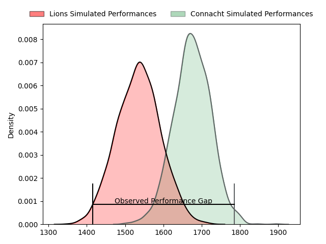
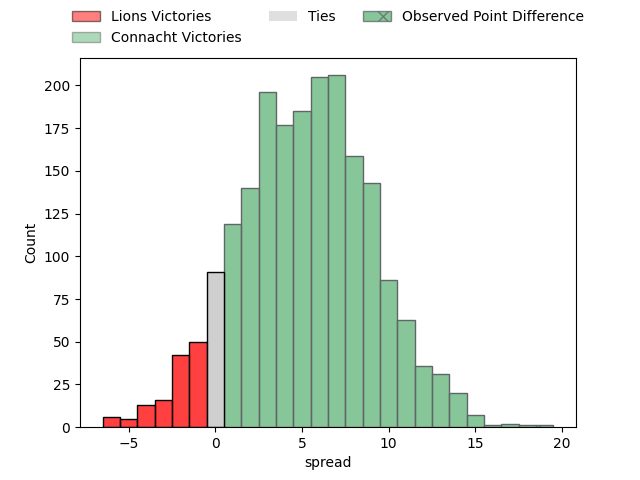
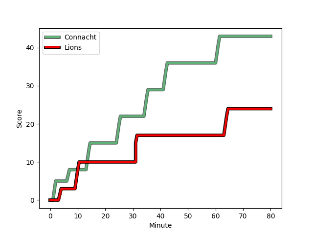
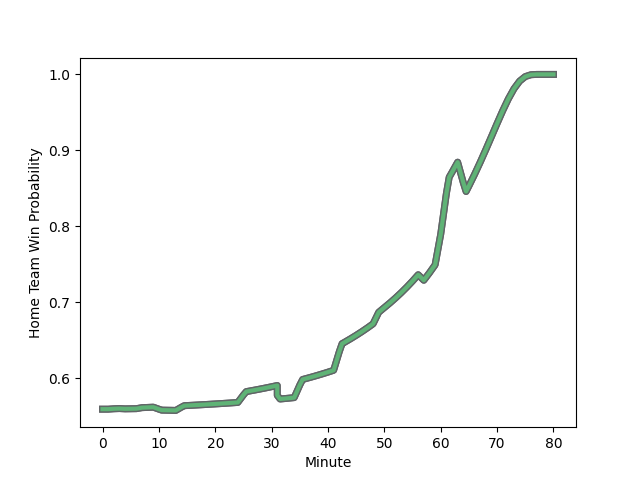

---  
layout: page  
title: Lions at Connacht; 24-43  
date: 2023-01-28 20:35:00 18:00:00 -0500  
categories: match review  
---
# Lions at Connacht; 24-43

# Club Level Predictions

The first set of predictions treats a club as the smallest object, as the club develops its members, organizes a gameplan, and deploys its players as needed for each match. This club model has a prediction of 0.689, which translates to predicting Connacht to win by 7.0.

Each club has a rating and a rating deviation (simiar to a Glicko system), and expected performances can be generated. This allows for simulated matches and spreads like the ones below.
## Projected Performances

## Projected Spreads

## Projected Results

# Player Level Predictions

Treating teams instead as an entity made up of the currently active players, I have ratings for each player in an altogether different system. These can be combined to form team ratings once teamsheets are announced, weighting starters a bit higher than the reserves. After the match is played, players can be weighted by their minutes on the field, allowing for an accurate measure of the team's composition. With these compiled team ratings, we can make predictions, measure inaccuracy, and update the individual player ratings.
## Prediction with Player Minutes: Connacht by 14.4

Connacht by 10.4 on a neutral field
## Scores over Time

## Win Probability over Time

## Prediction without Player Minutes: Connacht by 15.3

Connacht by 11.3 on a neutral pitch

|   Away Minutes | Away Player                                                                   |   Away elo |   Away Percentile |   Number |   Home Percentile |   Home elo | Home Player                                                                   |   Home Minutes |
|---------------:|:------------------------------------------------------------------------------|-----------:|------------------:|---------:|------------------:|-----------:|:------------------------------------------------------------------------------|---------------:|
|             57 | [Jean-Pierre Smith](..//playerfiles//Jean-PierreSmith_cleaned.md)             |      82.52 |                14 |        1 |                99 |     142.33 | [Peter Dooley](..//playerfiles//PeterDooley_cleaned.md)                       |             60 |
|             62 | [PJ Botha](..//playerfiles//PJBotha_cleaned.md)                               |      92.9  |                43 |        2 |                72 |     102.62 | [Shane Delahunt](..//playerfiles//ShaneDelahunt_cleaned.md)                   |             57 |
|             63 | [Asenathi Ntlabakanye](..//playerfiles//AsenathiNtlabakanye_cleaned.md)       |      71.92 |                 3 |        3 |                83 |     109.17 | [Jack Aungier](..//playerfiles//JackAungier_cleaned.md)                       |             60 |
|             80 | [Willem Alberts](..//playerfiles//WillemAlberts_cleaned.md)                   |      92.38 |                39 |        4 |                33 |      88.1  | [Darragh Murray](..//playerfiles//DarraghMurray_cleaned.md)                   |             67 |
|             50 | [Darrien-Lane Landsberg](..//playerfiles//Darrien-LaneLandsberg_cleaned.md)   |      98.96 |                58 |        5 |                90 |     119.35 | [Niall Murray](..//playerfiles//NiallMurray_cleaned.md)                       |             80 |
|             80 | [Sibusiso Sangweni](..//playerfiles//SibusisoSangweni_cleaned.md)             |      81.64 |                19 |        6 |                92 |     122.63 | [Josh Murphy](..//playerfiles//JoshMurphy_cleaned.md)                         |             57 |
|             80 | [Ruhan Straeuli ](..//playerfiles//RuhanStraeuli_cleaned.md)                  |     114.96 |                86 |        7 |                67 |     102.5  | [Conor Oliver](..//playerfiles//ConorOliver_cleaned.md)                       |             80 |
|             60 | [Emmanuel Tshituka](..//playerfiles//EmmanuelTshituka_cleaned.md)             |      71.5  |                 5 |        8 |                39 |      93.06 | [Jarrad Butler](..//playerfiles//JarradButler_cleaned.md)                     |             80 |
|             49 | [Andre Warner](..//playerfiles//AndreWarner_cleaned.md)                       |     101.58 |                65 |        9 |                47 |      94.55 | [Caolin Blade](..//playerfiles//CaolinBlade_cleaned.md)                       |             62 |
|             80 | [Jordan Hendrikse](..//playerfiles//JordanHendrikse_cleaned.md)               |      84.91 |                16 |       10 |                85 |     117.11 | [Jack Carty](..//playerfiles//JackCarty_cleaned.md)                           |             80 |
|             66 | [Edwill van der Merwe](..//playerfiles//EdwillvanderMerwe_cleaned.md)         |     115.77 |                86 |       11 |                96 |     130.08 | [John Porch](..//playerfiles//JohnPorch_cleaned.md)                           |             80 |
|             80 | [Marius Louw](..//playerfiles//MariusLouw_cleaned.md)                         |     119.98 |                89 |       12 |                22 |      85.07 | [Cathal Forde](..//playerfiles//CathalForde_cleaned.md)                       |             60 |
|             50 | [Henco van Wyk](..//playerfiles//HencovanWyk_cleaned.md)                      |     108.69 |                77 |       13 |                53 |      92.57 | [Tom Farrell](..//playerfiles//TomFarrell_cleaned.md)                         |             80 |
|             80 | [Stean Pienaar](..//playerfiles//SteanPienaar_cleaned.md)                     |     115.48 |                86 |       14 |                57 |      98.64 | [Diarmuid Kilgallen](..//playerfiles//DiarmuidKilgallen_cleaned.md)           |             80 |
|             80 | [Quan Horn](..//playerfiles//QuanHorn_cleaned.md)                             |     103.96 |                70 |       15 |                56 |      99.48 | [Tiernan O'Halloran](..//playerfiles//TiernanO'Halloran_cleaned.md)           |             57 |
|             31 | [Morne Van den Berg](..//playerfiles//MorneVandenBerg_cleaned.md)             |      76.36 |                 8 |       16 |                57 |      95.74 | [Jordan Duggan](..//playerfiles//JordanDuggan_cleaned.md)                     |             20 |
|             30 | [Pieter Jansen van Vuuren](..//playerfiles//PieterJansenvanVuuren_cleaned.md) |      98.16 |                53 |       17 |                46 |      94.43 | [Dominic Robertson-McCoy](..//playerfiles//DominicRobertson-McCoy_cleaned.md) |             20 |
|             30 | [Manuel Rass](..//playerfiles//ManuelRass_cleaned.md)                         |      97.52 |                48 |       18 |                84 |     112.82 | [Leva Fifita](..//playerfiles//LevaFifita_cleaned.md)                         |             13 |
|             23 | [Morgan Naude](..//playerfiles//MorganNaude_cleaned.md)                       |     105.34 |               nan |       19 |                84 |     111.74 | [Kieran Marmion](..//playerfiles//KieranMarmion_cleaned.md)                   |             18 |
|             20 | [Jaco Kriel](..//playerfiles//JacoKriel_cleaned.md)                           |     127.74 |                95 |       20 |                11 |      78.98 | [Tom Daly](..//playerfiles//TomDaly_cleaned.md)                               |             20 |
|             18 | [Michael van Vuuren](..//playerfiles//MichaelvanVuuren_cleaned.md)            |      91.69 |                38 |       21 |                31 |      88.57 | [Oran McNulty](..//playerfiles//OranMcNulty_cleaned.md)                       |             23 |
|             17 | [Ruan Smith](..//playerfiles//RuanSmith_cleaned.md)                           |     101.67 |                70 |       22 |                30 |      87.1  | [Dylan Tierney-Martin](..//playerfiles//DylanTierney-Martin_cleaned.md)       |             23 |
|             14 | [Andries Coetzee](..//playerfiles//AndriesCoetzee_cleaned.md)                 |     104    |                65 |       23 |                33 |      90.14 | [Shamus Hurley-Langton](..//playerfiles//ShamusHurley-Langton_cleaned.md)     |             23 |

