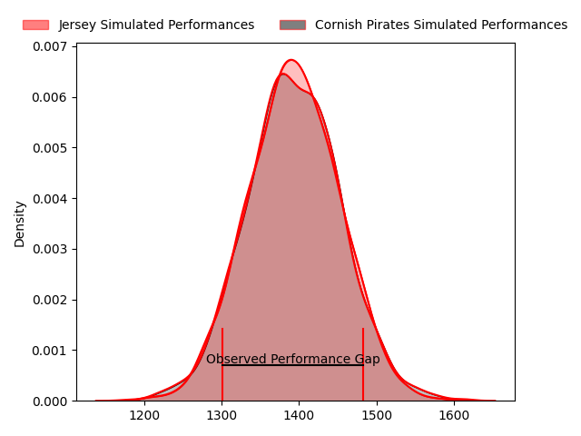
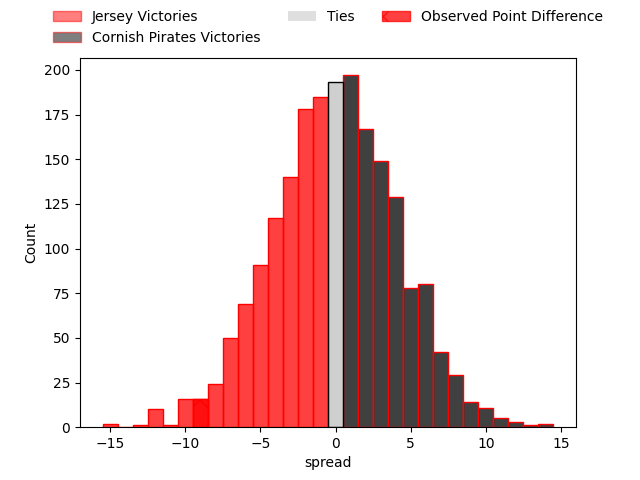
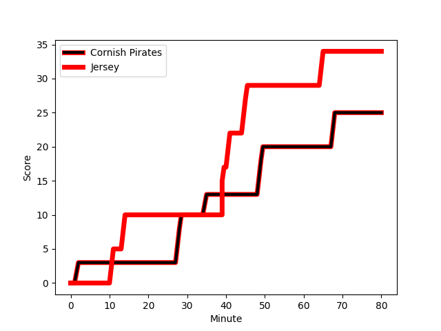
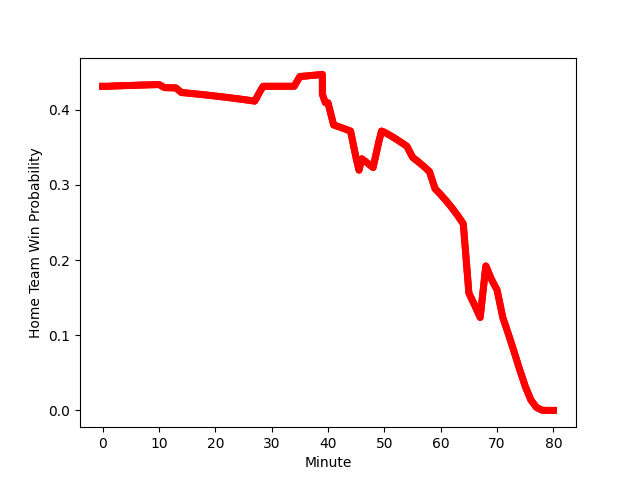

---  
layout: page  
title: Jersey at Cornish Pirates; 34-25  
date: 2023-01-28 15:30:00 18:00:00 -0500  
categories: match review  
---
# Jersey at Cornish Pirates; 34-25

# Club Level Predictions

The first set of predictions treats a club as the smallest object, as the club develops its members, organizes a gameplan, and deploys its players as needed for each match. This club model has a prediction of 0.502, which translates to predicting Cornish Pirates to win by 0.1.

Each club has a rating and a rating deviation (simiar to a Glicko system), and expected performances can be generated. This allows for simulated matches and spreads like the ones below.
## Projected Performances

## Projected Spreads

## Projected Results

# Player Level Predictions

Treating teams instead as an entity made up of the currently active players, I have ratings for each player in an altogether different system. These can be combined to form team ratings once teamsheets are announced, weighting starters a bit higher than the reserves. After the match is played, players can be weighted by their minutes on the field, allowing for an accurate measure of the team's composition. With these compiled team ratings, we can make predictions, measure inaccuracy, and update the individual player ratings.
## Prediction with Player Minutes: Jersey by 8.0

Jersey by 12.0 on a neutral field
## Scores over Time

## Win Probability over Time

## Prediction without Player Minutes: Jersey by 8.7

Jersey by 12.7 on a neutral pitch

|   Away Minutes | Away Player                                                                          |   Away elo |   Away Percentile |   Number |   Home Percentile |   Home elo | Home Player                                                                 |   Home Minutes |
|---------------:|:-------------------------------------------------------------------------------------|-----------:|------------------:|---------:|------------------:|-----------:|:----------------------------------------------------------------------------|---------------:|
|             46 | [Samuel Alexander Grahamslaw](..//playerfiles//SamuelAlexanderGrahamslaw_cleaned.md) |     109.66 |                84 |        1 |                85 |     109.69 | [Marlen Walker](..//playerfiles//MarlenWalker_cleaned.md)                   |             59 |
|             79 | [James Hadfield](..//playerfiles//JamesHadfield_cleaned.md)                          |      76.87 |                10 |        2 |                47 |      93.79 | [William Crane](..//playerfiles//WilliamCrane_cleaned.md)                   |             73 |
|             70 | [Steven Longwell](..//playerfiles//StevenLongwell_cleaned.md)                        |     112.37 |                88 |        3 |                50 |      96.03 | [Matt Johnson](..//playerfiles//MattJohnson_cleaned.md)                     |             59 |
|             80 | [Sean O'Connor](..//playerfiles//SeanO'Connor_cleaned.md)                            |     115.31 |                91 |        4 |                75 |     106.51 | [Will Britton](..//playerfiles//WillBritton_cleaned.md)                     |             73 |
|             77 | [James Scott](..//playerfiles//JamesScott_cleaned.md)                                |      86.6  |                26 |        5 |                 5 |      70.04 | [Cory Teague](..//playerfiles//CoryTeague_cleaned.md)                       |             80 |
|             80 | [Macauley Cook](..//playerfiles//MacauleyCook_cleaned.md)                            |     186.67 |                99 |        6 |                39 |      91.68 | [Alex Everett](..//playerfiles//AlexEverett_cleaned.md)                     |             80 |
|             77 | [Lewis Wynne](..//playerfiles//LewisWynne_cleaned.md)                                |     100.89 |                63 |        7 |                92 |     123.17 | [John Stevens](..//playerfiles//JohnStevens_cleaned.md)                     |             80 |
|             80 | [James Dun](..//playerfiles//JamesDun_cleaned.md)                                    |      76.14 |                 8 |        8 |                56 |      98.42 | [Sebastian Nagle-Taylor](..//playerfiles//SebastianNagle-Taylor_cleaned.md) |             55 |
|             70 | [James Mitchell](..//playerfiles//JamesMitchell_cleaned.md)                          |      90.1  |                23 |        9 |                30 |      82.71 | [Alex Schwarz](..//playerfiles//AlexSchwarz_cleaned.md)                     |             80 |
|             80 | [Russell Bennett](..//playerfiles//RussellBennett_cleaned.md)                        |      96.44 |                48 |       10 |                23 |      86.78 | [Arwel Robson](..//playerfiles//ArwelRobson_cleaned.md)                     |             80 |
|             70 | [Will Brown](..//playerfiles//WillBrown_cleaned.md)                                  |     115.73 |                86 |       11 |                60 |      99.53 | [Tom Wyatt](..//playerfiles//TomWyatt_cleaned.md)                           |             80 |
|             71 | [Jordan Holgate](..//playerfiles//JordanHolgate_cleaned.md)                          |      80.65 |                18 |       12 |                66 |     102.3  | [Joe Elderkin](..//playerfiles//JoeElderkin_cleaned.md)                     |             50 |
|             80 | [Alex McHenry](..//playerfiles//AlexMcHenry_cleaned.md)                              |     106.41 |                74 |       13 |                51 |      96.7  | [Garyn Smith](..//playerfiles//GarynSmith_cleaned.md)                       |             80 |
|             80 | [Ben Woollett](..//playerfiles//BenWoollett_cleaned.md)                              |      97.89 |                55 |       14 |                17 |      83.86 | [Robin Wedlake](..//playerfiles//RobinWedlake_cleaned.md)                   |             73 |
|             80 | [Brendan Owen](..//playerfiles//BrendanOwen_cleaned.md)                              |      99.95 |                57 |       15 |                44 |      90.42 | [Carwyn Penny](..//playerfiles//CarwynPenny_cleaned.md)                     |             80 |
|             34 | [Greg McGrath](..//playerfiles//GregMcGrath_cleaned.md)                              |      75.31 |                 6 |       16 |                68 |     103.35 | [Shae Tucker](..//playerfiles//ShaeTucker_cleaned.md)                       |             30 |
|             10 | [Adam Nicol](..//playerfiles//AdamNicol_cleaned.md)                                  |      85.29 |                19 |       17 |                18 |      81.3  | [Will Gibson](..//playerfiles//WillGibson_cleaned.md)                       |             25 |
|             10 | [Tomi Lewis](..//playerfiles//TomiLewis_cleaned.md)                                  |     102.01 |                67 |       18 |                14 |      83.6  | [Ollie Adkins](..//playerfiles//OllieAdkins_cleaned.md)                     |             21 |
|             10 | [Josh Gray](..//playerfiles//JoshGray_cleaned.md)                                    |     114.9  |                86 |       19 |                40 |      91.19 | [Harvey Beaton](..//playerfiles//HarveyBeaton_cleaned.md)                   |             21 |
|              9 | [Dan Barnes](..//playerfiles//DanBarnes_cleaned.md)                                  |     126.62 |                94 |       20 |               nan |      94.5  | [Josh Williams](..//playerfiles//JoshWilliams_cleaned.md)                   |              7 |
|              3 | [James Elliott](..//playerfiles//JamesElliott_cleaned.md)                            |      64.93 |                 1 |       21 |               nan |      95.85 | [Morgan Nelson](..//playerfiles//MorganNelson_cleaned.md)                   |              7 |
|              3 | [Tom Everard](..//playerfiles//TomEverard_cleaned.md)                                |      77.76 |                11 |       22 |                50 |      95.86 | [Arthur Relton](..//playerfiles//ArthurRelton_cleaned.md)                   |              7 |
|              1 | [Harry Doolan](..//playerfiles//HarryDoolan_cleaned.md)                              |      94.19 |                49 |       23 |               nan |     nan    | nan                                                                         |            nan |

