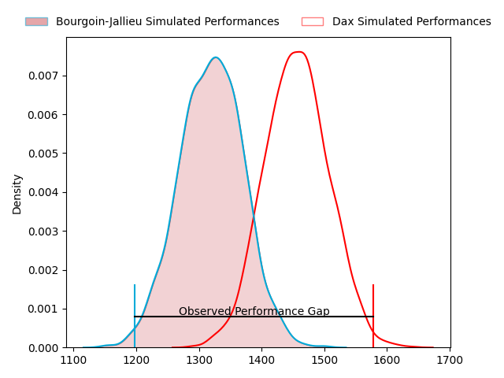
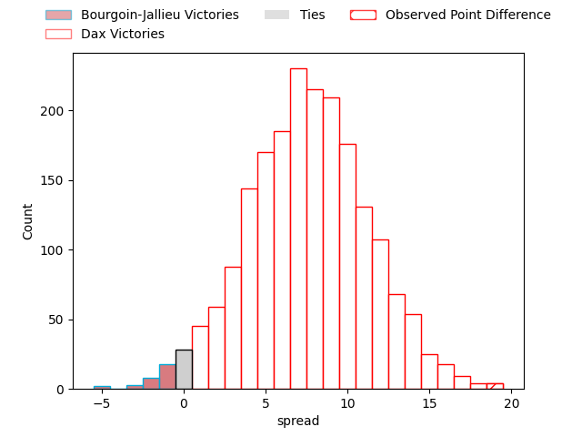
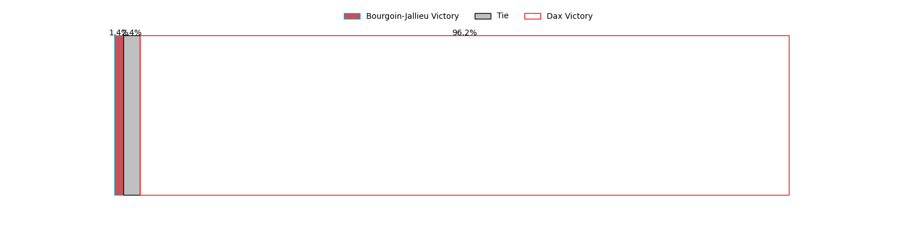
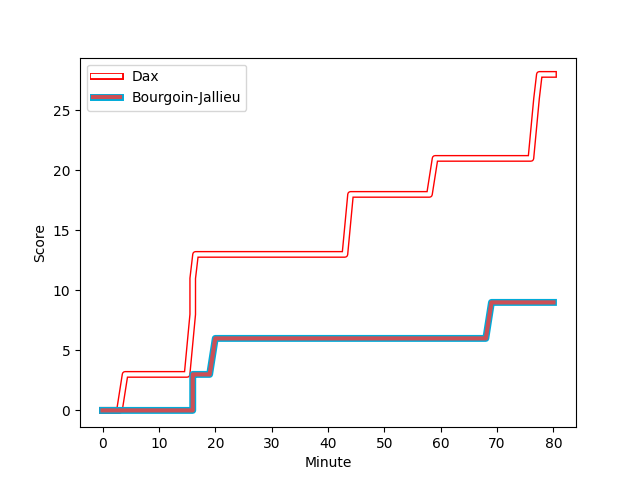
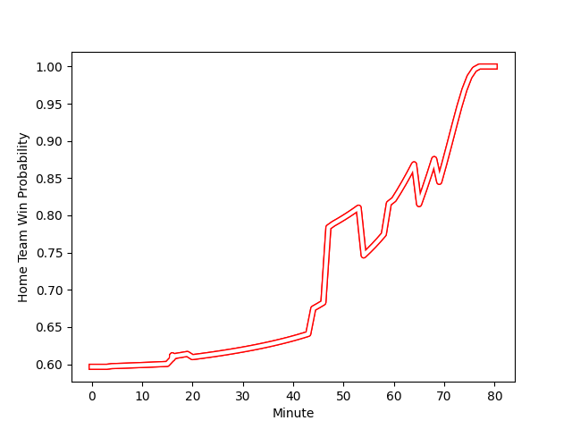

---  
layout: page  
title: Bourgoin-Jallieu at Dax; 9-28  
date: 2023-01-28 19:00:00 18:00:00 -0500  
categories: match review  
---
# Bourgoin-Jallieu at Dax; 9-28

# Club Level Predictions

The first set of predictions treats a club as the smallest object, as the club develops its members, organizes a gameplan, and deploys its players as needed for each match. This club model has a prediction of 0.683, which translates to predicting Dax to win by 6.8.

Each club has a rating and a rating deviation (simiar to a Glicko system), and expected performances can be generated. This allows for simulated matches and spreads like the ones below.
## Projected Performances

## Projected Spreads

## Projected Results

# Player Level Predictions

Treating teams instead as an entity made up of the currently active players, I have ratings for each player in an altogether different system. These can be combined to form team ratings once teamsheets are announced, weighting starters a bit higher than the reserves. After the match is played, players can be weighted by their minutes on the field, allowing for an accurate measure of the team's composition. With these compiled team ratings, we can make predictions, measure inaccuracy, and update the individual player ratings.
## Prediction with Player Minutes: Dax by 21.0

Dax by 17.0 on a neutral field
## Scores over Time

## Win Probability over Time

## Prediction without Player Minutes: Dax by 19.9

Dax by 15.9 on a neutral pitch

|   Away Minutes | Away Player                                                           |   Away elo |   Away Percentile |   Number |   Home Percentile |   Home elo | Home Player                                                                |   Home Minutes |
|---------------:|:----------------------------------------------------------------------|-----------:|------------------:|---------:|------------------:|-----------:|:---------------------------------------------------------------------------|---------------:|
|             47 | [Nugzar Somkhishvili](..//playerfiles//NugzarSomkhishvili_cleaned.md) |      94.85 |                58 |        1 |                57 |      98.49 | [Louis Mary](..//playerfiles//LouisMary_cleaned.md)                        |             54 |
|             47 | [Mohamed Khribache](..//playerfiles//MohamedKhribache_cleaned.md)     |      95.95 |                58 |        2 |                86 |     110.99 | [Maxime Delonca](..//playerfiles//MaximeDelonca_cleaned.md)                |             54 |
|             47 | [Maxime Caillet](..//playerfiles//MaximeCaillet_cleaned.md)           |     101.89 |                68 |        3 |                 6 |      76.2  | [Diogo Hasse Ferreira](..//playerfiles//DiogoHasseFerreira_cleaned.md)     |             54 |
|             62 | [Joketani Koroi](..//playerfiles//JoketaniKoroi_cleaned.md)           |      95.86 |                35 |        4 |                29 |      90.19 | [Mattieu Bidau](..//playerfiles//MattieuBidau_cleaned.md)                  |             80 |
|             48 | [Léandre Cotte](..//playerfiles//LéandreCotte_cleaned.md)             |      95    |                48 |        5 |                92 |     121.75 | [Yoan Gaune](..//playerfiles//YoanGaune_cleaned.md)                        |             54 |
|             80 | [Kevin Chaudouard](..//playerfiles//KevinChaudouard_cleaned.md)       |     109.06 |                79 |        6 |                54 |      97.75 | [Arnaud Aletti](..//playerfiles//ArnaudAletti_cleaned.md)                  |             80 |
|             67 | [Theophile Cotte](..//playerfiles//TheophileCotte_cleaned.md)         |      85.92 |                22 |        7 |                68 |     102.85 | [Paul Arnaud Ausset](..//playerfiles//PaulArnaudAusset_cleaned.md)         |             60 |
|             80 | [Poutasi Luafutu](..//playerfiles//PoutasiLuafutu_cleaned.md)         |     118.93 |                88 |        8 |                37 |      92.3  | [Brice Ferrer](..//playerfiles//BriceFerrer_cleaned.md)                    |             80 |
|             80 | [Adrien Pontarollo](..//playerfiles//AdrienPontarollo_cleaned.md)     |      87.34 |                35 |        9 |                 6 |      74.41 | [Adrien Ayestaran](..//playerfiles//AdrienAyestaran_cleaned.md)            |             60 |
|             47 | [Nicolas Vuillemin](..//playerfiles//NicolasVuillemin_cleaned.md)     |      83.76 |                15 |       10 |                76 |     108.26 | [Felipe Berchesi Pisano](..//playerfiles//FelipeBerchesiPisano_cleaned.md) |             41 |
|             80 | [Naibuka Rokua](..//playerfiles//NaibukaRokua_cleaned.md)             |      83.84 |                18 |       11 |                46 |      94.96 | [Théo Gatelier](..//playerfiles//ThéoGatelier_cleaned.md)                  |             80 |
|             60 | [Romain Sola](..//playerfiles//RomainSola_cleaned.md)                 |      84.26 |                21 |       12 |                85 |     114.72 | [Hugo Fourquet](..//playerfiles//HugoFourquet_cleaned.md)                  |             65 |
|             80 | [Pablo Patilla](..//playerfiles//PabloPatilla_cleaned.md)             |      78.39 |                16 |       13 |                65 |     102    | [Rodrigo Marta](..//playerfiles//RodrigoMarta_cleaned.md)                  |             80 |
|             80 | [Matthieu Nicolas](..//playerfiles//MatthieuNicolas_cleaned.md)       |      54.95 |                 0 |       14 |                81 |     111.19 | [Guillaume Bouche](..//playerfiles//GuillaumeBouche_cleaned.md)            |             80 |
|             80 | [Nicolas Cachet](..//playerfiles//NicolasCachet_cleaned.md)           |      76.24 |                11 |       15 |                86 |     116.94 | [Théo Duprat](..//playerfiles//ThéoDuprat_cleaned.md)                      |             80 |
|             33 | [Romain Favaretto](..//playerfiles//RomainFavaretto_cleaned.md)       |      85.42 |                19 |       16 |                85 |     110.32 | [Asa Faitotoa](..//playerfiles//AsaFaitotoa_cleaned.md)                    |             26 |
|             33 | [Maxime Castant](..//playerfiles//MaximeCastant_cleaned.md)           |      87.24 |                23 |       17 |                96 |     127.93 | [Elvis Levi](..//playerfiles//ElvisLevi_cleaned.md)                        |             26 |
|             33 | [Oktay Yilmaz](..//playerfiles//OktayYilmaz_cleaned.md)               |      92.4  |                38 |       18 |                 8 |      77.49 | [Thibaud Dréan](..//playerfiles//ThibaudDréan_cleaned.md)                  |             26 |
|             18 | [Robin Gascou](..//playerfiles//RobinGascou_cleaned.md)               |      82.05 |                17 |       19 |                30 |      89.27 | [Mat Luamanu](..//playerfiles//MatLuamanu_cleaned.md)                      |             26 |
|             32 | [Lakisipone Lee](..//playerfiles//LakisiponeLee_cleaned.md)           |      69.18 |                 3 |       20 |                19 |      82.96 | [Jean Despiau](..//playerfiles//JeanDespiau_cleaned.md)                    |             20 |
|             13 | [Matteo Broeders](..//playerfiles//MatteoBroeders_cleaned.md)         |     107.96 |                74 |       21 |               nan |      95    | [Jules Bousquet](..//playerfiles//JulesBousquet_cleaned.md)                |             20 |
|             33 | [Remi Bouet](..//playerfiles//RemiBouet_cleaned.md)                   |      99.5  |                56 |       22 |                55 |      99.25 | [Hugo Cerisier](..//playerfiles//HugoCerisier_cleaned.md)                  |             39 |
|             20 | [Makalea Foliaki](..//playerfiles//MakaleaFoliaki_cleaned.md)         |      97.56 |                54 |       23 |                51 |      96.75 | [Julien Dechavanne](..//playerfiles//JulienDechavanne_cleaned.md)          |             15 |

