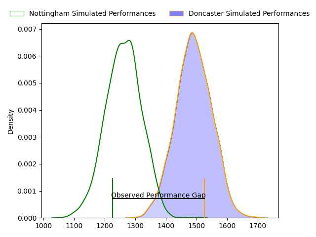
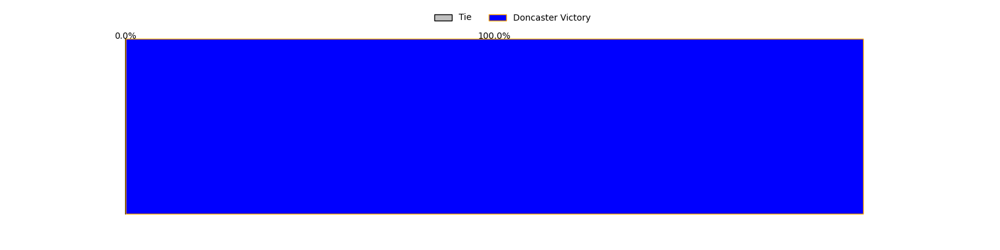
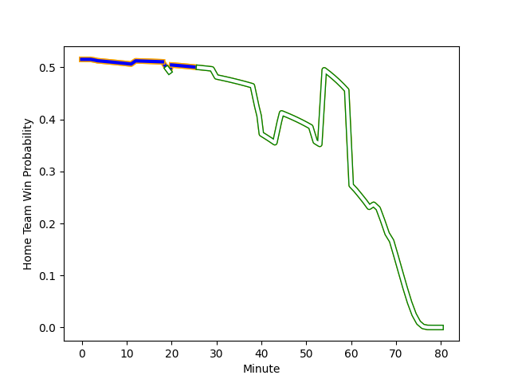

---  
layout: page  
title: Nottingham at Doncaster; 17-32  
date: 2023-01-28 15:30:00 18:00:00 -0500  
categories: match review  
---
# Nottingham at Doncaster; 17-32

# Club Level Predictions

The first set of predictions treats a club as the smallest object, as the club develops its members, organizes a gameplan, and deploys its players as needed for each match. This club model has a prediction of 0.788, which translates to predicting Doncaster to win by 11.6.

Each club has a rating and a rating deviation (simiar to a Glicko system), and expected performances can be generated. This allows for simulated matches and spreads like the ones below.
## Projected Performances

## Projected Spreads

## Projected Results

# Player Level Predictions

Treating teams instead as an entity made up of the currently active players, I have ratings for each player in an altogether different system. These can be combined to form team ratings once teamsheets are announced, weighting starters a bit higher than the reserves. After the match is played, players can be weighted by their minutes on the field, allowing for an accurate measure of the team's composition. With these compiled team ratings, we can make predictions, measure inaccuracy, and update the individual player ratings.
## Prediction with Player Minutes: Doncaster by 2.8

Nottingham by 1.2 on a neutral field
## Scores over Time

## Win Probability over Time

## Prediction without Player Minutes: Nottingham by 2.1

Nottingham by 6.1 on a neutral pitch

|   Away Minutes | Away Player                                                                     |   Away elo |   Away Percentile |   Number |   Home Percentile |   Home elo | Home Player                                                 |   Home Minutes |
|---------------:|:--------------------------------------------------------------------------------|-----------:|------------------:|---------:|------------------:|-----------:|:------------------------------------------------------------|---------------:|
|             52 | [Aniseko Sio](..//playerfiles//AnisekoSio_cleaned.md)                           |      94.17 |                44 |        1 |               nan |      89.98 | [Kai Owen](..//playerfiles//KaiOwen_cleaned.md)             |             52 |
|             40 | [Jack Dickinson](..//playerfiles//JackDickinson_cleaned.md)                     |     102.83 |                73 |        2 |                47 |      93.91 | [Will Holling](..//playerfiles//WillHolling_cleaned.md)     |             54 |
|             65 | [Ben Betts](..//playerfiles//BenBetts_cleaned.md)                               |      94.69 |                45 |        3 |                79 |     106.46 | [Jake Armstrong](..//playerfiles//JakeArmstrong_cleaned.md) |             69 |
|             52 | [Ross Bundy](..//playerfiles//RossBundy_cleaned.md)                             |      95.04 |                47 |        4 |                 1 |      55.8  | [Ehize Ehizode](..//playerfiles//EhizeEhizode_cleaned.md)   |             80 |
|             80 | [Iosefa Danny Wayne Fiaola](..//playerfiles//IosefaDannyWayneFiaola_cleaned.md) |     105.02 |                72 |        5 |                84 |     112.82 | [Evan Mintern](..//playerfiles//EvanMintern_cleaned.md)     |             80 |
|             80 | [George Cox](..//playerfiles//GeorgeCox_cleaned.md)                             |      99.43 |                65 |        6 |                39 |      91.88 | [Martin Molina](..//playerfiles//MartinMolina_cleaned.md)   |             66 |
|             65 | [Carl Kirwan](..//playerfiles//CarlKirwan_cleaned.md)                           |      70.5  |                 4 |        7 |                 6 |      76.44 | [Thom Smith](..//playerfiles//ThomSmith_cleaned.md)         |             40 |
|             80 | [Josh Poullet](..//playerfiles//JoshPoullet_cleaned.md)                         |      93.79 |                41 |        8 |                57 |      99.95 | [Sam Hudson](..//playerfiles//SamHudson_cleaned.md)         |             80 |
|             62 | [Liam Slatem](..//playerfiles//LiamSlatem_cleaned.md)                           |      77.48 |                10 |        9 |                70 |     103.78 | [Alex Dolly](..//playerfiles//AlexDolly_cleaned.md)         |             80 |
|             80 | [Morgan Bunting](..//playerfiles//MorganBunting_cleaned.md)                     |      82.08 |                17 |       10 |                29 |      90.19 | [Sam Olver](..//playerfiles//SamOlver_cleaned.md)           |             80 |
|             60 | [Harry Graham](..//playerfiles//HarryGraham_cleaned.md)                         |      94.53 |                38 |       11 |                92 |     123.56 | [Maliq Holden](..//playerfiles//MaliqHolden_cleaned.md)     |             80 |
|             80 | [John Joseph Neville](..//playerfiles//JohnJosephNeville_cleaned.md)            |      83.24 |                14 |       12 |                 2 |      63.96 | [Connor Edwards](..//playerfiles//ConnorEdwards_cleaned.md) |             80 |
|             80 | [Michael Green](..//playerfiles//MichaelGreen_cleaned.md)                       |      76.63 |               nan |       13 |                 2 |      64.1  | [Robbie Smith](..//playerfiles//RobbieSmith_cleaned.md)     |             59 |
|             80 | [David Williams](..//playerfiles//DavidWilliams_cleaned.md)                     |      95.37 |                48 |       14 |                15 |      82.03 | [George Simpson](..//playerfiles//GeorgeSimpson_cleaned.md) |             80 |
|             52 | [Jordan Olowofela](..//playerfiles//JordanOlowofela_cleaned.md)                 |     111.64 |                78 |       15 |                 3 |      64.52 | [Jack Metcalf](..//playerfiles//JackMetcalf_cleaned.md)     |             66 |
|             40 | [Archie Vanes](..//playerfiles//ArchieVanes_cleaned.md)                         |      76.67 |                 7 |       16 |                29 |      88.86 | [Jared Cardew](..//playerfiles//JaredCardew_cleaned.md)     |             40 |
|             28 | [Toby Williams](..//playerfiles//TobyWilliams_cleaned.md)                       |      67.21 |                 2 |       17 |                35 |      91.76 | [Jake Pope](..//playerfiles//JakePope_cleaned.md)           |             28 |
|             28 | [Marcus Alexander Ramage](..//playerfiles//MarcusAlexanderRamage_cleaned.md)    |      93.57 |                43 |       18 |                90 |     114.6  | [George Edgson](..//playerfiles//GeorgeEdgson_cleaned.md)   |             26 |
|             28 | [Emeka Remigius Ilione](..//playerfiles//EmekaRemigiusIlione_cleaned.md)        |      92.2  |                39 |       19 |                14 |      82.6  | [Joe Margetts](..//playerfiles//JoeMargetts_cleaned.md)     |             21 |
|             20 | [Sam Hollingsworth](..//playerfiles//SamHollingsworth_cleaned.md)               |      76.56 |                 7 |       20 |                16 |      84.41 | [Sam Daly](..//playerfiles//SamDaly_cleaned.md)             |             14 |
|             18 | [Josh Goodwin](..//playerfiles//JoshGoodwin_cleaned.md)                         |      95.51 |               nan |       21 |                77 |     107.73 | [Billy McBryde](..//playerfiles//BillyMcBryde_cleaned.md)   |             14 |
|             15 | [Jacob Wright](..//playerfiles//JacobWright_cleaned.md)                         |      98.99 |               nan |       22 |                 9 |      76.76 | [Karl Garside](..//playerfiles//KarlGarside_cleaned.md)     |             11 |
|             15 | [Liam Bishop](..//playerfiles//LiamBishop_cleaned.md)                           |      94.76 |               nan |       23 |               nan |     nan    | nan                                                         |            nan |

