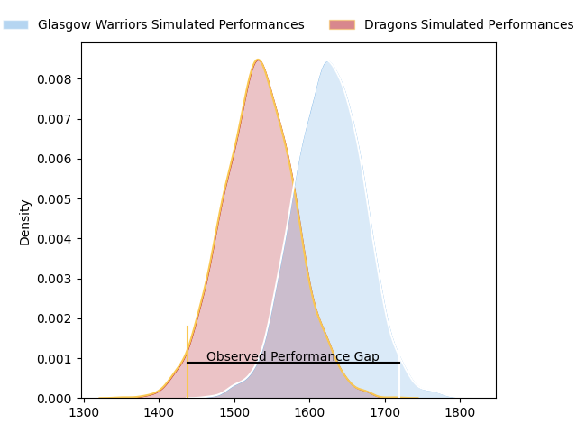
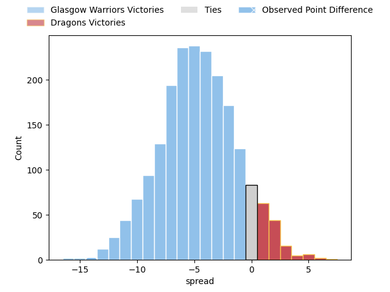
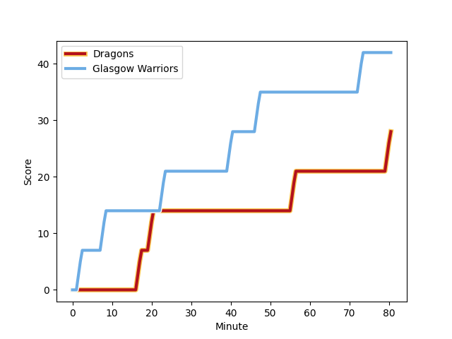
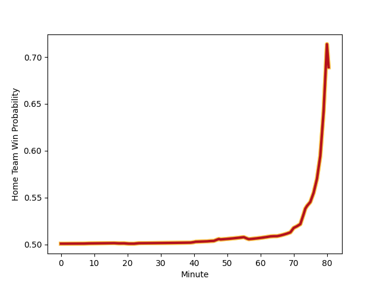

---  
layout: page  
title: Glasgow Warriors at Dragons; 42-28  
date: 2023-01-28 16:00:00 18:00:00 -0500  
categories: match review  
---
# Glasgow Warriors at Dragons; 42-28

# Club Level Predictions

The first set of predictions treats a club as the smallest object, as the club develops its members, organizes a gameplan, and deploys its players as needed for each match. This club model has a prediction of 0.369, which translates to predicting Glasgow Warriors to win by 4.7.

Each club has a rating and a rating deviation (simiar to a Glicko system), and expected performances can be generated. This allows for simulated matches and spreads like the ones below.
## Projected Performances

## Projected Spreads

## Projected Results

# Player Level Predictions

Treating teams instead as an entity made up of the currently active players, I have ratings for each player in an altogether different system. These can be combined to form team ratings once teamsheets are announced, weighting starters a bit higher than the reserves. After the match is played, players can be weighted by their minutes on the field, allowing for an accurate measure of the team's composition. With these compiled team ratings, we can make predictions, measure inaccuracy, and update the individual player ratings.
## Prediction with Player Minutes: Dragons by 4.1

Dragons by 0.1 on a neutral field
## Scores over Time

## Win Probability over Time

## Prediction without Player Minutes: Dragons by 1.7

Glasgow Warriors by 2.3 on a neutral pitch

|   Away Minutes | Away Player                                                               |   Away elo |   Away Percentile |   Number |   Home Percentile |   Home elo | Home Player                                                       |   Home Minutes |
|---------------:|:--------------------------------------------------------------------------|-----------:|------------------:|---------:|------------------:|-----------:|:------------------------------------------------------------------|---------------:|
|             65 | [Jamie Bhatti](..//playerfiles//JamieBhatti_cleaned.md)                   |     120.61 |                94 |        1 |                86 |     110.72 | [Rhodri Jones](..//playerfiles//RhodriJones_cleaned.md)           |             48 |
|             65 | [Fraser Brown](..//playerfiles//FraserBrown_cleaned.md)                   |     119.65 |                93 |        2 |               nan |      92.15 | [Brodie Coghlan](..//playerfiles//BrodieCoghlan_cleaned.md)       |             70 |
|             65 | [Simon Berghan](..//playerfiles//SimonBerghan_cleaned.md)                 |     102.07 |                68 |        3 |                 6 |      75.58 | [Lloyd Fairbrother](..//playerfiles//LloydFairbrother_cleaned.md) |             48 |
|             80 | [Lewis Bean](..//playerfiles//LewisBean_cleaned.md)                       |     104.15 |                78 |        4 |                76 |     107.07 | [Matthew Screech](..//playerfiles//MatthewScreech_cleaned.md)     |             80 |
|             75 | [JP du Preez](..//playerfiles//JPduPreez_cleaned.md)                      |      84.74 |                23 |        5 |                40 |      92.31 | [Ben Carter](..//playerfiles//BenCarter_cleaned.md)               |             80 |
|             65 | [Tom Gordon](..//playerfiles//TomGordon_cleaned.md)                       |     120.42 |                91 |        6 |                17 |      83.12 | [George Nott](..//playerfiles//GeorgeNott_cleaned.md)             |             40 |
|             80 | [Sione Vailanu](..//playerfiles//SioneVailanu_cleaned.md)                 |      91.14 |                37 |        7 |                10 |      79.31 | [Sean Lonsdale](..//playerfiles//SeanLonsdale_cleaned.md)         |             70 |
|             75 | [Jack Dempsey](..//playerfiles//JackDempsey_cleaned.md)                   |      88.82 |                28 |        8 |                82 |     111.52 | [Taine Basham](..//playerfiles//TaineBasham_cleaned.md)           |             80 |
|             45 | [Ali Price](..//playerfiles//AliPrice_cleaned.md)                         |      88.71 |                29 |        9 |                90 |     115    | [Rhodri Williams](..//playerfiles//RhodriWilliams_cleaned.md)     |             70 |
|             66 | [Duncan Weir](..//playerfiles//DuncanWeir_cleaned.md)                     |      90.51 |                32 |       10 |                91 |     121.86 | [JJ Hanrahan](..//playerfiles//JJHanrahan_cleaned.md)             |             80 |
|             80 | [Cole Forbes](..//playerfiles//ColeForbes_cleaned.md)                     |     108.39 |                78 |       11 |                75 |     106.48 | [Ashton Hewitt](..//playerfiles//AshtonHewitt_cleaned.md)         |             80 |
|             80 | [Sam Johnson](..//playerfiles//SamJohnson_cleaned.md)                     |     102.11 |                65 |       12 |                68 |     101.43 | [Jack Dixon](..//playerfiles//JackDixon_cleaned.md)               |             80 |
|             80 | [Stafford McDowall](..//playerfiles//StaffordMcDowall_cleaned.md)         |     132.81 |                97 |       13 |                87 |     116.83 | [Sio Tomkinson](..//playerfiles//SioTomkinson_cleaned.md)         |             80 |
|             80 | [Sebastian Cancelliere](..//playerfiles//SebastianCancelliere_cleaned.md) |      98.64 |                57 |       14 |                26 |      87.93 | [Jared Rosser](..//playerfiles//JaredRosser_cleaned.md)           |             48 |
|             80 | [Josh McKay](..//playerfiles//JoshMcKay_cleaned.md)                       |      92.06 |                40 |       15 |                65 |     103.76 | [Jordan Williams](..//playerfiles//JordanWilliams_cleaned.md)     |             64 |
|             35 | [Jamie Dobie](..//playerfiles//JamieDobie_cleaned.md)                     |      97    |                52 |       16 |                78 |     107.59 | [Ben Fry](..//playerfiles//BenFry_cleaned.md)                     |             40 |
|             15 | [Cameron Neild](..//playerfiles//CameronNeild_cleaned.md)                 |      84.39 |                20 |       17 |                61 |      99.03 | [Aki Seiuli](..//playerfiles//AkiSeiuli_cleaned.md)               |             32 |
|             15 | [Nathan McBeth](..//playerfiles//NathanMcBeth_cleaned.md)                 |      87.34 |                26 |       18 |                51 |      96.52 | [Chris Coleman](..//playerfiles//ChrisColeman_cleaned.md)         |             32 |
|             15 | [Johnny Matthews](..//playerfiles//JohnnyMatthews_cleaned.md)             |     113.98 |                89 |       19 |                90 |     121.53 | [Steffan Hughes](..//playerfiles//SteffanHughes_cleaned.md)       |             32 |
|             15 | [Lucio Sordoni](..//playerfiles//LucioSordoni_cleaned.md)                 |     102.2  |                70 |       20 |                94 |     129.19 | [Sam Davies](..//playerfiles//SamDavies_cleaned.md)               |             16 |
|             14 | [Tom Jordan](..//playerfiles//TomJordan_cleaned.md)                       |      92.49 |                37 |       21 |                65 |     101.97 | [James Benjamin](..//playerfiles//JamesBenjamin_cleaned.md)       |             10 |
|              5 | [Euan Ferrie](..//playerfiles//EuanFerrie_cleaned.md)                     |      94.17 |                45 |       22 |                45 |      94.21 | [Lewis Jones](..//playerfiles//LewisJones_cleaned.md)             |             10 |
|              5 | [Alex Samuel](..//playerfiles//AlexSamuel_cleaned.md)                     |     103.39 |                70 |       23 |                 7 |      74.15 | [Huw Taylor](..//playerfiles//HuwTaylor_cleaned.md)               |             10 |

