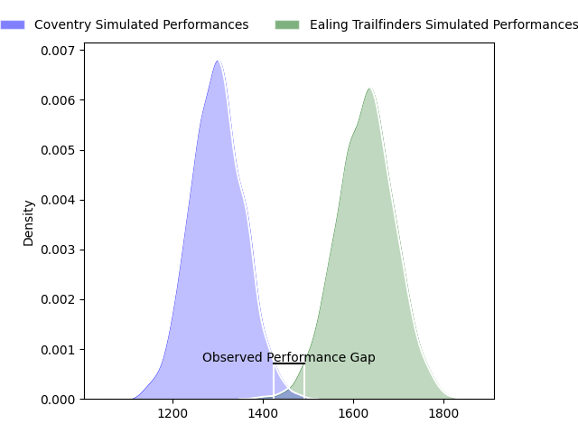
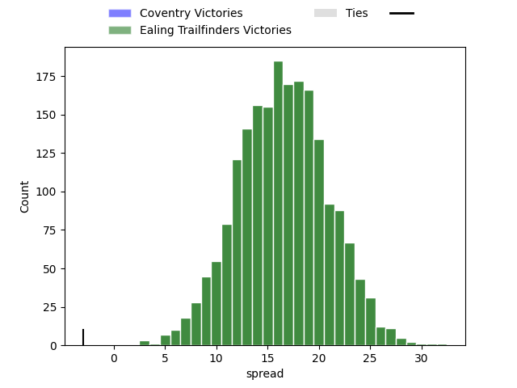
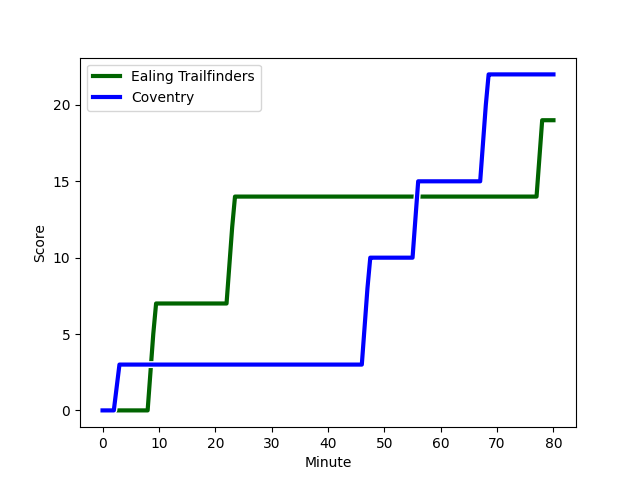
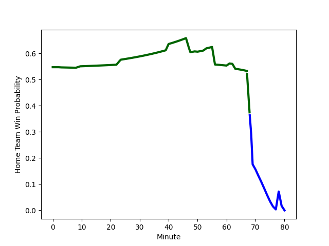

---  
layout: page  
title: Coventry at Ealing Trailfinders; 22-19  
date: 2023-01-28 16:00:00 18:00:00 -0500  
categories: match review  
---
# Coventry at Ealing Trailfinders; 22-19

# Club Level Predictions

The first set of predictions treats a club as the smallest object, as the club develops its members, organizes a gameplan, and deploys its players as needed for each match. This club model has a prediction of 0.864, which translates to predicting Ealing Trailfinders to win by 16.4.

Each club has a rating and a rating deviation (simiar to a Glicko system), and expected performances can be generated. This allows for simulated matches and spreads like the ones below.
## Projected Performances

## Projected Spreads

## Projected Results

# Player Level Predictions

Treating teams instead as an entity made up of the currently active players, I have ratings for each player in an altogether different system. These can be combined to form team ratings once teamsheets are announced, weighting starters a bit higher than the reserves. After the match is played, players can be weighted by their minutes on the field, allowing for an accurate measure of the team's composition. With these compiled team ratings, we can make predictions, measure inaccuracy, and update the individual player ratings.
## Prediction with Player Minutes: Ealing Trailfinders by 8.7

Ealing Trailfinders by 4.7 on a neutral field
## Scores over Time

## Win Probability over Time

## Prediction without Player Minutes: Ealing Trailfinders by 13.5

Ealing Trailfinders by 9.5 on a neutral pitch

|   Away Minutes | Away Player                                                         |   Away elo |   Away Percentile |   Number |   Home Percentile |   Home elo | Home Player                                                            |   Home Minutes |
|---------------:|:--------------------------------------------------------------------|-----------:|------------------:|---------:|------------------:|-----------:|:-----------------------------------------------------------------------|---------------:|
|             80 | [Toby Trinder](..//playerfiles//TobyTrinder_cleaned.md)             |      94.29 |                46 |        1 |                12 |      81.31 | [James Gibbons](..//playerfiles//JamesGibbons_cleaned.md)              |             53 |
|             80 | [Jordon Poole](..//playerfiles//JordonPoole_cleaned.md)             |     114.16 |                88 |        2 |                98 |     128.24 | [Shaun Malton](..//playerfiles//ShaunMalton_cleaned.md)                |             80 |
|             80 | [Ollie Andrews](..//playerfiles//OllieAndrews_cleaned.md)           |      97.72 |                55 |        3 |                97 |     124.26 | [Lewis Thiede](..//playerfiles//LewisThiede_cleaned.md)                |             53 |
|             67 | [T.Rhys Thomas](..//playerfiles//T.RhysThomas_cleaned.md)           |      97.64 |               nan |        4 |                92 |     120.55 | [Bobby de Wee](..//playerfiles//BobbydeWee_cleaned.md)                 |             80 |
|             80 | [Adam Peters](..//playerfiles//AdamPeters_cleaned.md)               |     111.63 |                83 |        5 |                83 |     111.58 | [Simon Linsell](..//playerfiles//SimonLinsell_cleaned.md)              |             63 |
|             61 | [Tom Ball](..//playerfiles//TomBall_cleaned.md)                     |     111.69 |                77 |        6 |                 8 |      77.33 | [Rob Farrar](..//playerfiles//RobFarrar_cleaned.md)                    |             80 |
|             80 | [Josh Bainbridge](..//playerfiles//JoshBainbridge_cleaned.md)       |     101.68 |                66 |        7 |                44 |      95.29 | [Carlo Tizzano](..//playerfiles//CarloTizzano_cleaned.md)              |             53 |
|             80 | [Senitiki Nayalo](..//playerfiles//SenitikiNayalo_cleaned.md)       |     109.83 |                79 |        8 |                46 |      95.99 | [Callum Chick](..//playerfiles//CallumChick_cleaned.md)                |             78 |
|             40 | [Will Chudley](..//playerfiles//WillChudley_cleaned.md)             |     126.82 |                96 |        9 |                80 |     108.39 | [Craig Hampson](..//playerfiles//CraigHampson_cleaned.md)              |             69 |
|             80 | [Patrick Pellegrini](..//playerfiles//PatrickPellegrini_cleaned.md) |     102.3  |                63 |       10 |                96 |     137.75 | [Craig Willis](..//playerfiles//CraigWillis_cleaned.md)                |             80 |
|             80 | [James Martin](..//playerfiles//JamesMartin_cleaned.md)             |      90.2  |                33 |       11 |                44 |      93.99 | [Luke Daniels](..//playerfiles//LukeDaniels_cleaned.md)                |             80 |
|             80 | [Will Rigg](..//playerfiles//WillRigg_cleaned.md)                   |     102.44 |                66 |       12 |                81 |     107.56 | [Steve Shingler](..//playerfiles//SteveShingler_cleaned.md)            |             71 |
|             50 | [Will Wand](..//playerfiles//WillWand_cleaned.md)                   |      95.19 |                48 |       13 |                 0 |      57.51 | [Max Bodilly](..//playerfiles//MaxBodilly_cleaned.md)                  |             80 |
|             80 | [Shea Cornish](..//playerfiles//SheaCornish_cleaned.md)             |     102.89 |                69 |       14 |                92 |     121.51 | [Nathan Earle](..//playerfiles//NathanEarle_cleaned.md)                |             80 |
|             80 | [Louis James](..//playerfiles//LouisJames_cleaned.md)               |      87.13 |                24 |       15 |                88 |     120.92 | [Jonah Holmes](..//playerfiles//JonahHolmes_cleaned.md)                |             80 |
|             40 | [Will Lane](..//playerfiles//WillLane_cleaned.md)                   |     102.58 |                59 |       16 |                57 |      98.59 | [Simon Uzokwe](..//playerfiles//SimonUzokwe_cleaned.md)                |             27 |
|             30 | [Lucas Titherington](..//playerfiles//LucasTitherington_cleaned.md) |      99.09 |                58 |       17 |                97 |     128.69 | [Kyle John Whyte](..//playerfiles//KyleJohnWhyte_cleaned.md)           |             27 |
|             19 | [Suva Ma'asi](..//playerfiles//SuvaMa'asi_cleaned.md)               |      99.26 |                55 |       18 |                39 |      95.13 | [Jimmy Roots](..//playerfiles//JimmyRoots_cleaned.md)                  |             27 |
|             13 | [George Smith](..//playerfiles//GeorgeSmith_cleaned.md)             |      95.86 |                48 |       19 |                27 |      88.98 | [Daniel Cutmore](..//playerfiles//DanielCutmore_cleaned.md)            |             17 |
|            nan | nan                                                                 |     nan    |               nan |       20 |                77 |      98.03 | [Jordan Burns](..//playerfiles//JordanBurns_cleaned.md)                |             11 |
|            nan | nan                                                                 |     nan    |               nan |       21 |                 5 |      70.71 | [Reuben Bird-Tulloch](..//playerfiles//ReubenBird-Tulloch_cleaned.md)  |              9 |
|            nan | nan                                                                 |     nan    |               nan |       22 |                25 |      86.57 | [David Douglas Bridge](..//playerfiles//DavidDouglasBridge_cleaned.md) |              2 |

