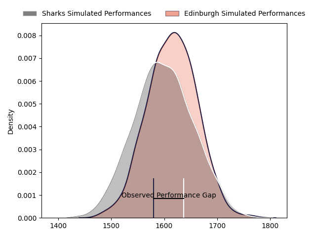
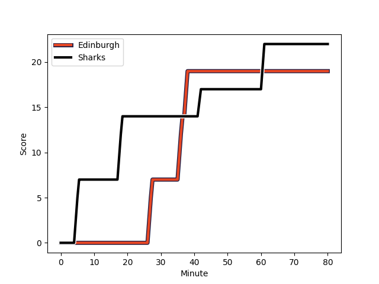
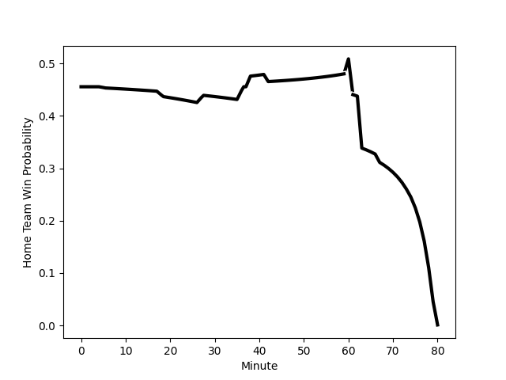

---  
layout: page  
title: Sharks at Edinburgh; 22-19  
date: 2023-01-28 18:15:00 18:00:00 -0500  
categories: match review  
---
# Sharks at Edinburgh; 22-19

# Club Level Predictions

The first set of predictions treats a club as the smallest object, as the club develops its members, organizes a gameplan, and deploys its players as needed for each match. This club model has a prediction of 0.569, which translates to predicting Edinburgh to win by 2.4.

Each club has a rating and a rating deviation (simiar to a Glicko system), and expected performances can be generated. This allows for simulated matches and spreads like the ones below.
## Projected Performances

## Projected Spreads

## Projected Results

# Player Level Predictions

Treating teams instead as an entity made up of the currently active players, I have ratings for each player in an altogether different system. These can be combined to form team ratings once teamsheets are announced, weighting starters a bit higher than the reserves. After the match is played, players can be weighted by their minutes on the field, allowing for an accurate measure of the team's composition. With these compiled team ratings, we can make predictions, measure inaccuracy, and update the individual player ratings.
## Prediction with Player Minutes: Sharks by 4.8

Sharks by 8.8 on a neutral field
## Scores over Time

## Win Probability over Time

## Prediction without Player Minutes: Sharks by 3.1

Sharks by 7.1 on a neutral pitch

|   Away Minutes | Away Player                                                              |   Away elo |   Away Percentile |   Number |   Home Percentile |   Home elo | Home Player                                                       |   Home Minutes |
|---------------:|:-------------------------------------------------------------------------|-----------:|------------------:|---------:|------------------:|-----------:|:------------------------------------------------------------------|---------------:|
|             59 | [Ox Nche](..//playerfiles//OxNche_cleaned.md)                            |     106.84 |                80 |        1 |                20 |      86.3  | [Boan Venter](..//playerfiles//BoanVenter_cleaned.md)             |             64 |
|             65 | [Kerron van Vuuren](..//playerfiles//KerronvanVuuren_cleaned.md)         |      73.72 |                 4 |        2 |                24 |      87.01 | [Adam McBurney](..//playerfiles//AdamMcBurney_cleaned.md)         |             49 |
|             60 | [Thomas du Toit](..//playerfiles//ThomasduToit_cleaned.md)               |     113.85 |                90 |        3 |                85 |     110.26 | [Murray McCallum](..//playerfiles//MurrayMcCallum_cleaned.md)     |             49 |
|             65 | [Hyron Andrews](..//playerfiles//HyronAndrews_cleaned.md)                |      90.64 |                29 |        4 |                29 |      89.12 | [Marshall Sykes](..//playerfiles//MarshallSykes_cleaned.md)       |             80 |
|             80 | [Gerbrandt Grobler](..//playerfiles//GerbrandtGrobler_cleaned.md)        |      99.27 |                60 |        5 |                49 |      95.4  | [Glen Young](..//playerfiles//GlenYoung_cleaned.md)               |             60 |
|             80 | [James Venter](..//playerfiles//JamesVenter_cleaned.md)                  |     102.91 |                68 |        6 |                91 |     120.54 | [Nick Haining](..//playerfiles//NickHaining_cleaned.md)           |             80 |
|             80 | [Henco Venter](..//playerfiles//HencoVenter_cleaned.md)                  |     100    |                61 |        7 |                71 |     104.55 | [Hamish Watson](..//playerfiles//HamishWatson_cleaned.md)         |             80 |
|             63 | [Phepsi Buthelezi](..//playerfiles//PhepsiButhelezi_cleaned.md)          |     109.67 |                75 |        8 |                 2 |      63.85 | [Viliame Mata](..//playerfiles//ViliameMata_cleaned.md)           |             60 |
|             40 | [Grant Williams](..//playerfiles//GrantWilliams_cleaned.md)              |     102.75 |                68 |        9 |                74 |     105.68 | [Ben Vellacott](..//playerfiles//BenVellacott_cleaned.md)         |             45 |
|             80 | [Curwin Bosch](..//playerfiles//CurwinBosch_cleaned.md)                  |     105.53 |                72 |       10 |                16 |      84.43 | [Charlie Savala](..//playerfiles//CharlieSavala_cleaned.md)       |             80 |
|             80 | [Thaakir Abrahams](..//playerfiles//ThaakirAbrahams_cleaned.md)          |      86.69 |                23 |       11 |                67 |     102.12 | [Jack Blain](..//playerfiles//JackBlain_cleaned.md)               |             80 |
|             80 | [Ben Tapuai](..//playerfiles//BenTapuai_cleaned.md)                      |     112.05 |                81 |       12 |                56 |      98.26 | [James Lang](..//playerfiles//JamesLang_cleaned.md)               |             67 |
|             72 | [Francois Venter](..//playerfiles//FrancoisVenter_cleaned.md)            |     123.82 |                92 |       13 |                71 |     105.1  | [Mark Bennett](..//playerfiles//MarkBennett_cleaned.md)           |             80 |
|             80 | [Marnus Potgieter](..//playerfiles//MarnusPotgieter_cleaned.md)          |     101.17 |                64 |       14 |                55 |      97.63 | [Wes Goosen](..//playerfiles//WesGoosen_cleaned.md)               |             80 |
|             80 | [Aphelele Fassi](..//playerfiles//ApheleleFassi_cleaned.md)              |     135.32 |                96 |       15 |                81 |     113.1  | [Henry Immelman](..//playerfiles//HenryImmelman_cleaned.md)       |             80 |
|             21 | [Ntuthuko Mchunu](..//playerfiles//NtuthukoMchunu_cleaned.md)            |     112.51 |                88 |       16 |                88 |     114.19 | [Charlie Shiel](..//playerfiles//CharlieShiel_cleaned.md)         |             35 |
|             15 | [Daniel Viljoen Jooste](..//playerfiles//DanielViljoenJooste_cleaned.md) |      94.23 |                50 |       17 |                87 |     111.4  | [Dave Cherry](..//playerfiles//DaveCherry_cleaned.md)             |             31 |
|             20 | [Carlu Sadie](..//playerfiles//CarluSadie_cleaned.md)                    |     108.33 |                82 |       18 |                16 |      82.31 | [Lee-Roy Atalifo](..//playerfiles//Lee-RoyAtalifo_cleaned.md)     |             31 |
|             15 | [Reniel Hugo](..//playerfiles//RenielHugo_cleaned.md)                    |     130.1  |                96 |       19 |                54 |      97.29 | [Jamie Hodgson](..//playerfiles//JamieHodgson_cleaned.md)         |             20 |
|             17 | [Sikhumbuzo Notshe](..//playerfiles//SikhumbuzoNotshe_cleaned.md)        |     106.89 |                73 |       20 |                64 |     103.01 | [Ben Muncaster](..//playerfiles//BenMuncaster_cleaned.md)         |             14 |
|             40 | [Cameron Wright](..//playerfiles//CameronWright_cleaned.md)              |      89.91 |                28 |       21 |                36 |      89.13 | [Luan de Bruin](..//playerfiles//LuandeBruin_cleaned.md)          |             16 |
|              8 | [Yaw Penxe](..//playerfiles//YawPenxe_cleaned.md)                        |      78.34 |                11 |       22 |                48 |      95.59 | [Cameron Hutchison](..//playerfiles//CameronHutchison_cleaned.md) |             13 |
|            nan | nan                                                                      |     nan    |               nan |       23 |                59 |      99.23 | [Jaco van der Walt](..//playerfiles//JacovanderWalt_cleaned.md)   |              6 |

