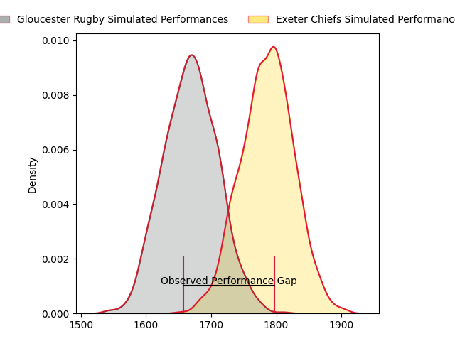
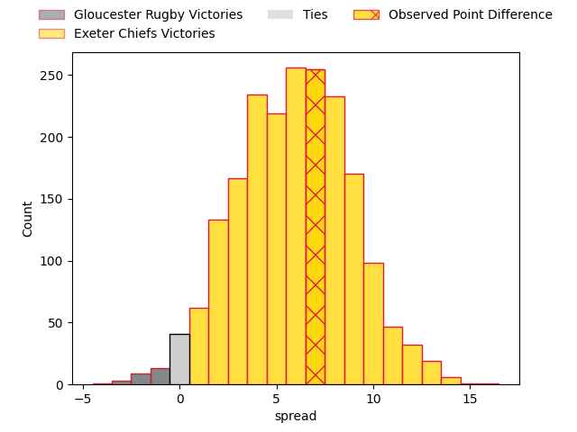
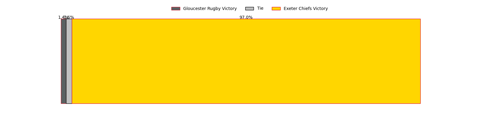
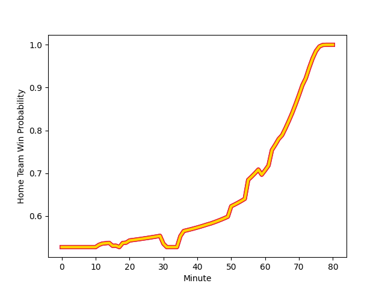

---  
layout: page  
title: Gloucester Rugby at Exeter Chiefs; 17-24  
date: 2023-01-28 11:30:00 18:00:00 -0500  
categories: match review  
---
# Gloucester Rugby at Exeter Chiefs; 17-24

# Club Level Predictions

The first set of predictions treats a club as the smallest object, as the club develops its members, organizes a gameplan, and deploys its players as needed for each match. This club model has a prediction of 0.741, which translates to predicting Exeter Chiefs to win by 9.2.

Each club has a rating and a rating deviation (simiar to a Glicko system), and expected performances can be generated. This allows for simulated matches and spreads like the ones below.
## Projected Performances

## Projected Spreads

## Projected Results

# Player Level Predictions

Treating teams instead as an entity made up of the currently active players, I have ratings for each player in an altogether different system. These can be combined to form team ratings once teamsheets are announced, weighting starters a bit higher than the reserves. After the match is played, players can be weighted by their minutes on the field, allowing for an accurate measure of the team's composition. With these compiled team ratings, we can make predictions, measure inaccuracy, and update the individual player ratings.
## Prediction with Player Minutes: Exeter Chiefs by 8.6

Exeter Chiefs by 4.6 on a neutral field
## Scores over Time

## Win Probability over Time

## Prediction without Player Minutes: Exeter Chiefs by 8.1

Exeter Chiefs by 4.1 on a neutral pitch

|   Away Minutes | Away Player                                                           |   Away elo |   Away Percentile |   Number |   Home Percentile |   Home elo | Home Player                                                             |   Home Minutes |
|---------------:|:----------------------------------------------------------------------|-----------:|------------------:|---------:|------------------:|-----------:|:------------------------------------------------------------------------|---------------:|
|             44 | [Val Rapava-Ruskin](..//playerfiles//ValRapava-Ruskin_cleaned.md)     |      88.25 |                26 |        1 |                56 |      98.82 | [Scott Sio](..//playerfiles//ScottSio_cleaned.md)                       |             72 |
|             65 | [Sebastian Blake](..//playerfiles//SebastianBlake_cleaned.md)         |      86.82 |               nan |        2 |                82 |     108.05 | [Jack Innard](..//playerfiles//JackInnard_cleaned.md)                   |             50 |
|             76 | [Kirill Gotovtsev](..//playerfiles//KirillGotovtsev_cleaned.md)       |     112.99 |                88 |        3 |                87 |     112.44 | [Harry Williams](..//playerfiles//HarryWilliams_cleaned.md)             |             72 |
|             62 | [Cameron Jordan](..//playerfiles//CameronJordan_cleaned.md)           |     125.37 |                94 |        4 |                79 |     109.71 | [Jonny Gray](..//playerfiles//JonnyGray_cleaned.md)                     |             68 |
|             80 | [Matias Alemanno](..//playerfiles//MatiasAlemanno_cleaned.md)         |     106.03 |                74 |        5 |                89 |     117.36 | [Dafydd Jenkins](..//playerfiles//DafyddJenkins_cleaned.md)             |             80 |
|             80 | [Jack Clement](..//playerfiles//JackClement_cleaned.md)               |     111.02 |                82 |        6 |                99 |     155.52 | [Dave Ewers](..//playerfiles//DaveEwers_cleaned.md)                     |             80 |
|             80 | [Lewis Ludlow](..//playerfiles//LewisLudlow_cleaned.md)               |      98.68 |                56 |        7 |                87 |     116.26 | [Jannes Kirsten](..//playerfiles//JannesKirsten_cleaned.md)             |             59 |
|             62 | [Albert Tuisue](..//playerfiles//AlbertTuisue_cleaned.md)             |      82.44 |                17 |        8 |                22 |      86.79 | [Greg Fisilau](..//playerfiles//GregFisilau_cleaned.md)                 |             80 |
|             62 | [Ben Meehan](..//playerfiles//BenMeehan_cleaned.md)                   |      90.25 |                33 |        9 |                12 |      78.86 | [Sam Maunder](..//playerfiles//SamMaunder_cleaned.md)                   |             62 |
|             65 | [Billy Twelvetrees](..//playerfiles//BillyTwelvetrees_cleaned.md)     |     132.26 |                95 |       10 |                60 |     103.38 | [Harvey Skinner](..//playerfiles//HarveySkinner_cleaned.md)             |             80 |
|             80 | [Ollie Thorley](..//playerfiles//OllieThorley_cleaned.md)             |     121.19 |                91 |       11 |                98 |     142.47 | [Olly Woodburn](..//playerfiles//OllyWoodburn_cleaned.md)               |             80 |
|             80 | [Sebastien Atkinson](..//playerfiles//SebastienAtkinson_cleaned.md)   |      67.43 |                 3 |       12 |                98 |     137.76 | [Solomone Kata](..//playerfiles//SolomoneKata_cleaned.md)               |             76 |
|             80 | [Chris Harris](..//playerfiles//ChrisHarris_cleaned.md)               |     114.23 |                85 |       13 |                48 |      95.43 | [Ian Whitten](..//playerfiles//IanWhitten_cleaned.md)                   |             76 |
|             62 | [Jonny May](..//playerfiles//JonnyMay_cleaned.md)                     |     115.91 |                86 |       14 |                13 |      80.52 | [Jack Nowell](..//playerfiles//JackNowell_cleaned.md)                   |             80 |
|             80 | [Santiago Carreras](..//playerfiles//SantiagoCarreras_cleaned.md)     |     141.61 |                98 |       15 |                34 |      89.99 | [Josh Hodge](..//playerfiles//JoshHodge_cleaned.md)                     |             80 |
|             15 | [Henry Walker](..//playerfiles//HenryWalker_cleaned.md)               |     112.94 |                88 |       16 |                99 |     139.78 | [Dan Frost](..//playerfiles//DanFrost_cleaned.md)                       |             30 |
|             36 | [Harry Elrington](..//playerfiles//HarryElrington_cleaned.md)         |      88.91 |                40 |       17 |                 9 |      78.52 | [James Kenny](..//playerfiles//JamesKenny_cleaned.md)                   |              8 |
|              4 | [Jamal Ford-Robinson](..//playerfiles//JamalFord-Robinson_cleaned.md) |      94.84 |                42 |       18 |                65 |     103.98 | [Patrick Schickerling](..//playerfiles//PatrickSchickerling_cleaned.md) |              8 |
|             18 | [Freddie Clarke](..//playerfiles//FreddieClarke_cleaned.md)           |      93.93 |                41 |       19 |                73 |     108.02 | [Jack Dunne](..//playerfiles//JackDunne_cleaned.md)                     |             12 |
|             18 | [Ben Morgan](..//playerfiles//BenMorgan_cleaned.md)                   |     122.98 |                91 |       20 |                11 |      79.85 | [Aidon Davis](..//playerfiles//AidonDavis_cleaned.md)                   |             21 |
|             18 | [Charlie Chapman](..//playerfiles//CharlieChapman_cleaned.md)         |      97.15 |                59 |       21 |                16 |      83.66 | [Jack Maunder](..//playerfiles//JackMaunder_cleaned.md)                 |             18 |
|             18 | [Tom Seabrook](..//playerfiles//TomSeabrook_cleaned.md)               |      60.68 |                 3 |       22 |                96 |     133.46 | [Joe Simmonds](..//playerfiles//JoeSimmonds_cleaned.md)                 |              4 |
|             15 | [Lloyd Evans](..//playerfiles//LloydEvans_cleaned.md)                 |     118.48 |                87 |       23 |                40 |      92.37 | [Rory O'Loughlin](..//playerfiles//RoryO'Loughlin_cleaned.md)           |              4 |

