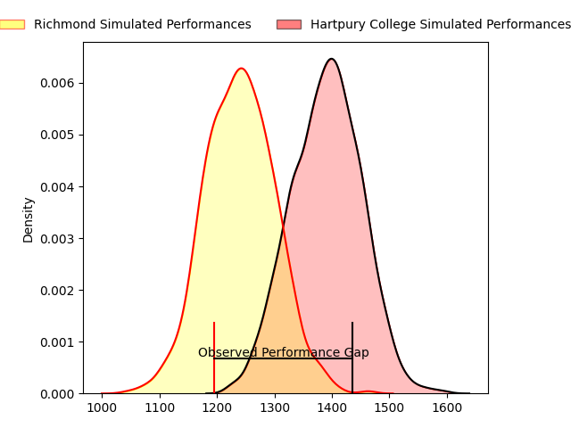
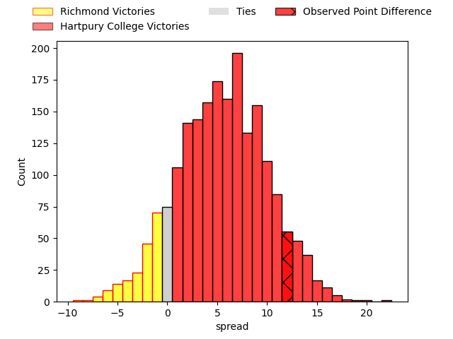
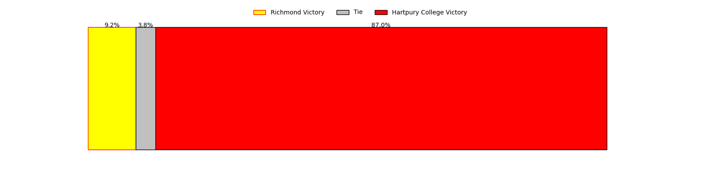
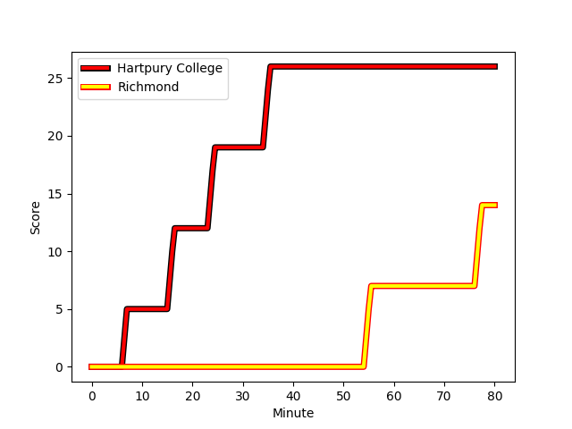
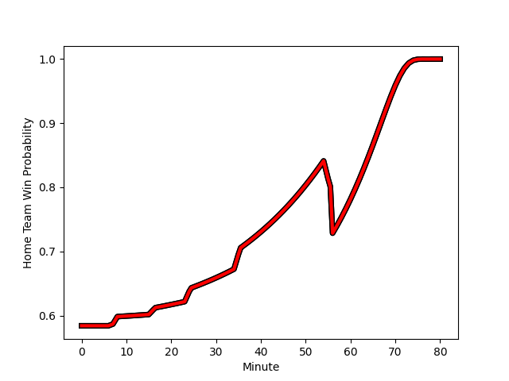

---  
layout: page  
title: Richmond at Hartpury College; 14-26  
date: 2023-01-28 15:30:00 18:00:00 -0500  
categories: match review  
---
# Richmond at Hartpury College; 14-26

# Club Level Predictions

The first set of predictions treats a club as the smallest object, as the club develops its members, organizes a gameplan, and deploys its players as needed for each match. This club model has a prediction of 0.652, which translates to predicting Hartpury College to win by 5.5.

Each club has a rating and a rating deviation (simiar to a Glicko system), and expected performances can be generated. This allows for simulated matches and spreads like the ones below.
## Projected Performances

## Projected Spreads

## Projected Results

# Player Level Predictions

Treating teams instead as an entity made up of the currently active players, I have ratings for each player in an altogether different system. These can be combined to form team ratings once teamsheets are announced, weighting starters a bit higher than the reserves. After the match is played, players can be weighted by their minutes on the field, allowing for an accurate measure of the team's composition. With these compiled team ratings, we can make predictions, measure inaccuracy, and update the individual player ratings.
## Prediction with Player Minutes: Hartpury College by 18.7

Hartpury College by 14.7 on a neutral field
## Scores over Time

## Win Probability over Time

## Prediction without Player Minutes: Hartpury College by 18.6

Hartpury College by 14.6 on a neutral pitch

|   Away Minutes | Away Player                                                       |   Away elo |   Away Percentile |   Number |   Home Percentile |   Home elo | Home Player                                                              |   Home Minutes |
|---------------:|:------------------------------------------------------------------|-----------:|------------------:|---------:|------------------:|-----------:|:-------------------------------------------------------------------------|---------------:|
|             56 | [Conor Maguire](..//playerfiles//ConorMaguire_cleaned.md)         |      78.75 |                 9 |        1 |                43 |      93.82 | [Joe Wrafter](..//playerfiles//JoeWrafter_cleaned.md)                    |             24 |
|             40 | [Joseph Vajner](..//playerfiles//JosephVajner_cleaned.md)         |      79.47 |                10 |        2 |                75 |     101.82 | [Luke Stratford](..//playerfiles//LukeStratford_cleaned.md)              |             58 |
|             62 | [Ntinga Mpiko](..//playerfiles//NtingaMpiko_cleaned.md)           |      88.96 |                27 |        3 |               nan |      96.5  | [George Kloska](..//playerfiles//GeorgeKloska_cleaned.md)                |             50 |
|             80 | [Sam Collingridge](..//playerfiles//SamCollingridge_cleaned.md)   |      85.1  |                22 |        4 |                37 |      91.37 | [Jack Davies](..//playerfiles//JackDavies_cleaned.md)                    |             80 |
|             80 | [Jake Monson](..//playerfiles//JakeMonson_cleaned.md)             |      84.64 |                21 |        5 |                66 |     101.77 | [Dale Lemon](..//playerfiles//DaleLemon_cleaned.md)                      |             80 |
|             80 | [David Massey](..//playerfiles//DavidMassey_cleaned.md)           |      81.78 |                14 |        6 |                10 |      78.87 | [Samuel Lewis](..//playerfiles//SamuelLewis_cleaned.md)                  |             80 |
|              8 | [Tobias Saysell](..//playerfiles//TobiasSaysell_cleaned.md)       |     103.11 |                69 |        7 |                27 |      88.5  | [Oli Robinson](..//playerfiles//OliRobinson_cleaned.md)                  |             67 |
|             80 | [Mark Bright](..//playerfiles//MarkBright_cleaned.md)             |      75.49 |                 8 |        8 |                16 |      82.29 | [Joe Howard](..//playerfiles//JoeHoward_cleaned.md)                      |             62 |
|             51 | [James Lennon](..//playerfiles//JamesLennon_cleaned.md)           |      95.75 |                55 |        9 |                82 |     108.87 | [Matty Jones](..//playerfiles//MattyJones_cleaned.md)                    |             62 |
|             80 | [Bill Johnston](..//playerfiles//BillJohnston_cleaned.md)         |      91.85 |                35 |       10 |                60 |     101.44 | [Tommy Mathews](..//playerfiles//TommyMathews_cleaned.md)                |             80 |
|             80 | [Owain James](..//playerfiles//OwainJames_cleaned.md)             |      70.37 |                 6 |       11 |                21 |      84.69 | [Matthew McNab](..//playerfiles//MatthewMcNab_cleaned.md)                |             78 |
|             80 | [Paul Kiernan](..//playerfiles//PaulKiernan_cleaned.md)           |      76.44 |                 9 |       12 |                68 |     103.88 | [Harry Tarling](..//playerfiles//HarryTarling_cleaned.md)                |             80 |
|             56 | [Zuriel Makele](..//playerfiles//ZurielMakele_cleaned.md)         |      89.77 |               nan |       13 |                23 |      90.61 | [Ben Foley](..//playerfiles//BenFoley_cleaned.md)                        |             33 |
|             80 | [Alexander O'Meara](..//playerfiles//AlexanderO'Meara_cleaned.md) |      85.81 |                20 |       14 |                54 |      97.57 | [Bradley Denty](..//playerfiles//BradleyDenty_cleaned.md)                |             80 |
|             68 | [Darren Atkins](..//playerfiles//DarrenAtkins_cleaned.md)         |      60.14 |                 2 |       15 |                 8 |      72.42 | [Jake Morris](..//playerfiles//JakeMorris_cleaned.md)                    |             80 |
|             48 | [Miles Wakeling](..//playerfiles//MilesWakeling_cleaned.md)       |      83.15 |                20 |       16 |                60 |      98.58 | [Aristot Benz-Salomon](..//playerfiles//AristotBenz-Salomon_cleaned.md)  |             56 |
|             40 | [Alex Post](..//playerfiles//AlexPost_cleaned.md)                 |     122.81 |                95 |       17 |                18 |      82.55 | [William Butler](..//playerfiles//WilliamButler_cleaned.md)              |             47 |
|             29 | [Jack Stafford](..//playerfiles//JackStafford_cleaned.md)         |      93.47 |                42 |       18 |                84 |     108.88 | [Sam Rodman](..//playerfiles//SamRodman_cleaned.md)                      |             30 |
|             24 | [George Cave](..//playerfiles//GeorgeCave_cleaned.md)             |      93.52 |               nan |       19 |                55 |      99.14 | [Jack Lloyd](..//playerfiles//JackLloyd_cleaned.md)                      |             18 |
|             24 | [Alex Burrage](..//playerfiles//AlexBurrage_cleaned.md)           |      92.89 |               nan |       20 |                37 |      93.75 | [Jake Holcombe](..//playerfiles//JakeHolcombe_cleaned.md)                |             18 |
|             24 | [Ethan Benson](..//playerfiles//EthanBenson_cleaned.md)           |      83.21 |                18 |       21 |               nan |      95    | [Andrew Davies](..//playerfiles//AndrewDavies_cleaned.md)                |             22 |
|             18 | [Jimmy Litchfield](..//playerfiles//JimmyLitchfield_cleaned.md)   |      62.11 |                 1 |       22 |               nan |      98.22 | [Ben Glynn](..//playerfiles//BenGlynn_cleaned.md)                        |             13 |
|             12 | [Jack Caddy](..//playerfiles//JackCaddy_cleaned.md)               |      66.86 |                 3 |       23 |               nan |      98.17 | [Arthur William Lennon](..//playerfiles//ArthurWilliamLennon_cleaned.md) |              2 |

