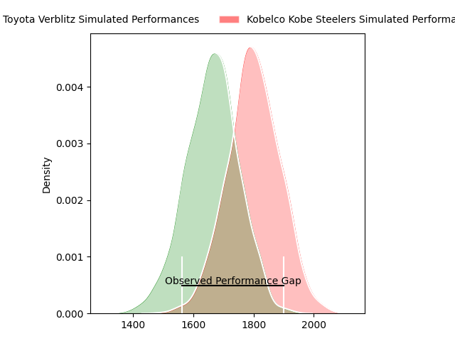
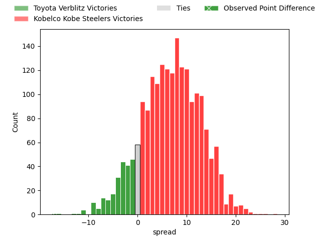
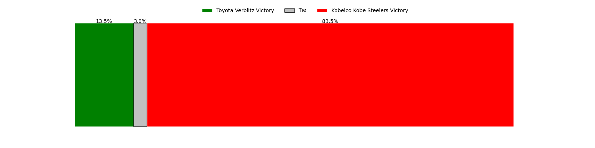
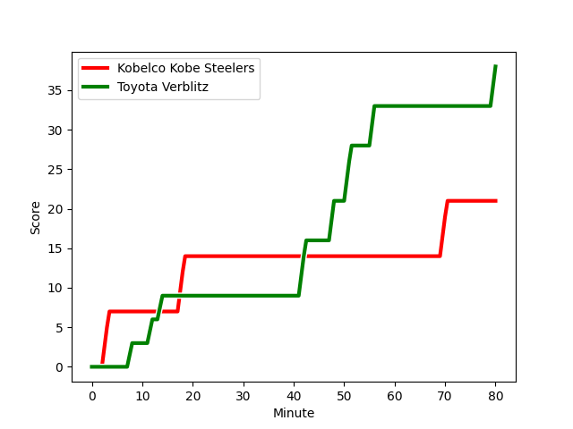
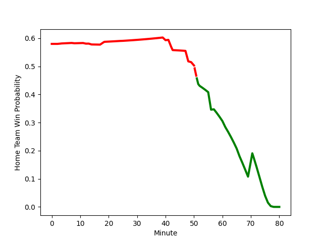

---  
layout: page  
title: Toyota Verblitz at Kobelco Kobe Steelers; 38-21  
date: 2023-01-28 06:30:00 18:00:00 -0500  
categories: match review  
---
# Toyota Verblitz at Kobelco Kobe Steelers; 38-21

# Club Level Predictions

The first set of predictions treats a club as the smallest object, as the club develops its members, organizes a gameplan, and deploys its players as needed for each match. This club model has a prediction of 0.636, which translates to predicting Kobelco Kobe Steelers to win by 5.0.

Each club has a rating and a rating deviation (simiar to a Glicko system), and expected performances can be generated. This allows for simulated matches and spreads like the ones below.
## Projected Performances

## Projected Spreads

## Projected Results

# Player Level Predictions

Treating teams instead as an entity made up of the currently active players, I have ratings for each player in an altogether different system. These can be combined to form team ratings once teamsheets are announced, weighting starters a bit higher than the reserves. After the match is played, players can be weighted by their minutes on the field, allowing for an accurate measure of the team's composition. With these compiled team ratings, we can make predictions, measure inaccuracy, and update the individual player ratings.
## Prediction with Player Minutes: Kobelco Kobe Steelers by 20.1

Kobelco Kobe Steelers by 16.1 on a neutral field
## Scores over Time

## Win Probability over Time

## Prediction without Player Minutes: Kobelco Kobe Steelers by 24.8

Kobelco Kobe Steelers by 20.8 on a neutral pitch

|   Away Minutes | Away Player                                                                            |   Away elo |   Away Percentile |   Number |   Home Percentile |   Home elo | Home Player                                                       |   Home Minutes |
|---------------:|:---------------------------------------------------------------------------------------|-----------:|------------------:|---------:|------------------:|-----------:|:------------------------------------------------------------------|---------------:|
|             80 | [Shogo Miura](..//playerfiles//ShogoMiura_cleaned.md)                                  |     103.87 |                73 |        1 |                72 |     103.18 | [Shigure Takao](..//playerfiles//ShigureTakao_cleaned.md)         |             57 |
|             80 | [Yoshikatsu Hikosaka](..//playerfiles//YoshikatsuHikosaka_cleaned.md)                  |     109.86 |                88 |        2 |                69 |     102.01 | [Kenta Matsuoka](..//playerfiles//KentaMatsuoka_cleaned.md)       |             80 |
|             40 | [Yusuke Kizu](..//playerfiles//YusukeKizu_cleaned.md)                                  |     117.55 |                93 |        3 |                91 |     116.09 | [Hiroshi Yamashita](..//playerfiles//HiroshiYamashita_cleaned.md) |             40 |
|             80 | [Daichi Akiyama](..//playerfiles//DaichiAkiyama_cleaned.md)                            |      97.19 |                54 |        4 |                91 |     120.22 | [Naohiro Kotaki](..//playerfiles//NaohiroKotaki_cleaned.md)       |             52 |
|             61 | [Michael Allardice](..//playerfiles//MichaelAllardice_cleaned.md)                      |      99.04 |                58 |        5 |                 6 |      70.85 | [JD Schickerling](..//playerfiles//JDSchickerling_cleaned.md)     |             80 |
|             80 | [Will Tupou](..//playerfiles//WillTupou_cleaned.md)                                    |      80.93 |                14 |        6 |                70 |     103.88 | [Amanaki Saumaki](..//playerfiles//AmanakiSaumaki_cleaned.md)     |             80 |
|             80 | [Masato Furukawa](..//playerfiles//MasatoFurukawa_cleaned.md)                          |      90.87 |                49 |        7 |                86 |     115.3  | [Marcell Coetzee](..//playerfiles//MarcellCoetzee_cleaned.md)     |             80 |
|             80 | [Pieter-Steph du Toit](..//playerfiles//Pieter-StephduToit_cleaned.md)                 |     103.93 |                70 |        8 |               nan |     113.75 | [Sosiceni Tokoqio](..//playerfiles//SosiceniTokoqio_cleaned.md)   |             50 |
|             66 | [Kenta Fukuda](..//playerfiles//KentaFukuda_cleaned.md)                                |      99.41 |                60 |        9 |                92 |     118.83 | [Daiki Nakajima](..//playerfiles//DaikiNakajima_cleaned.md)       |             57 |
|             80 | [Tiaan Falcon](..//playerfiles//TiaanFalcon_cleaned.md)                                |     103.8  |                69 |       10 |                72 |     105.8  | [Seungsin Lee](..//playerfiles//SeungsinLee_cleaned.md)           |             80 |
|             80 | [Jone Turaganivalu Nabetelevu](..//playerfiles//JoneTuraganivaluNabetelevu_cleaned.md) |      83.44 |                20 |       11 |                99 |     156.16 | [Rakuhei Yamashita](..//playerfiles//RakuheiYamashita_cleaned.md) |             80 |
|             71 | [Charlie Lawrence](..//playerfiles//CharlieLawrence_cleaned.md)                        |     112.2  |                81 |       12 |                89 |     119.87 | [Richard Buckman](..//playerfiles//RichardBuckman_cleaned.md)     |             40 |
|             73 | [Vatiliai Tuidraki](..//playerfiles//VatiliaiTuidraki_cleaned.md)                      |      89.85 |                34 |       13 |                65 |     102.04 | [Timothy Lafaele](..//playerfiles//TimothyLafaele_cleaned.md)     |             80 |
|             80 | [Taichi Takahashi](..//playerfiles//TaichiTakahashi_cleaned.md)                        |      76.27 |                 9 |       14 |               nan |      95    | [Kosuke Naka](..//playerfiles//KosukeNaka_cleaned.md)             |             25 |
|             80 | [Viliame Tuidraki](..//playerfiles//ViliameTuidraki_cleaned.md)                        |      86.26 |                22 |       15 |                57 |     100.26 | [Ryohei Yamanaka](..//playerfiles//RyoheiYamanaka_cleaned.md)     |             80 |
|             40 | [Shunsuke Asaoka](..//playerfiles//ShunsukeAsaoka_cleaned.md)                          |     103.84 |                77 |       16 |                46 |      94.16 | [Kanta Matsunaga](..//playerfiles//KantaMatsunaga_cleaned.md)     |             55 |
|             19 | [Ryoma Nishimura](..//playerfiles//RyomaNishimura_cleaned.md)                          |     107.06 |                76 |       17 |                77 |     105.5  | [Go Maeda](..//playerfiles//GoMaeda_cleaned.md)                   |             40 |
|             14 | [Kaito Shigeno](..//playerfiles//KaitoShigeno_cleaned.md)                              |      99.78 |                61 |       18 |                57 |     100.07 | [Beaudein Waaka](..//playerfiles//BeaudeinWaaka_cleaned.md)       |             40 |
|              9 | [Willie le Roux](..//playerfiles//WillieleRoux_cleaned.md)                             |     126.84 |                93 |       19 |               nan |      93.46 | [Willie Potgieter](..//playerfiles//WilliePotgieter_cleaned.md)   |             30 |
|              7 | [Shuhei Yamaguchi](..//playerfiles//ShuheiYamaguchi_cleaned.md)                        |      93.86 |               nan |       20 |                48 |      99.21 | [Takara Imamura](..//playerfiles//TakaraImamura_cleaned.md)       |             28 |
|            nan | nan                                                                                    |     nan    |               nan |       21 |                93 |     119.58 | [Atsushi Hiwasa](..//playerfiles//AtsushiHiwasa_cleaned.md)       |             23 |
|            nan | nan                                                                                    |     nan    |               nan |       22 |                64 |     101.69 | [Koki Yamamoto](..//playerfiles//KokiYamamoto_cleaned.md)         |             23 |

