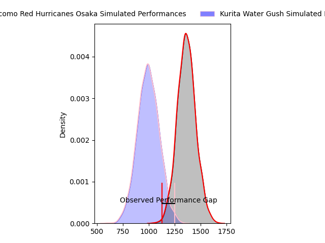
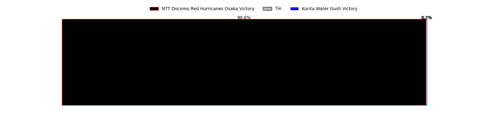
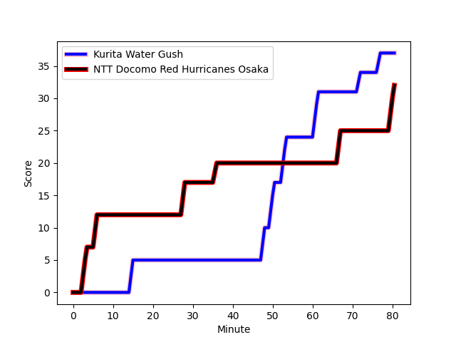
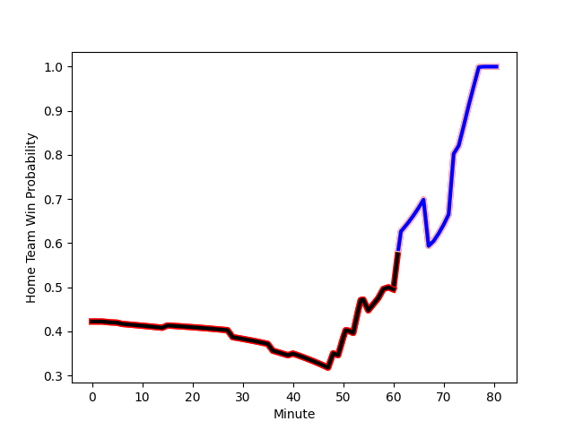

---  
layout: page  
title: NTT Docomo Red Hurricanes Osaka at Kurita Water Gush; 32-37  
date: 2023-01-28 00:00:00 18:00:00 -0500  
categories: match review  
---
# NTT Docomo Red Hurricanes Osaka at Kurita Water Gush; 32-37

# Club Level Predictions

The first set of predictions treats a club as the smallest object, as the club develops its members, organizes a gameplan, and deploys its players as needed for each match. This club model has a prediction of 0.129, which translates to predicting NTT Docomo Red Hurricanes Osaka to win by 17.3.

Each club has a rating and a rating deviation (simiar to a Glicko system), and expected performances can be generated. This allows for simulated matches and spreads like the ones below.
## Projected Performances

## Projected Spreads

## Projected Results

# Player Level Predictions

Treating teams instead as an entity made up of the currently active players, I have ratings for each player in an altogether different system. These can be combined to form team ratings once teamsheets are announced, weighting starters a bit higher than the reserves. After the match is played, players can be weighted by their minutes on the field, allowing for an accurate measure of the team's composition. With these compiled team ratings, we can make predictions, measure inaccuracy, and update the individual player ratings.
## Prediction with Player Minutes: NTT Docomo Red Hurricanes Osaka by 9.6

NTT Docomo Red Hurricanes Osaka by 13.6 on a neutral field
## Scores over Time

## Win Probability over Time

## Prediction without Player Minutes: NTT Docomo Red Hurricanes Osaka by 13.1

NTT Docomo Red Hurricanes Osaka by 17.1 on a neutral pitch

|   Away Minutes | Away Player                                                                                 |   Away elo |   Away Percentile |   Number |   Home Percentile |   Home elo | Home Player                                                               |   Home Minutes |
|---------------:|:--------------------------------------------------------------------------------------------|-----------:|------------------:|---------:|------------------:|-----------:|:--------------------------------------------------------------------------|---------------:|
|             60 | [Shosuke Fukasawa](..//playerfiles//ShosukeFukasawa_cleaned.md)                             |      94.44 |                46 |        1 |                 4 |      64.91 | [Hyong Ji Kim](..//playerfiles//HyongJiKim_cleaned.md)                    |             58 |
|             60 | [Hisamitsu Shimada](..//playerfiles//HisamitsuShimada_cleaned.md)                           |      99.02 |                71 |        2 |                 1 |      67.52 | [Ryota Kuribara](..//playerfiles//RyotaKuribara_cleaned.md)               |             57 |
|             60 | [Munekata Sashida](..//playerfiles//MunekataSashida_cleaned.md)                             |      98.4  |                59 |        3 |                 3 |      70.42 | [Kuriyama Rui](..//playerfiles//KuriyamaRui_cleaned.md)                   |             68 |
|             80 | [Tatsunari Fujita](..//playerfiles//TatsunariFujita_cleaned.md)                             |      83.11 |                18 |        4 |                 1 |      56.42 | [Mitsuo Nakao](..//playerfiles//MitsuoNakao_cleaned.md)                   |             56 |
|             80 | [Tom Jeffries](..//playerfiles//TomJeffries_cleaned.md)                                     |     105.98 |                75 |        5 |                 4 |      66.01 | [Gideon Koegelenberg](..//playerfiles//GideonKoegelenberg_cleaned.md)     |             80 |
|             55 | [Josh Fenner](..//playerfiles//JoshFenner_cleaned.md)                                       |      87.2  |                25 |        6 |                 8 |      77.11 | [Yosuke Ishii](..//playerfiles//YosukeIshii_cleaned.md)                   |             68 |
|             73 | [Toru Sugishita](..//playerfiles//ToruSugishita_cleaned.md)                                 |      59.67 |                 0 |        7 |                23 |      86.78 | [Taisei Nakao](..//playerfiles//TaiseiNakao_cleaned.md)                   |             80 |
|             80 | [Colin Bourke](..//playerfiles//ColinBourke_cleaned.md)                                     |      88.71 |                29 |        8 |                14 |      80.56 | [Feinga Kihe Lotu Fakai](..//playerfiles//FeingaKiheLotuFakai_cleaned.md) |             40 |
|             73 | [Tatsuya Hamano](..//playerfiles//TatsuyaHamano_cleaned.md)                                 |      94.19 |                43 |        9 |                 5 |      72.06 | [Kengo Nakamura](..//playerfiles//KengoNakamura_cleaned.md)               |             80 |
|             80 | [Ei Kawamuko](..//playerfiles//EiKawamuko_cleaned.md)                                       |      99.34 |                55 |       10 |                 9 |      77.78 | [Takuro Hayashida](..//playerfiles//TakuroHayashida_cleaned.md)           |             80 |
|             80 | [Michael Zakhia](..//playerfiles//MichaelZakhia_cleaned.md)                                 |      95    |               nan |       11 |                 2 |      62.12 | [Keigo Hamazoe](..//playerfiles//KeigoHamazoe_cleaned.md)                 |             80 |
|             52 | [Tonisio Lafaele Fakamisia Vaihu](..//playerfiles//TonisioLafaeleFakamisiaVaihu_cleaned.md) |      85.1  |                23 |       12 |                19 |      83.22 | [Jamie Vakalahi](..//playerfiles//JamieVakalahi_cleaned.md)               |             80 |
|             80 | [Yonhi Kimu](..//playerfiles//YonhiKimu_cleaned.md)                                         |      79.61 |                13 |       13 |                39 |      88.88 | [Antonio Mikaele-Tu'u](..//playerfiles//AntonioMikaele-Tu'u_cleaned.md)   |             55 |
|             80 | [Taichi Yoshizawa](..//playerfiles//TaichiYoshizawa_cleaned.md)                             |      62.28 |                 4 |       14 |                63 |     101.05 | [Tom English](..//playerfiles//TomEnglish_cleaned.md)                     |             80 |
|             55 | [Kanta Yamamoto](..//playerfiles//KantaYamamoto_cleaned.md)                                 |      59.96 |                 2 |       15 |                60 |     100.83 | [Koshi Emoto](..//playerfiles//KoshiEmoto_cleaned.md)                     |             80 |
|             28 | [Daisuke Iba](..//playerfiles//DaisukeIba_cleaned.md)                                       |      91.87 |                46 |       16 |                60 |      94.93 | [Tebita Oto](..//playerfiles//TebitaOto_cleaned.md)                       |             40 |
|             25 | [Tsukasa Yasuda](..//playerfiles//TsukasaYasuda_cleaned.md)                                 |      95.71 |                46 |       17 |                17 |      84.81 | [Andrew Deegan](..//playerfiles//AndrewDeegan_cleaned.md)                 |             25 |
|             20 | [Mitsumasa Harayama](..//playerfiles//MitsumasaHarayama_cleaned.md)                         |     111.2  |                85 |       18 |                 9 |      75.67 | [Kota Nakamura](..//playerfiles//KotaNakamura_cleaned.md)                 |             24 |
|             20 | [Wataru Furuya](..//playerfiles//WataruFuruya_cleaned.md)                                   |      94.51 |               nan |       19 |                39 |      86.58 | [Kota Hojo](..//playerfiles//KotaHojo_cleaned.md)                         |             23 |
|             20 | [Yuichiro Hosono](..//playerfiles//YuichiroHosono_cleaned.md)                               |     101.19 |               nan |       20 |               nan |      95    | [Megumi Tagusagawa](..//playerfiles//MegumiTagusagawa_cleaned.md)         |             22 |
|              7 | [Taro Sato](..//playerfiles//TaroSato_cleaned.md)                                           |     112.22 |               nan |       21 |                 5 |      70.97 | [Aki Kajiwara](..//playerfiles//AkiKajiwara_cleaned.md)                   |             12 |
|              7 | [Toshihiro Yamamouchi](..//playerfiles//ToshihiroYamamouchi_cleaned.md)                     |      95.21 |               nan |       22 |                 3 |      69.47 | [Hiroki Kawase](..//playerfiles//HirokiKawase_cleaned.md)                 |             12 |
|             25 | [Amanaki Lisala](..//playerfiles//AmanakiLisala_cleaned.md)                                 |      95    |               nan |       23 |               nan |     nan    | nan                                                                       |            nan |

