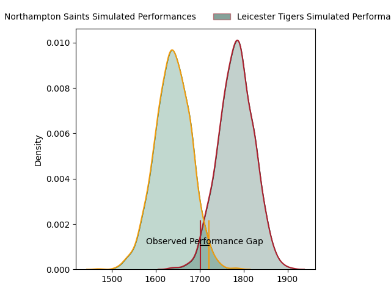
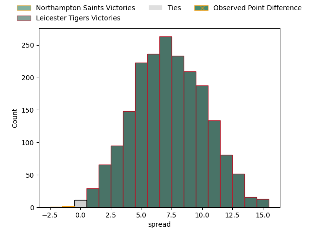
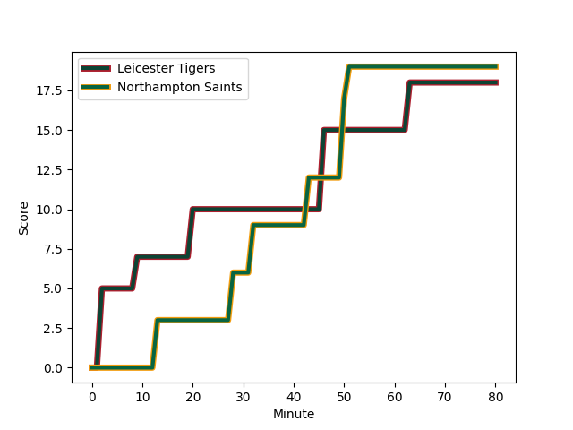

---  
layout: page  
title: Northampton Saints at Leicester Tigers; 19-18  
date: 2023-01-28 09:00:00 18:00:00 -0500  
categories: match review  
---
# Northampton Saints at Leicester Tigers; 19-18

# Club Level Predictions

The first set of predictions treats a club as the smallest object, as the club develops its members, organizes a gameplan, and deploys its players as needed for each match. This club model has a prediction of 0.695, which translates to predicting Leicester Tigers to win by 7.2.

Each club has a rating and a rating deviation (simiar to a Glicko system), and expected performances can be generated. This allows for simulated matches and spreads like the ones below.
## Projected Performances

## Projected Spreads

## Projected Results

# Player Level Predictions

Treating teams instead as an entity made up of the currently active players, I have ratings for each player in an altogether different system. These can be combined to form team ratings once teamsheets are announced, weighting starters a bit higher than the reserves. After the match is played, players can be weighted by their minutes on the field, allowing for an accurate measure of the team's composition. With these compiled team ratings, we can make predictions, measure inaccuracy, and update the individual player ratings.
## Prediction with Player Minutes: Leicester Tigers by 4.0

Leicester Tigers by 0.0 on a neutral field
## Scores over Time

## Win Probability over Time

## Prediction without Player Minutes: Leicester Tigers by 0.3

Northampton Saints by 3.7 on a neutral pitch

|   Away Minutes | Away Player                                                         |   Away elo |   Away Percentile |   Number |   Home Percentile |   Home elo | Home Player                                                     |   Home Minutes |
|---------------:|:--------------------------------------------------------------------|-----------:|------------------:|---------:|------------------:|-----------:|:----------------------------------------------------------------|---------------:|
|             51 | [Alex Waller](..//playerfiles//AlexWaller_cleaned.md)               |     131.12 |                98 |        1 |                12 |      81.65 | [James Whitcombe](..//playerfiles//JamesWhitcombe_cleaned.md)   |             57 |
|              8 | [Mike Haywood](..//playerfiles//MikeHaywood_cleaned.md)             |     138.57 |                99 |        2 |                48 |      93.87 | [Julian Montoya](..//playerfiles//JulianMontoya_cleaned.md)     |             75 |
|             69 | [Paul Hill](..//playerfiles//PaulHill_cleaned.md)                   |     103.16 |                72 |        3 |                25 |      89.66 | [Will Hurd](..//playerfiles//WillHurd_cleaned.md)               |             63 |
|             80 | [Alex Moon](..//playerfiles//AlexMoon_cleaned.md)                   |     106.69 |                75 |        4 |                98 |     143.47 | [Harry Wells](..//playerfiles//HarryWells_cleaned.md)           |             80 |
|             80 | [Alex Coles](..//playerfiles//AlexColes_cleaned.md)                 |      66.13 |                 4 |        5 |                49 |      94.95 | [Eli Snyman](..//playerfiles//EliSnyman_cleaned.md)             |             57 |
|             80 | [Angus Scott-Young](..//playerfiles//AngusScott-Young_cleaned.md)   |     107.66 |                75 |        6 |                94 |     127.34 | [Hanro Liebenberg](..//playerfiles//HanroLiebenberg_cleaned.md) |             80 |
|             51 | [Aaron Hinkley](..//playerfiles//AaronHinkley_cleaned.md)           |      88.39 |                28 |        7 |                84 |     113.35 | [Tommy Reffell](..//playerfiles//TommyReffell_cleaned.md)       |             40 |
|             80 | [Juarno Augustus](..//playerfiles//JuarnoAugustus_cleaned.md)       |      85.35 |                23 |        8 |                53 |      98.89 | [Jasper Wiese](..//playerfiles//JasperWiese_cleaned.md)         |             80 |
|             80 | [Tom James](..//playerfiles//TomJames_cleaned.md)                   |      90.38 |                38 |        9 |               nan |      82.7  | [Sam Edwards](..//playerfiles//SamEdwards_cleaned.md)           |             69 |
|             80 | [George Furbank](..//playerfiles//GeorgeFurbank_cleaned.md)         |     125.37 |                91 |       10 |                93 |     125.66 | [Handre Pollard](..//playerfiles//HandrePollard_cleaned.md)     |             45 |
|             80 | [Ollie Sleightholme](..//playerfiles//OllieSleightholme_cleaned.md) |     112.63 |                84 |       11 |                37 |      91.67 | [Harry Potter](..//playerfiles//HarryPotter_cleaned.md)         |             80 |
|             80 | [Rory Hutchinson](..//playerfiles//RoryHutchinson_cleaned.md)       |      95.3  |                47 |       12 |                88 |     117.49 | [Guy Porter](..//playerfiles//GuyPorter_cleaned.md)             |             80 |
|             80 | [Matty Proctor](..//playerfiles//MattyProctor_cleaned.md)           |     131.76 |                96 |       13 |                33 |      89.65 | [Matt Scott](..//playerfiles//MattScott_cleaned.md)             |             80 |
|             80 | [Courtnall Skosan](..//playerfiles//CourtnallSkosan_cleaned.md)     |     119.09 |                89 |       14 |                36 |      91.17 | [Anthony Watson](..//playerfiles//AnthonyWatson_cleaned.md)     |             80 |
|             80 | [James Ramm](..//playerfiles//JamesRamm_cleaned.md)                 |     114    |                84 |       15 |                83 |     114.94 | [Freddie Burns](..//playerfiles//FreddieBurns_cleaned.md)       |             69 |
|             72 | [Robbie Smith](..//playerfiles//RobbieSmith_cleaned.md)             |      68.89 |               nan |       16 |                 3 |      72.12 | [Charlie Clare](..//playerfiles//CharlieClare_cleaned.md)       |              5 |
|             29 | [Ethan Waller](..//playerfiles//EthanWaller_cleaned.md)             |     101.39 |                67 |       17 |                53 |      97.27 | [Tom West](..//playerfiles//TomWest_cleaned.md)                 |             23 |
|             11 | [Alfie Petch](..//playerfiles//AlfiePetch_cleaned.md)               |      66.76 |                 6 |       18 |               nan |      95    | [Dan Richardson](..//playerfiles//DanRichardson_cleaned.md)     |             17 |
|              0 | [Brandon Nansen](..//playerfiles//BrandonNansen_cleaned.md)         |      91.66 |                38 |       19 |                55 |      98.21 | [George Martin](..//playerfiles//GeorgeMartin_cleaned.md)       |             23 |
|              0 | [Karl Wilkins](..//playerfiles//KarlWilkins_cleaned.md)             |      79.65 |                11 |       20 |                49 |      97.51 | [Olly Cracknell](..//playerfiles//OllyCracknell_cleaned.md)     |             40 |
|             29 | [Sam Graham](..//playerfiles//SamGraham_cleaned.md)                 |     117.38 |                88 |       21 |                64 |     102.69 | [Tom Whiteley](..//playerfiles//TomWhiteley_cleaned.md)         |             11 |
|              0 | [Callum Braley](..//playerfiles//CallumBraley_cleaned.md)           |      91    |                36 |       22 |                53 |      97.68 | [Jimmy Gopperth](..//playerfiles//JimmyGopperth_cleaned.md)     |             11 |
|              0 | [Tom Litchfield](..//playerfiles//TomLitchfield_cleaned.md)         |      92.87 |               nan |       23 |                81 |     111.56 | [Harry Simmons](..//playerfiles//HarrySimmons_cleaned.md)       |             35 |

