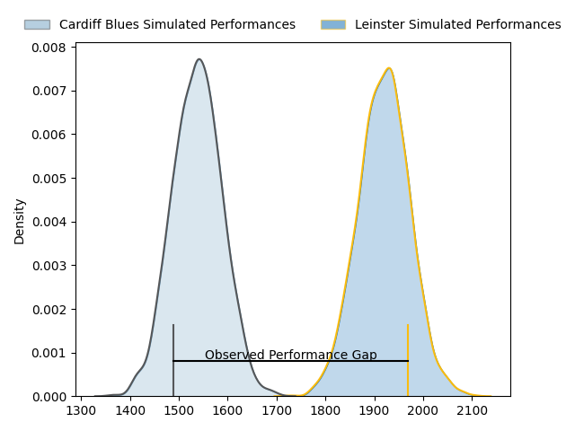
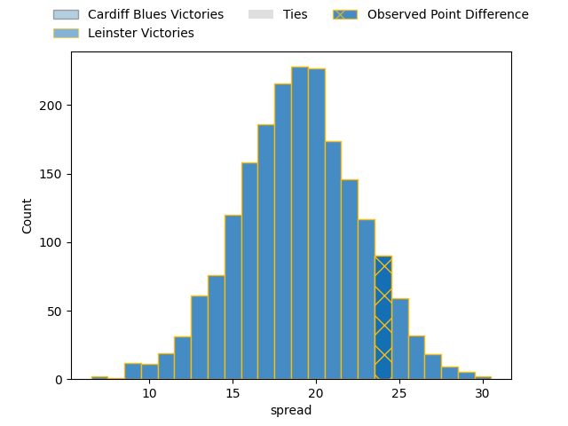
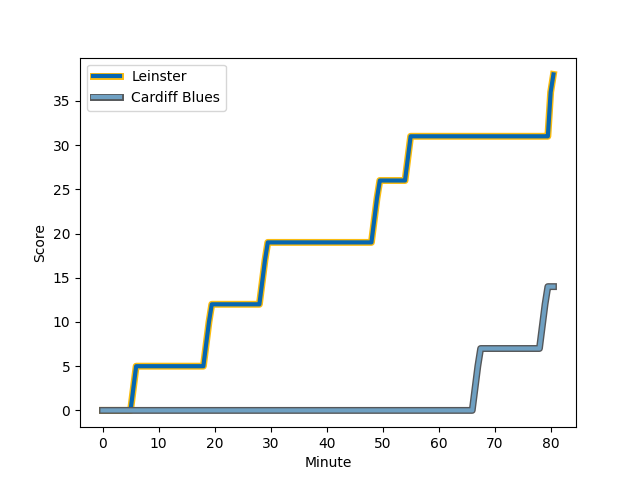
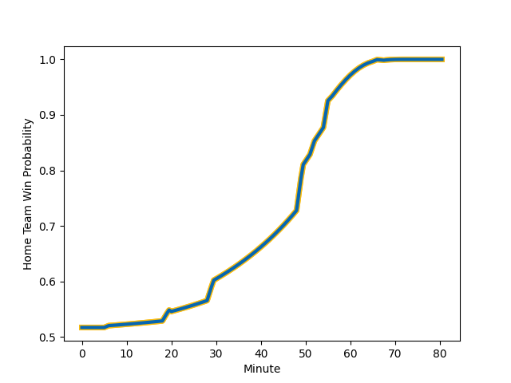

---  
layout: page  
title: Cardiff Blues at Leinster; 14-38  
date: 2023-01-28 18:00:00 18:00:00 -0500  
categories: match review  
---
# Cardiff Blues at Leinster; 14-38

# Club Level Predictions

The first set of predictions treats a club as the smallest object, as the club develops its members, organizes a gameplan, and deploys its players as needed for each match. This club model has a prediction of 0.896, which translates to predicting Leinster to win by 19.0.

Each club has a rating and a rating deviation (simiar to a Glicko system), and expected performances can be generated. This allows for simulated matches and spreads like the ones below.
## Projected Performances

## Projected Spreads

## Projected Results

# Player Level Predictions

Treating teams instead as an entity made up of the currently active players, I have ratings for each player in an altogether different system. These can be combined to form team ratings once teamsheets are announced, weighting starters a bit higher than the reserves. After the match is played, players can be weighted by their minutes on the field, allowing for an accurate measure of the team's composition. With these compiled team ratings, we can make predictions, measure inaccuracy, and update the individual player ratings.
## Prediction with Player Minutes: Leinster by 7.0

Leinster by 3.0 on a neutral field
## Scores over Time

## Win Probability over Time

## Prediction without Player Minutes: Leinster by 3.5

Cardiff Blues by 0.5 on a neutral pitch

|   Away Minutes | Away Player                                                           |   Away elo |   Away Percentile |   Number |   Home Percentile |   Home elo | Home Player                                                       |   Home Minutes |
|---------------:|:----------------------------------------------------------------------|-----------:|------------------:|---------:|------------------:|-----------:|:------------------------------------------------------------------|---------------:|
|             52 | [Bradley Thyer](..//playerfiles//BradleyThyer_cleaned.md)             |     114.33 |                85 |        1 |                63 |      98.56 | [Michael Milne](..//playerfiles//MichaelMilne_cleaned.md)         |             56 |
|             52 | [Kirby Myhill](..//playerfiles//KirbyMyhill_cleaned.md)               |      87.65 |                27 |        2 |                59 |     100.17 | [John McKee](..//playerfiles//JohnMcKee_cleaned.md)               |             56 |
|             73 | [Keiron Assiratti](..//playerfiles//KeironAssiratti_cleaned.md)       |      96.7  |                54 |        3 |                28 |      89.2  | [Michael Alaalatoa](..//playerfiles//MichaelAlaalatoa_cleaned.md) |             56 |
|             80 | [Lopeti Timani](..//playerfiles//LopetiTimani_cleaned.md)             |      83.87 |                19 |        4 |                92 |     122.49 | [Ross Molony](..//playerfiles//RossMolony_cleaned.md)             |             80 |
|             66 | [Seb Davies](..//playerfiles//SebDavies_cleaned.md)                   |      88.66 |                31 |        5 |                34 |      91.16 | [Brian Deeny](..//playerfiles//BrianDeeny_cleaned.md)             |             80 |
|             69 | [Josh Turnbull](..//playerfiles//JoshTurnbull_cleaned.md)             |      86.4  |                22 |        6 |                89 |     118.04 | [Rhys Ruddock](..//playerfiles//RhysRuddock_cleaned.md)           |             80 |
|             80 | [James Botham](..//playerfiles//JamesBotham_cleaned.md)               |     105.97 |                74 |        7 |                74 |     106.54 | [Scott Penny](..//playerfiles//ScottPenny_cleaned.md)             |             56 |
|             80 | [James Ratti](..//playerfiles//JamesRatti_cleaned.md)                 |      97.47 |                50 |        8 |                86 |     116.03 | [Max Deegan](..//playerfiles//MaxDeegan_cleaned.md)               |             80 |
|             69 | [Lloyd Williams](..//playerfiles//LloydWilliams_cleaned.md)           |     114.62 |                88 |        9 |                90 |     115.59 | [Luke McGrath](..//playerfiles//LukeMcGrath_cleaned.md)           |             56 |
|             80 | [Jarrod Evans](..//playerfiles//JarrodEvans_cleaned.md)               |     114.05 |                82 |       10 |                89 |     122.29 | [Harry Byrne](..//playerfiles//HarryByrne_cleaned.md)             |             80 |
|             80 | [Jason Harries](..//playerfiles//JasonHarries_cleaned.md)             |     145.76 |                99 |       11 |                73 |     104.91 | [Dave Kearney](..//playerfiles//DaveKearney_cleaned.md)           |             80 |
|             80 | [Ben Thomas](..//playerfiles//BenThomas_cleaned.md)                   |     103.55 |                67 |       12 |               nan |      96.6  | [Ben Brownlee](..//playerfiles//BenBrownlee_cleaned.md)           |             80 |
|             80 | [Rey Lee-Lo](..//playerfiles//ReyLee-Lo_cleaned.md)                   |     156.56 |               100 |       13 |                88 |     117.6  | [Liam Turner](..//playerfiles//LiamTurner_cleaned.md)             |             80 |
|             69 | [Owen Lane](..//playerfiles//OwenLane_cleaned.md)                     |      74.7  |                 8 |       14 |                11 |      76.84 | [Max O'Reilly](..//playerfiles//MaxO'Reilly_cleaned.md)           |             80 |
|             20 | [Rhys Priestland](..//playerfiles//RhysPriestland_cleaned.md)         |      87.43 |                23 |       15 |                62 |     102.52 | [Chris Cosgrave](..//playerfiles//ChrisCosgrave_cleaned.md)       |             67 |
|             60 | [Matthew Morgan](..//playerfiles//MatthewMorgan_cleaned.md)           |      91.76 |                39 |       16 |                73 |     102.83 | [Tom Clarkson](..//playerfiles//TomClarkson_cleaned.md)           |             24 |
|             28 | [Corey Domachowski](..//playerfiles//CoreyDomachowski_cleaned.md)     |      88.65 |                26 |       17 |                94 |     127.29 | [Will Connors](..//playerfiles//WillConnors_cleaned.md)           |             24 |
|             28 | [Kristian Dacey](..//playerfiles//KristianDacey_cleaned.md)           |      88.9  |                31 |       18 |                52 |      99.15 | [Nick McCarthy](..//playerfiles//NickMcCarthy_cleaned.md)         |             24 |
|             14 | [Rory Thornton](..//playerfiles//RoryThornton_cleaned.md)             |      86.59 |                25 |       19 |               nan |      95    | [Marcus Hannan](..//playerfiles//MarcusHannan_cleaned.md)         |             24 |
|             11 | [Ellis Bevan](..//playerfiles//EllisBevan_cleaned.md)                 |      97.76 |               nan |       20 |               nan |      92.09 | [Tadgh McElroy](..//playerfiles//TadghMcElroy_cleaned.md)         |             24 |
|             11 | [Shane Lewis-Hughes](..//playerfiles//ShaneLewis-Hughes_cleaned.md)   |      86.98 |                25 |       21 |               nan |      95    | [Aitzol King](..//playerfiles//AitzolKing_cleaned.md)             |             13 |
|             11 | [Aled Summerhill](..//playerfiles//AledSummerhill_cleaned.md)         |      70.07 |                 5 |       22 |               nan |     nan    | nan                                                               |            nan |
|              7 | [William Davies-King](..//playerfiles//WilliamDavies-King_cleaned.md) |      98.52 |                55 |       23 |               nan |     nan    | nan                                                               |            nan |

