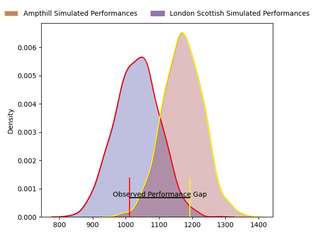
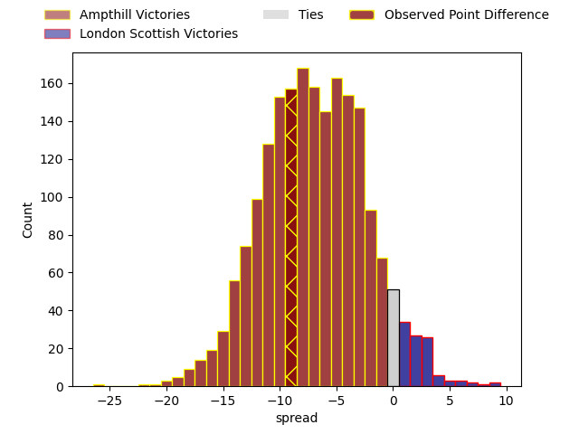
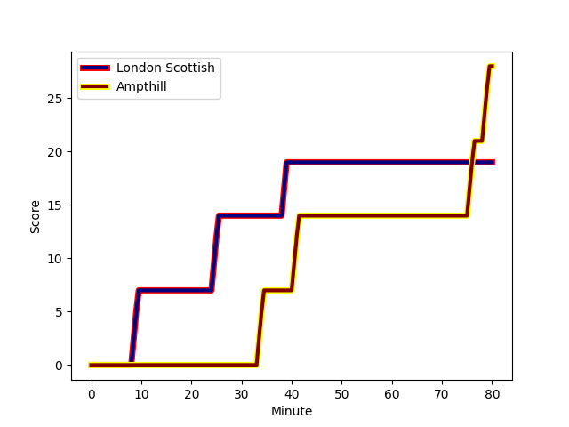
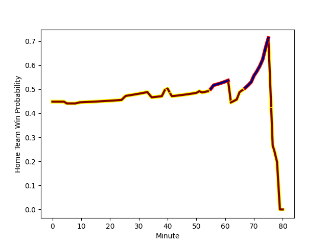

---  
layout: page  
title: Ampthill at London Scottish; 28-19  
date: 2023-01-28 16:00:00 18:00:00 -0500  
categories: match review  
---
# Ampthill at London Scottish; 28-19

# Club Level Predictions

The first set of predictions treats a club as the smallest object, as the club develops its members, organizes a gameplan, and deploys its players as needed for each match. This club model has a prediction of 0.363, which translates to predicting Ampthill to win by 5.0.

Each club has a rating and a rating deviation (simiar to a Glicko system), and expected performances can be generated. This allows for simulated matches and spreads like the ones below.
## Projected Performances

## Projected Spreads

## Projected Results

# Player Level Predictions

Treating teams instead as an entity made up of the currently active players, I have ratings for each player in an altogether different system. These can be combined to form team ratings once teamsheets are announced, weighting starters a bit higher than the reserves. After the match is played, players can be weighted by their minutes on the field, allowing for an accurate measure of the team's composition. With these compiled team ratings, we can make predictions, measure inaccuracy, and update the individual player ratings.
## Prediction with Player Minutes: Ampthill by 5.0

Ampthill by 9.0 on a neutral field
## Scores over Time

## Win Probability over Time

## Prediction without Player Minutes: Ampthill by 1.2

Ampthill by 5.2 on a neutral pitch

|   Away Minutes | Away Player                                                   |   Away elo |   Away Percentile |   Number |   Home Percentile |   Home elo | Home Player                                                                             |   Home Minutes |
|---------------:|:--------------------------------------------------------------|-----------:|------------------:|---------:|------------------:|-----------:|:----------------------------------------------------------------------------------------|---------------:|
|             52 | [Zac Nearchou](..//playerfiles//ZacNearchou_cleaned.md)       |      98.56 |                57 |        1 |                18 |      88.09 | [Jordan Els](..//playerfiles//JordanEls_cleaned.md)                                     |             62 |
|             52 | [Beck Cutting](..//playerfiles//BeckCutting_cleaned.md)       |      87.59 |                24 |        2 |                27 |      92.31 | [Sam Riley](..//playerfiles//SamRiley_cleaned.md)                                       |             40 |
|             62 | ['Aleki Lutui](..//playerfiles//'AlekiLutui_cleaned.md)       |     109.51 |                84 |        3 |                 2 |      68.57 | [Joe Rees](..//playerfiles//JoeRees_cleaned.md)                                         |             74 |
|             80 | [Charlie Beckett](..//playerfiles//CharlieBeckett_cleaned.md) |     114.07 |                86 |        4 |                95 |     128.45 | [Bailey Ransom](..//playerfiles//BaileyRansom_cleaned.md)                               |             80 |
|             80 | [Fyn Brown](..//playerfiles//FynBrown_cleaned.md)             |      89.72 |                24 |        5 |                67 |     106.53 | [Matas Jurevicius](..//playerfiles//MatasJurevicius_cleaned.md)                         |             80 |
|             80 | [Harry Wilson](..//playerfiles//HarryWilson_cleaned.md)       |      81.64 |                14 |        6 |                38 |      91.61 | [Will Trenholm](..//playerfiles//WillTrenholm_cleaned.md)                               |             80 |
|              5 | [Josh Smart](..//playerfiles//JoshSmart_cleaned.md)           |      94.08 |                45 |        7 |                 6 |      74.11 | [Jack Ingall](..//playerfiles//JackIngall_cleaned.md)                                   |             80 |
|             80 | [Morgan Strong](..//playerfiles//MorganStrong_cleaned.md)     |      90.48 |                34 |        8 |                13 |      80.41 | [Viliami Taulani](..//playerfiles//ViliamiTaulani_cleaned.md)                           |             55 |
|             80 | [Peter White](..//playerfiles//PeterWhite_cleaned.md)         |     110.65 |                83 |        9 |                 3 |      67.55 | [Daniel Nutton](..//playerfiles//DanielNutton_cleaned.md)                               |             65 |
|             80 | [Tom Hardwick](..//playerfiles//TomHardwick_cleaned.md)       |      90.93 |                31 |       10 |                38 |      92.63 | [Nathan Chamberlain](..//playerfiles//NathanChamberlain_cleaned.md)                     |             80 |
|             56 | [Ben Harris](..//playerfiles//BenHarris_cleaned.md)           |     105.84 |                74 |       11 |                 0 |      50.47 | [Noah Ferdinand](..//playerfiles//NoahFerdinand_cleaned.md)                             |             70 |
|             80 | [Joshua Bragman](..//playerfiles//JoshuaBragman_cleaned.md)   |      74.28 |                 8 |       12 |                42 |      91.95 | [Harry Sheppard](..//playerfiles//HarrySheppard_cleaned.md)                             |             80 |
|             51 | [George Worth](..//playerfiles//GeorgeWorth_cleaned.md)       |     108.97 |                77 |       13 |               nan |      97.92 | [Vilikesa Wara](..//playerfiles//VilikesaWara_cleaned.md)                               |             74 |
|             80 | [Conor Rankin](..//playerfiles//ConorRankin_cleaned.md)       |      92.1  |                38 |       14 |                65 |     101.52 | [Luke Mehson](..//playerfiles//LukeMehson_cleaned.md)                                   |             80 |
|             80 | [Tomas Bacon](..//playerfiles//TomasBacon_cleaned.md)         |      90.26 |                35 |       15 |                61 |     101.67 | [Cameron Anderson](..//playerfiles//CameronAnderson_cleaned.md)                         |             80 |
|             75 | [Paddy Ryan](..//playerfiles//PaddyRyan_cleaned.md)           |     109.27 |                75 |       16 |                68 |     101.42 | [Harri Morris](..//playerfiles//HarriMorris_cleaned.md)                                 |             22 |
|             29 | [Josh Hallett](..//playerfiles//JoshHallett_cleaned.md)       |      99.55 |                59 |       17 |                40 |      94.52 | [Austin Wallis](..//playerfiles//AustinWallis_cleaned.md)                               |             25 |
|             28 | [Sid Blackmore](..//playerfiles//SidBlackmore_cleaned.md)     |     104.1  |                71 |       18 |                78 |     106.03 | [Harrison Courtney](..//playerfiles//HarrisonCourtney_cleaned.md)                       |             18 |
|             28 | [Dominic Hardman](..//playerfiles//DominicHardman_cleaned.md) |      97.08 |                48 |       19 |                86 |     114.81 | [Matt Wilkinson](..//playerfiles//MattWilkinson_cleaned.md)                             |             18 |
|             24 | [Ollie Hartley](..//playerfiles//OllieHartley_cleaned.md)     |      81.16 |                15 |       20 |                 7 |      75.32 | [Luca Petrozzi](..//playerfiles//LucaPetrozzi_cleaned.md)                               |             15 |
|             18 | [Rob Hardwick](..//playerfiles//RobHardwick_cleaned.md)       |     113.16 |                89 |       21 |                75 |     105.24 | [William Hobson](..//playerfiles//WilliamHobson_cleaned.md)                             |              6 |
|            nan | nan                                                           |     nan    |               nan |       22 |                18 |      82.61 | [Robert David McCallum](..//playerfiles//RobertDavidMcCallum_cleaned.md)                |              6 |
|            nan | nan                                                           |     nan    |               nan |       23 |               nan |      95    | [William Thomas Horatio Panday](..//playerfiles//WilliamThomasHoratioPanday_cleaned.md) |             10 |

