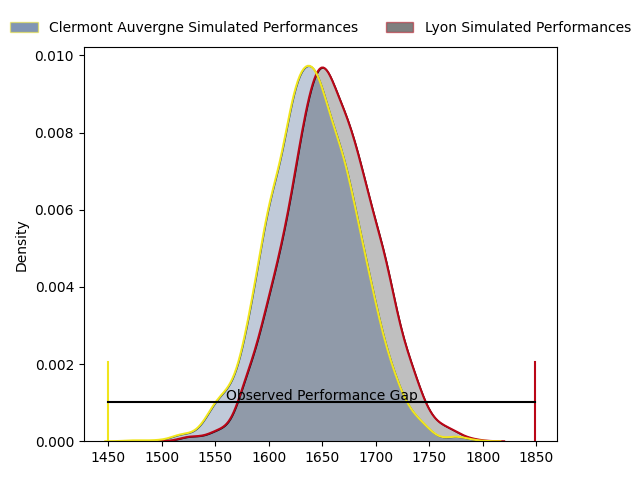
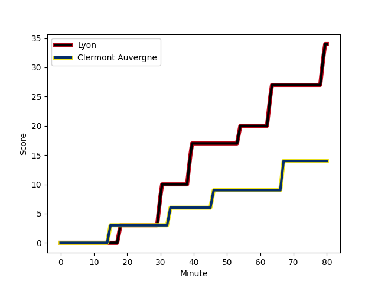
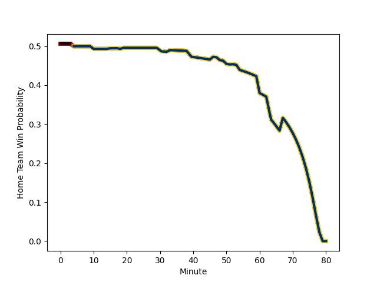

---  
layout: page  
title: Clermont Auvergne at Lyon; 14-34  
date: 2023-01-28 15:00:00 18:00:00 -0500  
categories: match review  
---
# Clermont Auvergne at Lyon; 14-34

# Club Level Predictions

The first set of predictions treats a club as the smallest object, as the club develops its members, organizes a gameplan, and deploys its players as needed for each match. This club model has a prediction of 0.525, which translates to predicting Lyon to win by 0.9.

Each club has a rating and a rating deviation (simiar to a Glicko system), and expected performances can be generated. This allows for simulated matches and spreads like the ones below.
## Projected Performances

## Projected Spreads

## Projected Results

# Player Level Predictions

Treating teams instead as an entity made up of the currently active players, I have ratings for each player in an altogether different system. These can be combined to form team ratings once teamsheets are announced, weighting starters a bit higher than the reserves. After the match is played, players can be weighted by their minutes on the field, allowing for an accurate measure of the team's composition. With these compiled team ratings, we can make predictions, measure inaccuracy, and update the individual player ratings.
## Prediction with Player Minutes: Lyon by 3.6

Clermont Auvergne by 0.4 on a neutral field
## Scores over Time

## Win Probability over Time

## Prediction without Player Minutes: Clermont Auvergne by 1.0

Clermont Auvergne by 5.0 on a neutral pitch

|   Away Minutes | Away Player                                                            |   Away elo |   Away Percentile |   Number |   Home Percentile |   Home elo | Home Player                                                                |   Home Minutes |
|---------------:|:-----------------------------------------------------------------------|-----------:|------------------:|---------:|------------------:|-----------:|:---------------------------------------------------------------------------|---------------:|
|             48 | [Etienne Falgoux](..//playerfiles//EtienneFalgoux_cleaned.md)          |     119.32 |                94 |        1 |                52 |      95.86 | [Sebastien Taofifenua](..//playerfiles//SebastienTaofifenua_cleaned.md)    |             60 |
|             32 | [Etienne Fourcade](..//playerfiles//EtienneFourcade_cleaned.md)        |      78.36 |                 9 |        2 |                14 |      81.76 | [Guillaume Marchand](..//playerfiles//GuillaumeMarchand_cleaned.md)        |             60 |
|             52 | [Cristian Ojovan](..//playerfiles//CristianOjovan_cleaned.md)          |      93.24 |                42 |        3 |                90 |     115.13 | [Demba Bamba](..//playerfiles//DembaBamba_cleaned.md)                      |             60 |
|             80 | [Thibaud Lanen](..//playerfiles//ThibaudLanen_cleaned.md)              |     107.54 |                77 |        4 |                44 |      94.5  | [Theo William](..//playerfiles//TheoWilliam_cleaned.md)                    |             65 |
|             80 | [Paul Jedrasiak](..//playerfiles//PaulJedrasiak_cleaned.md)            |      81.59 |                15 |        5 |                36 |      91.75 | [Temo Mayanavanua](..//playerfiles//TemoMayanavanua_cleaned.md)            |             80 |
|             19 | [Arthur Iturria](..//playerfiles//ArthurIturria_cleaned.md)            |     105.76 |                71 |        6 |                60 |      99.35 | [Dylan Cretin](..//playerfiles//DylanCretin_cleaned.md)                    |             65 |
|             50 | [Alexandre Fischer](..//playerfiles//AlexandreFischer_cleaned.md)      |     128.08 |                95 |        7 |                81 |     110.38 | [Patrick Sobela](..//playerfiles//PatrickSobela_cleaned.md)                |             80 |
|             80 | [Fritz Lee](..//playerfiles//FritzLee_cleaned.md)                      |     138.65 |                98 |        8 |                93 |     126.32 | [Jordan Taufua](..//playerfiles//JordanTaufua_cleaned.md)                  |             80 |
|             54 | [Baptiste Jauneau](..//playerfiles//BaptisteJauneau_cleaned.md)        |      91.04 |                35 |        9 |                83 |     110.29 | [Jean-Marc Doussain](..//playerfiles//Jean-MarcDoussain_cleaned.md)        |             80 |
|             54 | [Jules Plisson](..//playerfiles//JulesPlisson_cleaned.md)              |      99.12 |                53 |       10 |                11 |      80.29 | [Leo Berdeu](..//playerfiles//LeoBerdeu_cleaned.md)                        |             65 |
|             80 | [Alivereti Raka](..//playerfiles//AliveretiRaka_cleaned.md)            |     114.09 |                85 |       11 |                14 |      82.01 | [Tavite Veredamu](..//playerfiles//TaviteVeredamu_cleaned.md)              |             80 |
|             80 | [Irae Simone](..//playerfiles//IraeSimone_cleaned.md)                  |      82.94 |                19 |       12 |                99 |     150.53 | [Josua Tuisova Ratulevu](..//playerfiles//JosuaTuisovaRatulevu_cleaned.md) |             80 |
|             80 | [George Moala](..//playerfiles//GeorgeMoala_cleaned.md)                |     107.22 |                75 |       13 |                 8 |      75.32 | [Josiah Maraku](..//playerfiles//JosiahMaraku_cleaned.md)                  |             78 |
|             10 | [Bautista Delguy](..//playerfiles//BautistaDelguy_cleaned.md)          |     101.81 |                66 |       14 |                21 |      86.03 | [Xavier Mignot](..//playerfiles//XavierMignot_cleaned.md)                  |              4 |
|             80 | [Alex Newsome](..//playerfiles//AlexNewsome_cleaned.md)                |     123.4  |                90 |       15 |                73 |     107.28 | [Toby Arnold](..//playerfiles//TobyArnold_cleaned.md)                      |             80 |
|             70 | [Samuel Ezeala](..//playerfiles//SamuelEzeala_cleaned.md)              |      82.29 |                17 |       16 |                93 |     124.52 | [Kyle Godwin](..//playerfiles//KyleGodwin_cleaned.md)                      |             76 |
|             61 | [Lucas Dessaigne](..//playerfiles//LucasDessaigne_cleaned.md)          |      95.16 |                26 |       17 |                12 |      83.01 | [Hamza Kaabeche](..//playerfiles//HamzaKaabeche_cleaned.md)                |             20 |
|             48 | [Benjamin Boudou](..//playerfiles//BenjaminBoudou_cleaned.md)          |      92.72 |                26 |       18 |                90 |     116.56 | [Liam Coltman](..//playerfiles//LiamColtman_cleaned.md)                    |             20 |
|             32 | [Giorgi Beria](..//playerfiles//GiorgiBeria_cleaned.md)                |      92.67 |                40 |       19 |                16 |      88.24 | [Paulo Tafili](..//playerfiles//PauloTafili_cleaned.md)                    |             20 |
|             30 | [Peceli Yato Senibitu](..//playerfiles//PeceliYatoSenibitu_cleaned.md) |     113.26 |               nan |       20 |                93 |     126.49 | [Lima Sopoaga](..//playerfiles//LimaSopoaga_cleaned.md)                    |             15 |
|             28 | [Davit Kubriashvili](..//playerfiles//DavitKubriashvili_cleaned.md)    |     111.71 |                87 |       21 |                78 |     107.45 | [Beka Saghinadze](..//playerfiles//BekaSaghinadze_cleaned.md)              |             15 |
|             26 | [Anthony Belleau](..//playerfiles//AnthonyBelleau_cleaned.md)          |     106.42 |                71 |       22 |                76 |     107.77 | [Mickael Guillard](..//playerfiles//MickaelGuillard_cleaned.md)            |             15 |
|             26 | [Sebastien Bezy](..//playerfiles//SebastienBezy_cleaned.md)            |     124.2  |                95 |       23 |               nan |      95.85 | [Liam Rimet](..//playerfiles//LiamRimet_cleaned.md)                        |              2 |

