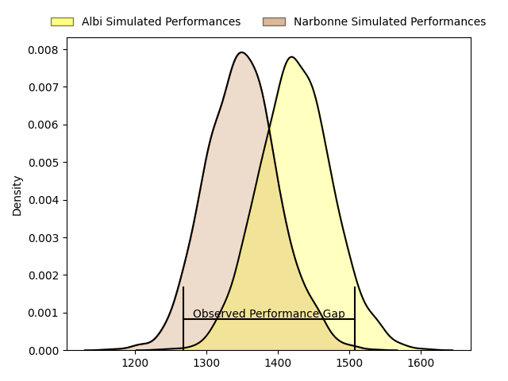
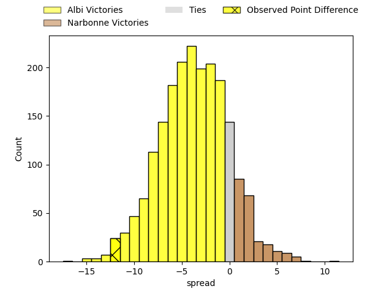
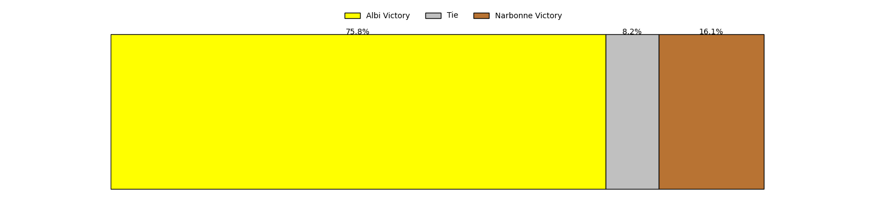
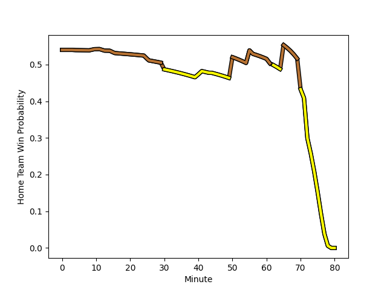

---  
layout: page  
title: Albi at Narbonne; 30-18  
date: 2023-01-28 18:30:00 18:00:00 -0500  
categories: match review  
---
# Albi at Narbonne; 30-18

# Club Level Predictions

The first set of predictions treats a club as the smallest object, as the club develops its members, organizes a gameplan, and deploys its players as needed for each match. This club model has a prediction of 0.461, which translates to predicting Albi to win by 1.4.

Each club has a rating and a rating deviation (simiar to a Glicko system), and expected performances can be generated. This allows for simulated matches and spreads like the ones below.
## Projected Performances

## Projected Spreads

## Projected Results

# Player Level Predictions

Treating teams instead as an entity made up of the currently active players, I have ratings for each player in an altogether different system. These can be combined to form team ratings once teamsheets are announced, weighting starters a bit higher than the reserves. After the match is played, players can be weighted by their minutes on the field, allowing for an accurate measure of the team's composition. With these compiled team ratings, we can make predictions, measure inaccuracy, and update the individual player ratings.
## Prediction with Player Minutes: Narbonne by 10.1

Narbonne by 6.1 on a neutral field
## Scores over Time

## Win Probability over Time

## Prediction without Player Minutes: Narbonne by 12.3

Narbonne by 8.3 on a neutral pitch

|   Away Minutes | Away Player                                                                        |   Away elo |   Away Percentile |   Number |   Home Percentile |   Home elo | Home Player                                                       |   Home Minutes |
|---------------:|:-----------------------------------------------------------------------------------|-----------:|------------------:|---------:|------------------:|-----------:|:------------------------------------------------------------------|---------------:|
|             65 | [Antoine Soave](..//playerfiles//AntoineSoave_cleaned.md)                          |     101.95 |                64 |        1 |                39 |      92.87 | [Geoffrey Moise](..//playerfiles//GeoffreyMoise_cleaned.md)       |             61 |
|             50 | [Reinach Venter](..//playerfiles//ReinachVenter_cleaned.md)                        |      82.8  |                15 |        2 |                74 |     105.01 | [Christophe David](..//playerfiles//ChristopheDavid_cleaned.md)   |             44 |
|             56 | [Dimitri Tchapnga](..//playerfiles//DimitriTchapnga_cleaned.md)                    |      95.48 |                48 |        3 |                97 |     125.69 | [Théo Castinel](..//playerfiles//ThéoCastinel_cleaned.md)         |             61 |
|             56 | [Mohsen Essid](..//playerfiles//MohsenEssid_cleaned.md)                            |     104.02 |                66 |        4 |                88 |     116.87 | [Valentin Sese](..//playerfiles//ValentinSese_cleaned.md)         |             80 |
|             80 | [Pilbarnon Djossou Lokossou](..//playerfiles//PilbarnonDjossouLokossou_cleaned.md) |      91.13 |                36 |        5 |                25 |      90.68 | [Morgan Maga](..//playerfiles//MorganMaga_cleaned.md)             |             65 |
|             65 | [Hugo Boutin](..//playerfiles//HugoBoutin_cleaned.md)                              |      79.51 |                11 |        6 |                78 |     108.37 | [Thibault Clauzade](..//playerfiles//ThibaultClauzade_cleaned.md) |             80 |
|             80 | [Pierre Roussel](..//playerfiles//PierreRoussel_cleaned.md)                        |     104.09 |                70 |        7 |                12 |      83.98 | [Guillem Montagne](..//playerfiles//GuillemMontagne_cleaned.md)   |             80 |
|             80 | [Sandrick Maciotta](..//playerfiles//SandrickMaciotta_cleaned.md)                  |     111.14 |                76 |        8 |                82 |     113.84 | [Luke Nakobukobua](..//playerfiles//LukeNakobukobua_cleaned.md)   |             30 |
|             80 | [Gilen Queheille](..//playerfiles//GilenQueheille_cleaned.md)                      |      97.2  |                52 |        9 |                71 |     104.52 | [Pierrick Nova](..//playerfiles//PierrickNova_cleaned.md)         |             80 |
|             74 | [Benjamin Pehau](..//playerfiles//BenjaminPehau_cleaned.md)                        |      96.29 |                43 |       10 |                54 |      98.96 | [Tom Chauvet](..//playerfiles//TomChauvet_cleaned.md)             |             80 |
|             73 | [Enzo Marzocca](..//playerfiles//EnzoMarzocca_cleaned.md)                          |     100.57 |                63 |       11 |                67 |     102.22 | [Sébastien Giorgis](..//playerfiles//SébastienGiorgis_cleaned.md) |             80 |
|             80 | [Simon Andreu](..//playerfiles//SimonAndreu_cleaned.md)                            |      91.93 |                39 |       12 |                91 |     122.08 | [Jose Lima](..//playerfiles//JoseLima_cleaned.md)                 |             80 |
|             80 | [Baptiste Couchinave](..//playerfiles//BaptisteCouchinave_cleaned.md)              |     117    |                87 |       13 |                67 |     102.84 | [Pierre Nueno](..//playerfiles//PierreNueno_cleaned.md)           |             80 |
|             80 | [Charly Trussardi](..//playerfiles//CharlyTrussardi_cleaned.md)                    |     101.83 |                66 |       14 |                65 |     101.53 | [Pierre-Hugo Ducom](..//playerfiles//Pierre-HugoDucom_cleaned.md) |             56 |
|             80 | [Paul Clergue](..//playerfiles//PaulClergue_cleaned.md)                            |      92.61 |                35 |       15 |                40 |      92.37 | [Tom Homer](..//playerfiles//TomHomer_cleaned.md)                 |             44 |
|             15 | [Maxime Escur](..//playerfiles//MaximeEscur_cleaned.md)                            |      84.37 |                17 |       16 |                55 |      99.98 | [Sylvain Abadie](..//playerfiles//SylvainAbadie_cleaned.md)       |             19 |
|             30 | [Arthur Castant](..//playerfiles//ArthurCastant_cleaned.md)                        |     103.75 |                71 |       17 |                23 |      87.11 | [Jordan Rochier](..//playerfiles//JordanRochier_cleaned.md)       |             36 |
|             24 | [Jean Baptiste De Clercq](..//playerfiles//JeanBaptisteDeClercq_cleaned.md)        |      86.31 |                20 |       18 |               nan |      90.78 | [Avto Gogiashvili](..//playerfiles//AvtoGogiashvili_cleaned.md)   |             19 |
|             24 | [Heath Backhouse](..//playerfiles//HeathBackhouse_cleaned.md)                      |     100.05 |                61 |       19 |                73 |     105.32 | [Mohamed Kbaier](..//playerfiles//MohamedKbaier_cleaned.md)       |             15 |
|             15 | [Luke Stringer](..//playerfiles//LukeStringer_cleaned.md)                          |      75.49 |                 8 |       20 |                 8 |      68.75 | [Manuel Plaza](..//playerfiles//ManuelPlaza_cleaned.md)           |             50 |
|              6 | [Francois Fontaine](..//playerfiles//FrancoisFontaine_cleaned.md)                  |      99.43 |                55 |       21 |                51 |      98.02 | [Étienne Ducom](..//playerfiles//ÉtienneDucom_cleaned.md)         |             24 |
|              7 | [Téo Dospital](..//playerfiles//TéoDospital_cleaned.md)                            |     109.93 |                76 |       22 |                77 |     111.76 | [James Kane](..//playerfiles//JamesKane_cleaned.md)               |             36 |

