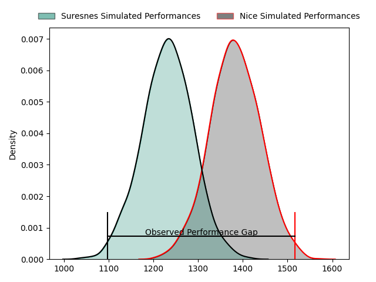
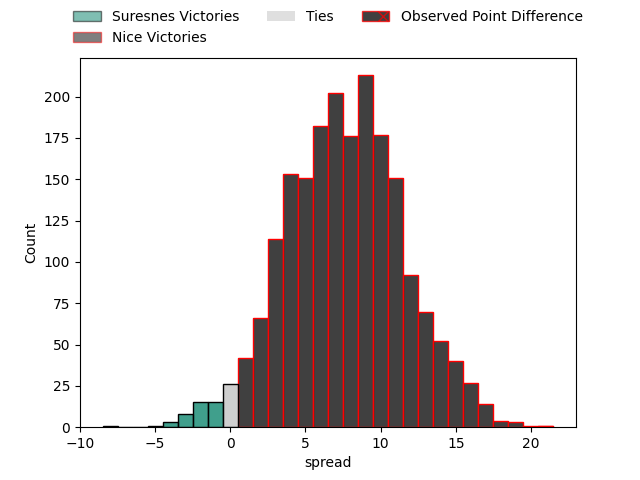
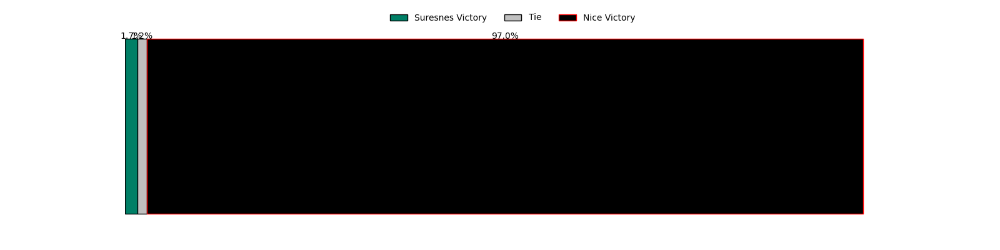
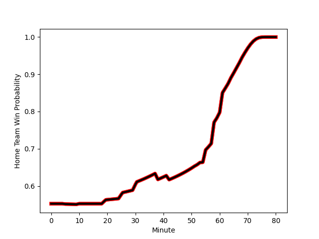

---  
layout: page  
title: Suresnes at Nice; 11-32  
date: 2023-01-28 18:00:00 18:00:00 -0500  
categories: match review  
---
# Suresnes at Nice; 11-32

# Club Level Predictions

The first set of predictions treats a club as the smallest object, as the club develops its members, organizes a gameplan, and deploys its players as needed for each match. This club model has a prediction of 0.703, which translates to predicting Nice to win by 7.6.

Each club has a rating and a rating deviation (simiar to a Glicko system), and expected performances can be generated. This allows for simulated matches and spreads like the ones below.
## Projected Performances

## Projected Spreads

## Projected Results

# Player Level Predictions

Treating teams instead as an entity made up of the currently active players, I have ratings for each player in an altogether different system. These can be combined to form team ratings once teamsheets are announced, weighting starters a bit higher than the reserves. After the match is played, players can be weighted by their minutes on the field, allowing for an accurate measure of the team's composition. With these compiled team ratings, we can make predictions, measure inaccuracy, and update the individual player ratings.
## Prediction with Player Minutes: Nice by 13.2

Nice by 9.2 on a neutral field
## Scores over Time

## Win Probability over Time

## Prediction without Player Minutes: Nice by 14.7

Nice by 10.7 on a neutral pitch

|   Away Minutes | Away Player                                                                  |   Away elo |   Away Percentile |   Number |   Home Percentile |   Home elo | Home Player                                                             |   Home Minutes |
|---------------:|:-----------------------------------------------------------------------------|-----------:|------------------:|---------:|------------------:|-----------:|:------------------------------------------------------------------------|---------------:|
|             61 | [Lucas Dycke](..//playerfiles//LucasDycke_cleaned.md)                        |      83.9  |                16 |        1 |                32 |      90.39 | [Nika Neparidze](..//playerfiles//NikaNeparidze_cleaned.md)             |             60 |
|             54 | [Thomas Bordes](..//playerfiles//ThomasBordes_cleaned.md)                    |      87.55 |                24 |        2 |                24 |      86.91 | [Badri Alkhazashvili](..//playerfiles//BadriAlkhazashvili_cleaned.md)   |             64 |
|             61 | [Leandro Mario Assi](..//playerfiles//LeandroMarioAssi_cleaned.md)           |      89.09 |                28 |        3 |                 2 |      69.1  | [Jeronimo Negrotto](..//playerfiles//JeronimoNegrotto_cleaned.md)       |             60 |
|             64 | [Christopher van Leeuwen](..//playerfiles//ChristophervanLeeuwen_cleaned.md) |      76.89 |                11 |        4 |                67 |     100.51 | [Thibault Rey](..//playerfiles//ThibaultRey_cleaned.md)                 |             60 |
|             54 | [Yakine Djebarri](..//playerfiles//YakineDjebarri_cleaned.md)                |      87.09 |                27 |        5 |                62 |     100.34 | [Marvin Woki](..//playerfiles//MarvinWoki_cleaned.md)                   |             80 |
|             80 | [Théo David Nathan Tanda](..//playerfiles//ThéoDavidNathanTanda_cleaned.md)  |      99.03 |                61 |        6 |                64 |     101.03 | [Louis Suaud](..//playerfiles//LouisSuaud_cleaned.md)                   |             80 |
|             80 | [Bastien Berenguel](..//playerfiles//BastienBerenguel_cleaned.md)            |     107.36 |                76 |        7 |                51 |      96.39 | [Arthur Vignolles](..//playerfiles//ArthurVignolles_cleaned.md)         |             80 |
|             80 | [Antonie Claassen](..//playerfiles//AntonieClaassen_cleaned.md)              |     128.35 |                95 |        8 |                79 |     110.39 | [Laijiasa Bolenaivalu](..//playerfiles//LaijiasaBolenaivalu_cleaned.md) |             52 |
|             61 | [Théo Bachiri](..//playerfiles//ThéoBachiri_cleaned.md)                      |      88.73 |                33 |        9 |                81 |     109.89 | [Mathieu Loree](..//playerfiles//MathieuLoree_cleaned.md)               |             74 |
|             80 | [Gaëtan Robert](..//playerfiles//GaëtanRobert_cleaned.md)                    |      77.68 |                 9 |       10 |                50 |      96.91 | [Mathis Viard](..//playerfiles//MathisViard_cleaned.md)                 |             80 |
|             61 | [Ervin Muric](..//playerfiles//ErvinMuric_cleaned.md)                        |      21.69 |                 0 |       11 |                33 |      89.42 | [David Odiete](..//playerfiles//DavidOdiete_cleaned.md)                 |             68 |
|             80 | [Hugo Detre](..//playerfiles//HugoDetre_cleaned.md)                          |      87.16 |                37 |       12 |                53 |      97.35 | [Julien Fritz](..//playerfiles//JulienFritz_cleaned.md)                 |             60 |
|             80 | [Thomas Baudy](..//playerfiles//ThomasBaudy_cleaned.md)                      |      80.3  |                19 |       13 |                12 |      79.81 | [Alban Conduche](..//playerfiles//AlbanConduche_cleaned.md)             |             80 |
|             80 | [Alexis Clement](..//playerfiles//AlexisClement_cleaned.md)                  |      79.07 |                12 |       14 |                42 |      93.63 | [Clement Egiziano](..//playerfiles//ClementEgiziano_cleaned.md)         |             80 |
|             64 | [Goulwen Gueho](..//playerfiles//GoulwenGueho_cleaned.md)                    |      85.25 |                24 |       15 |                 6 |      68.52 | [Loic Le Gal](..//playerfiles//LoicLeGal_cleaned.md)                    |             80 |
|             26 | [Hayam El Bibouji](..//playerfiles//HayamElBibouji_cleaned.md)               |      87.57 |                32 |       16 |                74 |     108.27 | [Steffon Armitage](..//playerfiles//SteffonArmitage_cleaned.md)         |             28 |
|             26 | [Wian Vosloo](..//playerfiles//WianVosloo_cleaned.md)                        |      99.27 |                59 |       17 |                 6 |      75.13 | [Jemal Shatirishvili](..//playerfiles//JemalShatirishvili_cleaned.md)   |             20 |
|             19 | [Enzo Barbarit](..//playerfiles//EnzoBarbarit_cleaned.md)                    |      82.4  |                18 |       18 |                72 |     101.69 | [Sunia Vola](..//playerfiles//SuniaVola_cleaned.md)                     |             20 |
|             19 | [Jean-Baptiste Fuster](..//playerfiles//Jean-BaptisteFuster_cleaned.md)      |      60.76 |                 2 |       19 |                20 |      84.01 | [Jérôme Mondoulet](..//playerfiles//JérômeMondoulet_cleaned.md)         |             20 |
|             19 | [Beqa Kakabadze](..//playerfiles//BeqaKakabadze_cleaned.md)                  |     110.74 |                89 |       20 |                70 |     104.49 | [Luca Cutayar](..//playerfiles//LucaCutayar_cleaned.md)                 |             20 |
|             19 | [Victor Damian Arias](..//playerfiles//VictorDamianArias_cleaned.md)         |     109.04 |                87 |       21 |                61 |      95.97 | [Killian Taofifenua](..//playerfiles//KillianTaofifenua_cleaned.md)     |             16 |
|             16 | [Damien Bozic](..//playerfiles//DamienBozic_cleaned.md)                      |      95    |               nan |       22 |                52 |      98.26 | [Augustin Slowik](..//playerfiles//AugustinSlowik_cleaned.md)           |             12 |
|             16 | [Clément Amon](..//playerfiles//ClémentAmon_cleaned.md)                      |      65.05 |                 2 |       23 |                25 |      84.56 | [Louis Peutin](..//playerfiles//LouisPeutin_cleaned.md)                 |              6 |

