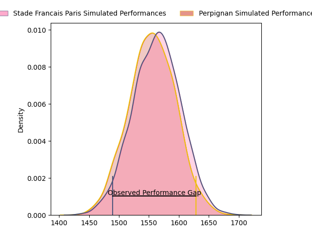
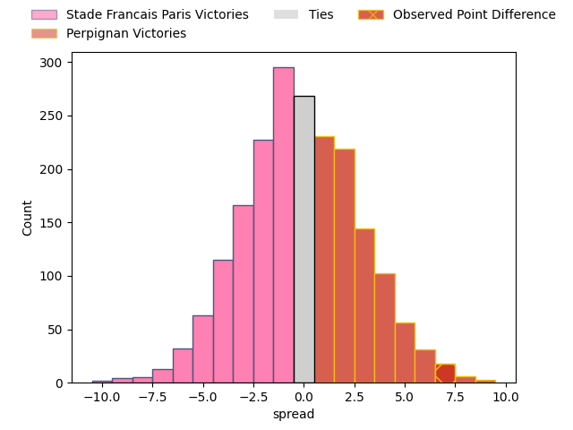
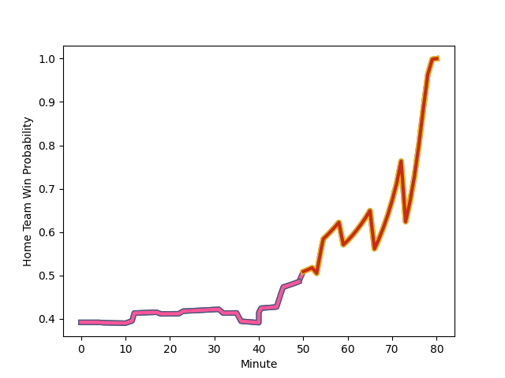

---  
layout: page  
title: Stade Francais Paris at Perpignan; 24-31  
date: 2023-01-28 17:00:00 18:00:00 -0500  
categories: match review  
---
# Stade Francais Paris at Perpignan; 24-31

# Club Level Predictions

The first set of predictions treats a club as the smallest object, as the club develops its members, organizes a gameplan, and deploys its players as needed for each match. This club model has a prediction of 0.459, which translates to predicting Stade Francais Paris to win by 1.4.

Each club has a rating and a rating deviation (simiar to a Glicko system), and expected performances can be generated. This allows for simulated matches and spreads like the ones below.
## Projected Performances

## Projected Spreads

## Projected Results

# Player Level Predictions

Treating teams instead as an entity made up of the currently active players, I have ratings for each player in an altogether different system. These can be combined to form team ratings once teamsheets are announced, weighting starters a bit higher than the reserves. After the match is played, players can be weighted by their minutes on the field, allowing for an accurate measure of the team's composition. With these compiled team ratings, we can make predictions, measure inaccuracy, and update the individual player ratings.
## Prediction with Player Minutes: Stade Francais Paris by 15.1

Stade Francais Paris by 19.1 on a neutral field
## Scores over Time

## Win Probability over Time

## Prediction without Player Minutes: Stade Francais Paris by 15.1

Stade Francais Paris by 19.1 on a neutral pitch

|   Away Minutes | Away Player                                                                   |   Away elo |   Away Percentile |   Number |   Home Percentile |   Home elo | Home Player                                                             |   Home Minutes |
|---------------:|:------------------------------------------------------------------------------|-----------:|------------------:|---------:|------------------:|-----------:|:------------------------------------------------------------------------|---------------:|
|             60 | [Clement Castets](..//playerfiles//ClementCastets_cleaned.md)                 |     116.47 |                93 |        1 |                17 |      84.68 | [Giorgi Tetrashvili](..//playerfiles//GiorgiTetrashvili_cleaned.md)     |             60 |
|             60 | [Mickael Ivaldi](..//playerfiles//MickaelIvaldi_cleaned.md)                   |      99.46 |                63 |        2 |                23 |      87.23 | [Seilala Lam](..//playerfiles//SeilalaLam_cleaned.md)                   |             60 |
|             53 | [Giorgi Melikidze](..//playerfiles//GiorgiMelikidze_cleaned.md)               |     106.67 |                80 |        3 |                21 |      86.65 | [Siua Halanukonuka](..//playerfiles//SiuaHalanukonuka_cleaned.md)       |             12 |
|             80 | [Marcos Kremer](..//playerfiles//MarcosKremer_cleaned.md)                     |      97.55 |                54 |        4 |                 6 |      71.31 | [Tristan Labouteley](..//playerfiles//TristanLabouteley_cleaned.md)     |             72 |
|             80 | [Sitaleki Timani](..//playerfiles//SitalekiTimani_cleaned.md)                 |     126.91 |                95 |        5 |                91 |     119.84 | [Piula Faasalele](..//playerfiles//PiulaFaasalele_cleaned.md)           |             60 |
|             80 | [Romain Briatte](..//playerfiles//RomainBriatte_cleaned.md)                   |     116.03 |                87 |        6 |                93 |     124.69 | [Brad Shields](..//playerfiles//BradShields_cleaned.md)                 |             80 |
|             50 | [Ryan Chapuis](..//playerfiles//RyanChapuis_cleaned.md)                       |      76.62 |                14 |        7 |                91 |     121.74 | [Lucas Bachelier](..//playerfiles//LucasBachelier_cleaned.md)           |             66 |
|             80 | [Giovanni Habel-Kueffner](..//playerfiles//GiovanniHabel-Kueffner_cleaned.md) |     145.07 |               100 |        8 |                39 |      92.86 | [Genesis Mamea Lemalu](..//playerfiles//GenesisMameaLemalu_cleaned.md)  |             80 |
|             50 | [James Hall](..//playerfiles//JamesHall_cleaned.md)                           |     123.94 |                95 |        9 |                67 |     102.36 | [Sadek Deghmache](..//playerfiles//SadekDeghmache_cleaned.md)           |             60 |
|             80 | [Joris Segonds](..//playerfiles//JorisSegonds_cleaned.md)                     |     132.44 |                95 |       10 |                65 |     102.6  | [Jake McIntyre](..//playerfiles//JakeMcIntyre_cleaned.md)               |             80 |
|             80 | [Lester Etien](..//playerfiles//LesterEtien_cleaned.md)                       |     131.15 |                96 |       11 |                79 |     112.02 | [Ali Crossdale](..//playerfiles//AliCrossdale_cleaned.md)               |             80 |
|             53 | [Alex Arrate](..//playerfiles//AlexArrate_cleaned.md)                         |      64.47 |                 2 |       12 |                 7 |      73.32 | [Jeronimo de la Fuente](..//playerfiles//JeronimodelaFuente_cleaned.md) |             80 |
|             80 | [Jeremy Ward](..//playerfiles//JeremyWard_cleaned.md)                         |     106.47 |                74 |       13 |                71 |     105.08 | [Afusipa Taumoepeau](..//playerfiles//AfusipaTaumoepeau_cleaned.md)     |             80 |
|             80 | [Sione Tui](..//playerfiles//SioneTui_cleaned.md)                             |     115.42 |                86 |       14 |                56 |      98.38 | [George Tilsley](..//playerfiles//GeorgeTilsley_cleaned.md)             |             80 |
|             80 | [Leo Barre](..//playerfiles//LeoBarre_cleaned.md)                             |     121.04 |                90 |       15 |                13 |      77.68 | [Tristan Tedder](..//playerfiles//TristanTedder_cleaned.md)             |             80 |
|             30 | [Morgan Parra](..//playerfiles//MorganParra_cleaned.md)                       |      95.92 |                50 |       16 |                96 |     123.83 | [Arthur Joly](..//playerfiles//ArthurJoly_cleaned.md)                   |             68 |
|             27 | [Paul Alo-Emile](..//playerfiles//PaulAlo-Emile_cleaned.md)                   |     104.58 |                75 |       17 |                12 |      81.57 | [Xavier Chiocci](..//playerfiles//XavierChiocci_cleaned.md)             |             20 |
|              7 | [Paolo Odogwu](..//playerfiles//PaoloOdogwu_cleaned.md)                       |     102.77 |                63 |       18 |                29 |      89.1  | [Mike Tadjer Barbosa](..//playerfiles//MikeTadjerBarbosa_cleaned.md)    |             20 |
|             30 | [Mathieu Hirigoyen](..//playerfiles//MathieuHirigoyen_cleaned.md)             |      66.45 |                 2 |       19 |               nan |      98.11 | [Posolo Tuilagi](..//playerfiles//PosoloTuilagi_cleaned.md)             |             20 |
|             20 | [Kylan Hamdaoui](..//playerfiles//KylanHamdaoui_cleaned.md)                   |     114.65 |                83 |       20 |                61 |     100    | [Kelian Galletier](..//playerfiles//KelianGalletier_cleaned.md)         |             14 |
|             20 | [Moses Alo-Emile](..//playerfiles//MosesAlo-Emile_cleaned.md)                 |      95.84 |                49 |       21 |                47 |      95.01 | [Matteo Rodor](..//playerfiles//MatteoRodor_cleaned.md)                 |             20 |
|             20 | [Lucas Peyresblanques](..//playerfiles//LucasPeyresblanques_cleaned.md)       |      91.95 |                48 |       22 |                30 |      89.23 | [Andrei Mahu](..//playerfiles//AndreiMahu_cleaned.md)                   |              8 |

