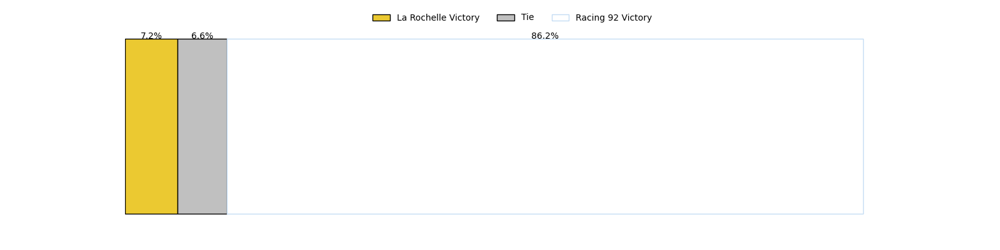

---  
layout: page  
title: La Rochelle at Racing 92; 36-39  
date: 2023-01-28 21:00:00 18:00:00 -0500  
categories: match review  
---
# La Rochelle at Racing 92; 36-39

# Club Level Predictions

The first set of predictions treats a club as the smallest object, as the club develops its members, organizes a gameplan, and deploys its players as needed for each match. This club model has a prediction of 0.556, which translates to predicting Racing 92 to win by 2.0.

Each club has a rating and a rating deviation (simiar to a Glicko system), and expected performances can be generated. This allows for simulated matches and spreads like the ones below.
## Projected Performances

## Projected Spreads

## Projected Results

# Player Level Predictions

Treating teams instead as an entity made up of the currently active players, I have ratings for each player in an altogether different system. These can be combined to form team ratings once teamsheets are announced, weighting starters a bit higher than the reserves. After the match is played, players can be weighted by their minutes on the field, allowing for an accurate measure of the team's composition. With these compiled team ratings, we can make predictions, measure inaccuracy, and update the individual player ratings.
## Prediction with Player Minutes: Racing 92 by 2.5

La Rochelle by 1.5 on a neutral field
## Scores over Time

## Win Probability over Time

## Prediction without Player Minutes: Racing 92 by 2.3

La Rochelle by 1.7 on a neutral pitch

|   Away Minutes | Away Player                                                               |   Away elo |   Away Percentile |   Number |   Home Percentile |   Home elo | Home Player                                                           |   Home Minutes |
|---------------:|:--------------------------------------------------------------------------|-----------:|------------------:|---------:|------------------:|-----------:|:----------------------------------------------------------------------|---------------:|
|             60 | [Joel Sclavi](..//playerfiles//JoelSclavi_cleaned.md)                     |     110.84 |                87 |        1 |                81 |     107.29 | [Eddy Ben Arous](..//playerfiles//EddyBenArous_cleaned.md)            |             47 |
|             57 | [Quentin Lespiaucq](..//playerfiles//QuentinLespiaucq_cleaned.md)         |      79.86 |                 4 |        2 |                41 |      92.22 | [Janick Tarrit](..//playerfiles//JanickTarrit_cleaned.md)             |             54 |
|             45 | [Georges-Henri Colombe](..//playerfiles//Georges-HenriColombe_cleaned.md) |      56.43 |                 0 |        3 |                75 |     104.64 | [Gia Kharaishvili](..//playerfiles//GiaKharaishvili_cleaned.md)       |             54 |
|             80 | [Romain Sazy](..//playerfiles//RomainSazy_cleaned.md)                     |     135.27 |                97 |        4 |                42 |      92.73 | [Boris Palu](..//playerfiles//BorisPalu_cleaned.md)                   |             80 |
|             41 | [Remi Picquette](..//playerfiles//RemiPicquette_cleaned.md)               |      91.9  |                38 |        5 |                 6 |      71.32 | [Veikoso Poloniati](..//playerfiles//VeikosoPoloniati_cleaned.md)     |             41 |
|             80 | [Ultan Dillane](..//playerfiles//UltanDillane_cleaned.md)                 |      99.63 |                60 |        6 |                16 |      81.66 | [Fabien Sanconnie](..//playerfiles//FabienSanconnie_cleaned.md)       |             80 |
|             16 | [Remi Bourdeau](..//playerfiles//RemiBourdeau_cleaned.md)                 |     122.6  |                91 |        7 |                32 |      89.87 | [Baptiste Chouzenoux](..//playerfiles//BaptisteChouzenoux_cleaned.md) |             80 |
|             80 | [Yoan Tanga](..//playerfiles//YoanTanga_cleaned.md)                       |     107.12 |                75 |        8 |                36 |      90.27 | [Maxime Baudonne](..//playerfiles//MaximeBaudonne_cleaned.md)         |             47 |
|             65 | [Tawera Kerr-Barlow](..//playerfiles//TaweraKerr-Barlow_cleaned.md)       |     124.54 |                96 |        9 |                94 |     126.09 | [Antoine Gibert](..//playerfiles//AntoineGibert_cleaned.md)           |             80 |
|             80 | [Antoine Hastoy](..//playerfiles//AntoineHastoy_cleaned.md)               |      96.47 |                47 |       10 |                98 |     138.42 | [Finn Russell](..//playerfiles//FinnRussell_cleaned.md)               |             80 |
|             80 | [Raymond Rhule](..//playerfiles//RaymondRhule_cleaned.md)                 |     113.26 |                83 |       11 |                96 |     130.14 | [Juan Imhoff](..//playerfiles//JuanImhoff_cleaned.md)                 |             16 |
|             80 | [Jules Favre](..//playerfiles//JulesFavre_cleaned.md)                     |     143.05 |                99 |       12 |                86 |     115.28 | [Henry Chavancy](..//playerfiles//HenryChavancy_cleaned.md)           |             80 |
|             80 | [Ulupano Seuteni](..//playerfiles//UlupanoSeuteni_cleaned.md)             |      92.77 |                41 |       13 |                83 |     113.52 | [Francis Saili](..//playerfiles//FrancisSaili_cleaned.md)             |             56 |
|             80 | [Teddy Thomas](..//playerfiles//TeddyThomas_cleaned.md)                   |     112.24 |                82 |       14 |                71 |     104.13 | [Donovan Taofifenua](..//playerfiles//DonovanTaofifenua_cleaned.md)   |             80 |
|             61 | [Pierre Popelin](..//playerfiles//PierrePopelin_cleaned.md)               |      98.7  |                51 |       15 |                42 |      93.49 | [Max Spring](..//playerfiles//MaxSpring_cleaned.md)                   |             80 |
|             64 | [Paul Boudehent](..//playerfiles//PaulBoudehent_cleaned.md)               |      80.85 |                11 |       16 |                82 |     112.81 | [Olivier Klemenczak](..//playerfiles//OlivierKlemenczak_cleaned.md)   |             64 |
|             39 | [Levani Botia Veivuke](..//playerfiles//LevaniBotiaVeivuke_cleaned.md)    |     114.04 |                85 |       17 |                86 |     114.92 | [Anton Bresler](..//playerfiles//AntonBresler_cleaned.md)             |             39 |
|             35 | [Aleksandre Kuntelia](..//playerfiles//AleksandreKuntelia_cleaned.md)     |      93.16 |                42 |       18 |                80 |     106.7  | [Guram Gogichashvili](..//playerfiles//GuramGogichashvili_cleaned.md) |             33 |
|             23 | [Samuel Lagrange](..//playerfiles//SamuelLagrange_cleaned.md)             |     100.16 |                64 |       19 |                17 |      82.53 | [Kitione Kamikamica](..//playerfiles//KitioneKamikamica_cleaned.md)   |             33 |
|             20 | [Leo Aouf](..//playerfiles//LeoAouf_cleaned.md)                           |      94.96 |                36 |       20 |                80 |     106.78 | [Peniami Narisia](..//playerfiles//PeniamiNarisia_cleaned.md)         |             26 |
|             19 | [Brice Dulin](..//playerfiles//BriceDulin_cleaned.md)                     |     138.76 |                96 |       21 |                99 |     141.43 | [Biyi Alo](..//playerfiles//BiyiAlo_cleaned.md)                       |             26 |
|             15 | [Thomas Berjon](..//playerfiles//ThomasBerjon_cleaned.md)                 |      97.59 |                53 |       22 |                75 |     106.02 | [Teddy Iribaren](..//playerfiles//TeddyIribaren_cleaned.md)           |             24 |

