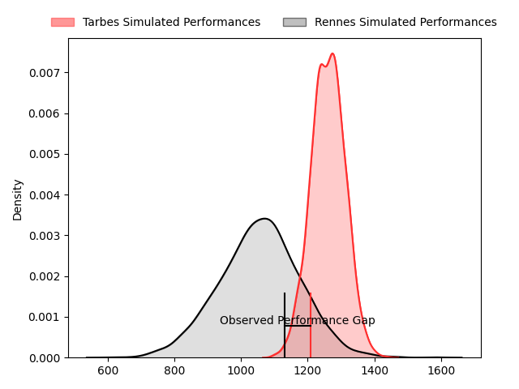
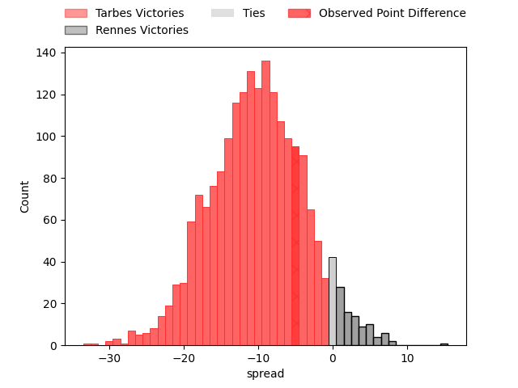
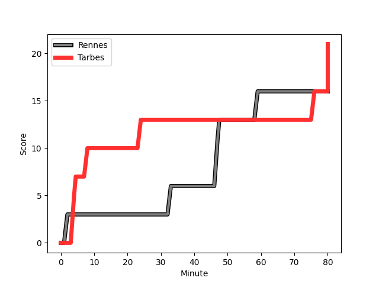
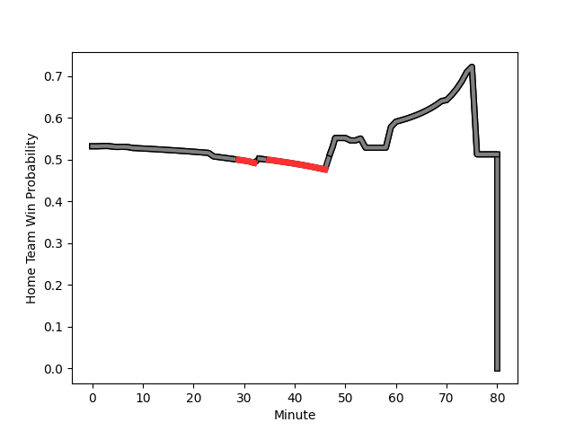

---  
layout: page  
title: Tarbes at Rennes; 21-16  
date: 2023-01-28 18:00:00 18:00:00 -0500  
categories: match review  
---
# Tarbes at Rennes; 21-16

# Club Level Predictions

The first set of predictions treats a club as the smallest object, as the club develops its members, organizes a gameplan, and deploys its players as needed for each match. This club model has a prediction of 0.386, which translates to predicting Tarbes to win by 4.1.

Each club has a rating and a rating deviation (simiar to a Glicko system), and expected performances can be generated. This allows for simulated matches and spreads like the ones below.
## Projected Performances

## Projected Spreads

## Projected Results

# Player Level Predictions

Treating teams instead as an entity made up of the currently active players, I have ratings for each player in an altogether different system. These can be combined to form team ratings once teamsheets are announced, weighting starters a bit higher than the reserves. After the match is played, players can be weighted by their minutes on the field, allowing for an accurate measure of the team's composition. With these compiled team ratings, we can make predictions, measure inaccuracy, and update the individual player ratings.
## Prediction with Player Minutes: Rennes by 9.6

Rennes by 5.6 on a neutral field
## Scores over Time

## Win Probability over Time

## Prediction without Player Minutes: Rennes by 9.7

Rennes by 5.7 on a neutral pitch

|   Away Minutes | Away Player                                                                 |   Away elo |   Away Percentile |   Number |   Home Percentile |   Home elo | Home Player                                                                |   Home Minutes |
|---------------:|:----------------------------------------------------------------------------|-----------:|------------------:|---------:|------------------:|-----------:|:---------------------------------------------------------------------------|---------------:|
|             54 | [Alexandre Combier](..//playerfiles//AlexandreCombier_cleaned.md)           |      83.13 |                17 |        1 |                43 |     101.59 | [Luvuyo Pupuma](..//playerfiles//LuvuyoPupuma_cleaned.md)                  |             75 |
|             48 | [Enzo Mondon](..//playerfiles//EnzoMondon_cleaned.md)                       |     106.35 |                80 |        2 |                64 |     100.14 | [Alexandre Fau](..//playerfiles//AlexandreFau_cleaned.md)                  |             60 |
|             54 | [Alexandre Duny](..//playerfiles//AlexandreDuny_cleaned.md)                 |      78.87 |                11 |        3 |                60 |      99.38 | [Atonio Ulutuipalelei](..//playerfiles//AtonioUlutuipalelei_cleaned.md)    |             32 |
|             80 | [Antoine Bousquet](..//playerfiles//AntoineBousquet_cleaned.md)             |      90.12 |                33 |        4 |                64 |     101.03 | [Alexandre Gueroult](..//playerfiles//AlexandreGueroult_cleaned.md)        |             80 |
|             60 | [Aurelien Ricart](..//playerfiles//AurelienRicart_cleaned.md)               |     117.13 |                88 |        5 |               nan |      97.47 | [Clément Fontaine](..//playerfiles//ClémentFontaine_cleaned.md)            |             80 |
|             80 | [Mattéo Coustalat](..//playerfiles//MattéoCoustalat_cleaned.md)             |     101.02 |                63 |        6 |                62 |     100.45 | [Téo Gazin](..//playerfiles//TéoGazin_cleaned.md)                          |              6 |
|             70 | [Loan Real](..//playerfiles//LoanReal_cleaned.md)                           |      87.08 |                27 |        7 |                38 |      91.52 | [Pedro Ortega](..//playerfiles//PedroOrtega_cleaned.md)                    |             53 |
|             80 | [Len Massyn](..//playerfiles//LenMassyn_cleaned.md)                         |      58.99 |                 0 |        8 |                35 |      90.9  | [Victor Fromenteze](..//playerfiles//VictorFromenteze_cleaned.md)          |             80 |
|             48 | [Thibaut Dulucq](..//playerfiles//ThibautDulucq_cleaned.md)                 |      82.88 |                17 |        9 |                50 |      95.98 | [Lucas Ollion](..//playerfiles//LucasOllion_cleaned.md)                    |             59 |
|             80 | [Anthony Fuertes](..//playerfiles//AnthonyFuertes_cleaned.md)               |      78.86 |                10 |       10 |                85 |     117.39 | [Sam Leeming](..//playerfiles//SamLeeming_cleaned.md)                      |             75 |
|             80 | [Jonathan Duffau](..//playerfiles//JonathanDuffau_cleaned.md)               |     114.64 |                85 |       11 |                11 |      78.63 | [Romuald François](..//playerfiles//RomualdFrançois_cleaned.md)            |             80 |
|             54 | [Vaea Tutuila Vaea](..//playerfiles//VaeaTutuilaVaea_cleaned.md)            |      95    |               nan |       12 |                30 |      88.27 | [Ryan Dubois](..//playerfiles//RyanDubois_cleaned.md)                      |             80 |
|             80 | [Alofa Alofa](..//playerfiles//AlofaAlofa_cleaned.md)                       |     132.46 |                96 |       13 |                48 |      95.38 | [Clément Lepresle](..//playerfiles//ClémentLepresle_cleaned.md)            |             51 |
|             70 | [Johan Paulet](..//playerfiles//JohanPaulet_cleaned.md)                     |      75.24 |                 8 |       14 |                53 |      97.44 | [Mathieu Brignonen](..//playerfiles//MathieuBrignonen_cleaned.md)          |             80 |
|             80 | [William Pees](..//playerfiles//WilliamPees_cleaned.md)                     |      97.89 |                51 |       15 |                52 |      98.06 | [Pedro Soto](..//playerfiles//PedroSoto_cleaned.md)                        |             80 |
|             26 | [Antoine Palisse](..//playerfiles//AntoinePalisse_cleaned.md)               |      96.44 |                51 |       16 |                37 |      94.65 | [Patrick Tu'ugahala](..//playerfiles//PatrickTu'ugahala_cleaned.md)        |             20 |
|             32 | [Florian Lamothe](..//playerfiles//FlorianLamothe_cleaned.md)               |      80.2  |                11 |       17 |                49 |      96.52 | [Pierre Strippoli](..//playerfiles//PierreStrippoli_cleaned.md)            |             48 |
|             26 | [Aleksi Tchitchiashvili](..//playerfiles//AleksiTchitchiashvili_cleaned.md) |      96.86 |                52 |       18 |                64 |     101.38 | [Vincent Wenger](..//playerfiles//VincentWenger_cleaned.md)                |             74 |
|             20 | [Jason Nel](..//playerfiles//JasonNel_cleaned.md)                           |      95    |               nan |       19 |               nan |      95    | [Ewann Puarai](..//playerfiles//EwannPuarai_cleaned.md)                    |              5 |
|             10 | [Gigi Leshkasheli](..//playerfiles//GigiLeshkasheli_cleaned.md)             |      88.65 |                28 |       20 |                30 |      90.36 | [Yvan Leroyer](..//playerfiles//YvanLeroyer_cleaned.md)                    |              5 |
|             32 | [Alexis Levron](..//playerfiles//AlexisLevron_cleaned.md)                   |      73.44 |                 9 |       21 |                23 |      85.49 | [Gonzalo Lopez Bontempo](..//playerfiles//GonzaloLopezBontempo_cleaned.md) |             29 |
|             26 | [Pierre Descoubet](..//playerfiles//PierreDescoubet_cleaned.md)             |     100.94 |                64 |       22 |                58 |      99.95 | [Matéo Jeune-Joly](..//playerfiles//MatéoJeune-Joly_cleaned.md)            |             21 |
|             10 | [Romain Dumestre](..//playerfiles//RomainDumestre_cleaned.md)               |      87.43 |                24 |       23 |                58 |      99.21 | [Victor Danielli](..//playerfiles//VictorDanielli_cleaned.md)              |             27 |

