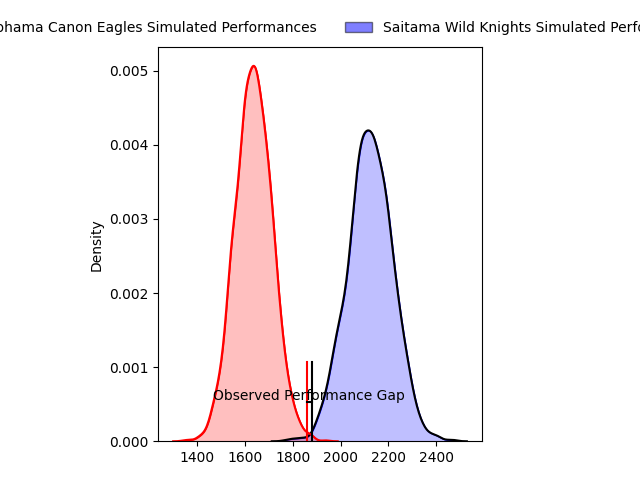
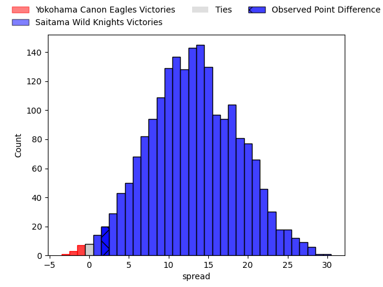
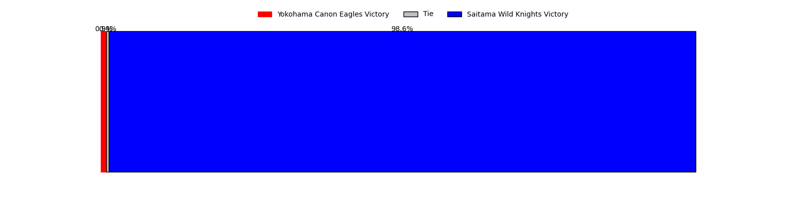
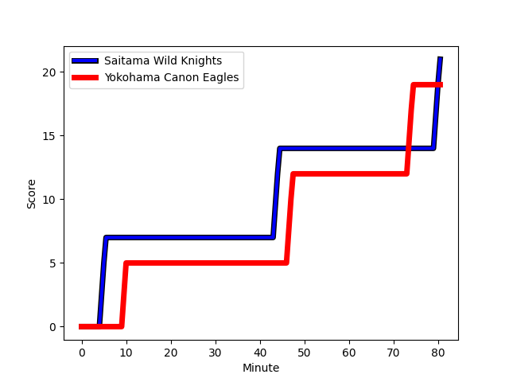
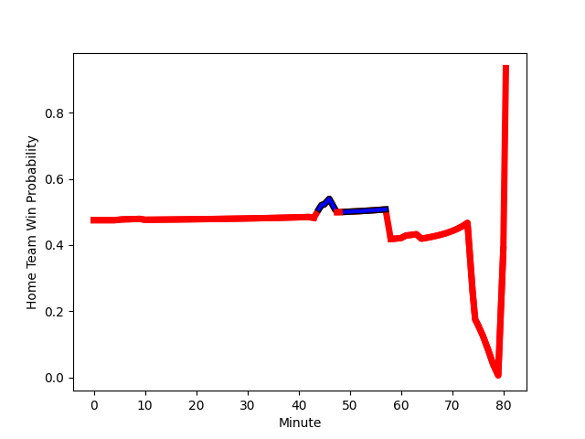

---  
layout: page  
title: Yokohama Canon Eagles at Saitama Wild Knights; 19-21  
date: 2023-01-28 06:30:00 18:00:00 -0500  
categories: match review  
---
# Yokohama Canon Eagles at Saitama Wild Knights; 19-21

# Club Level Predictions

The first set of predictions treats a club as the smallest object, as the club develops its members, organizes a gameplan, and deploys its players as needed for each match. This club model has a prediction of 0.939, which translates to predicting Saitama Wild Knights to win by 24.5.

Each club has a rating and a rating deviation (simiar to a Glicko system), and expected performances can be generated. This allows for simulated matches and spreads like the ones below.
## Projected Performances

## Projected Spreads

## Projected Results

# Player Level Predictions

Treating teams instead as an entity made up of the currently active players, I have ratings for each player in an altogether different system. These can be combined to form team ratings once teamsheets are announced, weighting starters a bit higher than the reserves. After the match is played, players can be weighted by their minutes on the field, allowing for an accurate measure of the team's composition. With these compiled team ratings, we can make predictions, measure inaccuracy, and update the individual player ratings.
## Prediction with Player Minutes: Yokohama Canon Eagles by 0.3

Yokohama Canon Eagles by 4.3 on a neutral field
## Scores over Time

## Win Probability over Time

## Prediction without Player Minutes: Saitama Wild Knights by 3.4

Yokohama Canon Eagles by 0.6 on a neutral pitch

|   Away Minutes | Away Player                                                     |   Away elo |   Away Percentile |   Number |   Home Percentile |   Home elo | Home Player                                                     |   Home Minutes |
|---------------:|:----------------------------------------------------------------|-----------:|------------------:|---------:|------------------:|-----------:|:----------------------------------------------------------------|---------------:|
|             80 | [Takato Okabe](..//playerfiles//TakatoOkabe_cleaned.md)         |     125.92 |                97 |        1 |                94 |     119.27 | [Keita Inagaki](..//playerfiles//KeitaInagaki_cleaned.md)       |             46 |
|             43 | [Yusaku Miyoshi](..//playerfiles//YusakuMiyoshi_cleaned.md)     |      95.49 |               nan |        2 |                80 |     106.93 | [Atsushi Sakate](..//playerfiles//AtsushiSakate_cleaned.md)     |             46 |
|             80 | [Rento Tsukayama](..//playerfiles//RentoTsukayama_cleaned.md)   |     105.4  |                80 |        3 |                43 |      95.58 | [Taiki Fujii](..//playerfiles//TaikiFujii_cleaned.md)           |             46 |
|             80 | [Kobus Van Dyk](..//playerfiles//KobusVanDyk_cleaned.md)        |     109.54 |                77 |        4 |                22 |      84.95 | [Liam Mitchell](..//playerfiles//LiamMitchell_cleaned.md)       |             80 |
|             80 | [Liaki Moli](..//playerfiles//LiakiMoli_cleaned.md)             |      90.23 |                33 |        5 |                44 |      93.78 | [Lood de Jager](..//playerfiles//LooddeJager_cleaned.md)        |             80 |
|             80 | [Sioeli Vakalahi](..//playerfiles//SioeliVakalahi_cleaned.md)   |     105.92 |                74 |        6 |                87 |     115.81 | [Ben Gunter](..//playerfiles//BenGunter_cleaned.md)             |             61 |
|             64 | [Naoto Shimada](..//playerfiles//NaotoShimada_cleaned.md)       |      72.94 |                 5 |        7 |                58 |      98.81 | [Lachlan Boshier](..//playerfiles//LachlanBoshier_cleaned.md)   |             80 |
|             46 | [Amanaki Mafi](..//playerfiles//AmanakiMafi_cleaned.md)         |     115.06 |                85 |        8 |                88 |     118.44 | [Jack Cornelsen](..//playerfiles//JackCornelsen_cleaned.md)     |             80 |
|             58 | [Faf de Klerk](..//playerfiles//FafdeKlerk_cleaned.md)          |      96.37 |                49 |        9 |                79 |     107.7  | [Keisuke Uchida](..//playerfiles//KeisukeUchida_cleaned.md)     |             61 |
|             80 | [Jumpei Ogura](..//playerfiles//JumpeiOgura_cleaned.md)         |     119.45 |                87 |       10 |                51 |      97.94 | [Rikiya Matsuda](..//playerfiles//RikiyaMatsuda_cleaned.md)     |             80 |
|             80 | [Viliame Takayawa](..//playerfiles//ViliameTakayawa_cleaned.md) |     131.05 |                96 |       11 |                28 |      88.45 | [Marika Koroibete](..//playerfiles//MarikaKoroibete_cleaned.md) |             80 |
|             80 | [Yusuke Kajimura](..//playerfiles//YusukeKajimura_cleaned.md)   |     103.2  |                67 |       12 |                66 |     102.56 | [Tomoki Osada](..//playerfiles//TomokiOsada_cleaned.md)         |             80 |
|             80 | [Jesse Kriel](..//playerfiles//JesseKriel_cleaned.md)           |     136.03 |                97 |       13 |                89 |     118.54 | [Dylan Riley](..//playerfiles//DylanRiley_cleaned.md)           |             80 |
|             80 | [Inoke Burua](..//playerfiles//InokeBurua_cleaned.md)           |     110.04 |                81 |       14 |                99 |     153.61 | [Koki Takeyama](..//playerfiles//KokiTakeyama_cleaned.md)       |             80 |
|             80 | [SP Marais](..//playerfiles//SPMarais_cleaned.md)               |     131.62 |                94 |       15 |                33 |      90.74 | [Kyohei Yamasawa](..//playerfiles//KyoheiYamasawa_cleaned.md)   |             80 |
|             37 | [Song Ho Park](..//playerfiles//SongHoPark_cleaned.md)          |     102.66 |                71 |       16 |                60 |      98.78 | [Craig Millar](..//playerfiles//CraigMillar_cleaned.md)         |             34 |
|             34 | [Sione Halasili](..//playerfiles//SioneHalasili_cleaned.md)     |     105.2  |                78 |       17 |               nan |     139.33 | [Shota Horie](..//playerfiles//ShotaHorie_cleaned.md)           |             34 |
|             22 | [Kouki Arai](..//playerfiles//KoukiArai_cleaned.md)             |      97.37 |                53 |       18 |                95 |     119.83 | [Asaeli Ai Valu](..//playerfiles//AsaeliAiValu_cleaned.md)      |             34 |
|             16 | [Max Douglas](..//playerfiles//MaxDouglas_cleaned.md)           |     108.73 |                79 |       19 |                96 |     125.63 | [Taiki Koyama](..//playerfiles//TaikiKoyama_cleaned.md)         |             19 |
|            nan | nan                                                             |     nan    |               nan |       20 |                81 |     111.32 | [Shota Fukui](..//playerfiles//ShotaFukui_cleaned.md)           |             19 |

