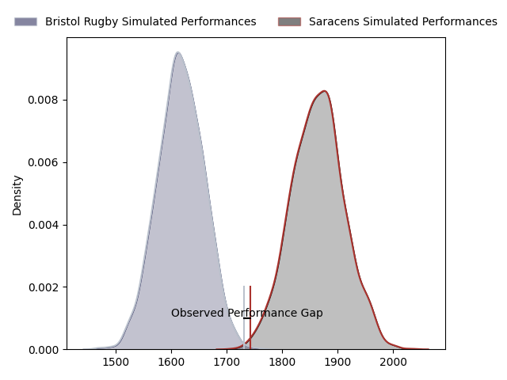
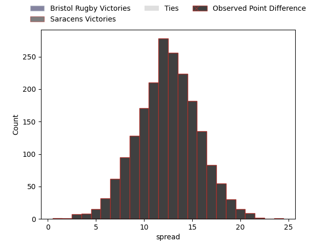
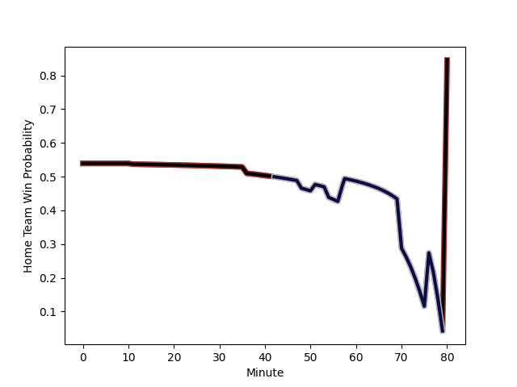

---  
layout: page  
title: Bristol Rugby at Saracens; 19-20  
date: 2023-01-28 16:00:00 18:00:00 -0500  
categories: match review  
---
# Bristol Rugby at Saracens; 19-20

# Club Level Predictions

The first set of predictions treats a club as the smallest object, as the club develops its members, organizes a gameplan, and deploys its players as needed for each match. This club model has a prediction of 0.806, which translates to predicting Saracens to win by 12.5.

Each club has a rating and a rating deviation (simiar to a Glicko system), and expected performances can be generated. This allows for simulated matches and spreads like the ones below.
## Projected Performances

## Projected Spreads

## Projected Results

# Player Level Predictions

Treating teams instead as an entity made up of the currently active players, I have ratings for each player in an altogether different system. These can be combined to form team ratings once teamsheets are announced, weighting starters a bit higher than the reserves. After the match is played, players can be weighted by their minutes on the field, allowing for an accurate measure of the team's composition. With these compiled team ratings, we can make predictions, measure inaccuracy, and update the individual player ratings.
## Prediction with Player Minutes: Saracens by 11.8

Saracens by 7.8 on a neutral field
## Scores over Time

## Win Probability over Time

## Prediction without Player Minutes: Saracens by 13.1

Saracens by 9.1 on a neutral pitch

|   Away Minutes | Away Player                                                               |   Away elo |   Away Percentile |   Number |   Home Percentile |   Home elo | Home Player                                                       |   Home Minutes |
|---------------:|:--------------------------------------------------------------------------|-----------:|------------------:|---------:|------------------:|-----------:|:------------------------------------------------------------------|---------------:|
|             42 | [Yann Thomas](..//playerfiles//YannThomas_cleaned.md)                     |      91.08 |                35 |        1 |                66 |     100.41 | [Robin Hislop](..//playerfiles//RobinHislop_cleaned.md)           |             35 |
|             41 | [Harry Thacker](..//playerfiles//HarryThacker_cleaned.md)                 |      98.81 |                60 |        2 |                92 |     119.57 | [Theo Dan](..//playerfiles//TheoDan_cleaned.md)                   |             60 |
|             75 | [Max Lahiff](..//playerfiles//MaxLahiff_cleaned.md)                       |      84.4  |                17 |        3 |                51 |      99.41 | [Christian Judge](..//playerfiles//ChristianJudge_cleaned.md)     |             45 |
|             80 | [Joe Batley](..//playerfiles//JoeBatley_cleaned.md)                       |     109.13 |                79 |        4 |                12 |      77.87 | [Andrew Kitchener](..//playerfiles//AndrewKitchener_cleaned.md)   |             41 |
|             80 | [Chris Vui](..//playerfiles//ChrisVui_cleaned.md)                         |     108.42 |                79 |        5 |                80 |     110.18 | [Hugh Tizard](..//playerfiles//HughTizard_cleaned.md)             |             80 |
|             61 | [Steven Luatua](..//playerfiles//StevenLuatua_cleaned.md)                 |     133.85 |                97 |        6 |                40 |      92.26 | [Andy Christie](..//playerfiles//AndyChristie_cleaned.md)         |             80 |
|             65 | [Jake Heenan](..//playerfiles//JakeHeenan_cleaned.md)                     |      91.94 |                41 |        7 |                98 |     140.63 | [Jackson Wray](..//playerfiles//JacksonWray_cleaned.md)           |             80 |
|             80 | [Magnus Bradbury](..//playerfiles//MagnusBradbury_cleaned.md)             |      91.32 |                37 |        8 |                83 |     113.75 | [Billy Vunipola](..//playerfiles//BillyVunipola_cleaned.md)       |             80 |
|             69 | [Harry Randall](..//playerfiles//HarryRandall_cleaned.md)                 |     108.71 |                81 |        9 |                46 |      95.58 | [Aled Davies](..//playerfiles//AledDavies_cleaned.md)             |             55 |
|             72 | [AJ MacGinty](..//playerfiles//AJMacGinty_cleaned.md)                     |     107.62 |                74 |       10 |                62 |     101.93 | [Manu Vunipola](..//playerfiles//ManuVunipola_cleaned.md)         |             80 |
|             80 | [Gabriel Ibitoye](..//playerfiles//GabrielIbitoye_cleaned.md)             |     113.14 |                85 |       11 |                30 |      91.74 | [Alex Lewington](..//playerfiles//AlexLewington_cleaned.md)       |             53 |
|             80 | [James Williams](..//playerfiles//JamesWilliams_cleaned.md)               |      77.13 |                10 |       12 |                94 |     126.37 | [Duncan Taylor](..//playerfiles//DuncanTaylor_cleaned.md)         |             74 |
|             80 | [Semi Radradra](..//playerfiles//SemiRadradra_cleaned.md)                 |     117.27 |                88 |       13 |                70 |     104.76 | [Alex Lozowski](..//playerfiles//AlexLozowski_cleaned.md)         |             52 |
|             80 | [Ratu Naulago](..//playerfiles//RatuNaulago_cleaned.md)                   |      92.27 |                39 |       14 |                76 |     107.5  | [Rotimi Segun](..//playerfiles//RotimiSegun_cleaned.md)           |             80 |
|             80 | [Richard Lane](..//playerfiles//RichardLane_cleaned.md)                   |      94.61 |                46 |       15 |                77 |     110.33 | [Alex Goode](..//playerfiles//AlexGoode_cleaned.md)               |             80 |
|             38 | [Jake Woolmore](..//playerfiles//JakeWoolmore_cleaned.md)                 |     111.22 |                87 |       16 |                 5 |      74.11 | [Eroni Mawi](..//playerfiles//EroniMawi_cleaned.md)               |             45 |
|             39 | [Bryan Byrne](..//playerfiles//BryanByrne_cleaned.md)                     |     101.66 |                68 |       17 |                 9 |      77.98 | [Kapeli Pifeleti](..//playerfiles//KapeliPifeleti_cleaned.md)     |             20 |
|              5 | [Jonathan Benz-Salomon](..//playerfiles//JonathanBenz-Salomon_cleaned.md) |      80.02 |                10 |       18 |                63 |     102.98 | [Alec Clarey](..//playerfiles//AlecClarey_cleaned.md)             |             35 |
|             19 | [Ed Holmes](..//playerfiles//EdHolmes_cleaned.md)                         |      68.14 |                 5 |       19 |                91 |     117.21 | [Ivan van Zyl](..//playerfiles//IvanvanZyl_cleaned.md)            |             25 |
|             15 | [Fitz Harding](..//playerfiles//FitzHarding_cleaned.md)                   |     110.1  |                79 |       20 |                85 |     113.25 | [Francois Hougaard](..//playerfiles//FrancoisHougaard_cleaned.md) |             27 |
|             11 | [Andy Uren](..//playerfiles//AndyUren_cleaned.md)                         |      79.54 |                13 |       21 |                99 |     145.83 | [Nick Tompkins](..//playerfiles//NickTompkins_cleaned.md)         |             28 |
|              8 | [Callum Sheedy](..//playerfiles//CallumSheedy_cleaned.md)                 |     136.86 |                96 |       22 |                52 |      96.56 | [Cameron Boon](..//playerfiles//CameronBoon_cleaned.md)           |              6 |
|            nan | nan                                                                       |     nan    |               nan |       23 |                 8 |      77.41 | [Tom Ellis](..//playerfiles//TomEllis_cleaned.md)                 |             39 |

