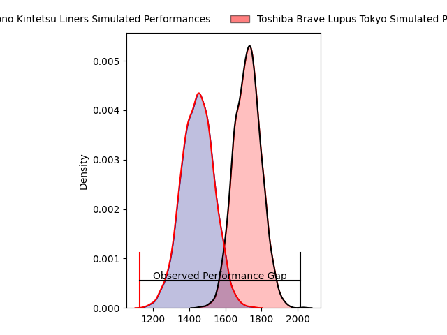
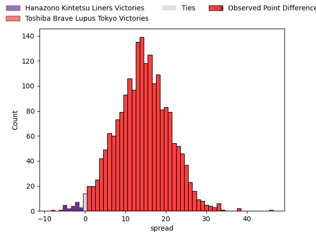
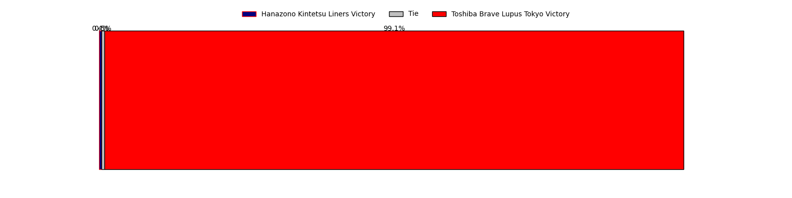
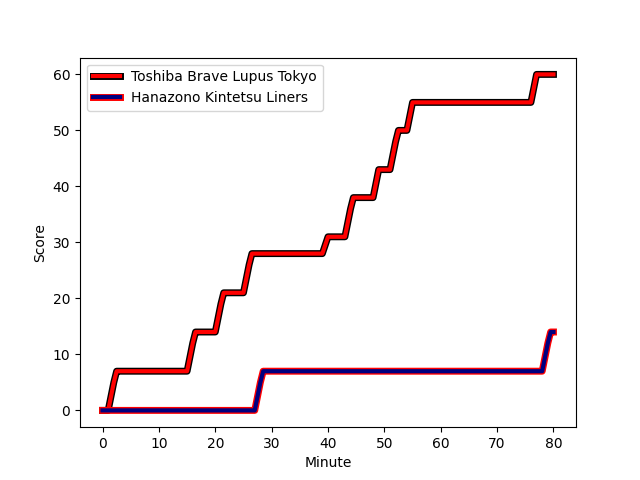
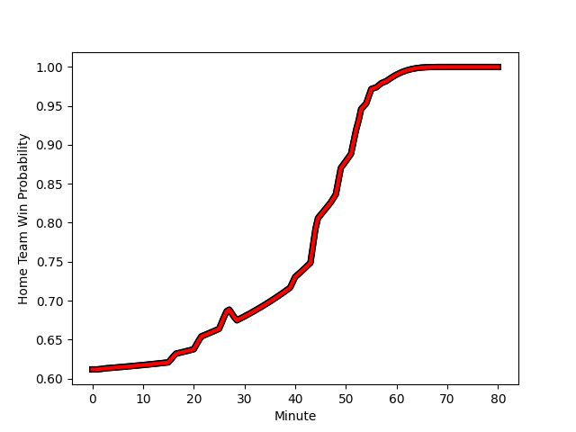

---  
layout: page  
title: Hanazono Kintetsu Liners at Toshiba Brave Lupus Tokyo; 14-60  
date: 2023-01-28 04:00:00 18:00:00 -0500  
categories: match review  
---
# Hanazono Kintetsu Liners at Toshiba Brave Lupus Tokyo; 14-60

# Club Level Predictions

The first set of predictions treats a club as the smallest object, as the club develops its members, organizes a gameplan, and deploys its players as needed for each match. This club model has a prediction of 0.862, which translates to predicting Toshiba Brave Lupus Tokyo to win by 16.5.

Each club has a rating and a rating deviation (simiar to a Glicko system), and expected performances can be generated. This allows for simulated matches and spreads like the ones below.
## Projected Performances

## Projected Spreads

## Projected Results

# Player Level Predictions

Treating teams instead as an entity made up of the currently active players, I have ratings for each player in an altogether different system. These can be combined to form team ratings once teamsheets are announced, weighting starters a bit higher than the reserves. After the match is played, players can be weighted by their minutes on the field, allowing for an accurate measure of the team's composition. With these compiled team ratings, we can make predictions, measure inaccuracy, and update the individual player ratings.
## Prediction with Player Minutes: Toshiba Brave Lupus Tokyo by 20.9

Toshiba Brave Lupus Tokyo by 16.9 on a neutral field
## Scores over Time

## Win Probability over Time

## Prediction without Player Minutes: Toshiba Brave Lupus Tokyo by 18.0

Toshiba Brave Lupus Tokyo by 14.0 on a neutral pitch

|   Away Minutes | Away Player                                                               |   Away elo |   Away Percentile |   Number |   Home Percentile |   Home elo | Home Player                                                         |   Home Minutes |
|---------------:|:--------------------------------------------------------------------------|-----------:|------------------:|---------:|------------------:|-----------:|:--------------------------------------------------------------------|---------------:|
|             53 | [Kenta Tanaka](..//playerfiles//KentaTanaka_cleaned.md)                   |      89.89 |                57 |        1 |                67 |     101.6  | [Masataka Mikami](..//playerfiles//MasatakaMikami_cleaned.md)       |             40 |
|             53 | [Atsushi Kashimoto](..//playerfiles//AtsushiKashimoto_cleaned.md)         |     118.92 |                97 |        2 |                 1 |      63.19 | [Daigo Hashimoto](..//playerfiles//DaigoHashimoto_cleaned.md)       |             40 |
|             53 | [Kota Mitake](..//playerfiles//KotaMitake_cleaned.md)                     |      94.67 |                52 |        3 |                91 |     116    | [Yuta Kokaji](..//playerfiles//YutaKokaji_cleaned.md)               |             40 |
|             80 | [Tsuyoshi Murata](..//playerfiles//TsuyoshiMurata_cleaned.md)             |     101.44 |                65 |        4 |                61 |     100.14 | [Warner Dearns](..//playerfiles//WarnerDearns_cleaned.md)           |             58 |
|             80 | [Ben Toolis](..//playerfiles//BenToolis_cleaned.md)                       |     127.2  |                95 |        5 |                93 |     124.9  | [Jacob Pierce](..//playerfiles//JacobPierce_cleaned.md)             |             80 |
|             80 | [Takahito Sugahara](..//playerfiles//TakahitoSugahara_cleaned.md)         |      86.32 |                22 |        6 |                47 |      94.74 | [Yoshitaka Tokunaga](..//playerfiles//YoshitakaTokunaga_cleaned.md) |             80 |
|             62 | [Shohei Nonaka](..//playerfiles//ShoheiNonaka_cleaned.md)                 |     114.3  |                85 |        7 |                99 |     147.01 | [Matt Todd](..//playerfiles//MattTodd_cleaned.md)                   |             80 |
|             44 | [Jed Brown](..//playerfiles//JedBrown_cleaned.md)                         |     102.29 |                63 |        8 |                89 |     118.53 | [Michael Leitch](..//playerfiles//MichaelLeitch_cleaned.md)         |             62 |
|             70 | [Will Genia](..//playerfiles//WillGenia_cleaned.md)                       |     100.35 |                62 |        9 |                55 |      97.79 | [Takahiro Ogawa](..//playerfiles//TakahiroOgawa_cleaned.md)         |             48 |
|             80 | [Takumi Yoshimoto](..//playerfiles//TakumiYoshimoto_cleaned.md)           |      90.92 |                31 |       10 |                75 |     107.71 | [Tom Taylor](..//playerfiles//TomTaylor_cleaned.md)                 |             50 |
|             56 | [Yoshizumi Takeda](..//playerfiles//YoshizumiTakeda_cleaned.md)           |      86.05 |                26 |       11 |                84 |     113.94 | [Masaki Hamada](..//playerfiles//MasakiHamada_cleaned.md)           |             80 |
|             80 | [Koji Okamura](..//playerfiles//KojiOkamura_cleaned.md)                   |      73.13 |                 6 |       12 |                67 |     102.99 | [Nicholas McCurran](..//playerfiles//NicholasMcCurran_cleaned.md)   |             80 |
|             80 | [Siosaia Fifita](..//playerfiles//SiosaiaFifita_cleaned.md)               |      78.26 |                11 |       13 |                69 |     103.82 | [Seta Tamanivalu](..//playerfiles//SetaTamanivalu_cleaned.md)       |             56 |
|             80 | [Joshua Nohra](..//playerfiles//JoshuaNohra_cleaned.md)                   |      80.71 |                13 |       14 |                86 |     115.5  | [Jone Naikabula](..//playerfiles//JoneNaikabula_cleaned.md)         |             80 |
|             65 | [Semisi Masirewa](..//playerfiles//SemisiMasirewa_cleaned.md)             |     109.13 |                75 |       15 |                62 |     101.93 | [Shohei Toyoshima](..//playerfiles//ShoheiToyoshima_cleaned.md)     |             80 |
|             36 | [Patrick Tafa](..//playerfiles//PatrickTafa_cleaned.md)                   |      84.51 |                30 |       16 |                58 |     101.1  | [Sena Kimura](..//playerfiles//SenaKimura_cleaned.md)               |             40 |
|             27 | [Shun Sasaki](..//playerfiles//ShunSasaki_cleaned.md)                     |      98    |                55 |       17 |                57 |      96.7  | [Mamoru Harada](..//playerfiles//MamoruHarada_cleaned.md)           |             40 |
|             27 | [Lata Tangimana](..//playerfiles//LataTangimana_cleaned.md)               |      76.78 |                 7 |       18 |               nan |      96.77 | [Latu Taufa](..//playerfiles//LatuTaufa_cleaned.md)                 |             40 |
|             27 | [Kazuma Matsuda](..//playerfiles//KazumaMatsuda_cleaned.md)               |      94.13 |               nan |       19 |                51 |      98.24 | [Yuhei Sugiyama](..//playerfiles//YuheiSugiyama_cleaned.md)         |             32 |
|             24 | [Tatsuma Nanto](..//playerfiles//TatsumaNanto_cleaned.md)                 |     122.72 |               nan |       20 |                68 |     104.74 | [Takuro Matsunaga](..//playerfiles//TakuroMatsunaga_cleaned.md)     |             30 |
|             18 | [Hayato Yokoi](..//playerfiles//HayatoYokoi_cleaned.md)                   |      90.59 |                35 |       21 |                86 |     116.21 | [Burger Odendaal](..//playerfiles//BurgerOdendaal_cleaned.md)       |             24 |
|             10 | [Jackson Garden-Bachop](..//playerfiles//JacksonGarden-Bachop_cleaned.md) |     101.69 |                62 |       22 |                 3 |      64.14 | [Kyosuke Kajikawa](..//playerfiles//KyosukeKajikawa_cleaned.md)     |             22 |
|             15 | [Keitaro Hitora](..//playerfiles//KeitaroHitora_cleaned.md)               |      96.64 |                72 |       23 |               nan |     103.2  | [Takeshi Sasaki](..//playerfiles//TakeshiSasaki_cleaned.md)         |             18 |

