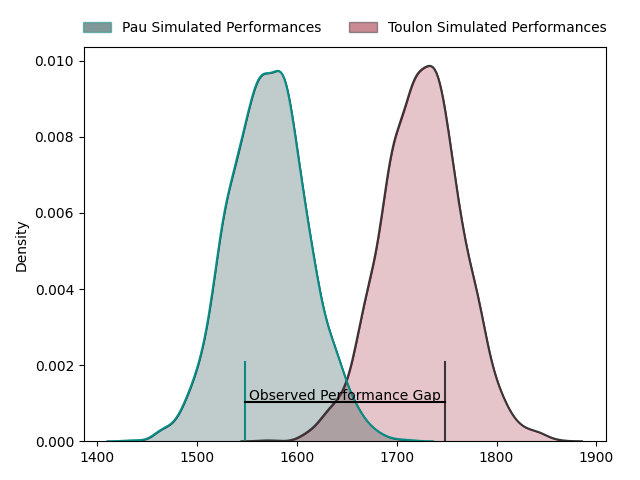
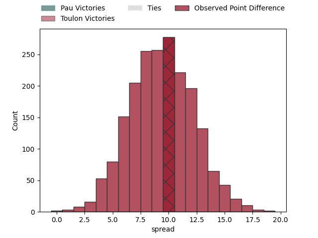
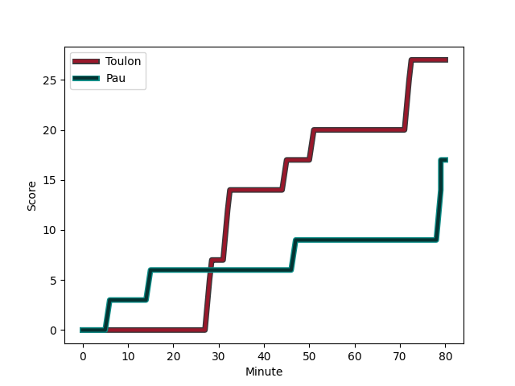
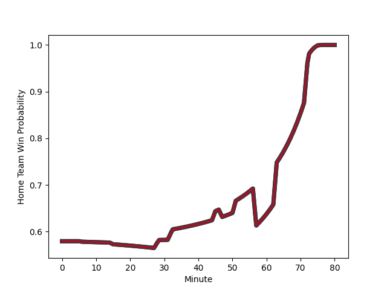

---  
layout: page  
title: Pau at Toulon; 17-27  
date: 2023-01-28 17:00:00 18:00:00 -0500  
categories: match review  
---
# Pau at Toulon; 17-27

# Club Level Predictions

The first set of predictions treats a club as the smallest object, as the club develops its members, organizes a gameplan, and deploys its players as needed for each match. This club model has a prediction of 0.747, which translates to predicting Toulon to win by 9.5.

Each club has a rating and a rating deviation (simiar to a Glicko system), and expected performances can be generated. This allows for simulated matches and spreads like the ones below.
## Projected Performances

## Projected Spreads

# Player Level Predictions

Treating teams instead as an entity made up of the currently active players, I have ratings for each player in an altogether different system. These can be combined to form team ratings once teamsheets are announced, weighting starters a bit higher than the reserves. After the match is played, players can be weighted by their minutes on the field, allowing for an accurate measure of the team's composition. With these compiled team ratings, we can make predictions, measure inaccuracy, and update the individual player ratings.
## Prediction with Player Minutes: Toulon by 18.8

Toulon by 14.8 on a neutral field
## Scores over Time

## Win Probability over Time

## Prediction without Player Minutes: Toulon by 18.9

Toulon by 14.9 on a neutral pitch

|   Away Minutes | Away Player                                                           |   Away elo |   Away Percentile |   Number |   Home Percentile |   Home elo | Home Player                                                                                |   Home Minutes |
|---------------:|:----------------------------------------------------------------------|-----------:|------------------:|---------:|------------------:|-----------:|:-------------------------------------------------------------------------------------------|---------------:|
|             57 | [Ignacio Calles](..//playerfiles//IgnacioCalles_cleaned.md)           |     110.61 |                86 |        1 |                38 |      89.95 | [Bruce Devaux](..//playerfiles//BruceDevaux_cleaned.md)                                    |             56 |
|             57 | [Lucas Rey](..//playerfiles//LucasRey_cleaned.md)                     |      72.73 |                 3 |        2 |                77 |     106.27 | [Anthony Etrillard](..//playerfiles//AnthonyEtrillard_cleaned.md)                          |             75 |
|             52 | [Siate Tokolahi](..//playerfiles//SiateTokolahi_cleaned.md)           |      95.23 |                49 |        3 |                81 |     106.85 | [Beka Gigashvili](..//playerfiles//BekaGigashvili_cleaned.md)                              |             74 |
|             63 | [Guillaume Ducat](..//playerfiles//GuillaumeDucat_cleaned.md)         |      77.27 |                11 |        4 |                45 |      93.01 | [Matthias Halagahu](..//playerfiles//MatthiasHalagahu_cleaned.md)                          |             48 |
|             57 | [Fabrice Metz](..//playerfiles//FabriceMetz_cleaned.md)               |      83.18 |                18 |        5 |                80 |     109.65 | [Brian Alainu'uese](..//playerfiles//BrianAlainu'uese_cleaned.md)                          |             80 |
|             63 | [Sacha Zegueur](..//playerfiles//SachaZegueur_cleaned.md)             |      65.46 |                 2 |        6 |                 9 |      75.33 | [Swan Rebbadj](..//playerfiles//SwanRebbadj_cleaned.md)                                    |             80 |
|             80 | [Reece Hewat](..//playerfiles//ReeceHewat_cleaned.md)                 |      89.71 |                29 |        7 |                71 |     103.94 | [Cornell du Preez](..//playerfiles//CornellduPreez_cleaned.md)                             |             58 |
|             80 | [Jordan Joseph](..//playerfiles//JordanJoseph_cleaned.md)             |      84.58 |                20 |        8 |                71 |     106.02 | [Facundo Isa](..//playerfiles//FacundoIsa_cleaned.md)                                      |             80 |
|             52 | [Dan Robson](..//playerfiles//DanRobson_cleaned.md)                   |     104.91 |                73 |        9 |                67 |     106.33 | [Jules Danglot](..//playerfiles//JulesDanglot_cleaned.md)                                  |             56 |
|             52 | [Axel Desperes](..//playerfiles//AxelDesperes_cleaned.md)             |      94.85 |               nan |       10 |                77 |     110.16 | [Ihaia West](..//playerfiles//IhaiaWest_cleaned.md)                                        |             80 |
|             80 | [Daniel Ikpefan](..//playerfiles//DanielIkpefan_cleaned.md)           |      85.06 |                19 |       11 |                51 |      96.53 | [Gabin Villiere](..//playerfiles//GabinVilliere_cleaned.md)                                |             61 |
|             80 | [Jale Vatubua](..//playerfiles//JaleVatubua_cleaned.md)               |      85.03 |                22 |       12 |                83 |     112.76 | [Duncan Paia'aua](..//playerfiles//DuncanPaia'aua_cleaned.md)                              |             80 |
|             80 | [Tumua Manu](..//playerfiles//TumuaManu_cleaned.md)                   |     125.68 |                94 |       13 |                92 |     122.6  | [Waisea Nayacalevu Vuidravuwalu](..//playerfiles//WaiseaNayacalevuVuidravuwalu_cleaned.md) |             80 |
|             80 | [Clement Laporte](..//playerfiles//ClementLaporte_cleaned.md)         |     156.21 |                99 |       14 |                99 |     149.95 | [Cheslin Kolbe](..//playerfiles//CheslinKolbe_cleaned.md)                                  |             80 |
|             80 | [Jack Maddocks](..//playerfiles//JackMaddocks_cleaned.md)             |      84.83 |                23 |       15 |                33 |      89.28 | [Marius Domon](..//playerfiles//MariusDomon_cleaned.md)                                    |             69 |
|             28 | [Thibault Daubagna](..//playerfiles//ThibaultDaubagna_cleaned.md)     |     137.31 |                99 |       16 |                87 |     114.49 | [Raphael Lakafia](..//playerfiles//RaphaelLakafia_cleaned.md)                              |             32 |
|             28 | [Émilien Gailleton](..//playerfiles//ÉmilienGailleton_cleaned.md)     |      92.33 |                41 |       17 |                34 |      88.54 | [Benoit Paillaugue](..//playerfiles//BenoitPaillaugue_cleaned.md)                          |             24 |
|             28 | [Guram Papidze](..//playerfiles//GuramPapidze_cleaned.md)             |      75    |                 6 |       18 |                49 |      95.33 | [Dany Priso](..//playerfiles//DanyPriso_cleaned.md)                                        |             24 |
|             23 | [Remi Seneca](..//playerfiles//RemiSeneca_cleaned.md)                 |     116.71 |                93 |       19 |                76 |     108.36 | [Mathieu Bastareaud](..//playerfiles//MathieuBastareaud_cleaned.md)                        |             22 |
|             23 | [Youri Delhommel](..//playerfiles//YouriDelhommel_cleaned.md)         |      81.17 |                19 |       20 |                52 |      96.98 | [Jiuta Wainiqolo](..//playerfiles//JiutaWainiqolo_cleaned.md)                              |             19 |
|             23 | [Lekima Tagitagivalu](..//playerfiles//LekimaTagitagivalu_cleaned.md) |     101.85 |                55 |       21 |                67 |     104.65 | [Thomas Salles](..//playerfiles//ThomasSalles_cleaned.md)                                  |             11 |
|             17 | [Hugo Auradou](..//playerfiles//HugoAuradou_cleaned.md)               |      84.7  |                21 |       22 |                94 |     118.72 | [Emerick Setiano](..//playerfiles//EmerickSetiano_cleaned.md)                              |              6 |
|             17 | [Martin Puech](..//playerfiles//MartinPuech_cleaned.md)               |     107.68 |                78 |       23 |               nan |      95    | [Yanis Boulassel](..//playerfiles//YanisBoulassel_cleaned.md)                              |              5 |

