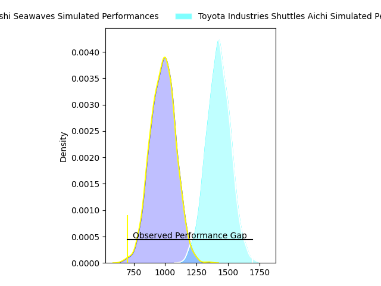
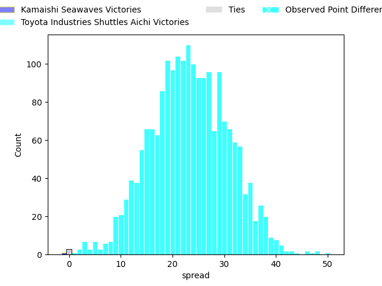
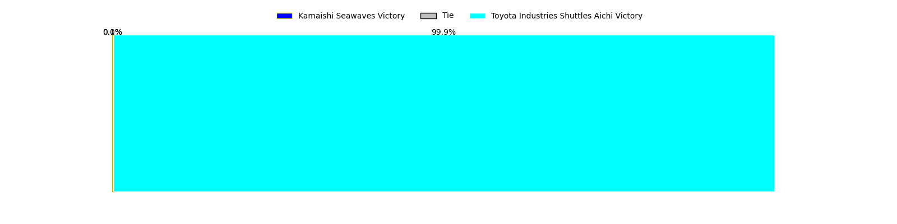
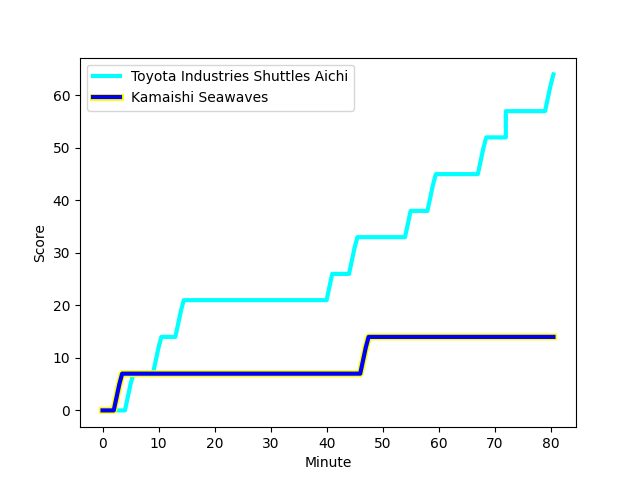
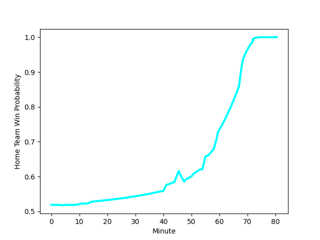

---  
layout: page  
title: Kamaishi Seawaves at Toyota Industries Shuttles Aichi; 14-64  
date: 2023-01-28 00:00:00 18:00:00 -0500  
categories: match review  
---
# Kamaishi Seawaves at Toyota Industries Shuttles Aichi; 14-64

# Club Level Predictions

The first set of predictions treats a club as the smallest object, as the club develops its members, organizes a gameplan, and deploys its players as needed for each match. This club model has a prediction of 0.934, which translates to predicting Toyota Industries Shuttles Aichi to win by 24.2.

Each club has a rating and a rating deviation (simiar to a Glicko system), and expected performances can be generated. This allows for simulated matches and spreads like the ones below.
## Projected Performances

## Projected Spreads

## Projected Results

# Player Level Predictions

Treating teams instead as an entity made up of the currently active players, I have ratings for each player in an altogether different system. These can be combined to form team ratings once teamsheets are announced, weighting starters a bit higher than the reserves. After the match is played, players can be weighted by their minutes on the field, allowing for an accurate measure of the team's composition. With these compiled team ratings, we can make predictions, measure inaccuracy, and update the individual player ratings.
## Prediction with Player Minutes: Toyota Industries Shuttles Aichi by 14.3

Toyota Industries Shuttles Aichi by 10.3 on a neutral field
## Scores over Time

## Win Probability over Time

## Prediction without Player Minutes: Toyota Industries Shuttles Aichi by 15.4

Toyota Industries Shuttles Aichi by 11.4 on a neutral pitch

|   Away Minutes | Away Player                                                        |   Away elo |   Away Percentile |   Number |   Home Percentile |   Home elo | Home Player                                                                 |   Home Minutes |
|---------------:|:-------------------------------------------------------------------|-----------:|------------------:|---------:|------------------:|-----------:|:----------------------------------------------------------------------------|---------------:|
|             54 | [Takuya Takahashi](..//playerfiles//TakuyaTakahashi_cleaned.md)    |      78.69 |                 9 |        1 |               nan |     104.82 | [Hyosuke Watanabe](..//playerfiles//HyosukeWatanabe_cleaned.md)             |             51 |
|             46 | [Daiki Ito](..//playerfiles//DaikiIto_cleaned.md)                  |      80.93 |                12 |        2 |                27 |      89.46 | [Hiroaki Ushihara](..//playerfiles//HiroakiUshihara_cleaned.md)             |             51 |
|             46 | [Shun Terawaki](..//playerfiles//ShunTerawaki_cleaned.md)          |      93.04 |               nan |        3 |                41 |      91.81 | [Harumoto Kodera](..//playerfiles//HarumotoKodera_cleaned.md)               |             51 |
|             40 | [Toshihiro Nishii](..//playerfiles//ToshihiroNishii_cleaned.md)    |     103.66 |                60 |        4 |                43 |      93    | [Taishi Nakamura](..//playerfiles//TaishiNakamura_cleaned.md)               |             80 |
|             80 | [Ben Nee Nee](..//playerfiles//BenNeeNee_cleaned.md)               |      73.76 |                 8 |        5 |                85 |     113.85 | [Ryuichiro Fukutsubo](..//playerfiles//RyuichiroFukutsubo_cleaned.md)       |             56 |
|             80 | [Naoki Ono](..//playerfiles//NaokiOno_cleaned.md)                  |     107.03 |                75 |        6 |                82 |     116.73 | [Shoichi Yura](..//playerfiles//ShoichiYura_cleaned.md)                     |             80 |
|             80 | [Ryota Kano](..//playerfiles//RyotaKano_cleaned.md)                |      84.37 |                19 |        7 |                49 |      95.77 | [Michi Kanado](..//playerfiles//MichiKanado_cleaned.md)                     |             80 |
|             48 | [Sam Henwood](..//playerfiles//SamHenwood_cleaned.md)              |     106.09 |                71 |        8 |                46 |      96.18 | [Taumua Lui Sanft Naeata](..//playerfiles//TaumuaLuiSanftNaeata_cleaned.md) |             69 |
|             59 | [Youhei Murakami](..//playerfiles//YouheiMurakami_cleaned.md)      |      80.33 |                13 |        9 |                76 |     106.17 | [Keita Fujiwara](..//playerfiles//KeitaFujiwara_cleaned.md)                 |             46 |
|             80 | [Ryoma Nakamura](..//playerfiles//RyomaNakamura_cleaned.md)        |      59.51 |                 1 |       10 |                58 |      99.75 | [Akihiro Shimizu](..//playerfiles//AkihiroShimizu_cleaned.md)               |             80 |
|             59 | [Kodai Ono](..//playerfiles//KodaiOno_cleaned.md)                  |      73.76 |                 7 |       11 |               nan |      95    | [Shunta Kawano](..//playerfiles//ShuntaKawano_cleaned.md)                   |             80 |
|             80 | [Joshua Stander](..//playerfiles//JoshuaStander_cleaned.md)        |     110.01 |                79 |       12 |                91 |     122.4  | [Josh Matavesi](..//playerfiles//JoshMatavesi_cleaned.md)                   |             59 |
|             80 | [Osuka Lloyd Murata](..//playerfiles//OsukaLloydMurata_cleaned.md) |      84.99 |                22 |       13 |                50 |      95.8  | [Hiroaki Saito](..//playerfiles//HiroakiSaito_cleaned.md)                   |             80 |
|             80 | [Ryuji Abe](..//playerfiles//RyujiAbe_cleaned.md)                  |     101.64 |                65 |       14 |                 1 |      56.08 | [Joe Kamana](..//playerfiles//JoeKamana_cleaned.md)                         |             68 |
|             75 | [Cam Bailey](..//playerfiles//CamBailey_cleaned.md)                |      80.34 |                14 |       15 |                23 |      83.79 | [Tim Swiel](..//playerfiles//TimSwiel_cleaned.md)                           |             80 |
|             40 | [Dallas Tatana](..//playerfiles//DallasTatana_cleaned.md)          |      94.17 |                41 |       16 |               nan |      95.54 | [Riku Morisaki](..//playerfiles//RikuMorisaki_cleaned.md)                   |             34 |
|             34 | [Kota Kumamoto](..//playerfiles//KotaKumamoto_cleaned.md)          |     100.2  |                67 |       17 |               nan |      95    | [Naoya Ishibashi](..//playerfiles//NaoyaIshibashi_cleaned.md)               |             29 |
|             34 | [Taiki Noguchi](..//playerfiles//TaikiNoguchi_cleaned.md)          |     103.6  |                73 |       18 |                 9 |      74.18 | [Hiroshi Murakawa](..//playerfiles//HiroshiMurakawa_cleaned.md)             |             29 |
|             32 | [Seta Koroitamana](..//playerfiles//SetaKoroitamana_cleaned.md)    |      92.09 |               nan |       19 |               nan |     104.77 | [Kosuke Oike](..//playerfiles//KosukeOike_cleaned.md)                       |             29 |
|             26 | [Shoichiro Inada](..//playerfiles//ShoichiroInada_cleaned.md)      |      96.09 |                50 |       20 |                40 |      91.09 | [Shoma Makinouchi](..//playerfiles//ShomaMakinouchi_cleaned.md)             |             24 |
|             21 | [Kohei Ishigaki](..//playerfiles//KoheiIshigaki_cleaned.md)        |     113.29 |                83 |       21 |               nan |      93.63 | [Keita Ichikawa](..//playerfiles//KeitaIchikawa_cleaned.md)                 |             21 |
|             21 | [Atsushi Minami](..//playerfiles//AtsushiMinami_cleaned.md)        |      85.67 |               nan |       22 |                 9 |      75.82 | [James Mollentze](..//playerfiles//JamesMollentze_cleaned.md)               |             12 |
|              5 | [Ryo Kataoka](..//playerfiles//RyoKataoka_cleaned.md)              |      95.82 |                49 |       23 |                72 |     105.06 | [Itaru Taniguchi](..//playerfiles//ItaruTaniguchi_cleaned.md)               |             11 |

