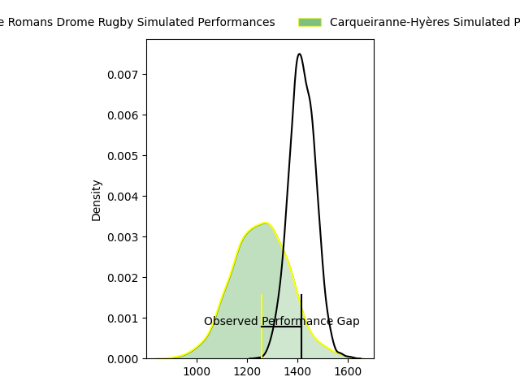
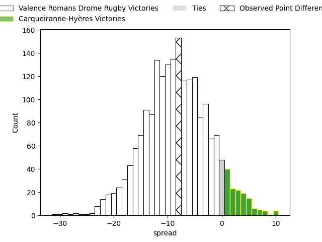
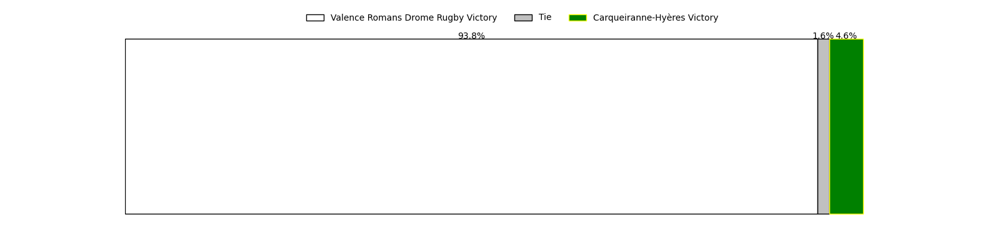
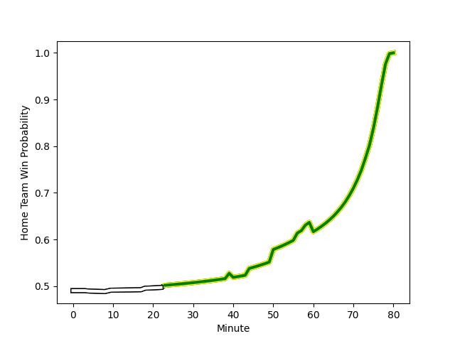

---  
layout: page  
title: Valence Romans Drome Rugby at Carqueiranne-Hyères; 19-11  
date: 2023-01-29 15:00:00 18:00:00 -0500  
categories: match review  
---
# Valence Romans Drome Rugby at Carqueiranne-Hyères; 19-11

# Club Level Predictions

The first set of predictions treats a club as the smallest object, as the club develops its members, organizes a gameplan, and deploys its players as needed for each match. This club model has a prediction of 0.276, which translates to predicting Valence Romans Drome Rugby to win by 8.5.

Each club has a rating and a rating deviation (simiar to a Glicko system), and expected performances can be generated. This allows for simulated matches and spreads like the ones below.
## Projected Performances

## Projected Spreads

## Projected Results

# Player Level Predictions

Treating teams instead as an entity made up of the currently active players, I have ratings for each player in an altogether different system. These can be combined to form team ratings once teamsheets are announced, weighting starters a bit higher than the reserves. After the match is played, players can be weighted by their minutes on the field, allowing for an accurate measure of the team's composition. With these compiled team ratings, we can make predictions, measure inaccuracy, and update the individual player ratings.
## Prediction with Player Minutes: Carqueiranne-Hyères by 4.3

Carqueiranne-Hyères by 0.3 on a neutral field
## Scores over Time

## Win Probability over Time

## Prediction without Player Minutes: Carqueiranne-Hyères by 7.6

Carqueiranne-Hyères by 3.6 on a neutral pitch

|   Away Minutes | Away Player                                                            |   Away elo |   Away Percentile |   Number |   Home Percentile |   Home elo | Home Player                                                           |   Home Minutes |
|---------------:|:-----------------------------------------------------------------------|-----------:|------------------:|---------:|------------------:|-----------:|:----------------------------------------------------------------------|---------------:|
|             50 | [Andrea Pontanier](..//playerfiles//AndreaPontanier_cleaned.md)        |      83.24 |                18 |        1 |                95 |     121.1  | [Sti Sithole](..//playerfiles//StiSithole_cleaned.md)                 |             58 |
|             50 | [Dorian Marco Pena](..//playerfiles//DorianMarcoPena_cleaned.md)       |      97.59 |                58 |        2 |                16 |      83.91 | [Yan Tabarot](..//playerfiles//YanTabarot_cleaned.md)                 |             58 |
|             60 | [John Henry Fincham](..//playerfiles//JohnHenryFincham_cleaned.md)     |      90.82 |                33 |        3 |                55 |      97.84 | [Lasha Mchelidze](..//playerfiles//LashaMchelidze_cleaned.md)         |             72 |
|             50 | [Charles Brayer](..//playerfiles//CharlesBrayer_cleaned.md)            |      63.62 |                 3 |        4 |                 2 |      61.65 | [Lucas Cazac](..//playerfiles//LucasCazac_cleaned.md)                 |             80 |
|             80 | [Florian Goumat](..//playerfiles//FlorianGoumat_cleaned.md)            |      77.54 |                11 |        5 |                 7 |      72.1  | [Cesar Damiani](..//playerfiles//CesarDamiani_cleaned.md)             |             71 |
|             80 | [Alexis Armary](..//playerfiles//AlexisArmary_cleaned.md)              |     111.1  |                81 |        6 |                39 |      91.89 | [Nicolas Baquer](..//playerfiles//NicolasBaquer_cleaned.md)           |             80 |
|             60 | [Matthew Gicquel](..//playerfiles//MatthewGicquel_cleaned.md)          |      78.64 |                10 |        7 |                76 |     107.63 | [Joachim Beaumont](..//playerfiles//JoachimBeaumont_cleaned.md)       |             80 |
|             80 | [Philippe Laville](..//playerfiles//PhilippeLaville_cleaned.md)        |      89.34 |                30 |        8 |                 1 |      62.7  | [Cristian Chirica](..//playerfiles//CristianChirica_cleaned.md)       |             69 |
|             80 | [Tim Menzel](..//playerfiles//TimMenzel_cleaned.md)                    |      76.91 |                 9 |        9 |                88 |     114.23 | [Thomas Sonetti](..//playerfiles//ThomasSonetti_cleaned.md)           |             56 |
|             40 | [Lucas Meret](..//playerfiles//LucasMeret_cleaned.md)                  |      77.44 |                 8 |       10 |                47 |      96.19 | [Ionel Melinte](..//playerfiles//IonelMelinte_cleaned.md)             |             80 |
|             65 | [Mason Emerson](..//playerfiles//MasonEmerson_cleaned.md)              |      94.25 |                44 |       11 |                40 |      92.75 | [Vincent Alessi](..//playerfiles//VincentAlessi_cleaned.md)           |             65 |
|             80 | [Ben Neiceru](..//playerfiles//BenNeiceru_cleaned.md)                  |     100.02 |                60 |       12 |                93 |     124.07 | [Romain Leveque](..//playerfiles//RomainLeveque_cleaned.md)           |             80 |
|             60 | [Jonathan Quinnez](..//playerfiles//JonathanQuinnez_cleaned.md)        |     118.91 |                89 |       13 |                88 |     118.24 | [Charles Brousse](..//playerfiles//CharlesBrousse_cleaned.md)         |             80 |
|             80 | [Adam Vargas](..//playerfiles//AdamVargas_cleaned.md)                  |     101.22 |                64 |       14 |                12 |      78.65 | [David Raikuna](..//playerfiles//DavidRaikuna_cleaned.md)             |             74 |
|             80 | [Quentin Gobet](..//playerfiles//QuentinGobet_cleaned.md)              |     112.38 |                80 |       15 |                67 |     102.54 | [Josselyn Bouchon](..//playerfiles//JosselynBouchon_cleaned.md)       |             80 |
|             30 | [Sami Zouhair](..//playerfiles//SamiZouhair_cleaned.md)                |     123.56 |                96 |       16 |                23 |      87.11 | [Eli Serra-Miglietti](..//playerfiles//EliSerra-Miglietti_cleaned.md) |             22 |
|             30 | [Enzo Bailly](..//playerfiles//EnzoBailly_cleaned.md)                  |      97.47 |               nan |       17 |                11 |      79.92 | [Michael Tyumenev](..//playerfiles//MichaelTyumenev_cleaned.md)       |             22 |
|             20 | [Vincent Pelo](..//playerfiles//VincentPelo_cleaned.md)                |      89.93 |                31 |       18 |                53 |      97.09 | [Costel Burtila](..//playerfiles//CostelBurtila_cleaned.md)           |              8 |
|             30 | [Francois Uys](..//playerfiles//FrancoisUys_cleaned.md)                |     102.89 |                68 |       19 |                62 |      99.85 | [Nathan Gendre](..//playerfiles//NathanGendre_cleaned.md)             |              9 |
|             20 | [Charles Bouldoire](..//playerfiles//CharlesBouldoire_cleaned.md)      |     106.18 |                74 |       20 |                66 |     103.97 | [Julien Ormea](..//playerfiles//JulienOrmea_cleaned.md)               |             11 |
|             40 | [Joris Moura](..//playerfiles//JorisMoura_cleaned.md)                  |     106.72 |                71 |       21 |                16 |      82.58 | [Rémi Dubié](..//playerfiles//RémiDubié_cleaned.md)                   |             24 |
|             15 | [Sven Bernat Girlando](..//playerfiles//SvenBernatGirlando_cleaned.md) |      99.49 |                59 |       22 |                55 |      98.17 | [Dylan Sage](..//playerfiles//DylanSage_cleaned.md)                   |             15 |
|             20 | [Léopold Dupas](..//playerfiles//LéopoldDupas_cleaned.md)              |      75.54 |                 8 |       23 |                77 |     109.27 | [Lachie Munro](..//playerfiles//LachieMunro_cleaned.md)               |              6 |

