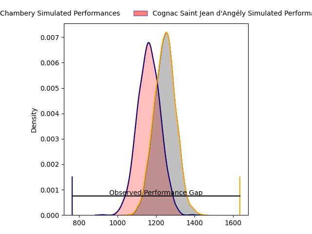
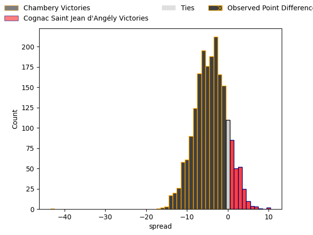
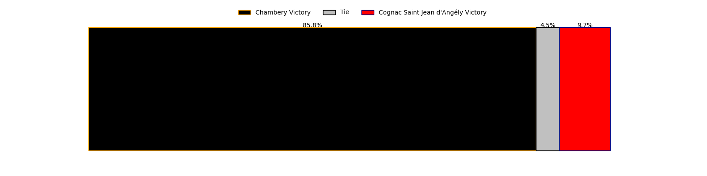
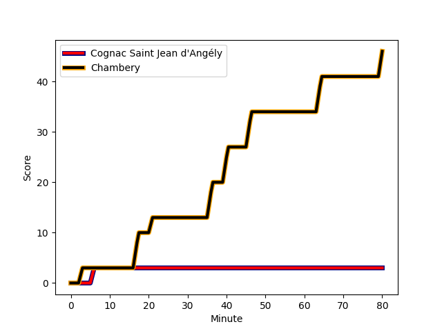
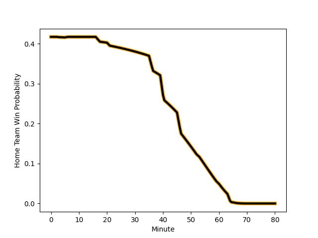

---  
layout: page  
title: Chambery at Cognac Saint Jean d'Angély; 46-3  
date: 2023-01-29 15:00:00 18:00:00 -0500  
categories: match review  
---
# Chambery at Cognac Saint Jean d'Angély; 46-3

# Club Level Predictions

The first set of predictions treats a club as the smallest object, as the club develops its members, organizes a gameplan, and deploys its players as needed for each match. This club model has a prediction of 0.369, which translates to predicting Chambery to win by 4.8.

Each club has a rating and a rating deviation (simiar to a Glicko system), and expected performances can be generated. This allows for simulated matches and spreads like the ones below.
## Projected Performances

## Projected Spreads

## Projected Results

# Player Level Predictions

Treating teams instead as an entity made up of the currently active players, I have ratings for each player in an altogether different system. These can be combined to form team ratings once teamsheets are announced, weighting starters a bit higher than the reserves. After the match is played, players can be weighted by their minutes on the field, allowing for an accurate measure of the team's composition. With these compiled team ratings, we can make predictions, measure inaccuracy, and update the individual player ratings.
## Prediction with Player Minutes: Chambery by 10.5

Chambery by 14.5 on a neutral field
## Scores over Time

## Win Probability over Time

There were 3 large changes in win probability in this match
## Prediction without Player Minutes: Chambery by 9.9

Chambery by 13.9 on a neutral pitch

|   Away Minutes | Away Player                                                                 |   Away elo |   Away Percentile |   Number |   Home Percentile |   Home elo | Home Player                                                             |   Home Minutes |
|---------------:|:----------------------------------------------------------------------------|-----------:|------------------:|---------:|------------------:|-----------:|:------------------------------------------------------------------------|---------------:|
|             65 | [Fabio Gonzalez](..//playerfiles//FabioGonzalez_cleaned.md)                 |      90.1  |                34 |        1 |                27 |      88.78 | [Kevin Tougne](..//playerfiles//KevinTougne_cleaned.md)                 |             70 |
|             60 | [Julien Primault](..//playerfiles//JulienPrimault_cleaned.md)               |      95.3  |                43 |        2 |                17 |      84.26 | [Maxime Gau](..//playerfiles//MaximeGau_cleaned.md)                     |             65 |
|             65 | [Giorgi Pertaia](..//playerfiles//GiorgiPertaia_cleaned.md)                 |      93.61 |                36 |        3 |                58 |      99.12 | [Giorgi Sharashidze](..//playerfiles//GiorgiSharashidze_cleaned.md)     |             65 |
|             80 | [Fabien Witz](..//playerfiles//FabienWitz_cleaned.md)                       |      85.9  |                24 |        4 |                22 |      84.72 | [Daniel Faleafa](..//playerfiles//DanielFaleafa_cleaned.md)             |             70 |
|             80 | [Romain Guyot](..//playerfiles//RomainGuyot_cleaned.md)                     |      68.82 |                 5 |        5 |                 2 |      62.35 | [Clément Praud](..//playerfiles//ClémentPraud_cleaned.md)               |             60 |
|             80 | [Martin Bertrand](..//playerfiles//MartinBertrand_cleaned.md)               |      78.4  |                12 |        6 |                 5 |      71.88 | [Matthieu Thomas](..//playerfiles//MatthieuThomas_cleaned.md)           |             60 |
|             68 | [Matheo Triki](..//playerfiles//MatheoTriki_cleaned.md)                     |     102.46 |                67 |        7 |                 1 |      61.45 | [Lucas Gulizzi](..//playerfiles//LucasGulizzi_cleaned.md)               |             80 |
|             70 | [Colin Lebian](..//playerfiles//ColinLebian_cleaned.md)                     |      89.3  |                31 |        8 |                 9 |      76.15 | [Thomas Toevalu](..//playerfiles//ThomasToevalu_cleaned.md)             |             80 |
|             65 | [Thibault Dufau](..//playerfiles//ThibaultDufau_cleaned.md)                 |     111.76 |                85 |        9 |                 7 |      74.77 | [Mathis Garnier](..//playerfiles//MathisGarnier_cleaned.md)             |             53 |
|             70 | [Thibault Moreno](..//playerfiles//ThibaultMoreno_cleaned.md)               |      89.22 |                27 |       10 |                 6 |      74.57 | [Serafin Bordoli](..//playerfiles//SerafinBordoli_cleaned.md)           |             80 |
|             80 | [Theo Velten](..//playerfiles//TheoVelten_cleaned.md)                       |      98.89 |                55 |       11 |                 3 |      62.46 | [Jone Tuva](..//playerfiles//JoneTuva_cleaned.md)                       |             80 |
|             80 | [Mattéo Faucher](..//playerfiles//MattéoFaucher_cleaned.md)                 |      88.93 |                31 |       12 |                62 |     100.86 | [Henry Tuilagi](..//playerfiles//HenryTuilagi_cleaned.md)               |             80 |
|             80 | [Victor Pisano](..//playerfiles//VictorPisano_cleaned.md)                   |      86.42 |                27 |       13 |                34 |      89.85 | [Eneri Lotawa](..//playerfiles//EneriLotawa_cleaned.md)                 |             40 |
|             64 | [Vereniki Goneva](..//playerfiles//VerenikiGoneva_cleaned.md)               |      50.93 |                 0 |       14 |                13 |      79.72 | [Vincent Pageneau](..//playerfiles//VincentPageneau_cleaned.md)         |             80 |
|             80 | [Thomas Hecquet](..//playerfiles//ThomasHecquet_cleaned.md)                 |      95.03 |                51 |       15 |                25 |      85.38 | [Dany Antunes](..//playerfiles//DanyAntunes_cleaned.md)                 |             80 |
|             15 | [Florent Lorenzon](..//playerfiles//FlorentLorenzon_cleaned.md)             |      79.42 |                10 |       16 |                18 |      86.11 | [Alico Kaikatsishvili](..//playerfiles//AlicoKaikatsishvili_cleaned.md) |             10 |
|             20 | [Luka Begic](..//playerfiles//LukaBegic_cleaned.md)                         |      87.27 |                23 |       17 |               nan |      90.11 | [Bryan Bruno](..//playerfiles//BryanBruno_cleaned.md)                   |             15 |
|             15 | [Lautaro Caro Saisi](..//playerfiles//LautaroCaroSaisi_cleaned.md)          |     105.05 |                76 |       18 |                39 |      93.03 | [Martin Augeix](..//playerfiles//MartinAugeix_cleaned.md)               |             15 |
|             10 | [Revan Gautier](..//playerfiles//RevanGautier_cleaned.md)                   |      93.52 |                44 |       19 |               nan |      95.49 | [Damien Bonnet](..//playerfiles//DamienBonnet_cleaned.md)               |             10 |
|             12 | [Gauthier Brute de Remur](..//playerfiles//GauthierBrutedeRemur_cleaned.md) |      92.63 |                42 |       20 |                 1 |      53.93 | [Utu Maninoa](..//playerfiles//UtuManinoa_cleaned.md)                   |             20 |
|             15 | [Dylan Nocete](..//playerfiles//DylanNocete_cleaned.md)                     |      85.9  |                26 |       21 |                21 |      86.61 | [Filipe Manu](..//playerfiles//FilipeManu_cleaned.md)                   |             20 |
|             10 | [Arthur Nennig](..//playerfiles//ArthurNennig_cleaned.md)                   |     104.19 |                71 |       22 |                16 |      85.66 | [Mathieu Billou](..//playerfiles//MathieuBillou_cleaned.md)             |             27 |
|             16 | [Mosese Mawalu](..//playerfiles//MoseseMawalu_cleaned.md)                   |     112.25 |                82 |       23 |                 2 |      58.39 | [Nils Guyon](..//playerfiles//NilsGuyon_cleaned.md)                     |             40 |

