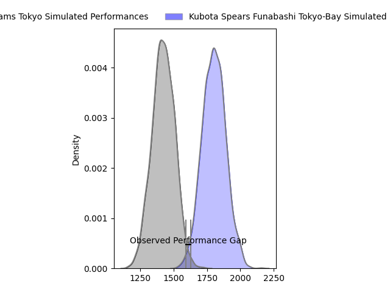
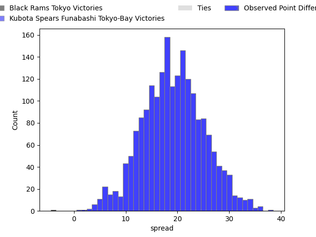
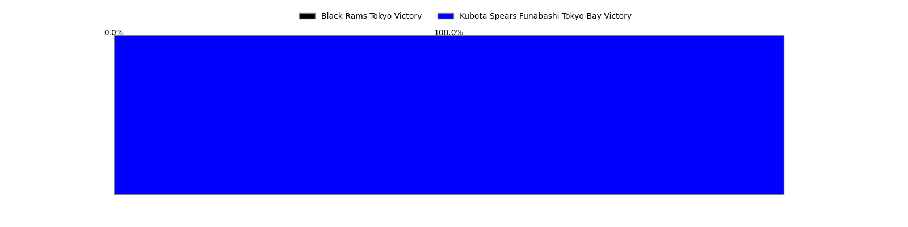
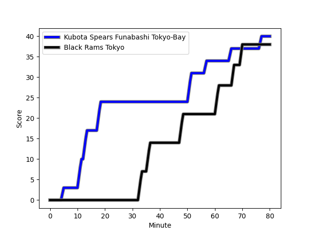
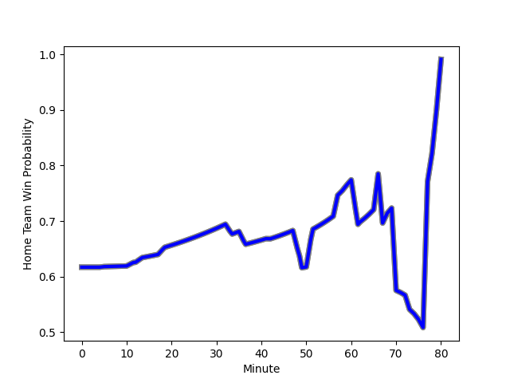

---  
layout: page  
title: Black Rams Tokyo at Kubota Spears Funabashi Tokyo-Bay; 38-40  
date: 2023-01-29 06:30:00 18:00:00 -0500  
categories: match review  
---
# Black Rams Tokyo at Kubota Spears Funabashi Tokyo-Bay; 38-40

# Club Level Predictions

The first set of predictions treats a club as the smallest object, as the club develops its members, organizes a gameplan, and deploys its players as needed for each match. This club model has a prediction of 0.893, which translates to predicting Kubota Spears Funabashi Tokyo-Bay to win by 19.1.

Each club has a rating and a rating deviation (simiar to a Glicko system), and expected performances can be generated. This allows for simulated matches and spreads like the ones below.
## Projected Performances

## Projected Spreads

## Projected Results

# Player Level Predictions

Treating teams instead as an entity made up of the currently active players, I have ratings for each player in an altogether different system. These can be combined to form team ratings once teamsheets are announced, weighting starters a bit higher than the reserves. After the match is played, players can be weighted by their minutes on the field, allowing for an accurate measure of the team's composition. With these compiled team ratings, we can make predictions, measure inaccuracy, and update the individual player ratings.
## Prediction with Player Minutes: Kubota Spears Funabashi Tokyo-Bay by 24.7

Kubota Spears Funabashi Tokyo-Bay by 20.7 on a neutral field
## Scores over Time

## Win Probability over Time

## Prediction without Player Minutes: Kubota Spears Funabashi Tokyo-Bay by 19.3

Kubota Spears Funabashi Tokyo-Bay by 15.3 on a neutral pitch

|   Away Minutes | Away Player                                                         |   Away elo |   Away Percentile |   Number |   Home Percentile |   Home elo | Home Player                                                               |   Home Minutes |
|---------------:|:--------------------------------------------------------------------|-----------:|------------------:|---------:|------------------:|-----------:|:--------------------------------------------------------------------------|---------------:|
|             59 | [Yuichiro Taniguchi](..//playerfiles//YuichiroTaniguchi_cleaned.md) |     104.56 |                77 |        1 |                68 |     101.06 | [Kota Kaishi](..//playerfiles//KotaKaishi_cleaned.md)                     |             68 |
|             51 | [Kazuhiro Koike](..//playerfiles//KazuhiroKoike_cleaned.md)         |      92.23 |               nan |        2 |                95 |     123.49 | [Malcolm Marx](..//playerfiles//MalcolmMarx_cleaned.md)                   |             80 |
|             62 | [Daigo Sasagawa](..//playerfiles//DaigoSasagawa_cleaned.md)         |      95.32 |                49 |        3 |                93 |     115.84 | [Opeti Helu](..//playerfiles//OpetiHelu_cleaned.md)                       |             80 |
|             59 | [Josh Goodhue](..//playerfiles//JoshGoodhue_cleaned.md)             |      91.95 |                38 |        4 |               nan |      95    | [Naoaki Horibe](..//playerfiles//NaoakiHoribe_cleaned.md)                 |             80 |
|             70 | [Pohiva Lotoahea](..//playerfiles//PohivaLotoahea_cleaned.md)       |     114.09 |                85 |        5 |                18 |      83.14 | [Yuki Aoki](..//playerfiles//YukiAoki_cleaned.md)                         |             80 |
|             80 | [Daiki Yanagawa](..//playerfiles//DaikiYanagawa_cleaned.md)         |      57.52 |                 1 |        6 |                97 |     132.14 | [Finau Tupa](..//playerfiles//FinauTupa_cleaned.md)                       |             73 |
|             80 | [Shuhei Matsuhashi](..//playerfiles//ShuheiMatsuhashi_cleaned.md)   |      93.31 |                43 |        7 |                75 |     106.14 | [Lappies Labuschagne](..//playerfiles//LappiesLabuschagne_cleaned.md)     |             80 |
|             80 | [Talau Fakatava](..//playerfiles//TalauFakatava_cleaned.md)         |      90.16 |                34 |        8 |                78 |     107.75 | [Takeo Suenaga](..//playerfiles//TakeoSuenaga_cleaned.md)                 |             80 |
|             68 | [Toshiya Takahashi](..//playerfiles//ToshiyaTakahashi_cleaned.md)   |      90.68 |                33 |        9 |                60 |     100.13 | [Shinobu Fujiwara](..//playerfiles//ShinobuFujiwara_cleaned.md)           |             68 |
|             80 | [Isaac Lucas](..//playerfiles//IsaacLucas_cleaned.md)               |      92.19 |                31 |       10 |                99 |     147.65 | [Bernard Foley](..//playerfiles//BernardFoley_cleaned.md)                 |             80 |
|             80 | [Netani Vakayalia](..//playerfiles//NetaniVakayalia_cleaned.md)     |      94.97 |                46 |       11 |                96 |     131.05 | [Gerhard van den Heever](..//playerfiles//GerhardvandenHeever_cleaned.md) |             80 |
|             80 | [Hadleigh Parkes](..//playerfiles//HadleighParkes_cleaned.md)       |     105.24 |                71 |       12 |                88 |     116.92 | [Harumichi Tatekawa](..//playerfiles//HarumichiTatekawa_cleaned.md)       |             49 |
|             80 | [Yuki Ikeda](..//playerfiles//YukiIkeda_cleaned.md)                 |     103.44 |                59 |       13 |                72 |     105.33 | [Ryan Crotty](..//playerfiles//RyanCrotty_cleaned.md)                     |             42 |
|             68 | [Main Taira](..//playerfiles//MainTaira_cleaned.md)                 |      85.08 |                19 |       14 |                55 |      97.73 | [Koga Nezuka](..//playerfiles//KogaNezuka_cleaned.md)                     |             80 |
|             80 | [Matt McGahan](..//playerfiles//MattMcGahan_cleaned.md)             |     118.45 |                86 |       15 |                29 |      87.12 | [Yuhei Shimada](..//playerfiles//YuheiShimada_cleaned.md)                 |             80 |
|             29 | [Masaaki Onishi](..//playerfiles//MasaakiOnishi_cleaned.md)         |      80.95 |                13 |       16 |                60 |      99.77 | [Sione Teaupa](..//playerfiles//SioneTeaupa_cleaned.md)                   |             38 |
|             21 | [Takeo Makabe](..//playerfiles//TakeoMakabe_cleaned.md)             |      77.75 |               nan |       17 |               nan |      74.91 | [Rikus Pretorius](..//playerfiles//RikusPretorius_cleaned.md)             |             31 |
|             21 | [Nathan Hughes](..//playerfiles//NathanHughes_cleaned.md)           |     115.18 |                86 |       18 |               nan |      97.56 | [Kenshi Yamamoto](..//playerfiles//KenshiYamamoto_cleaned.md)             |             12 |
|             18 | [Taichi Chiba](..//playerfiles//TaichiChiba_cleaned.md)             |      92.64 |                37 |       19 |                94 |     119.83 | [Kazuhiro Taniguchi](..//playerfiles//KazuhiroTaniguchi_cleaned.md)       |             12 |
|             12 | [Takanobu Minami](..//playerfiles//TakanobuMinami_cleaned.md)       |      92.1  |                42 |       20 |               nan |      95    | [Masaya Tamaki](..//playerfiles//MasayaTamaki_cleaned.md)                 |              7 |
|             12 | [Yuta Kurihara](..//playerfiles//YutaKurihara_cleaned.md)           |      80.03 |                12 |       21 |               nan |     nan    | nan                                                                       |            nan |
|             10 | [Brodi McCurran](..//playerfiles//BrodiMcCurran_cleaned.md)         |     120.49 |                91 |       22 |               nan |     nan    | nan                                                                       |            nan |

