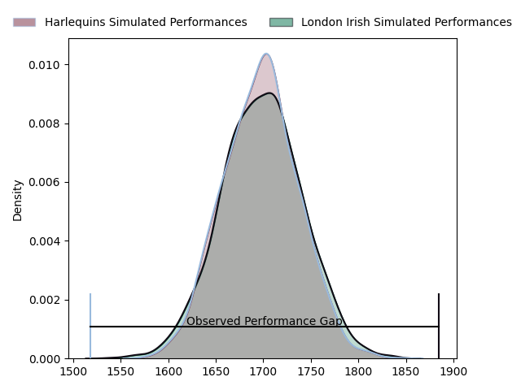
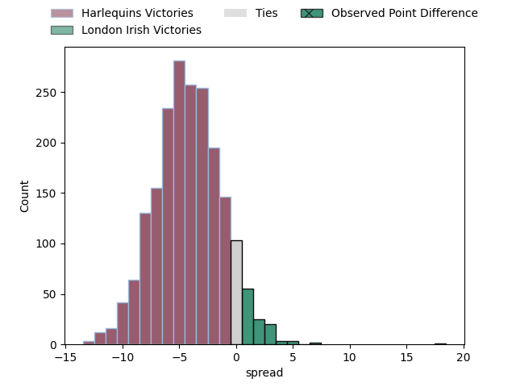
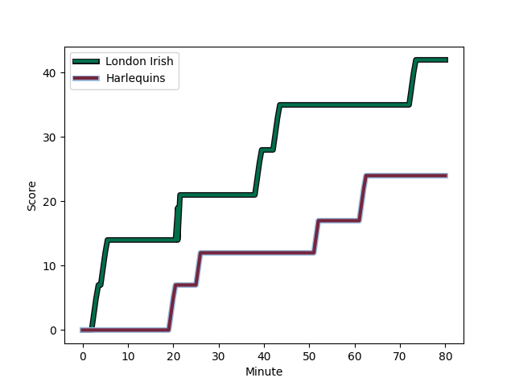
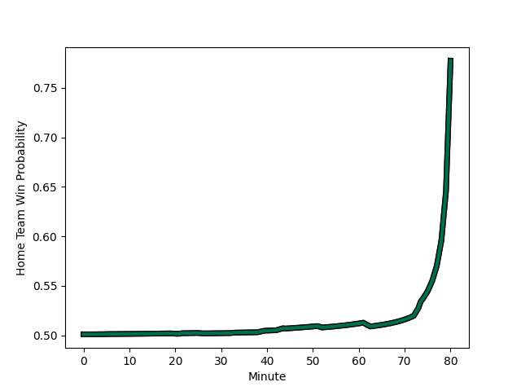

---  
layout: page  
title: Harlequins at London Irish; 24-42  
date: 2023-01-29 16:00:00 18:00:00 -0500  
categories: match review  
---
# Harlequins at London Irish; 24-42

# Club Level Predictions

The first set of predictions treats a club as the smallest object, as the club develops its members, organizes a gameplan, and deploys its players as needed for each match. This club model has a prediction of 0.502, which translates to predicting London Irish to win by 0.1.

Each club has a rating and a rating deviation (simiar to a Glicko system), and expected performances can be generated. This allows for simulated matches and spreads like the ones below.
## Projected Performances

## Projected Spreads

## Projected Results

# Player Level Predictions

Treating teams instead as an entity made up of the currently active players, I have ratings for each player in an altogether different system. These can be combined to form team ratings once teamsheets are announced, weighting starters a bit higher than the reserves. After the match is played, players can be weighted by their minutes on the field, allowing for an accurate measure of the team's composition. With these compiled team ratings, we can make predictions, measure inaccuracy, and update the individual player ratings.
## Prediction with Player Minutes: London Irish by 4.0

London Irish by 0.0 on a neutral field
## Scores over Time

## Win Probability over Time

## Prediction without Player Minutes: London Irish by 11.5

London Irish by 7.5 on a neutral pitch

|   Away Minutes | Away Player                                                       |   Away elo |   Away Percentile |   Number |   Home Percentile |   Home elo | Home Player                                                                       |   Home Minutes |
|---------------:|:------------------------------------------------------------------|-----------:|------------------:|---------:|------------------:|-----------:|:----------------------------------------------------------------------------------|---------------:|
|             80 | [Joe Marler](..//playerfiles//JoeMarler_cleaned.md)               |      93.92 |                43 |        1 |                80 |     106.98 | [Will Goodrick-Clarke](..//playerfiles//WillGoodrick-Clarke_cleaned.md)           |             33 |
|             44 | [George Head](..//playerfiles//GeorgeHead_cleaned.md)             |      89.49 |                29 |        2 |                88 |     113.16 | [Agustin Creevy](..//playerfiles//AgustinCreevy_cleaned.md)                       |             44 |
|             52 | [Wilco Louw](..//playerfiles//WilcoLouw_cleaned.md)               |     117.93 |                93 |        3 |                85 |     110.22 | [Oli Hoskins](..//playerfiles//OliHoskins_cleaned.md)                             |             63 |
|             80 | [Dino Lamb](..//playerfiles//DinoLamb_cleaned.md)                 |     123.64 |                92 |        4 |                97 |     133.74 | [Rob Simmons](..//playerfiles//RobSimmons_cleaned.md)                             |             80 |
|             80 | [Irne Herbst](..//playerfiles//IrneHerbst_cleaned.md)             |     116.32 |                87 |        5 |                98 |     136.3  | [Adam Coleman](..//playerfiles//AdamColeman_cleaned.md)                           |             24 |
|             80 | [Stephan Lewies](..//playerfiles//StephanLewies_cleaned.md)       |     127.02 |                94 |        6 |                75 |     109.01 | [Matt Rogerson](..//playerfiles//MattRogerson_cleaned.md)                         |             80 |
|             80 | [Will Evans](..//playerfiles//WillEvans_cleaned.md)               |      97.2  |                52 |        7 |                93 |     125.36 | [Tom Pearson](..//playerfiles//TomPearson_cleaned.md)                             |             80 |
|             56 | [Tom Lawday](..//playerfiles//TomLawday_cleaned.md)               |      83.84 |                14 |        8 |                51 |      98.14 | [Chandler Cunningham-South](..//playerfiles//ChandlerCunningham-South_cleaned.md) |             50 |
|             73 | [Danny Care](..//playerfiles//DannyCare_cleaned.md)               |     109.99 |                81 |        9 |                90 |     116.02 | [Ben White](..//playerfiles//BenWhite_cleaned.md)                                 |             64 |
|             80 | [Tommaso Allan](..//playerfiles//TommasoAllan_cleaned.md)         |      96.62 |                48 |       10 |                95 |     131.3  | [Paddy Jackson](..//playerfiles//PaddyJackson_cleaned.md)                         |             80 |
|             80 | [Josh Bassett](..//playerfiles//JoshBassett_cleaned.md)           |     101.17 |                64 |       11 |                58 |      98.72 | [Michael Dykes](..//playerfiles//MichaelDykes_cleaned.md)                         |             80 |
|             80 | [Andre Esterhuizen](..//playerfiles//AndreEsterhuizen_cleaned.md) |     113.85 |                84 |       12 |                65 |     102.11 | [Rory Jennings](..//playerfiles//RoryJennings_cleaned.md)                         |             80 |
|             73 | [Oscar Beard](..//playerfiles//OscarBeard_cleaned.md)             |     117.77 |                86 |       13 |                63 |     101.03 | [Benhard Janse van Rensburg](..//playerfiles//BenhardJansevanRensburg_cleaned.md) |             73 |
|             80 | [Nick David](..//playerfiles//NickDavid_cleaned.md)               |      99.85 |                56 |       14 |                32 |      89.2  | [Lucio Cinti](..//playerfiles//LucioCinti_cleaned.md)                             |             80 |
|             28 | [Aaron Morris](..//playerfiles//AaronMorris_cleaned.md)           |     144.96 |                99 |       15 |                62 |     103.96 | [James Stokes](..//playerfiles//JamesStokes_cleaned.md)                           |             50 |
|             36 | [Jack Musk](..//playerfiles//JackMusk_cleaned.md)                 |     108.97 |                84 |       16 |                36 |      91.97 | [Danilo Fischetti](..//playerfiles//DaniloFischetti_cleaned.md)                   |             47 |
|             28 | [Simon Kerrod](..//playerfiles//SimonKerrod_cleaned.md)           |      98.96 |                52 |       17 |                 7 |      78.08 | [Mike Willemse](..//playerfiles//MikeWillemse_cleaned.md)                         |             36 |
|             24 | [James Chisholm](..//playerfiles//JamesChisholm_cleaned.md)       |     122.53 |                95 |       18 |               nan |     107.38 | [Ciaran Parker](..//playerfiles//CiaranParker_cleaned.md)                         |             17 |
|              7 | [Scott Steele](..//playerfiles//ScottSteele_cleaned.md)           |      62.81 |                 0 |       19 |                16 |      81.8  | [Api Ratuniyarawa](..//playerfiles//ApiRatuniyarawa_cleaned.md)                   |             56 |
|              7 | [Lennox Anyanwu](..//playerfiles//LennoxAnyanwu_cleaned.md)       |      98.1  |                55 |       20 |                47 |      94.83 | [Juan Martin Gonzalez](..//playerfiles//JuanMartinGonzalez_cleaned.md)            |             30 |
|             52 | [Luke Wallace](..//playerfiles//LukeWallace_cleaned.md)           |      82.5  |                14 |       21 |                18 |      83.61 | [Joe Powell](..//playerfiles//JoePowell_cleaned.md)                               |             16 |
|            nan | nan                                                               |     nan    |               nan |       22 |                72 |     105.44 | [Luca Morisi](..//playerfiles//LucaMorisi_cleaned.md)                             |              7 |
|            nan | nan                                                               |     nan    |               nan |       23 |                45 |      94.74 | [Henry Arundell](..//playerfiles//HenryArundell_cleaned.md)                       |             30 |

