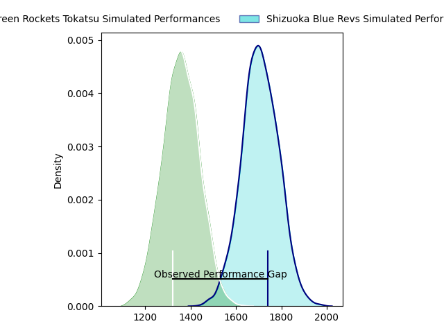
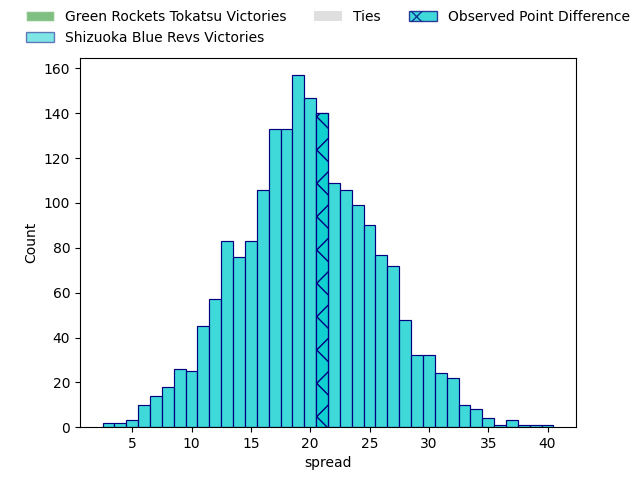
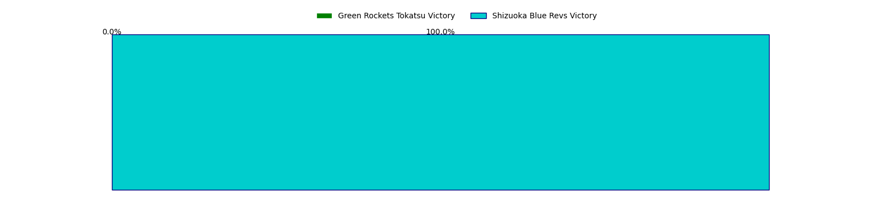
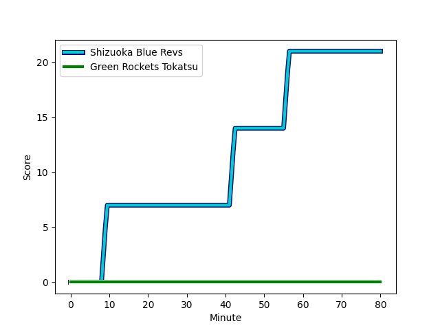
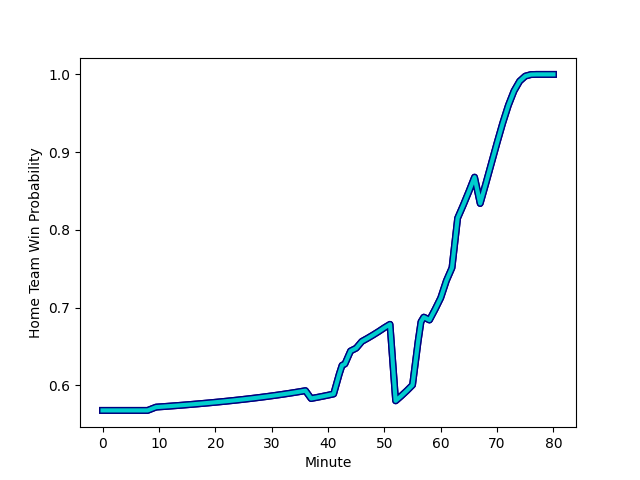

---  
layout: page  
title: Green Rockets Tokatsu at Shizuoka Blue Revs; 0-21  
date: 2023-01-29 06:00:00 18:00:00 -0500  
categories: match review  
---
# Green Rockets Tokatsu at Shizuoka Blue Revs; 0-21

# Club Level Predictions

The first set of predictions treats a club as the smallest object, as the club develops its members, organizes a gameplan, and deploys its players as needed for each match. This club model has a prediction of 0.915, which translates to predicting Shizuoka Blue Revs to win by 21.5.

Each club has a rating and a rating deviation (simiar to a Glicko system), and expected performances can be generated. This allows for simulated matches and spreads like the ones below.
## Projected Performances

## Projected Spreads

## Projected Results

# Player Level Predictions

Treating teams instead as an entity made up of the currently active players, I have ratings for each player in an altogether different system. These can be combined to form team ratings once teamsheets are announced, weighting starters a bit higher than the reserves. After the match is played, players can be weighted by their minutes on the field, allowing for an accurate measure of the team's composition. With these compiled team ratings, we can make predictions, measure inaccuracy, and update the individual player ratings.
## Prediction with Player Minutes: Shizuoka Blue Revs by 14.9

Shizuoka Blue Revs by 10.9 on a neutral field
## Scores over Time

## Win Probability over Time

## Prediction without Player Minutes: Shizuoka Blue Revs by 12.5

Shizuoka Blue Revs by 8.5 on a neutral pitch

|   Away Minutes | Away Player                                                 |   Away elo |   Away Percentile |   Number |   Home Percentile |   Home elo | Home Player                                                         |   Home Minutes |
|---------------:|:------------------------------------------------------------|-----------:|------------------:|---------:|------------------:|-----------:|:--------------------------------------------------------------------|---------------:|
|             51 | [Gakuto Ishida](..//playerfiles//GakutoIshida_cleaned.md)   |     104.98 |                78 |        1 |                59 |      98.28 | [Kazuhiro Kawata](..//playerfiles//KazuhiroKawata_cleaned.md)       |             61 |
|             51 | [Myuu Arai](..//playerfiles//MyuuArai_cleaned.md)           |     101.47 |                68 |        2 |                62 |      99.45 | [Takeshi Hino](..//playerfiles//TakeshiHino_cleaned.md)             |             67 |
|             37 | [Takahiro Doi](..//playerfiles//TakahiroDoi_cleaned.md)     |      68.99 |                 3 |        3 |                61 |      98.85 | [Heiichiro Ito](..//playerfiles//HeiichiroIto_cleaned.md)           |             61 |
|             80 | [Daiki Yamagiwa](..//playerfiles//DaikiYamagiwa_cleaned.md) |      87.27 |                26 |        4 |                81 |     110.68 | [Yuya Odo](..//playerfiles//YuyaOdo_cleaned.md)                     |             80 |
|             63 | [Jake Ball](..//playerfiles//JakeBall_cleaned.md)           |     111.12 |                82 |        5 |                78 |     107.83 | [Eishin Kuwano](..//playerfiles//EishinKuwano_cleaned.md)           |             52 |
|             80 | [Whetu Douglas](..//playerfiles//WhetuDouglas_cleaned.md)   |      93.38 |                43 |        6 |                39 |      92.18 | [Riki Sugihara](..//playerfiles//RikiSugihara_cleaned.md)           |             80 |
|             63 | [Ryoi Kamei](..//playerfiles//RyoiKamei_cleaned.md)         |      81.99 |                15 |        7 |                34 |      90.37 | [Richard Goh Jones](..//playerfiles//RichardGohJones_cleaned.md)    |             58 |
|             80 | [Aseri Masivou](..//playerfiles//AseriMasivou_cleaned.md)   |     102.15 |                63 |        8 |                93 |     125.51 | [Kwagga Smith](..//playerfiles//KwaggaSmith_cleaned.md)             |             80 |
|             51 | [Nick Phipps](..//playerfiles//NickPhipps_cleaned.md)       |     111.31 |                84 |        9 |                94 |     122.03 | [Bryn Hall](..//playerfiles//BrynHall_cleaned.md)                   |             58 |
|             80 | [Doga Maeda](..//playerfiles//DogaMaeda_cleaned.md)         |      95    |               nan |       10 |                 3 |      69.95 | [Sho Kiyohara](..//playerfiles//ShoKiyohara_cleaned.md)             |             80 |
|             80 | [Lomano Lemeki](..//playerfiles//LomanoLemeki_cleaned.md)   |     106.63 |                70 |       11 |                80 |     109.51 | [Malo Tuitama](..//playerfiles//MaloTuitama_cleaned.md)             |             80 |
|             46 | [Christian Laui](..//playerfiles//ChristianLaui_cleaned.md) |      94.61 |                47 |       12 |                35 |      90.08 | [Viliami Tahitu'a](..//playerfiles//ViliamiTahitu'a_cleaned.md)     |             80 |
|             80 | [Koichi Matsura](..//playerfiles//KoichiMatsura_cleaned.md) |      74.75 |                 7 |       13 |                86 |     114.91 | [Hiroto Kobayashi](..//playerfiles//HirotoKobayashi_cleaned.md)     |             80 |
|             44 | [Teruya Goto](..//playerfiles//TeruyaGoto_cleaned.md)       |      92.9  |                41 |       14 |                50 |      97.23 | [Kakeru Okumura](..//playerfiles//KakeruOkumura_cleaned.md)         |             74 |
|             80 | [Tom Marshall](..//playerfiles//TomMarshall_cleaned.md)     |      84.04 |               nan |       15 |                62 |     102.33 | [Futo Yamaguchi](..//playerfiles//FutoYamaguchi_cleaned.md)         |             80 |
|             43 | [Keisuke Kikuta](..//playerfiles//KeisukeKikuta_cleaned.md) |      96.71 |                64 |       16 |                12 |      77.3  | [Samuela Anise](..//playerfiles//SamuelaAnise_cleaned.md)           |             28 |
|             36 | [Kentaro Kodama](..//playerfiles//KentaroKodama_cleaned.md) |      81.55 |                17 |       17 |                89 |     116.71 | [Murray Douglas](..//playerfiles//MurrayDouglas_cleaned.md)         |             22 |
|             34 | [Tim Bennetts](..//playerfiles//TimBennetts_cleaned.md)     |      91.39 |                38 |       18 |                15 |      82.07 | [Hironori Yatomi](..//playerfiles//HironoriYatomi_cleaned.md)       |             22 |
|             29 | [Sunao Takizawa](..//playerfiles//SunaoTakizawa_cleaned.md) |      53.77 |                 0 |       19 |               nan |      92.34 | [Shintaro Okamoto](..//playerfiles//ShintaroOkamoto_cleaned.md)     |             19 |
|             29 | [Ash Dixon](..//playerfiles//AshDixon_cleaned.md)           |     114.76 |                88 |       20 |                 2 |      70.32 | [Sohei Nishimura](..//playerfiles//SoheiNishimura_cleaned.md)       |             19 |
|             29 | [Tatsuya Fujii](..//playerfiles//TatsuyaFujii_cleaned.md)   |      98.5  |                56 |       21 |               nan |      94.48 | [Richmond Tongatama](..//playerfiles//RichmondTongatama_cleaned.md) |             13 |
|             17 | [Luke Porter](..//playerfiles//LukePorter_cleaned.md)       |      91.59 |                43 |       22 |                45 |      94.4  | [Tomokazu Kira](..//playerfiles//TomokazuKira_cleaned.md)           |              6 |
|             17 | [Tatsuru Owada](..//playerfiles//TatsuruOwada_cleaned.md)   |      80.76 |                10 |       23 |               nan |     nan    | nan                                                                 |            nan |

