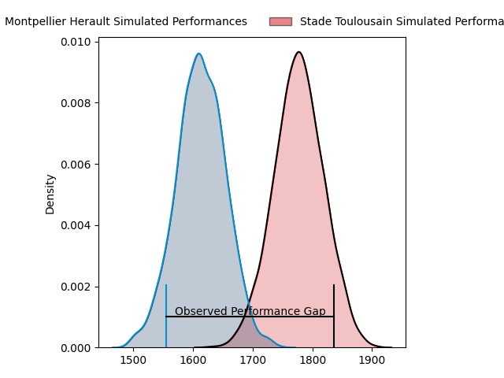
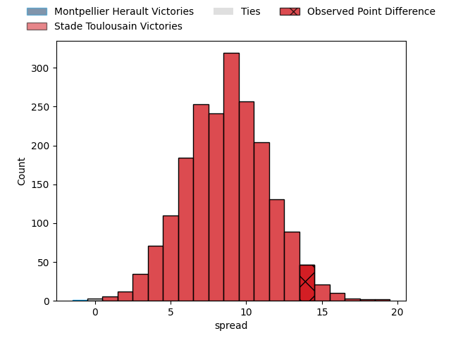
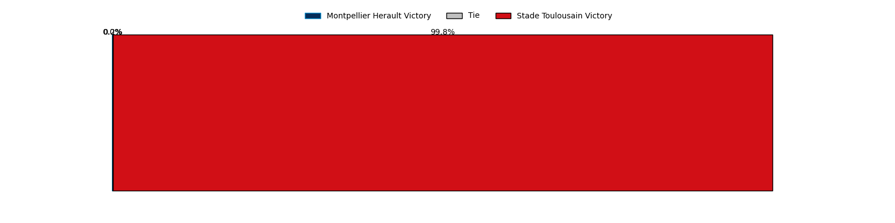
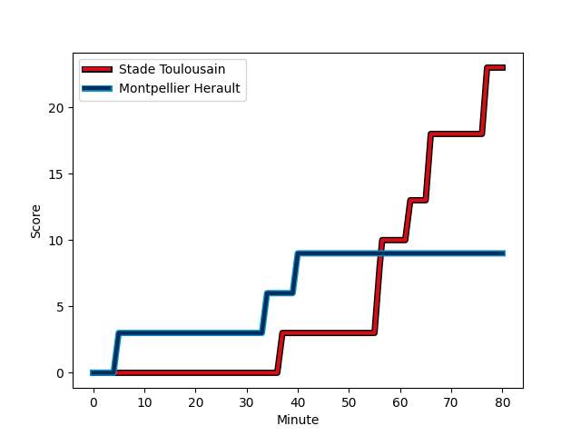
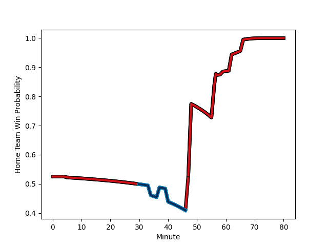

---  
layout: page  
title: Montpellier Herault at Stade Toulousain; 9-23  
date: 2023-01-29 21:00:00 18:00:00 -0500  
categories: match review  
---
# Montpellier Herault at Stade Toulousain; 9-23

# Club Level Predictions

The first set of predictions treats a club as the smallest object, as the club develops its members, organizes a gameplan, and deploys its players as needed for each match. This club model has a prediction of 0.686, which translates to predicting Stade Toulousain to win by 6.8.

Each club has a rating and a rating deviation (simiar to a Glicko system), and expected performances can be generated. This allows for simulated matches and spreads like the ones below.
## Projected Performances

## Projected Spreads

## Projected Results

# Player Level Predictions

Treating teams instead as an entity made up of the currently active players, I have ratings for each player in an altogether different system. These can be combined to form team ratings once teamsheets are announced, weighting starters a bit higher than the reserves. After the match is played, players can be weighted by their minutes on the field, allowing for an accurate measure of the team's composition. With these compiled team ratings, we can make predictions, measure inaccuracy, and update the individual player ratings.
## Prediction with Player Minutes: Stade Toulousain by 8.4

Stade Toulousain by 4.4 on a neutral field
## Scores over Time

## Win Probability over Time

## Prediction without Player Minutes: Stade Toulousain by 8.9

Stade Toulousain by 4.9 on a neutral pitch

|   Away Minutes | Away Player                                                                     |   Away elo |   Away Percentile |   Number |   Home Percentile |   Home elo | Home Player                                                           |   Home Minutes |
|---------------:|:--------------------------------------------------------------------------------|-----------:|------------------:|---------:|------------------:|-----------:|:----------------------------------------------------------------------|---------------:|
|             59 | [Enzo Forletta](..//playerfiles//EnzoForletta_cleaned.md)                       |     106.03 |                79 |        1 |                21 |      86.77 | [Rodrigue Neti](..//playerfiles//RodrigueNeti_cleaned.md)             |             68 |
|             59 | [Vincent Giudicelli](..//playerfiles//VincentGiudicelli_cleaned.md)             |      96.81 |                66 |        2 |                16 |      84.92 | [Guillaume Cramont](..//playerfiles//GuillaumeCramont_cleaned.md)     |             72 |
|             62 | [Titi Lamositele](..//playerfiles//TitiLamositele_cleaned.md)                   |      84.96 |                19 |        3 |                86 |     110.68 | [Dorian Aldegheri](..//playerfiles//DorianAldegheri_cleaned.md)       |             62 |
|             57 | [Yacouba Camara](..//playerfiles//YacoubaCamara_cleaned.md)                     |     122.8  |                91 |        4 |                60 |      99.48 | [Joshua Brennan](..//playerfiles//JoshuaBrennan_cleaned.md)           |             47 |
|             48 | [Elliott Stooke](..//playerfiles//ElliottStooke_cleaned.md)                     |      91.79 |                42 |        5 |                59 |      99.18 | [Richie Arnold](..//playerfiles//RichieArnold_cleaned.md)             |             80 |
|             80 | [Marco Tauleigne](..//playerfiles//MarcoTauleigne_cleaned.md)                   |     109.37 |                79 |        6 |                73 |     105.5  | [Alban Placines](..//playerfiles//AlbanPlacines_cleaned.md)           |             47 |
|             80 | [Alexandre Becognee](..//playerfiles//AlexandreBecognee_cleaned.md)             |      91.06 |                36 |        7 |                89 |     119.47 | [Rynhardt Elstadt](..//playerfiles//RynhardtElstadt_cleaned.md)       |             47 |
|             80 | [Zach Mercer](..//playerfiles//ZachMercer_cleaned.md)                           |     107.58 |                73 |        8 |                56 |      98.57 | [Selevasio Tolofua](..//playerfiles//SelevasioTolofua_cleaned.md)     |             80 |
|             80 | [Cobus Reinach](..//playerfiles//CobusReinach_cleaned.md)                       |     111.24 |                85 |        9 |                32 |      89.63 | [Martin Page-Relo](..//playerfiles//MartinPage-Relo_cleaned.md)       |             80 |
|             68 | [Louis Carbonel](..//playerfiles//LouisCarbonel_cleaned.md)                     |      94.62 |                43 |       10 |                58 |      98.8  | [Juan Cruz Mallia](..//playerfiles//JuanCruzMallia_cleaned.md)        |             78 |
|             80 | [George Bridge](..//playerfiles//GeorgeBridge_cleaned.md)                       |     125.49 |                93 |       11 |                97 |     134.39 | [Matthis Lebel](..//playerfiles//MatthisLebel_cleaned.md)             |             80 |
|             80 | [Jan Serfontein](..//playerfiles//JanSerfontein_cleaned.md)                     |     108.22 |                76 |       12 |                56 |      98.24 | [Pita Ahki](..//playerfiles//PitaAhki_cleaned.md)                     |             80 |
|             72 | [Thomas Darmon](..//playerfiles//ThomasDarmon_cleaned.md)                       |      67.79 |                 3 |       13 |                84 |     113.51 | [Dimitri Delibes](..//playerfiles//DimitriDelibes_cleaned.md)         |             80 |
|             80 | [Julien Tisseron](..//playerfiles//JulienTisseron_cleaned.md)                   |     106.35 |                75 |       14 |                76 |     107.28 | [Arthur Retiere](..//playerfiles//ArthurRetiere_cleaned.md)           |             65 |
|             68 | [Anthony Bouthier](..//playerfiles//AnthonyBouthier_cleaned.md)                 |     110.03 |                77 |       15 |                72 |     104.71 | [Ange Capuozzo](..//playerfiles//AngeCapuozzo_cleaned.md)             |             80 |
|             21 | [Simon-Pierre Chauvac](..//playerfiles//Simon-PierreChauvac_cleaned.md)         |     107.11 |                80 |       16 |                94 |     127.73 | [Jack Willis](..//playerfiles//JackWillis_cleaned.md)                 |             33 |
|             21 | [Curtis Langdon](..//playerfiles//CurtisLangdon_cleaned.md)                     |     100.1  |                65 |       17 |                99 |     162.73 | [Francois Cros](..//playerfiles//FrancoisCros_cleaned.md)             |             33 |
|             32 | [Bastien Chalureau](..//playerfiles//BastienChalureau_cleaned.md)               |     128.08 |                95 |       18 |                50 |      95.99 | [Emmanuel Meafou](..//playerfiles//EmmanuelMeafou_cleaned.md)         |             33 |
|             23 | [Clément Doumenc](..//playerfiles//ClémentDoumenc_cleaned.md)                   |      83.18 |                23 |       19 |                65 |     100.48 | [David Ainu'u](..//playerfiles//DavidAinu'u_cleaned.md)               |             18 |
|             18 | [Henry Thomas](..//playerfiles//HenryThomas_cleaned.md)                         |      86.71 |                23 |       20 |                58 |      99.14 | [Santiago Chocobares](..//playerfiles//SantiagoChocobares_cleaned.md) |             15 |
|             12 | [Louis Foursans-Bourdette](..//playerfiles//LouisFoursans-Bourdette_cleaned.md) |      85.66 |                31 |       21 |                86 |     110.92 | [Maxime Duprat](..//playerfiles//MaximeDuprat_cleaned.md)             |             12 |
|             12 | [Gabriel Ngandebe](..//playerfiles//GabrielNgandebe_cleaned.md)                 |      80.53 |                13 |       22 |               nan |      86.08 | [Ian Boubila](..//playerfiles//IanBoubila_cleaned.md)                 |              8 |
|              8 | [Pierre Lucas](..//playerfiles//PierreLucas_cleaned.md)                         |      67.66 |                 6 |       23 |                67 |     103.53 | [Edgar Retiere](..//playerfiles//EdgarRetiere_cleaned.md)             |              2 |

