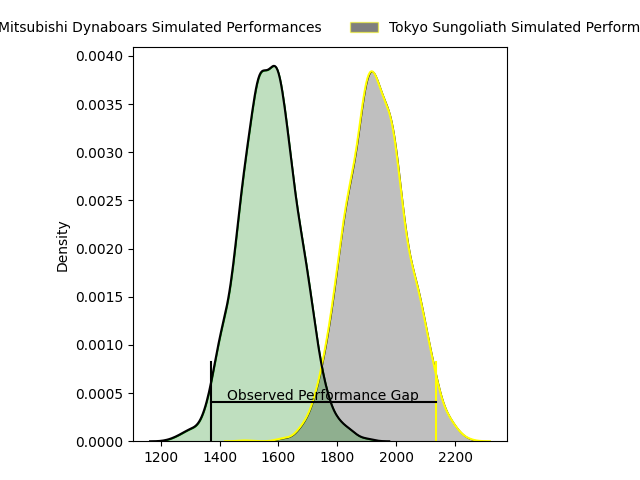
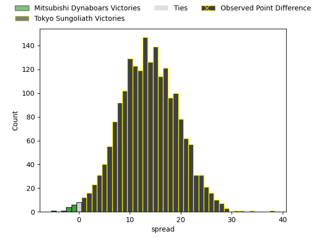
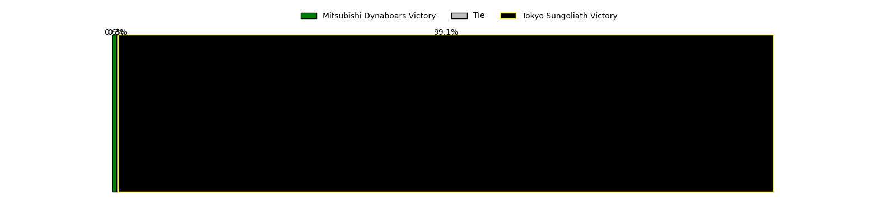
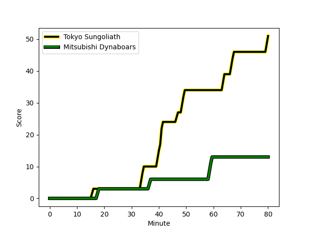
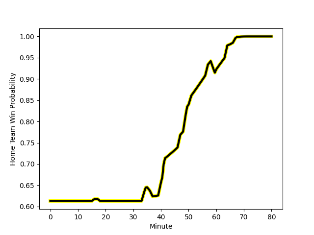

---  
layout: page  
title: Mitsubishi Dynaboars at Tokyo Sungoliath; 13-51  
date: 2023-01-29 06:30:00 18:00:00 -0500  
categories: match review  
---
# Mitsubishi Dynaboars at Tokyo Sungoliath; 13-51

# Club Level Predictions

The first set of predictions treats a club as the smallest object, as the club develops its members, organizes a gameplan, and deploys its players as needed for each match. This club model has a prediction of 0.824, which translates to predicting Tokyo Sungoliath to win by 13.9.

Each club has a rating and a rating deviation (simiar to a Glicko system), and expected performances can be generated. This allows for simulated matches and spreads like the ones below.
## Projected Performances

## Projected Spreads

## Projected Results

# Player Level Predictions

Treating teams instead as an entity made up of the currently active players, I have ratings for each player in an altogether different system. These can be combined to form team ratings once teamsheets are announced, weighting starters a bit higher than the reserves. After the match is played, players can be weighted by their minutes on the field, allowing for an accurate measure of the team's composition. With these compiled team ratings, we can make predictions, measure inaccuracy, and update the individual player ratings.
## Prediction with Player Minutes: Tokyo Sungoliath by 35.4

Tokyo Sungoliath by 31.4 on a neutral field
## Scores over Time

## Win Probability over Time

## Prediction without Player Minutes: Tokyo Sungoliath by 37.4

Tokyo Sungoliath by 33.4 on a neutral pitch

|   Away Minutes | Away Player                                                               |   Away elo |   Away Percentile |   Number |   Home Percentile |   Home elo | Home Player                                                           |   Home Minutes |
|---------------:|:--------------------------------------------------------------------------|-----------:|------------------:|---------:|------------------:|-----------:|:----------------------------------------------------------------------|---------------:|
|             51 | [Shunsuke Sakamoto](..//playerfiles//ShunsukeSakamoto_cleaned.md)         |      96.14 |                54 |        1 |               nan |     100.19 | [Kenta Kobayashi](..//playerfiles//KentaKobayashi_cleaned.md)         |             57 |
|             57 | [Yoshimitsu Yasue](..//playerfiles//YoshimitsuYasue_cleaned.md)           |      85.44 |                26 |        2 |                96 |     124.35 | [Shunta Nakamura](..//playerfiles//ShuntaNakamura_cleaned.md)         |             65 |
|             51 | [Mototsugu Hachiya](..//playerfiles//MototsuguHachiya_cleaned.md)         |      95    |               nan |        3 |                74 |     104.28 | [Shinnosuke Kakinaga](..//playerfiles//ShinnosukeKakinaga_cleaned.md) |             60 |
|             61 | [Daniel Linde](..//playerfiles//DanielLinde_cleaned.md)                   |      84.79 |                22 |        4 |                54 |      97.22 | [Hendrik Tui](..//playerfiles//HendrikTui_cleaned.md)                 |             57 |
|             80 | [Epineri Uluiviti](..//playerfiles//EpineriUluiviti_cleaned.md)           |      79.68 |                13 |        5 |                99 |     146.61 | [Harry Hockings](..//playerfiles//HarryHockings_cleaned.md)           |             80 |
|             80 | [Sam Chongkit](..//playerfiles//SamChongkit_cleaned.md)                   |     110.32 |                85 |        6 |                92 |     123.31 | [Kanji Shimokawa](..//playerfiles//KanjiShimokawa_cleaned.md)         |             80 |
|             80 | [Koki Sato](..//playerfiles//KokiSato_cleaned.md)                         |      79.72 |               nan |        7 |                53 |      97.5  | [Kai Yamamoto](..//playerfiles//KaiYamamoto_cleaned.md)               |             80 |
|             80 | [Jackson Hemopo](..//playerfiles//JacksonHemopo_cleaned.md)               |     100.9  |                60 |        8 |                95 |     128.79 | [Tevita Tatafu](..//playerfiles//TevitaTatafu_cleaned.md)             |             69 |
|             51 | [Kota Iwamura](..//playerfiles//KotaIwamura_cleaned.md)                   |      98.37 |                57 |        9 |                71 |     104.5  | [Naoto Saito](..//playerfiles//NaotoSaito_cleaned.md)                 |             57 |
|             80 | [James Shillcock](..//playerfiles//JamesShillcock_cleaned.md)             |     108.23 |                76 |       10 |                89 |     119.17 | [Aaron Cruden](..//playerfiles//AaronCruden_cleaned.md)               |             80 |
|             80 | [Roland Alaiasa](..//playerfiles//RolandAlaiasa_cleaned.md)               |      89.42 |                33 |       11 |                97 |     135.18 | [Tevita Li](..//playerfiles//TevitaLi_cleaned.md)                     |             66 |
|             80 | [Fisipuna Tuiaki](..//playerfiles//FisipunaTuiaki_cleaned.md)             |      95    |               nan |       12 |                92 |     124.73 | [Ryoto Nakamura](..//playerfiles//RyotoNakamura_cleaned.md)           |             72 |
|             36 | [Matt Vaega](..//playerfiles//MattVaega_cleaned.md)                       |      88.22 |                30 |       13 |                71 |     105.11 | [Shogo Nakano](..//playerfiles//ShogoNakano_cleaned.md)               |             80 |
|             47 | [Tomoyuki Ochiai](..//playerfiles//TomoyukiOchiai_cleaned.md)             |      95.55 |                48 |       14 |                73 |     108.13 | [Seiya Ozaki](..//playerfiles//SeiyaOzaki_cleaned.md)                 |             80 |
|             80 | [Kazuki Ishida](..//playerfiles//KazukiIshida_cleaned.md)                 |     101.25 |                61 |       15 |                56 |      99.77 | [Kotaro Matsushima](..//playerfiles//KotaroMatsushima_cleaned.md)     |             80 |
|             44 | [Nozomi Nara](..//playerfiles//NozomiNara_cleaned.md)                     |     104.62 |                70 |       16 |                66 |     101.33 | [Ryosuke Iwaihara](..//playerfiles//RyosukeIwaihara_cleaned.md)       |             23 |
|             33 | [Heiden Bedwell-Curtis](..//playerfiles//HeidenBedwell-Curtis_cleaned.md) |      91.3  |                39 |       17 |                99 |     157.83 | [Tom Savage](..//playerfiles//TomSavage_cleaned.md)                   |             23 |
|             29 | [Hayato Hosoda](..//playerfiles//HayatoHosoda_cleaned.md)                 |      85.64 |                16 |       18 |                42 |      96.99 | [Yutaka Nagare](..//playerfiles//YutakaNagare_cleaned.md)             |             23 |
|             29 | [Taro Aihara](..//playerfiles//TaroAihara_cleaned.md)                     |      95    |               nan |       19 |                88 |     112    | [Shintaro Ishihara](..//playerfiles//ShintaroIshihara_cleaned.md)     |             20 |
|             29 | [Taichi Takahashi](..//playerfiles//TaichiTakahashi_cleaned.md)           |      93.31 |               nan |       20 |               nan |      91.64 | [Kienori Go](..//playerfiles//KienoriGo_cleaned.md)                   |             15 |
|             23 | [Yuya Otsuka](..//playerfiles//YuyaOtsuka_cleaned.md)                     |      94.68 |                50 |       21 |                63 |     100.3  | [Ryosuke Kawase](..//playerfiles//RyosukeKawase_cleaned.md)           |             14 |
|             19 | [Maoya Nakagawa](..//playerfiles//MaoyaNakagawa_cleaned.md)               |      60.45 |                 2 |       22 |                63 |     100.97 | [Ryuga Hashimoto](..//playerfiles//RyugaHashimoto_cleaned.md)         |             11 |
|            nan | nan                                                                       |     nan    |               nan |       23 |                95 |     130.27 | [Keisuke Moriya](..//playerfiles//KeisukeMoriya_cleaned.md)           |              8 |

