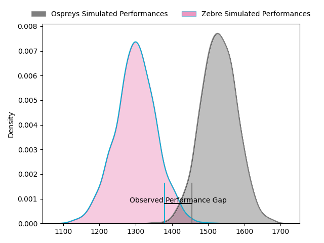
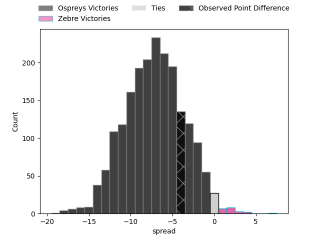
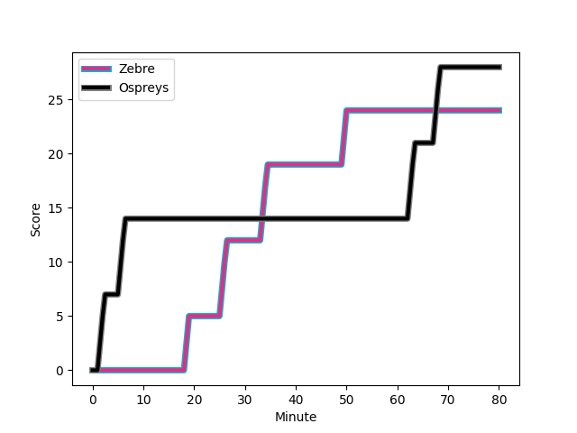
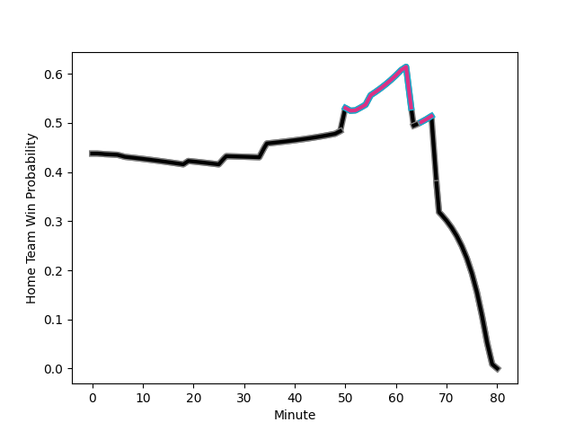

---  
layout: page  
title: Ospreys at Zebre; 28-24  
date: 2023-01-29 16:00:00 18:00:00 -0500  
categories: match review  
---
# Ospreys at Zebre; 28-24

# Club Level Predictions

The first set of predictions treats a club as the smallest object, as the club develops its members, organizes a gameplan, and deploys its players as needed for each match. This club model has a prediction of 0.222, which translates to predicting Ospreys to win by 11.0.

Each club has a rating and a rating deviation (simiar to a Glicko system), and expected performances can be generated. This allows for simulated matches and spreads like the ones below.
## Projected Performances

## Projected Spreads

## Projected Results

# Player Level Predictions

Treating teams instead as an entity made up of the currently active players, I have ratings for each player in an altogether different system. These can be combined to form team ratings once teamsheets are announced, weighting starters a bit higher than the reserves. After the match is played, players can be weighted by their minutes on the field, allowing for an accurate measure of the team's composition. With these compiled team ratings, we can make predictions, measure inaccuracy, and update the individual player ratings.
## Prediction with Player Minutes: Ospreys by 6.9

Ospreys by 10.9 on a neutral field
## Scores over Time

## Win Probability over Time

## Prediction without Player Minutes: Ospreys by 0.8

Ospreys by 4.8 on a neutral pitch

|   Away Minutes | Away Player                                                                 |   Away elo |   Away Percentile |   Number |   Home Percentile |   Home elo | Home Player                                                                 |   Home Minutes |
|---------------:|:----------------------------------------------------------------------------|-----------:|------------------:|---------:|------------------:|-----------:|:----------------------------------------------------------------------------|---------------:|
|             73 | [Nicky Smith](..//playerfiles//NickySmith_cleaned.md)                       |      99.33 |                59 |        1 |                52 |      96.83 | [Paolo Buonfiglio](..//playerfiles//PaoloBuonfiglio_cleaned.md)             |             62 |
|             72 | [Elvis Taione](..//playerfiles//ElvisTaione_cleaned.md)                     |      97    |               nan |        2 |                30 |      89.55 | [Giampietro Ribaldi](..//playerfiles//GiampietroRibaldi_cleaned.md)         |             52 |
|             66 | [Tom Botha](..//playerfiles//TomBotha_cleaned.md)                           |      86.83 |                22 |        3 |                34 |      90.81 | [Ion Neculai](..//playerfiles//IonNeculai_cleaned.md)                       |             62 |
|             80 | [Bradley Davies](..//playerfiles//BradleyDavies_cleaned.md)                 |     102.4  |                67 |        4 |                 4 |      67.77 | [Leonard Krumov](..//playerfiles//LeonardKrumov_cleaned.md)                 |             80 |
|             49 | [Huw Sutton](..//playerfiles//HuwSutton_cleaned.md)                         |      98.23 |               nan |        5 |                96 |     128.56 | [Josh Furno](..//playerfiles//JoshFurno_cleaned.md)                         |             80 |
|             80 | [Jack Regan](..//playerfiles//JackRegan_cleaned.md)                         |      96.7  |               nan |        6 |                41 |      91.7  | [Luca Andreani](..//playerfiles//LucaAndreani_cleaned.md)                   |             55 |
|             80 | [Harri Deaves](..//playerfiles//HarriDeaves_cleaned.md)                     |      92.71 |                37 |        7 |                72 |     104.92 | [Matt Kvesic](..//playerfiles//MattKvesic_cleaned.md)                       |             80 |
|             80 | [Morgan Morris](..//playerfiles//MorganMorris_cleaned.md)                   |      99.05 |                47 |        8 |                86 |     115.37 | [Taina Fox-Matamua](..//playerfiles//TainaFox-Matamua_cleaned.md)           |             57 |
|             80 | [Reuben Morgan-Williams](..//playerfiles//ReubenMorgan-Williams_cleaned.md) |     101.56 |                65 |        9 |                19 |      85.41 | [Chris Cook](..//playerfiles//ChrisCook_cleaned.md)                         |             80 |
|             51 | [Jack Walsh](..//playerfiles//JackWalsh_cleaned.md)                         |     110.47 |                78 |       10 |                24 |      87.53 | [Tiff Eden](..//playerfiles//TiffEden_cleaned.md)                           |             80 |
|             80 | [Keelan Giles](..//playerfiles//KeelanGiles_cleaned.md)                     |      86.78 |                23 |       11 |                 9 |      76.19 | [Jacopo Trulla](..//playerfiles//JacopoTrulla_cleaned.md)                   |             80 |
|             80 | [Tiaan Thomas-Wheeler](..//playerfiles//TiaanThomas-Wheeler_cleaned.md)     |      89.62 |                33 |       12 |                 4 |      70.58 | [Tommaso Boni](..//playerfiles//TommasoBoni_cleaned.md)                     |             80 |
|             80 | [Michael Collins](..//playerfiles//MichaelCollins_cleaned.md)               |     131.64 |                96 |       13 |                32 |      92.9  | [Franco Smith](..//playerfiles//FrancoSmith_cleaned.md)                     |             70 |
|             80 | [Luke Morgan](..//playerfiles//LukeMorgan_cleaned.md)                       |      96.17 |                51 |       14 |                93 |     124.41 | [Jacobus van Wyk](..//playerfiles//JacobusvanWyk_cleaned.md)                |             65 |
|             80 | [Max Nagy](..//playerfiles//MaxNagy_cleaned.md)                             |     112.42 |                80 |       15 |                 4 |      66.41 | [Lorenzo Pani](..//playerfiles//LorenzoPani_cleaned.md)                     |             80 |
|             31 | [James Fender](..//playerfiles//JamesFender_cleaned.md)                     |      92.11 |                39 |       16 |                12 |      81.54 | [Jacques du Toit](..//playerfiles//JacquesduToit_cleaned.md)                |             28 |
|             29 | [Stephen Myler](..//playerfiles//StephenMyler_cleaned.md)                   |     129.49 |                94 |       17 |                85 |     115.09 | [Giovanni Licata](..//playerfiles//GiovanniLicata_cleaned.md)               |             25 |
|             14 | [Rhys Henry](..//playerfiles//RhysHenry_cleaned.md)                         |     112.62 |                88 |       18 |                94 |     126.32 | [Jan Uys](..//playerfiles//JanUys_cleaned.md)                               |             23 |
|              7 | [Garyn Phillips](..//playerfiles//GarynPhillips_cleaned.md)                 |     102.23 |                72 |       19 |               nan |     106.98 | [Alessio Sanavia](..//playerfiles//AlessioSanavia_cleaned.md)               |             18 |
|              8 | [Luke Cowan-Dickie](..//playerfiles//LukeCowan-Dickie_cleaned.md)           |     108.91 |                84 |       20 |               nan |      90.65 | [Riccardo Genovese](..//playerfiles//RiccardoGenovese_cleaned.md)           |             18 |
|            nan | nan                                                                         |     nan    |               nan |       21 |                99 |     150.06 | [Geronimo Prisciantelli](..//playerfiles//GeronimoPrisciantelli_cleaned.md) |             15 |
|            nan | nan                                                                         |     nan    |               nan |       22 |                25 |      86.5  | [Damiano Mazza](..//playerfiles//DamianoMazza_cleaned.md)                   |             10 |

