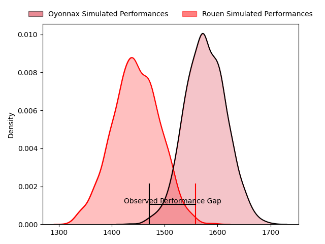
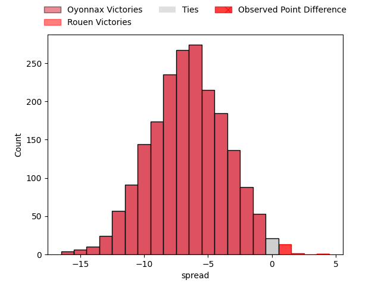
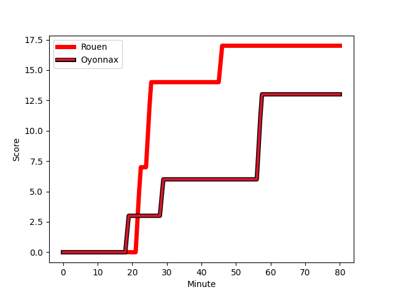
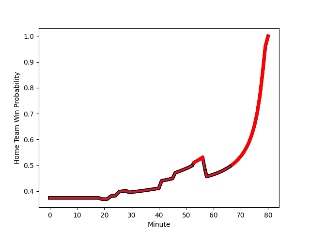

---  
layout: page  
title: Oyonnax at Rouen; 13-17  
date: 2023-02-02 21:00:00 18:00:00 -0500  
categories: match review  
---
# Oyonnax at Rouen; 13-17

# Club Level Predictions

The first set of predictions treats a club as the smallest object, as the club develops its members, organizes a gameplan, and deploys its players as needed for each match. This club model has a prediction of 0.303, which translates to predicting Oyonnax to win by 7.3.

Each club has a rating and a rating deviation (simiar to a Glicko system), and expected performances can be generated. This allows for simulated matches and spreads like the ones below.
## Projected Performances

## Projected Spreads

## Projected Results

# Player Level Predictions

Treating teams instead as an entity made up of the currently active players, I have ratings for each player in an altogether different system. These can be combined to form team ratings once teamsheets are announced, weighting starters a bit higher than the reserves. After the match is played, players can be weighted by their minutes on the field, allowing for an accurate measure of the team's composition. With these compiled team ratings, we can make predictions, measure inaccuracy, and update the individual player ratings.
## Prediction with Player Minutes: Oyonnax by 18.5

Oyonnax by 22.5 on a neutral field
## Scores over Time

## Win Probability over Time

## Prediction without Player Minutes: Oyonnax by 22.0

Oyonnax by 26.0 on a neutral pitch

|   Away Minutes | Away Player                                                       |   Away elo |   Away Percentile |   Number |   Home Percentile |   Home elo | Home Player                                                             |   Home Minutes |
|---------------:|:------------------------------------------------------------------|-----------:|------------------:|---------:|------------------:|-----------:|:------------------------------------------------------------------------|---------------:|
|             41 | [Antoine Abraham](..//playerfiles//AntoineAbraham_cleaned.md)     |      90.82 |                24 |        1 |                13 |      82.29 | [Antoine Fournier](..//playerfiles//AntoineFournier_cleaned.md)         |             53 |
|             41 | [Manu Leiataua](..//playerfiles//ManuLeiataua_cleaned.md)         |      87.75 |                32 |        2 |                 1 |      65.66 | [Efi Ma'afu](..//playerfiles//EfiMa'afu_cleaned.md)                     |             67 |
|             63 | [Thomas Laclayat](..//playerfiles//ThomasLaclayat_cleaned.md)     |     106.49 |                79 |        3 |                75 |     104.67 | [Cody Thomas](..//playerfiles//CodyThomas_cleaned.md)                   |             60 |
|             41 | [Tom Murday](..//playerfiles//TomMurday_cleaned.md)               |     136.73 |                98 |        4 |                 1 |      56.29 | [John-Charles Astle](..//playerfiles//John-CharlesAstle_cleaned.md)     |             80 |
|             80 | [Hugo Fabregue](..//playerfiles//HugoFabregue_cleaned.md)         |      85.81 |                23 |        5 |                86 |     113.34 | [Jimi Maximin](..//playerfiles//JimiMaximin_cleaned.md)                 |             64 |
|             80 | [Wandrille Picault](..//playerfiles//WandrillePicault_cleaned.md) |     127.68 |                94 |        6 |                43 |      93.18 | [Lucas Costa](..//playerfiles//LucasCosta_cleaned.md)                   |             80 |
|             53 | [Luke Hamilton](..//playerfiles//LukeHamilton_cleaned.md)         |     140.92 |                99 |        7 |                33 |      90.14 | [Tienie Burger](..//playerfiles//TienieBurger_cleaned.md)               |             80 |
|             80 | [Rory Grice](..//playerfiles//RoryGrice_cleaned.md)               |     115.27 |                85 |        8 |                21 |      84.39 | [Tino Mapapalangi](..//playerfiles//TinoMapapalangi_cleaned.md)         |             56 |
|             53 | [Ilan El Khattabi](..//playerfiles//IlanElKhattabi_cleaned.md)    |      79.03 |                12 |        9 |                 6 |      73.39 | [Theo Nanette](..//playerfiles//TheoNanette_cleaned.md)                 |             60 |
|             80 | [Jules Soulan](..//playerfiles//JulesSoulan_cleaned.md)           |     121.28 |                90 |       10 |                50 |      96.91 | [Franck Pourteau](..//playerfiles//FranckPourteau_cleaned.md)           |             80 |
|             80 | [Enzo Reybier](..//playerfiles//EnzoReybier_cleaned.md)           |     109.76 |                79 |       11 |                85 |     114.48 | [Benito Masilevu](..//playerfiles//BenitoMasilevu_cleaned.md)           |             80 |
|             80 | [Theo Millet](..//playerfiles//TheoMillet_cleaned.md)             |      93    |                41 |       12 |                56 |      98.69 | [JT Jackson](..//playerfiles//JTJackson_cleaned.md)                     |             70 |
|             80 | [Florian Vialelle](..//playerfiles//FlorianVialelle_cleaned.md)   |     121.99 |                91 |       13 |                75 |     106.98 | [Alex Luatua](..//playerfiles//AlexLuatua_cleaned.md)                   |             80 |
|             53 | [Joe Ravouvou](..//playerfiles//JoeRavouvou_cleaned.md)           |     122.04 |                91 |       14 |                52 |      96.51 | [Malcolm Bertschy](..//playerfiles//MalcolmBertschy_cleaned.md)         |             80 |
|             41 | [Tony Ensor](..//playerfiles//TonyEnsor_cleaned.md)               |      82.32 |                21 |       15 |                26 |      87.11 | [Paul Surano](..//playerfiles//PaulSurano_cleaned.md)                   |             80 |
|             39 | [Tommy Raynaud](..//playerfiles//TommyRaynaud_cleaned.md)         |      72.13 |                 4 |       16 |               nan |      92.38 | [Ewan Clément](..//playerfiles//EwanClément_cleaned.md)                 |             27 |
|             39 | [Teddy Durand](..//playerfiles//TeddyDurand_cleaned.md)           |      85.5  |                29 |       17 |                 9 |      76.19 | [Abdelkarim Fofana](..//playerfiles//AbdelkarimFofana_cleaned.md)       |             24 |
|             39 | [Victor Lebas](..//playerfiles//VictorLebas_cleaned.md)           |      84.98 |                26 |       18 |                85 |     108.01 | [Hugo Ndiaye](..//playerfiles//HugoNdiaye_cleaned.md)                   |             20 |
|             39 | [Justin Bouraux](..//playerfiles//JustinBouraux_cleaned.md)       |     100.73 |                63 |       19 |                11 |      78.75 | [Florent Campeggia](..//playerfiles//FlorentCampeggia_cleaned.md)       |             20 |
|             27 | [Filimo Taofifenua](..//playerfiles//FilimoTaofifenua_cleaned.md) |     133.44 |                98 |       20 |                67 |     102.48 | [Toby Salmon](..//playerfiles//TobySalmon_cleaned.md)                   |             16 |
|             27 | [Yvan David](..//playerfiles//YvanDavid_cleaned.md)               |     102.52 |                64 |       21 |                26 |      86.68 | [Opetera Peleseuma](..//playerfiles//OpeteraPeleseuma_cleaned.md)       |             10 |
|             27 | [Leo Treilles](..//playerfiles//LeoTreilles_cleaned.md)           |      98.99 |                57 |       22 |                22 |      86.84 | [Jean-Étienne Lesueur](..//playerfiles//Jean-ÉtienneLesueur_cleaned.md) |             13 |
|             17 | [Victor Delmas](..//playerfiles//VictorDelmas_cleaned.md)         |     104.01 |               nan |       23 |               nan |     nan    | nan                                                                     |            nan |

