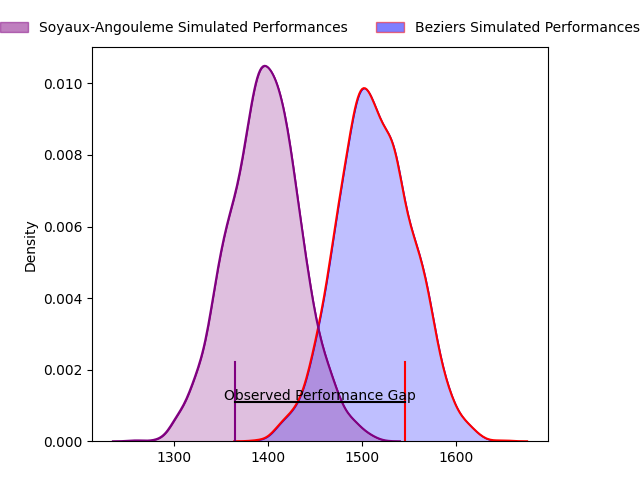
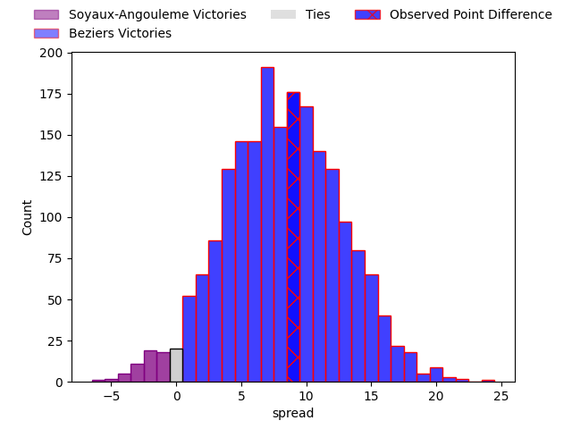
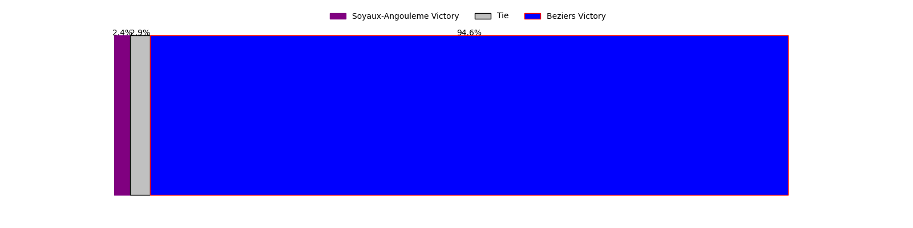
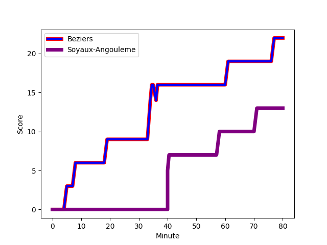
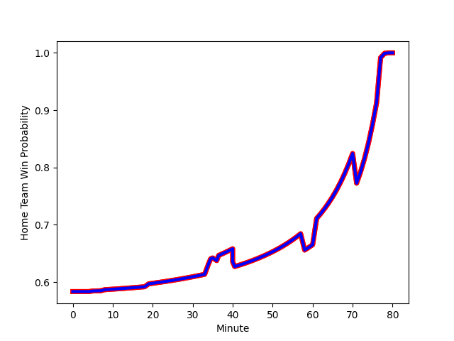

---  
layout: page  
title: Soyaux-Angouleme at Beziers; 13-22  
date: 2023-02-03 19:30:00 18:00:00 -0500  
categories: match review  
---
# Soyaux-Angouleme at Beziers; 13-22

# Club Level Predictions

The first set of predictions treats a club as the smallest object, as the club develops its members, organizes a gameplan, and deploys its players as needed for each match. This club model has a prediction of 0.718, which translates to predicting Beziers to win by 8.2.

Each club has a rating and a rating deviation (simiar to a Glicko system), and expected performances can be generated. This allows for simulated matches and spreads like the ones below.
## Projected Performances

## Projected Spreads

## Projected Results

# Player Level Predictions

Treating teams instead as an entity made up of the currently active players, I have ratings for each player in an altogether different system. These can be combined to form team ratings once teamsheets are announced, weighting starters a bit higher than the reserves. After the match is played, players can be weighted by their minutes on the field, allowing for an accurate measure of the team's composition. With these compiled team ratings, we can make predictions, measure inaccuracy, and update the individual player ratings.
## Prediction with Player Minutes: Beziers by 18.7

Beziers by 14.7 on a neutral field
## Scores over Time

## Win Probability over Time

There were 7 large changes in win probability in this match
## Prediction without Player Minutes: Beziers by 19.3

Beziers by 15.3 on a neutral pitch

|   Away Minutes | Away Player                                                                |   Away elo |   Away Percentile |   Number |   Home Percentile |   Home elo | Home Player                                                                          |   Home Minutes |
|---------------:|:---------------------------------------------------------------------------|-----------:|------------------:|---------:|------------------:|-----------:|:-------------------------------------------------------------------------------------|---------------:|
|             80 | [Elias El Ansari](..//playerfiles//EliasElAnsari_cleaned.md)               |      73.05 |                 5 |        1 |                95 |     122.19 | [Francisco Fernandes Moreira](..//playerfiles//FranciscoFernandesMoreira_cleaned.md) |             69 |
|             43 | [Elias El Ansari](..//playerfiles//EliasElAnsari_cleaned.md)               |      73.05 |                 5 |        1 |                95 |     122.19 | [Francisco Fernandes Moreira](..//playerfiles//FranciscoFernandesMoreira_cleaned.md) |             80 |
|             80 | [Elias El Ansari](..//playerfiles//EliasElAnsari_cleaned.md)               |      73.05 |                 5 |        1 |                95 |     122.19 | [Francisco Fernandes Moreira](..//playerfiles//FranciscoFernandesMoreira_cleaned.md) |             80 |
|             43 | [Elias El Ansari](..//playerfiles//EliasElAnsari_cleaned.md)               |      73.05 |                 5 |        1 |                95 |     122.19 | [Francisco Fernandes Moreira](..//playerfiles//FranciscoFernandesMoreira_cleaned.md) |             69 |
|             80 | [Rayne Barka](..//playerfiles//RayneBarka_cleaned.md)                      |     107.32 |                85 |        2 |                19 |      85.58 | [Wilmar Arnoldi](..//playerfiles//WilmarArnoldi_cleaned.md)                          |             60 |
|             43 | [Rayne Barka](..//playerfiles//RayneBarka_cleaned.md)                      |     107.32 |                85 |        2 |                19 |      85.58 | [Wilmar Arnoldi](..//playerfiles//WilmarArnoldi_cleaned.md)                          |             60 |
|             80 | [Rayne Barka](..//playerfiles//RayneBarka_cleaned.md)                      |     107.32 |                85 |        2 |                19 |      85.58 | [Wilmar Arnoldi](..//playerfiles//WilmarArnoldi_cleaned.md)                          |             80 |
|             43 | [Rayne Barka](..//playerfiles//RayneBarka_cleaned.md)                      |     107.32 |                85 |        2 |                19 |      85.58 | [Wilmar Arnoldi](..//playerfiles//WilmarArnoldi_cleaned.md)                          |             80 |
|             63 | [Shota Gogisvanidze](..//playerfiles//ShotaGogisvanidze_cleaned.md)        |      87.64 |                24 |        3 |                80 |     107.63 | [Yannick Arroyo](..//playerfiles//YannickArroyo_cleaned.md)                          |             80 |
|             80 | [Shota Gogisvanidze](..//playerfiles//ShotaGogisvanidze_cleaned.md)        |      87.64 |                24 |        3 |                80 |     107.63 | [Yannick Arroyo](..//playerfiles//YannickArroyo_cleaned.md)                          |             80 |
|             80 | [Shota Gogisvanidze](..//playerfiles//ShotaGogisvanidze_cleaned.md)        |      87.64 |                24 |        3 |                80 |     107.63 | [Yannick Arroyo](..//playerfiles//YannickArroyo_cleaned.md)                          |             41 |
|             63 | [Shota Gogisvanidze](..//playerfiles//ShotaGogisvanidze_cleaned.md)        |      87.64 |                24 |        3 |                80 |     107.63 | [Yannick Arroyo](..//playerfiles//YannickArroyo_cleaned.md)                          |             41 |
|             80 | [Saba Pesvianidze](..//playerfiles//SabaPesvianidze_cleaned.md)            |     105.72 |                75 |        4 |                75 |     106.53 | [Clément Bitz](..//playerfiles//ClémentBitz_cleaned.md)                              |             80 |
|             41 | [Saba Pesvianidze](..//playerfiles//SabaPesvianidze_cleaned.md)            |     105.72 |                75 |        4 |                75 |     106.53 | [Clément Bitz](..//playerfiles//ClémentBitz_cleaned.md)                              |             80 |
|             80 | [Janse Roux](..//playerfiles//JanseRoux_cleaned.md)                        |      93.54 |                45 |        5 |                45 |      93.51 | [John Madigan](..//playerfiles//JohnMadigan_cleaned.md)                              |             48 |
|             80 | [Janse Roux](..//playerfiles//JanseRoux_cleaned.md)                        |      93.54 |                45 |        5 |                45 |      93.51 | [John Madigan](..//playerfiles//JohnMadigan_cleaned.md)                              |             80 |
|             80 | [Hubert Texier](..//playerfiles//HubertTexier_cleaned.md)                  |     107.78 |                79 |        6 |                53 |      97.53 | [William van Bost](..//playerfiles//WilliamvanBost_cleaned.md)                       |             80 |
|             80 | [Germain Burgaud](..//playerfiles//GermainBurgaud_cleaned.md)              |      94.23 |                45 |        7 |                35 |      87.17 | [Pierrick Gunther](..//playerfiles//PierrickGunther_cleaned.md)                      |             80 |
|             41 | [Yassine Jarmouni](..//playerfiles//YassineJarmouni_cleaned.md)            |      85.12 |                23 |        8 |                82 |     113.77 | [Thomas Hoarau](..//playerfiles//ThomasHoarau_cleaned.md)                            |             80 |
|             80 | [Yassine Jarmouni](..//playerfiles//YassineJarmouni_cleaned.md)            |      85.12 |                23 |        8 |                82 |     113.77 | [Thomas Hoarau](..//playerfiles//ThomasHoarau_cleaned.md)                            |             80 |
|             41 | [Yassine Jarmouni](..//playerfiles//YassineJarmouni_cleaned.md)            |      85.12 |                23 |        8 |                82 |     113.77 | [Thomas Hoarau](..//playerfiles//ThomasHoarau_cleaned.md)                            |             59 |
|             80 | [Yassine Jarmouni](..//playerfiles//YassineJarmouni_cleaned.md)            |      85.12 |                23 |        8 |                82 |     113.77 | [Thomas Hoarau](..//playerfiles//ThomasHoarau_cleaned.md)                            |             59 |
|             73 | [Manu Saubusse](..//playerfiles//ManuSaubusse_cleaned.md)                  |     103.98 |                70 |        9 |                96 |     127.85 | [Jean Victor Goillot](..//playerfiles//JeanVictorGoillot_cleaned.md)                 |             80 |
|             80 | [Manu Saubusse](..//playerfiles//ManuSaubusse_cleaned.md)                  |     103.98 |                70 |        9 |                96 |     127.85 | [Jean Victor Goillot](..//playerfiles//JeanVictorGoillot_cleaned.md)                 |             53 |
|             73 | [Manu Saubusse](..//playerfiles//ManuSaubusse_cleaned.md)                  |     103.98 |                70 |        9 |                96 |     127.85 | [Jean Victor Goillot](..//playerfiles//JeanVictorGoillot_cleaned.md)                 |             53 |
|             80 | [Manu Saubusse](..//playerfiles//ManuSaubusse_cleaned.md)                  |     103.98 |                70 |        9 |                96 |     127.85 | [Jean Victor Goillot](..//playerfiles//JeanVictorGoillot_cleaned.md)                 |             80 |
|             80 | [Matthieu Ugalde](..//playerfiles//MatthieuUgalde_cleaned.md)              |     113.16 |                82 |       10 |                52 |      98.44 | [Victor Dreuille](..//playerfiles//VictorDreuille_cleaned.md)                        |             53 |
|             63 | [Matthieu Ugalde](..//playerfiles//MatthieuUgalde_cleaned.md)              |     113.16 |                82 |       10 |                52 |      98.44 | [Victor Dreuille](..//playerfiles//VictorDreuille_cleaned.md)                        |             53 |
|             80 | [Matthieu Ugalde](..//playerfiles//MatthieuUgalde_cleaned.md)              |     113.16 |                82 |       10 |                52 |      98.44 | [Victor Dreuille](..//playerfiles//VictorDreuille_cleaned.md)                        |             80 |
|             63 | [Matthieu Ugalde](..//playerfiles//MatthieuUgalde_cleaned.md)              |     113.16 |                82 |       10 |                52 |      98.44 | [Victor Dreuille](..//playerfiles//VictorDreuille_cleaned.md)                        |             80 |
|             80 | [Marvin Lestremau](..//playerfiles//MarvinLestremau_cleaned.md)            |      99.98 |                61 |       11 |                96 |     129.88 | [Nicolas Plazy](..//playerfiles//NicolasPlazy_cleaned.md)                            |             80 |
|             80 | [Nasoni Naqiri Kunavore](..//playerfiles//NasoniNaqiriKunavore_cleaned.md) |     104.4  |                70 |       12 |                 4 |      69.45 | [James Tofa](..//playerfiles//JamesTofa_cleaned.md)                                  |             80 |
|             80 | [Nasoni Naqiri Kunavore](..//playerfiles//NasoniNaqiriKunavore_cleaned.md) |     104.4  |                70 |       12 |                 4 |      69.45 | [James Tofa](..//playerfiles//JamesTofa_cleaned.md)                                  |             62 |
|             80 | [Ledua Mau](..//playerfiles//LeduaMau_cleaned.md)                          |      63.87 |                 2 |       13 |                99 |     143.42 | [Maxime Espeut](..//playerfiles//MaximeEspeut_cleaned.md)                            |             80 |
|             53 | [Maxime Laforgue](..//playerfiles//MaximeLaforgue_cleaned.md)              |      93.84 |                43 |       14 |                50 |      95.68 | [Paul Alquier](..//playerfiles//PaulAlquier_cleaned.md)                              |             80 |
|             80 | [Maxime Laforgue](..//playerfiles//MaximeLaforgue_cleaned.md)              |      93.84 |                43 |       14 |                50 |      95.68 | [Paul Alquier](..//playerfiles//PaulAlquier_cleaned.md)                              |             80 |
|             80 | [Rémi Brosset](..//playerfiles//RémiBrosset_cleaned.md)                    |     106.41 |                78 |       15 |                16 |      80.31 | [Charly Malie](..//playerfiles//CharlyMalie_cleaned.md)                              |             80 |
|             39 | [Sikeli Nabou](..//playerfiles//SikeliNabou_cleaned.md)                    |     111.38 |                82 |       16 |                94 |     119.92 | [Jamie Hagan](..//playerfiles//JamieHagan_cleaned.md)                                |             39 |
|             39 | [Gautier Gibouin](..//playerfiles//GautierGibouin_cleaned.md)              |      80.69 |                12 |       17 |                19 |      86.46 | [Yassine Maamry](..//playerfiles//YassineMaamry_cleaned.md)                          |             32 |
|             37 | [Khatchik Vartanov](..//playerfiles//KhatchikVartanov_cleaned.md)          |      91.4  |                35 |       18 |                 4 |      68.62 | [Mitch Short](..//playerfiles//MitchShort_cleaned.md)                                |             27 |
|             37 | [Ole Avei](..//playerfiles//OleAvei_cleaned.md)                            |     132.49 |                98 |       19 |                60 |     100.76 | [Romain Uruty](..//playerfiles//RomainUruty_cleaned.md)                              |             27 |
|             27 | [Pierre Lafitte](..//playerfiles//PierreLafitte_cleaned.md)                |      71.98 |                 8 |       20 |                59 |     101.14 | [Sias Koen](..//playerfiles//SiasKoen_cleaned.md)                                    |             21 |
|             17 | [Jacob Botica](..//playerfiles//JacobBotica_cleaned.md)                    |      82.8  |                19 |       21 |                28 |      89.19 | [Marco Pinto Ferrer](..//playerfiles//MarcoPintoFerrer_cleaned.md)                   |             20 |
|             17 | [Nolan Pienaar](..//playerfiles//NolanPienaar_cleaned.md)                  |      99.26 |                62 |       22 |                54 |      98    | [Watisoni Votu](..//playerfiles//WatisoniVotu_cleaned.md)                            |             18 |
|              7 | [Lucas Rubio](..//playerfiles//LucasRubio_cleaned.md)                      |      69.75 |                 5 |       23 |                72 |     103.25 | [John-Hubert Meyer](..//playerfiles//John-HubertMeyer_cleaned.md)                    |             11 |

