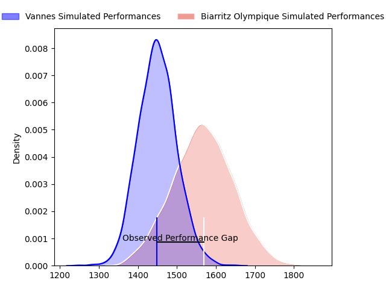
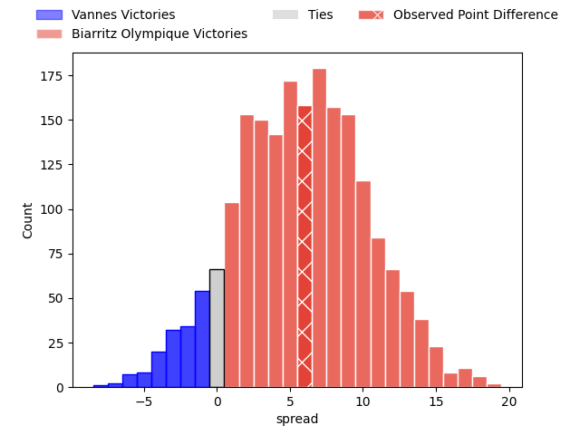
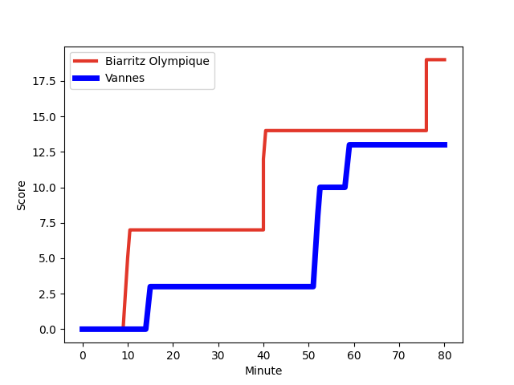
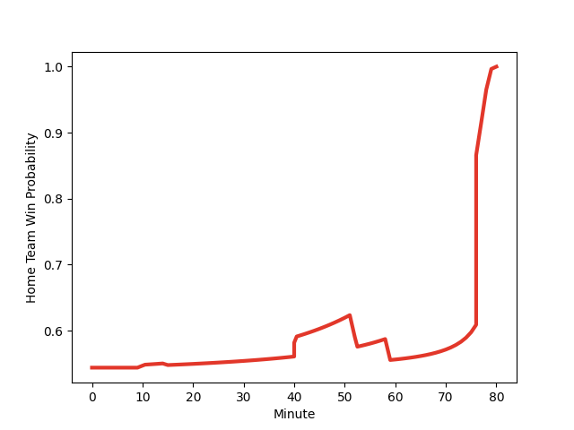

---  
layout: page  
title: Vannes at Biarritz Olympique; 13-19  
date: 2023-02-03 19:00:00 18:00:00 -0500  
categories: match review  
---
# Vannes at Biarritz Olympique; 13-19

# Club Level Predictions

The first set of predictions treats a club as the smallest object, as the club develops its members, organizes a gameplan, and deploys its players as needed for each match. This club model has a prediction of 0.642, which translates to predicting Biarritz Olympique to win by 5.1.

Each club has a rating and a rating deviation (simiar to a Glicko system), and expected performances can be generated. This allows for simulated matches and spreads like the ones below.
## Projected Performances

## Projected Spreads

## Projected Results

# Player Level Predictions

Treating teams instead as an entity made up of the currently active players, I have ratings for each player in an altogether different system. These can be combined to form team ratings once teamsheets are announced, weighting starters a bit higher than the reserves. After the match is played, players can be weighted by their minutes on the field, allowing for an accurate measure of the team's composition. With these compiled team ratings, we can make predictions, measure inaccuracy, and update the individual player ratings.
## Prediction with Player Minutes: Biarritz Olympique by 11.7

Biarritz Olympique by 7.7 on a neutral field
## Scores over Time

## Win Probability over Time

## Prediction without Player Minutes: Biarritz Olympique by 10.7

Biarritz Olympique by 6.7 on a neutral pitch

|   Away Minutes | Away Player                                                                  |   Away elo |   Away Percentile |   Number |   Home Percentile |   Home elo | Home Player                                                       |   Home Minutes |
|---------------:|:-----------------------------------------------------------------------------|-----------:|------------------:|---------:|------------------:|-----------:|:------------------------------------------------------------------|---------------:|
|             55 | [Ximun Bessonart](..//playerfiles//XimunBessonart_cleaned.md)                |      91.24 |                40 |        1 |                43 |      93.79 | [Baptiste Erdocio](..//playerfiles//BaptisteErdocio_cleaned.md)   |             52 |
|             80 | [Ximun Bessonart](..//playerfiles//XimunBessonart_cleaned.md)                |      91.24 |                40 |        1 |                43 |      93.79 | [Baptiste Erdocio](..//playerfiles//BaptisteErdocio_cleaned.md)   |             52 |
|             55 | [Ximun Bessonart](..//playerfiles//XimunBessonart_cleaned.md)                |      91.24 |                40 |        1 |                43 |      93.79 | [Baptiste Erdocio](..//playerfiles//BaptisteErdocio_cleaned.md)   |             80 |
|             80 | [Ximun Bessonart](..//playerfiles//XimunBessonart_cleaned.md)                |      91.24 |                40 |        1 |                43 |      93.79 | [Baptiste Erdocio](..//playerfiles//BaptisteErdocio_cleaned.md)   |             80 |
|             80 | [Théo Beziat](..//playerfiles//ThéoBeziat_cleaned.md)                        |      98.5  |                54 |        2 |                43 |      95.39 | [Clement Renaud](..//playerfiles//ClementRenaud_cleaned.md)       |             80 |
|             58 | [Théo Beziat](..//playerfiles//ThéoBeziat_cleaned.md)                        |      98.5  |                54 |        2 |                43 |      95.39 | [Clement Renaud](..//playerfiles//ClementRenaud_cleaned.md)       |             80 |
|             39 | [Phil Kite](..//playerfiles//PhilKite_cleaned.md)                            |      94.11 |                44 |        3 |                15 |      83.34 | [Quentin Samaran](..//playerfiles//QuentinSamaran_cleaned.md)     |             52 |
|             80 | [Phil Kite](..//playerfiles//PhilKite_cleaned.md)                            |      94.11 |                44 |        3 |                15 |      83.34 | [Quentin Samaran](..//playerfiles//QuentinSamaran_cleaned.md)     |             52 |
|             80 | [Phil Kite](..//playerfiles//PhilKite_cleaned.md)                            |      94.11 |                44 |        3 |                15 |      83.34 | [Quentin Samaran](..//playerfiles//QuentinSamaran_cleaned.md)     |             80 |
|             39 | [Phil Kite](..//playerfiles//PhilKite_cleaned.md)                            |      94.11 |                44 |        3 |                15 |      83.34 | [Quentin Samaran](..//playerfiles//QuentinSamaran_cleaned.md)     |             80 |
|             80 | [Eric Marks](..//playerfiles//EricMarks_cleaned.md)                          |      50.5  |                 0 |        4 |                47 |      94.98 | [Adrian Motoc](..//playerfiles//AdrianMotoc_cleaned.md)           |             80 |
|             80 | [Joe Edwards](..//playerfiles//JoeEdwards_cleaned.md)                        |      97.21 |                52 |        5 |                17 |      82.88 | [Johnny Dyer](..//playerfiles//JohnnyDyer_cleaned.md)             |             80 |
|             80 | [Joe Edwards](..//playerfiles//JoeEdwards_cleaned.md)                        |      97.21 |                52 |        5 |                17 |      82.88 | [Johnny Dyer](..//playerfiles//JohnnyDyer_cleaned.md)             |             52 |
|             80 | [Francisco Gorrissen](..//playerfiles//FranciscoGorrissen_cleaned.md)        |     146.95 |                99 |        6 |                 9 |      77.91 | [Dave O'Callaghan](..//playerfiles//DaveO'Callaghan_cleaned.md)   |             52 |
|             80 | [Francisco Gorrissen](..//playerfiles//FranciscoGorrissen_cleaned.md)        |     146.95 |                99 |        6 |                 9 |      77.91 | [Dave O'Callaghan](..//playerfiles//DaveO'Callaghan_cleaned.md)   |             80 |
|             69 | [Gregoire Bazin](..//playerfiles//GregoireBazin_cleaned.md)                  |      79.6  |                14 |        7 |                66 |     102.12 | [Thomas Hebert](..//playerfiles//ThomasHebert_cleaned.md)         |             80 |
|             80 | [Gregoire Bazin](..//playerfiles//GregoireBazin_cleaned.md)                  |      79.6  |                14 |        7 |                66 |     102.12 | [Thomas Hebert](..//playerfiles//ThomasHebert_cleaned.md)         |             80 |
|             52 | [Karl Chateau](..//playerfiles//KarlChateau_cleaned.md)                      |      66.3  |                 2 |        8 |                73 |     107.95 | [Elliot Dixon](..//playerfiles//ElliotDixon_cleaned.md)           |             80 |
|             80 | [Karl Chateau](..//playerfiles//KarlChateau_cleaned.md)                      |      66.3  |                 2 |        8 |                73 |     107.95 | [Elliot Dixon](..//playerfiles//ElliotDixon_cleaned.md)           |             80 |
|             80 | [Alexandre Gouaux](..//playerfiles//AlexandreGouaux_cleaned.md)              |      90.92 |                41 |        9 |                20 |      84.7  | [Barnabe Couilloud](..//playerfiles//BarnabeCouilloud_cleaned.md) |             52 |
|             67 | [Alexandre Gouaux](..//playerfiles//AlexandreGouaux_cleaned.md)              |      90.92 |                41 |        9 |                20 |      84.7  | [Barnabe Couilloud](..//playerfiles//BarnabeCouilloud_cleaned.md) |             80 |
|             80 | [Alexandre Gouaux](..//playerfiles//AlexandreGouaux_cleaned.md)              |      90.92 |                41 |        9 |                20 |      84.7  | [Barnabe Couilloud](..//playerfiles//BarnabeCouilloud_cleaned.md) |             80 |
|             67 | [Alexandre Gouaux](..//playerfiles//AlexandreGouaux_cleaned.md)              |      90.92 |                41 |        9 |                20 |      84.7  | [Barnabe Couilloud](..//playerfiles//BarnabeCouilloud_cleaned.md) |             52 |
|             80 | [Maxime Lafage](..//playerfiles//MaximeLafage_cleaned.md)                    |      98.9  |                54 |       10 |                78 |     110.4  | [Ilian Perraux](..//playerfiles//IlianPerraux_cleaned.md)         |             80 |
|             76 | [Matthys Gratien](..//playerfiles//MatthysGratien_cleaned.md)                |     116.57 |                87 |       11 |                96 |     130.8  | [Yohann Artru](..//playerfiles//YohannArtru_cleaned.md)           |             80 |
|             76 | [Matthys Gratien](..//playerfiles//MatthysGratien_cleaned.md)                |     116.57 |                87 |       11 |                96 |     130.8  | [Yohann Artru](..//playerfiles//YohannArtru_cleaned.md)           |             52 |
|             80 | [Matthys Gratien](..//playerfiles//MatthysGratien_cleaned.md)                |     116.57 |                87 |       11 |                96 |     130.8  | [Yohann Artru](..//playerfiles//YohannArtru_cleaned.md)           |             52 |
|             80 | [Matthys Gratien](..//playerfiles//MatthysGratien_cleaned.md)                |     116.57 |                87 |       11 |                96 |     130.8  | [Yohann Artru](..//playerfiles//YohannArtru_cleaned.md)           |             80 |
|             66 | [Youenn Floch](..//playerfiles//YouennFloch_cleaned.md)                      |      87.68 |                28 |       12 |                73 |     106.44 | [Auguste Cadot](..//playerfiles//AugusteCadot_cleaned.md)         |             80 |
|             80 | [Youenn Floch](..//playerfiles//YouennFloch_cleaned.md)                      |      87.68 |                28 |       12 |                73 |     106.44 | [Auguste Cadot](..//playerfiles//AugusteCadot_cleaned.md)         |             80 |
|             80 | [Nicolas Freitas](..//playerfiles//NicolasFreitas_cleaned.md)                |      85.41 |                23 |       13 |                66 |     102.41 | [Tyler Morgan](..//playerfiles//TylerMorgan_cleaned.md)           |             80 |
|             80 | [Nathanael Hulleu](..//playerfiles//NathanaelHulleu_cleaned.md)              |      80.86 |                14 |       14 |                82 |     111.98 | [Steeve Barry](..//playerfiles//SteeveBarry_cleaned.md)           |             80 |
|             80 | [Romaric Camou](..//playerfiles//RomaricCamou_cleaned.md)                    |      89.18 |                31 |       15 |                93 |     130.65 | [Romain Lonca](..//playerfiles//RomainLonca_cleaned.md)           |             80 |
|             80 | [Romaric Camou](..//playerfiles//RomaricCamou_cleaned.md)                    |      89.18 |                31 |       15 |                93 |     130.65 | [Romain Lonca](..//playerfiles//RomainLonca_cleaned.md)           |             61 |
|             41 | [Paga Tafili](..//playerfiles//PagaTafili_cleaned.md)                        |     122.19 |                98 |       16 |                10 |      77.7  | [Luka Azariashvili](..//playerfiles//LukaAzariashvili_cleaned.md) |             28 |
|             28 | [Ewan Thomas Johnson](..//playerfiles//EwanThomasJohnson_cleaned.md)         |      90.07 |                33 |       17 |                25 |      88.05 | [Baptiste Germain](..//playerfiles//BaptisteGermain_cleaned.md)   |             28 |
|             25 | [Charles-Henri Berguet](..//playerfiles//Charles-HenriBerguet_cleaned.md)    |      94.23 |                44 |       18 |                79 |     108.45 | [Tomas Cubelli](..//playerfiles//TomasCubelli_cleaned.md)         |             28 |
|             22 | [Pat Leafa](..//playerfiles//PatLeafa_cleaned.md)                            |     103.14 |                74 |       19 |                29 |      89.36 | [Giorgi Nutsubidze](..//playerfiles//GiorgiNutsubidze_cleaned.md) |             28 |
|             14 | [Dan Hollinshead](..//playerfiles//DanHollinshead_cleaned.md)                |      90.09 |                31 |       20 |                76 |     105.34 | [Temo Matiu](..//playerfiles//TemoMatiu_cleaned.md)               |             28 |
|             13 | [Will Percillier](..//playerfiles//WillPercillier_cleaned.md)                |      82.64 |                17 |       21 |                67 |     102.46 | [Josh Tyrell](..//playerfiles//JoshTyrell_cleaned.md)             |             28 |
|             11 | [Juan Bautista Pedemonte](..//playerfiles//JuanBautistaPedemonte_cleaned.md) |      89.78 |                31 |       22 |                63 |     103.05 | [Joe Jonas](..//playerfiles//JoeJonas_cleaned.md)                 |             19 |
|              4 | [Gwenaël Duplenne](..//playerfiles//GwenaëlDuplenne_cleaned.md)              |      91.97 |                38 |       23 |               nan |     nan    | nan                                                               |            nan |

