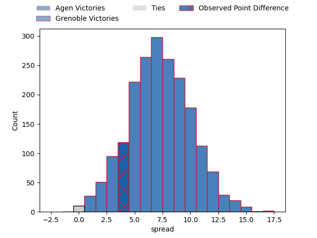
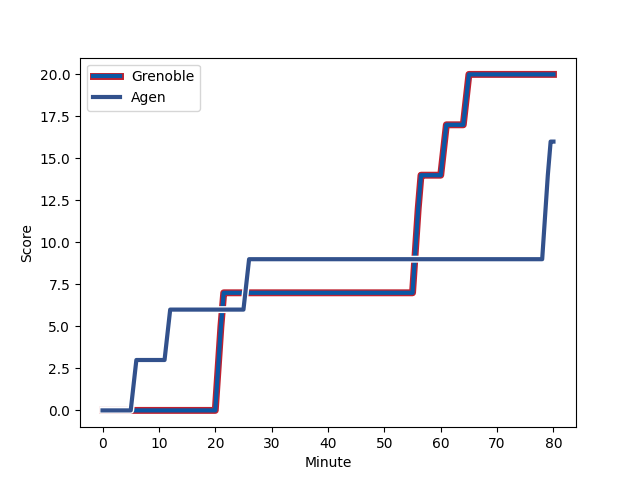
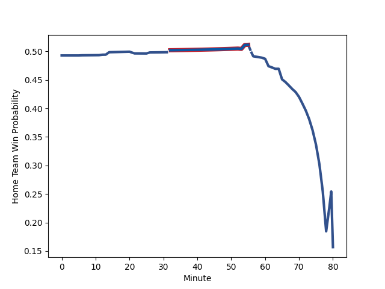

---  
layout: page  
title: Agen at Grenoble; 16-20  
date: 2023-02-03 21:00:00 18:00:00 -0500  
categories: match review  
---
# Agen at Grenoble; 16-20

# Club Level Predictions

The first set of predictions treats a club as the smallest object, as the club develops its members, organizes a gameplan, and deploys its players as needed for each match. This club model has a prediction of 0.696, which translates to predicting Grenoble to win by 7.2.

Each club has a rating and a rating deviation (simiar to a Glicko system), and expected performances can be generated. This allows for simulated matches and spreads like the ones below.
## Projected Performances

## Projected Spreads

## Projected Results

# Player Level Predictions

Treating teams instead as an entity made up of the currently active players, I have ratings for each player in an altogether different system. These can be combined to form team ratings once teamsheets are announced, weighting starters a bit higher than the reserves. After the match is played, players can be weighted by their minutes on the field, allowing for an accurate measure of the team's composition. With these compiled team ratings, we can make predictions, measure inaccuracy, and update the individual player ratings.
## Prediction with Player Minutes: Grenoble by 2.7

Agen by 1.3 on a neutral field
## Scores over Time

## Win Probability over Time

## Prediction without Player Minutes: Grenoble by 8.9

Grenoble by 4.9 on a neutral pitch

|   Away Minutes | Away Player                                                         |   Away elo |   Away Percentile |   Number |   Home Percentile |   Home elo | Home Player                                                           |   Home Minutes |
|---------------:|:--------------------------------------------------------------------|-----------:|------------------:|---------:|------------------:|-----------:|:----------------------------------------------------------------------|---------------:|
|             60 | [Richard Barrington](..//playerfiles//RichardBarrington_cleaned.md) |      94    |                48 |        1 |                97 |     126.82 | [Zurabi Zhvania](..//playerfiles//ZurabiZhvania_cleaned.md)           |             41 |
|             60 | [Mike Sosene-Feagai](..//playerfiles//MikeSosene-Feagai_cleaned.md) |      97.84 |                58 |        2 |                62 |      97.89 | [Mathis Sarragallet](..//playerfiles//MathisSarragallet_cleaned.md)   |             54 |
|             64 | [Beau Farrance](..//playerfiles//BeauFarrance_cleaned.md)           |      96.89 |               nan |        3 |                64 |      97.7  | [Regis Montagne](..//playerfiles//RegisMontagne_cleaned.md)           |             64 |
|             60 | [Joe Maksymiw](..//playerfiles//JoeMaksymiw_cleaned.md)             |      73.22 |                 6 |        4 |                60 |      99.3  | [Thomas Lainault](..//playerfiles//ThomasLainault_cleaned.md)         |             80 |
|             80 | [Zak Farrance](..//playerfiles//ZakFarrance_cleaned.md)             |      86.54 |                26 |        5 |                81 |     110.91 | [Tanginoa Halaifonua](..//playerfiles//TanginoaHalaifonua_cleaned.md) |             80 |
|             80 | [Matthieu Bonnet](..//playerfiles//MatthieuBonnet_cleaned.md)       |     107.87 |                81 |        6 |                21 |      85.44 | [Marnus Schoeman](..//playerfiles//MarnusSchoeman_cleaned.md)         |             80 |
|             80 | [Valentin Gayraud](..//playerfiles//ValentinGayraud_cleaned.md)     |      97.23 |               nan |        7 |                75 |     106.51 | [Steeve Blanc-Mappaz](..//playerfiles//SteeveBlanc-Mappaz_cleaned.md) |             53 |
|             64 | [Fotu Lokotui](..//playerfiles//FotuLokotui_cleaned.md)             |     115.59 |                87 |        8 |                82 |     109.73 | [Pio Muarua](..//playerfiles//PioMuarua_cleaned.md)                   |             64 |
|             69 | [Theo Idjellidaine](..//playerfiles//TheoIdjellidaine_cleaned.md)   |      79.87 |                18 |        9 |                99 |     142.49 | [Felipe Ezcurra](..//playerfiles//FelipeEzcurra_cleaned.md)           |             54 |
|             80 | [Elton Jantjies](..//playerfiles//EltonJantjies_cleaned.md)         |     115.89 |                85 |       10 |                13 |      82.68 | [Thomas Fortunel](..//playerfiles//ThomasFortunel_cleaned.md)         |             71 |
|             80 | [Jefferson Joseph](..//playerfiles//JeffersonJoseph_cleaned.md)     |     101.76 |                66 |       11 |                24 |      86.93 | [Lucas Dupont](..//playerfiles//LucasDupont_cleaned.md)               |             67 |
|             80 | [Harry Sloan](..//playerfiles//HarrySloan_cleaned.md)               |     103.68 |                68 |       12 |                79 |     113.39 | [Romain Barthelemy](..//playerfiles//RomainBarthelemy_cleaned.md)     |             80 |
|             80 | [Theo Belan](..//playerfiles//TheoBelan_cleaned.md)                 |     104.72 |                70 |       13 |                15 |      81.37 | [Terrence Hepetema](..//playerfiles//TerrenceHepetema_cleaned.md)     |             80 |
|             80 | [Timilai Rokoduru](..//playerfiles//TimilaiRokoduru_cleaned.md)     |     148.28 |                99 |       14 |                33 |      89.95 | [Karim Qadiri](..//playerfiles//KarimQadiri_cleaned.md)               |             80 |
|             14 | [Loris Tolot](..//playerfiles//LorisTolot_cleaned.md)               |      62.96 |                 3 |       15 |                78 |     111.78 | [Julien Farnoux](..//playerfiles//JulienFarnoux_cleaned.md)           |             80 |
|             18 | [Romain Darchen](..//playerfiles//RomainDarchen_cleaned.md)         |      95    |               nan |       16 |                92 |     113.42 | [Zack Gauthier](..//playerfiles//ZackGauthier_cleaned.md)             |             39 |
|             48 | [Thomas Vincent](..//playerfiles//ThomasVincent_cleaned.md)         |     121.78 |                90 |       17 |                11 |      76.98 | [Thibaut Martel](..//playerfiles//ThibautMartel_cleaned.md)           |             27 |
|             20 | [Florent Guion](..//playerfiles//FlorentGuion_cleaned.md)           |      66.22 |                 3 |       18 |                72 |     105    | [Eric Escande](..//playerfiles//EricEscande_cleaned.md)               |             26 |
|             20 | [Corentin Vernet](..//playerfiles//CorentinVernet_cleaned.md)       |      84.26 |                22 |       19 |                86 |     111.24 | [Lilian Rossi](..//playerfiles//LilianRossi_cleaned.md)               |             26 |
|             20 | [Loris Zarantonello](..//playerfiles//LorisZarantonello_cleaned.md) |     107.64 |                80 |       20 |                32 |      89.71 | [Adrien Vigne](..//playerfiles//AdrienVigne_cleaned.md)               |             16 |
|             16 | [Malik Hamadache](..//playerfiles//MalikHamadache_cleaned.md)       |     103.31 |                71 |       21 |                27 |      88.64 | [Irakli Aptsiauri](..//playerfiles//IrakliAptsiauri_cleaned.md)       |             16 |
|             16 | [Evan Olmstead](..//playerfiles//EvanOlmstead_cleaned.md)           |     101.51 |                65 |       22 |                38 |      91.68 | [Wilfried Hulleu](..//playerfiles//WilfriedHulleu_cleaned.md)         |             13 |
|             11 | [Dorian Bellot](..//playerfiles//DorianBellot_cleaned.md)           |      93.82 |                45 |       23 |               nan |      95    | [Max Clement](..//playerfiles//MaxClement_cleaned.md)                 |              9 |

