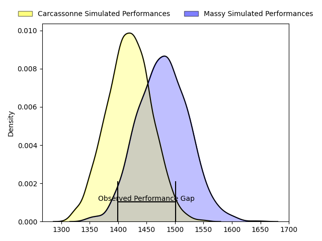
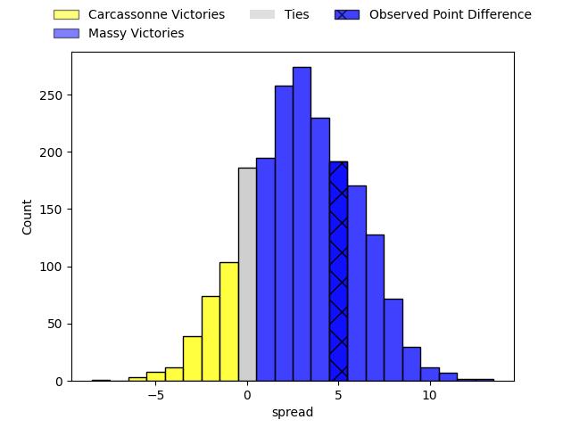
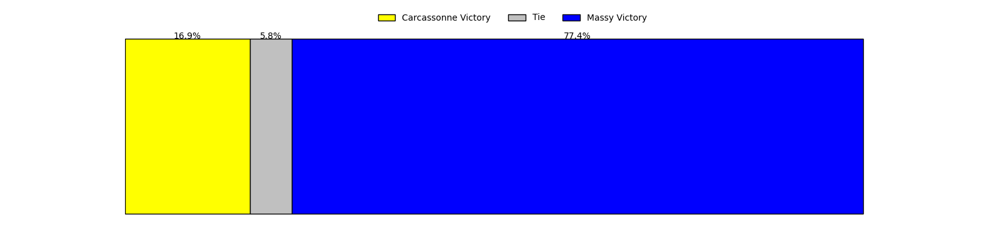
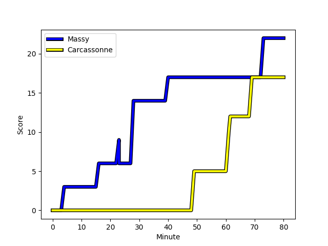
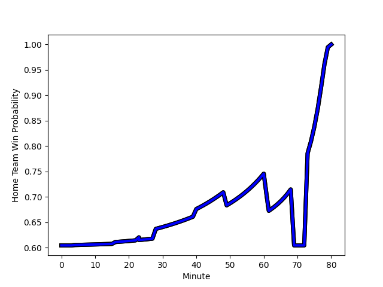

---  
layout: page  
title: Carcassonne at Massy; 17-22  
date: 2023-02-03 19:30:00 18:00:00 -0500  
categories: match review  
---
# Carcassonne at Massy; 17-22

# Club Level Predictions

The first set of predictions treats a club as the smallest object, as the club develops its members, organizes a gameplan, and deploys its players as needed for each match. This club model has a prediction of 0.608, which translates to predicting Massy to win by 3.9.

Each club has a rating and a rating deviation (simiar to a Glicko system), and expected performances can be generated. This allows for simulated matches and spreads like the ones below.
## Projected Performances

## Projected Spreads

## Projected Results

# Player Level Predictions

Treating teams instead as an entity made up of the currently active players, I have ratings for each player in an altogether different system. These can be combined to form team ratings once teamsheets are announced, weighting starters a bit higher than the reserves. After the match is played, players can be weighted by their minutes on the field, allowing for an accurate measure of the team's composition. With these compiled team ratings, we can make predictions, measure inaccuracy, and update the individual player ratings.
## Prediction with Player Minutes: Massy by 22.4

Massy by 18.4 on a neutral field
## Scores over Time

## Win Probability over Time

There were 9 large changes in win probability in this match
## Prediction without Player Minutes: Massy by 26.4

Massy by 22.4 on a neutral pitch

|   Away Minutes | Away Player                                                              |   Away elo |   Away Percentile |   Number |   Home Percentile |   Home elo | Home Player                                                                     |   Home Minutes |
|---------------:|:-------------------------------------------------------------------------|-----------:|------------------:|---------:|------------------:|-----------:|:--------------------------------------------------------------------------------|---------------:|
|             80 | [Jules Martinez](..//playerfiles//JulesMartinez_cleaned.md)              |      77.83 |                 8 |        1 |                19 |      86.28 | [Fernandez Correa](..//playerfiles//FernandezCorrea_cleaned.md)                 |             47 |
|             28 | [Jules Martinez](..//playerfiles//JulesMartinez_cleaned.md)              |      77.83 |                 8 |        1 |                19 |      86.28 | [Fernandez Correa](..//playerfiles//FernandezCorrea_cleaned.md)                 |             47 |
|             80 | [Jules Martinez](..//playerfiles//JulesMartinez_cleaned.md)              |      77.83 |                 8 |        1 |                19 |      86.28 | [Fernandez Correa](..//playerfiles//FernandezCorrea_cleaned.md)                 |             80 |
|             28 | [Jules Martinez](..//playerfiles//JulesMartinez_cleaned.md)              |      77.83 |                 8 |        1 |                19 |      86.28 | [Fernandez Correa](..//playerfiles//FernandezCorrea_cleaned.md)                 |             80 |
|             67 | [Luka Petriashvili](..//playerfiles//LukaPetriashvili_cleaned.md)        |     101.51 |                68 |        2 |                98 |     135.82 | [Pierre Trassoudaine](..//playerfiles//PierreTrassoudaine_cleaned.md)           |             51 |
|             80 | [Luka Petriashvili](..//playerfiles//LukaPetriashvili_cleaned.md)        |     101.51 |                68 |        2 |                98 |     135.82 | [Pierre Trassoudaine](..//playerfiles//PierreTrassoudaine_cleaned.md)           |             51 |
|             67 | [Luka Petriashvili](..//playerfiles//LukaPetriashvili_cleaned.md)        |     101.51 |                68 |        2 |                98 |     135.82 | [Pierre Trassoudaine](..//playerfiles//PierreTrassoudaine_cleaned.md)           |             80 |
|             80 | [Luka Petriashvili](..//playerfiles//LukaPetriashvili_cleaned.md)        |     101.51 |                68 |        2 |                98 |     135.82 | [Pierre Trassoudaine](..//playerfiles//PierreTrassoudaine_cleaned.md)           |             80 |
|             80 | [Vakhtangi Akhobadze](..//playerfiles//VakhtangiAkhobadze_cleaned.md)    |      50.58 |                 0 |        3 |                67 |     102.82 | [Tijde Visser](..//playerfiles//TijdeVisser_cleaned.md)                         |             80 |
|             28 | [Vakhtangi Akhobadze](..//playerfiles//VakhtangiAkhobadze_cleaned.md)    |      50.58 |                 0 |        3 |                67 |     102.82 | [Tijde Visser](..//playerfiles//TijdeVisser_cleaned.md)                         |             80 |
|             80 | [Vakhtangi Akhobadze](..//playerfiles//VakhtangiAkhobadze_cleaned.md)    |      50.58 |                 0 |        3 |                67 |     102.82 | [Tijde Visser](..//playerfiles//TijdeVisser_cleaned.md)                         |             46 |
|             28 | [Vakhtangi Akhobadze](..//playerfiles//VakhtangiAkhobadze_cleaned.md)    |      50.58 |                 0 |        3 |                67 |     102.82 | [Tijde Visser](..//playerfiles//TijdeVisser_cleaned.md)                         |             46 |
|             80 | [Romain Manchia](..//playerfiles//RomainManchia_cleaned.md)              |      66.71 |                 3 |        4 |                23 |      86.09 | [Abongile Nonkontwana](..//playerfiles//AbongileNonkontwana_cleaned.md)         |             80 |
|             72 | [Romain Manchia](..//playerfiles//RomainManchia_cleaned.md)              |      66.71 |                 3 |        4 |                23 |      86.09 | [Abongile Nonkontwana](..//playerfiles//AbongileNonkontwana_cleaned.md)         |             80 |
|             80 | [Rob Harley](..//playerfiles//RobHarley_cleaned.md)                      |     118.36 |                89 |        5 |                42 |      92.89 | [Andrew Chauveau](..//playerfiles//AndrewChauveau_cleaned.md)                   |             80 |
|             80 | [Nick Grigg](..//playerfiles//NickGrigg_cleaned.md)                      |      99.44 |                58 |        6 |                38 |      93.96 | [Tony Tissot](..//playerfiles//TonyTissot_cleaned.md)                           |             80 |
|             80 | [Nick Grigg](..//playerfiles//NickGrigg_cleaned.md)                      |      99.44 |                58 |        6 |                38 |      93.96 | [Tony Tissot](..//playerfiles//TonyTissot_cleaned.md)                           |             34 |
|             80 | [Stephane Onambele](..//playerfiles//StephaneOnambele_cleaned.md)        |      66.43 |                 2 |        7 |                72 |     105.01 | [Samuel Nollet](..//playerfiles//SamuelNollet_cleaned.md)                       |             80 |
|             41 | [Stephane Onambele](..//playerfiles//StephaneOnambele_cleaned.md)        |      66.43 |                 2 |        7 |                72 |     105.01 | [Samuel Nollet](..//playerfiles//SamuelNollet_cleaned.md)                       |             80 |
|             80 | [Pierre Reynaud](..//playerfiles//PierreReynaud_cleaned.md)              |     102.91 |                68 |        8 |                11 |      77.78 | [Dylan Lam](..//playerfiles//DylanLam_cleaned.md)                               |             59 |
|             80 | [Pierre Reynaud](..//playerfiles//PierreReynaud_cleaned.md)              |     102.91 |                68 |        8 |                11 |      77.78 | [Dylan Lam](..//playerfiles//DylanLam_cleaned.md)                               |             80 |
|             80 | [Samuel Marques](..//playerfiles//SamuelMarques_cleaned.md)              |     123.01 |                95 |        9 |                55 |      99.53 | [Gaetan Pichon](..//playerfiles//GaetanPichon_cleaned.md)                       |             57 |
|             80 | [Samuel Marques](..//playerfiles//SamuelMarques_cleaned.md)              |     123.01 |                95 |        9 |                55 |      99.53 | [Gaetan Pichon](..//playerfiles//GaetanPichon_cleaned.md)                       |             80 |
|             80 | [Chris Hilsenbeck](..//playerfiles//ChrisHilsenbeck_cleaned.md)          |      99.42 |                56 |       10 |                47 |      99.21 | [Will Haydon-Wood](..//playerfiles//WillHaydon-Wood_cleaned.md)                 |             80 |
|             41 | [Chris Hilsenbeck](..//playerfiles//ChrisHilsenbeck_cleaned.md)          |      99.42 |                56 |       10 |                47 |      99.21 | [Will Haydon-Wood](..//playerfiles//WillHaydon-Wood_cleaned.md)                 |             57 |
|             41 | [Chris Hilsenbeck](..//playerfiles//ChrisHilsenbeck_cleaned.md)          |      99.42 |                56 |       10 |                47 |      99.21 | [Will Haydon-Wood](..//playerfiles//WillHaydon-Wood_cleaned.md)                 |             80 |
|             80 | [Chris Hilsenbeck](..//playerfiles//ChrisHilsenbeck_cleaned.md)          |      99.42 |                56 |       10 |                47 |      99.21 | [Will Haydon-Wood](..//playerfiles//WillHaydon-Wood_cleaned.md)                 |             57 |
|             80 | [Clément Clavières](..//playerfiles//ClémentClavières_cleaned.md)        |      95.35 |                48 |       11 |                42 |      93.37 | [Nathan Farissier](..//playerfiles//NathanFarissier_cleaned.md)                 |             80 |
|             80 | [Aaron Carroll](..//playerfiles//AaronCarroll_cleaned.md)                |     114.89 |                85 |       12 |                 7 |      74.4  | [Mathieu Guillomot](..//playerfiles//MathieuGuillomot_cleaned.md)               |             80 |
|             41 | [Pierre Aguillon](..//playerfiles//PierreAguillon_cleaned.md)            |      53.12 |                 0 |       13 |                44 |      94.25 | [JJ Taulagi](..//playerfiles//JJTaulagi_cleaned.md)                             |             80 |
|             41 | [Pierre Aguillon](..//playerfiles//PierreAguillon_cleaned.md)            |      53.12 |                 0 |       13 |                44 |      94.25 | [JJ Taulagi](..//playerfiles//JJTaulagi_cleaned.md)                             |             46 |
|             80 | [Pierre Aguillon](..//playerfiles//PierreAguillon_cleaned.md)            |      53.12 |                 0 |       13 |                44 |      94.25 | [JJ Taulagi](..//playerfiles//JJTaulagi_cleaned.md)                             |             46 |
|             80 | [Pierre Aguillon](..//playerfiles//PierreAguillon_cleaned.md)            |      53.12 |                 0 |       13 |                44 |      94.25 | [JJ Taulagi](..//playerfiles//JJTaulagi_cleaned.md)                             |             80 |
|             80 | [Benoit Jasmin](..//playerfiles//BenoitJasmin_cleaned.md)                |     135.39 |                97 |       14 |                43 |      91.01 | [Thomas Roziere](..//playerfiles//ThomasRoziere_cleaned.md)                     |             80 |
|             80 | [Baptiste Mouchous](..//playerfiles//BaptisteMouchous_cleaned.md)        |      83.18 |                16 |       15 |                44 |      94.64 | [Romain Clouté](..//playerfiles//RomainClouté_cleaned.md)                       |             80 |
|             58 | [Baptiste Mouchous](..//playerfiles//BaptisteMouchous_cleaned.md)        |      83.18 |                16 |       15 |                44 |      94.64 | [Romain Clouté](..//playerfiles//RomainClouté_cleaned.md)                       |             80 |
|             52 | [Youssef Amrouni](..//playerfiles//YoussefAmrouni_cleaned.md)            |      76.21 |                 7 |       16 |                43 |      94.64 | [Yohann Gbizie](..//playerfiles//YohannGbizie_cleaned.md)                       |             46 |
|             52 | [Soso Bekoshvili](..//playerfiles//SosoBekoshvili_cleaned.md)            |      88.17 |                24 |       17 |                83 |     108.92 | [Nicolas Ferrer](..//playerfiles//NicolasFerrer_cleaned.md)                     |             34 |
|             39 | [Dorian Jones](..//playerfiles//DorianJones_cleaned.md)                  |     101.62 |                61 |       18 |                59 |      99.8  | [Victorien Jacomme](..//playerfiles//VictorienJacomme_cleaned.md)               |             34 |
|             39 | [Jordan Puletua](..//playerfiles//JordanPuletua_cleaned.md)              |      60.18 |                 1 |       19 |                50 |      96.05 | [Robin Poipy](..//playerfiles//RobinPoipy_cleaned.md)                           |             33 |
|             39 | [Rynard Landman](..//playerfiles//RynardLandman_cleaned.md)              |     102.51 |                67 |       20 |                42 |      94.61 | [Pierre-Alexandre Duclieu](..//playerfiles//Pierre-AlexandreDuclieu_cleaned.md) |             29 |
|             22 | [Damien Añon](..//playerfiles//DamienAñon_cleaned.md)                    |      90.22 |                32 |       21 |                95 |     124.38 | [Benjamin Prier](..//playerfiles//BenjaminPrier_cleaned.md)                     |             23 |
|             13 | [Raphael Carbou](..//playerfiles//RaphaelCarbou_cleaned.md)              |      79.86 |                 5 |       22 |                66 |     103.31 | [Massimo Ortolan](..//playerfiles//MassimoOrtolan_cleaned.md)                   |             23 |
|              8 | [Come Clayver Joussain](..//playerfiles//ComeClayverJoussain_cleaned.md) |      97.48 |                55 |       23 |                 8 |      73.43 | [Koen Bloemen](..//playerfiles//KoenBloemen_cleaned.md)                         |             21 |

