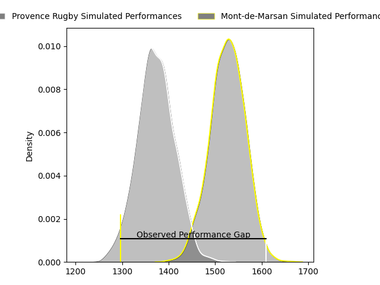
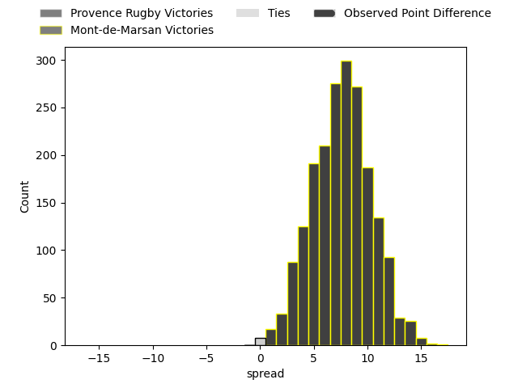
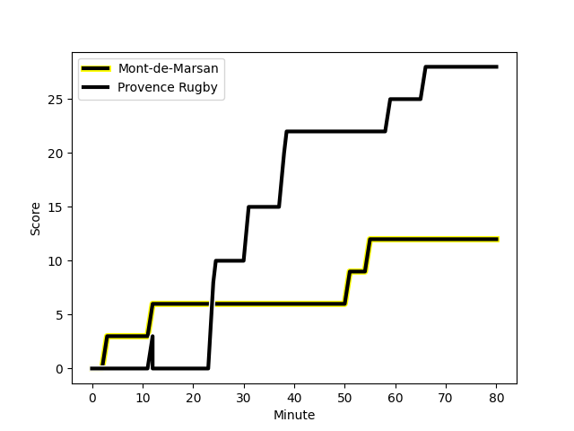
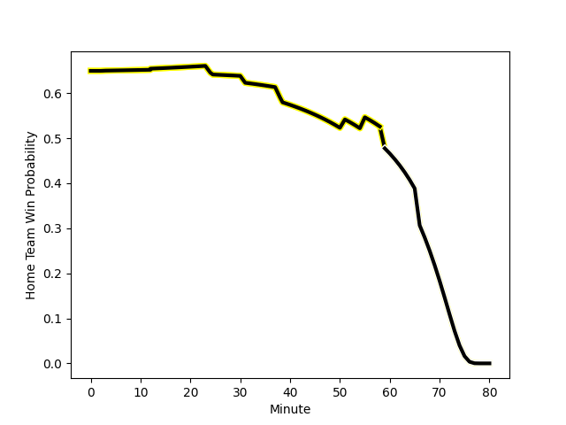

---  
layout: page  
title: Provence Rugby at Mont-de-Marsan; 28-12  
date: 2023-02-03 19:30:00 18:00:00 -0500  
categories: match review  
---
# Provence Rugby at Mont-de-Marsan; 28-12

# Club Level Predictions

The first set of predictions treats a club as the smallest object, as the club develops its members, organizes a gameplan, and deploys its players as needed for each match. This club model has a prediction of 0.685, which translates to predicting Mont-de-Marsan to win by 6.8.

Each club has a rating and a rating deviation (simiar to a Glicko system), and expected performances can be generated. This allows for simulated matches and spreads like the ones below.
## Projected Performances

## Projected Spreads

## Projected Results

# Player Level Predictions

Treating teams instead as an entity made up of the currently active players, I have ratings for each player in an altogether different system. These can be combined to form team ratings once teamsheets are announced, weighting starters a bit higher than the reserves. After the match is played, players can be weighted by their minutes on the field, allowing for an accurate measure of the team's composition. With these compiled team ratings, we can make predictions, measure inaccuracy, and update the individual player ratings.
## Prediction with Player Minutes: Mont-de-Marsan by 30.8

Mont-de-Marsan by 26.8 on a neutral field
## Scores over Time

## Win Probability over Time

## Prediction without Player Minutes: Mont-de-Marsan by 30.2

Mont-de-Marsan by 26.2 on a neutral pitch

|   Away Minutes | Away Player                                                              |   Away elo |   Away Percentile |   Number |   Home Percentile |   Home elo | Home Player                                                                      |   Home Minutes |
|---------------:|:-------------------------------------------------------------------------|-----------:|------------------:|---------:|------------------:|-----------:|:---------------------------------------------------------------------------------|---------------:|
|             55 | [Julius Nostadt](..//playerfiles//JuliusNostadt_cleaned.md)              |      83.31 |                16 |        1 |                82 |     112.56 | [Max Curie](..//playerfiles//MaxCurie_cleaned.md)                                |             41 |
|             80 | [Julius Nostadt](..//playerfiles//JuliusNostadt_cleaned.md)              |      83.31 |                16 |        1 |                82 |     112.56 | [Max Curie](..//playerfiles//MaxCurie_cleaned.md)                                |             41 |
|             55 | [Julius Nostadt](..//playerfiles//JuliusNostadt_cleaned.md)              |      83.31 |                16 |        1 |                82 |     112.56 | [Max Curie](..//playerfiles//MaxCurie_cleaned.md)                                |             80 |
|             80 | [Julius Nostadt](..//playerfiles//JuliusNostadt_cleaned.md)              |      83.31 |                16 |        1 |                82 |     112.56 | [Max Curie](..//playerfiles//MaxCurie_cleaned.md)                                |             80 |
|             43 | [German Kessler Lordon](..//playerfiles//GermanKesslerLordon_cleaned.md) |     102.72 |                71 |        2 |                56 |      97.08 | [Romain Laterrade](..//playerfiles//RomainLaterrade_cleaned.md)                  |             60 |
|             80 | [German Kessler Lordon](..//playerfiles//GermanKesslerLordon_cleaned.md) |     102.72 |                71 |        2 |                56 |      97.08 | [Romain Laterrade](..//playerfiles//RomainLaterrade_cleaned.md)                  |             60 |
|             43 | [German Kessler Lordon](..//playerfiles//GermanKesslerLordon_cleaned.md) |     102.72 |                71 |        2 |                56 |      97.08 | [Romain Laterrade](..//playerfiles//RomainLaterrade_cleaned.md)                  |             80 |
|             80 | [German Kessler Lordon](..//playerfiles//GermanKesslerLordon_cleaned.md) |     102.72 |                71 |        2 |                56 |      97.08 | [Romain Laterrade](..//playerfiles//RomainLaterrade_cleaned.md)                  |             80 |
|             80 | [Dave Lolohea](..//playerfiles//DaveLolohea_cleaned.md)                  |      80    |                11 |        3 |                94 |     119.6  | [Anthony Alves](..//playerfiles//AnthonyAlves_cleaned.md)                        |             80 |
|             60 | [Dave Lolohea](..//playerfiles//DaveLolohea_cleaned.md)                  |      80    |                11 |        3 |                94 |     119.6  | [Anthony Alves](..//playerfiles//AnthonyAlves_cleaned.md)                        |             80 |
|             60 | [Dave Lolohea](..//playerfiles//DaveLolohea_cleaned.md)                  |      80    |                11 |        3 |                94 |     119.6  | [Anthony Alves](..//playerfiles//AnthonyAlves_cleaned.md)                        |             41 |
|             80 | [Dave Lolohea](..//playerfiles//DaveLolohea_cleaned.md)                  |      80    |                11 |        3 |                94 |     119.6  | [Anthony Alves](..//playerfiles//AnthonyAlves_cleaned.md)                        |             41 |
|             51 | [Jérôme Dufour](..//playerfiles//JérômeDufour_cleaned.md)                |     106.16 |                71 |        4 |                95 |     129.3  | [Nicolas Garrault](..//playerfiles//NicolasGarrault_cleaned.md)                  |             80 |
|             80 | [Jérôme Dufour](..//playerfiles//JérômeDufour_cleaned.md)                |     106.16 |                71 |        4 |                95 |     129.3  | [Nicolas Garrault](..//playerfiles//NicolasGarrault_cleaned.md)                  |             80 |
|             80 | [Clément Chartier](..//playerfiles//ClémentChartier_cleaned.md)          |     112.34 |                84 |        5 |                22 |      84.93 | [Andrei Ostrikov](..//playerfiles//AndreiOstrikov_cleaned.md)                    |             80 |
|             80 | [Guillaume Piazzoli](..//playerfiles//GuillaumePiazzoli_cleaned.md)      |      97.63 |                53 |        6 |                87 |     124.82 | [Aurélien Lisena](..//playerfiles//AurélienLisena_cleaned.md)                    |             80 |
|             68 | [Jessy Jegerlehner](..//playerfiles//JessyJegerlehner_cleaned.md)        |      70.36 |                 4 |        7 |                41 |      92.54 | [Léo Banos](..//playerfiles//LéoBanos_cleaned.md)                                |             41 |
|             80 | [Jessy Jegerlehner](..//playerfiles//JessyJegerlehner_cleaned.md)        |      70.36 |                 4 |        7 |                41 |      92.54 | [Léo Banos](..//playerfiles//LéoBanos_cleaned.md)                                |             41 |
|             68 | [Jessy Jegerlehner](..//playerfiles//JessyJegerlehner_cleaned.md)        |      70.36 |                 4 |        7 |                41 |      92.54 | [Léo Banos](..//playerfiles//LéoBanos_cleaned.md)                                |             80 |
|             80 | [Jessy Jegerlehner](..//playerfiles//JessyJegerlehner_cleaned.md)        |      70.36 |                 4 |        7 |                41 |      92.54 | [Léo Banos](..//playerfiles//LéoBanos_cleaned.md)                                |             80 |
|             80 | [Carl Axtens](..//playerfiles//CarlAxtens_cleaned.md)                    |      97.8  |                50 |        8 |                87 |     116.9  | [Veresa Tuqovu Ramototabua](..//playerfiles//VeresaTuqovuRamototabua_cleaned.md) |             80 |
|             80 | [Carl Axtens](..//playerfiles//CarlAxtens_cleaned.md)                    |      97.8  |                50 |        8 |                87 |     116.9  | [Veresa Tuqovu Ramototabua](..//playerfiles//VeresaTuqovuRamototabua_cleaned.md) |             60 |
|             76 | [Joris Cazenave](..//playerfiles//JorisCazenave_cleaned.md)              |      74.82 |                 7 |        9 |                17 |      82.95 | [Christophe Loustalot](..//playerfiles//ChristopheLoustalot_cleaned.md)          |             80 |
|             76 | [Joris Cazenave](..//playerfiles//JorisCazenave_cleaned.md)              |      74.82 |                 7 |        9 |                17 |      82.95 | [Christophe Loustalot](..//playerfiles//ChristopheLoustalot_cleaned.md)          |             60 |
|             80 | [Joris Cazenave](..//playerfiles//JorisCazenave_cleaned.md)              |      74.82 |                 7 |        9 |                17 |      82.95 | [Christophe Loustalot](..//playerfiles//ChristopheLoustalot_cleaned.md)          |             60 |
|             80 | [Joris Cazenave](..//playerfiles//JorisCazenave_cleaned.md)              |      74.82 |                 7 |        9 |                17 |      82.95 | [Christophe Loustalot](..//playerfiles//ChristopheLoustalot_cleaned.md)          |             80 |
|             80 | [Johnny McPhillips](..//playerfiles//JohnnyMcPhillips_cleaned.md)        |     105.52 |                72 |       10 |                68 |     103.82 | [Joris Pialot](..//playerfiles//JorisPialot_cleaned.md)                          |             41 |
|             61 | [Johnny McPhillips](..//playerfiles//JohnnyMcPhillips_cleaned.md)        |     105.52 |                72 |       10 |                68 |     103.82 | [Joris Pialot](..//playerfiles//JorisPialot_cleaned.md)                          |             41 |
|             80 | [Johnny McPhillips](..//playerfiles//JohnnyMcPhillips_cleaned.md)        |     105.52 |                72 |       10 |                68 |     103.82 | [Joris Pialot](..//playerfiles//JorisPialot_cleaned.md)                          |             80 |
|             61 | [Johnny McPhillips](..//playerfiles//JohnnyMcPhillips_cleaned.md)        |     105.52 |                72 |       10 |                68 |     103.82 | [Joris Pialot](..//playerfiles//JorisPialot_cleaned.md)                          |             80 |
|             80 | [Nadir Bouhedjeur](..//playerfiles//NadirBouhedjeur_cleaned.md)          |     107.14 |                76 |       11 |                70 |     103.58 | [Kaminieli Rasaku](..//playerfiles//KaminieliRasaku_cleaned.md)                  |             80 |
|             80 | [Kaveinga Finau](..//playerfiles//KaveingaFinau_cleaned.md)              |     104.62 |                70 |       12 |                60 |      99.46 | [Lucas Mensa](..//playerfiles//LucasMensa_cleaned.md)                            |             80 |
|             80 | [Peter Betham](..//playerfiles//PeterBetham_cleaned.md)                  |     126.86 |                94 |       13 |                37 |      91.1  | [Jules Even](..//playerfiles//JulesEven_cleaned.md)                              |             60 |
|             80 | [Peter Betham](..//playerfiles//PeterBetham_cleaned.md)                  |     126.86 |                94 |       13 |                37 |      91.1  | [Jules Even](..//playerfiles//JulesEven_cleaned.md)                              |             80 |
|             80 | [Kevin Bly](..//playerfiles//KevinBly_cleaned.md)                        |     113.65 |                84 |       14 |                45 |      94.97 | [Alexandre de Nardi](..//playerfiles//AlexandredeNardi_cleaned.md)               |             80 |
|             80 | [Florent Massip](..//playerfiles//FlorentMassip_cleaned.md)              |     103.21 |                63 |       15 |                96 |     142.6  | [Yoann Laousse Azpiazu](..//playerfiles//YoannLaousseAzpiazu_cleaned.md)         |             80 |
|             37 | [Lucas Martin](..//playerfiles//LucasMartin_cleaned.md)                  |      89.12 |                23 |       16 |                 3 |      69.94 | [Jean-Luc Innocente](..//playerfiles//Jean-LucInnocente_cleaned.md)              |             39 |
|             29 | [Alexandre Flanquart](..//playerfiles//AlexandreFlanquart_cleaned.md)    |      92.5  |                40 |       17 |                18 |      85.19 | [Lasha Macharashvili](..//playerfiles//LashaMacharashvili_cleaned.md)            |             39 |
|             25 | [Federico Wegrzyn](..//playerfiles//FedericoWegrzyn_cleaned.md)          |     107.9  |                82 |       18 |                19 |      82.97 | [Mike Faleafa](..//playerfiles//MikeFaleafa_cleaned.md)                          |             39 |
|             20 | [Thomas Vernet](..//playerfiles//ThomasVernet_cleaned.md)                |      94.59 |                34 |       19 |                93 |     125.18 | [Willie du Plessis](..//playerfiles//WillieduPlessis_cleaned.md)                 |             39 |
|             19 | [Enzo Selponi](..//playerfiles//EnzoSelponi_cleaned.md)                  |     111.77 |                80 |       20 |                38 |      93.29 | [Baptiste Canut](..//playerfiles//BaptisteCanut_cleaned.md)                      |             20 |
|              4 | [Nicolas Mousties](..//playerfiles//NicolasMousties_cleaned.md)          |      74.04 |                 6 |       21 |                56 |      98.27 | [Ambrose Curtis](..//playerfiles//AmbroseCurtis_cleaned.md)                      |             20 |
|              8 | [Adrian Sanday](..//playerfiles//AdrianSanday_cleaned.md)                |     113.82 |                84 |       22 |                40 |      92.19 | [Simon Labouyrie](..//playerfiles//SimonLabouyrie_cleaned.md)                    |             20 |
|              4 | [Jeremie Martin](..//playerfiles//JeremieMartin_cleaned.md)              |      94.2  |               nan |       23 |                87 |     115.81 | [Aston Fortuin](..//playerfiles//AstonFortuin_cleaned.md)                        |             20 |

