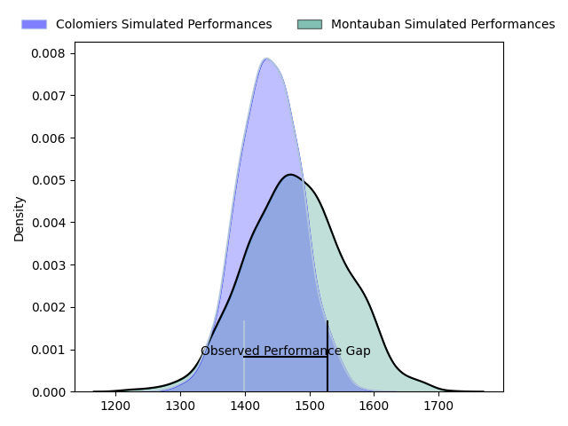
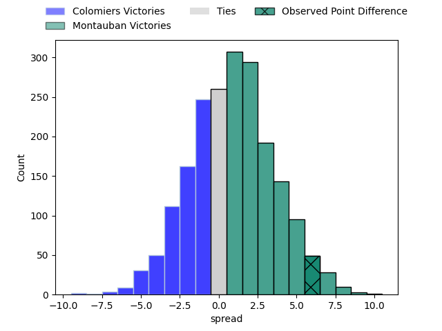
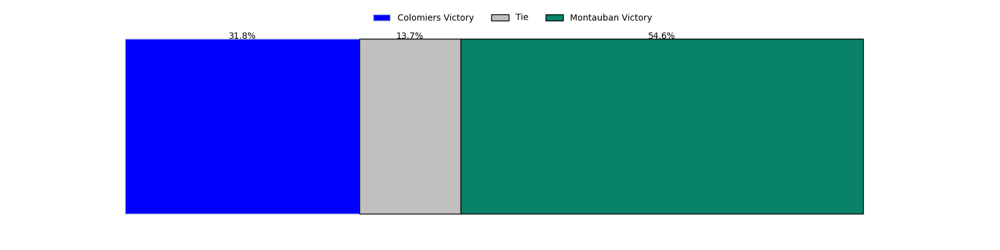
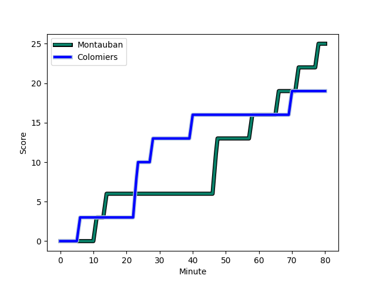
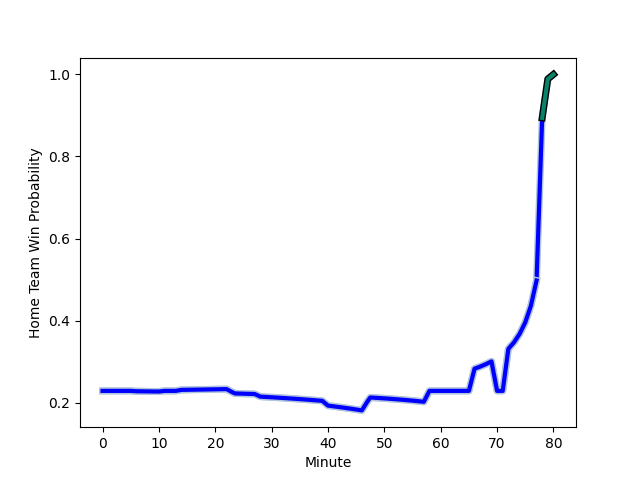

---  
layout: page  
title: Colomiers at Montauban; 19-25  
date: 2023-02-03 19:30:00 18:00:00 -0500  
categories: match review  
---
# Colomiers at Montauban; 19-25

# Club Level Predictions

The first set of predictions treats a club as the smallest object, as the club develops its members, organizes a gameplan, and deploys its players as needed for each match. This club model has a prediction of 0.5, which translates to predicting Montauban to win by 0.0.

Each club has a rating and a rating deviation (simiar to a Glicko system), and expected performances can be generated. This allows for simulated matches and spreads like the ones below.
## Projected Performances

## Projected Spreads

## Projected Results

# Player Level Predictions

Treating teams instead as an entity made up of the currently active players, I have ratings for each player in an altogether different system. These can be combined to form team ratings once teamsheets are announced, weighting starters a bit higher than the reserves. After the match is played, players can be weighted by their minutes on the field, allowing for an accurate measure of the team's composition. With these compiled team ratings, we can make predictions, measure inaccuracy, and update the individual player ratings.
## Prediction with Player Minutes: Colomiers by 48.7

Colomiers by 52.7 on a neutral field
## Scores over Time

## Win Probability over Time

## Prediction without Player Minutes: Colomiers by 51.4

Colomiers by 55.4 on a neutral pitch

|   Away Minutes | Away Player                                                         |   Away elo |   Away Percentile |   Number |   Home Percentile |   Home elo | Home Player                                                         |   Home Minutes |
|---------------:|:--------------------------------------------------------------------|-----------:|------------------:|---------:|------------------:|-----------:|:--------------------------------------------------------------------|---------------:|
|             53 | [Thomas Dubois](..//playerfiles//ThomasDubois_cleaned.md)           |      87.43 |                20 |        1 |                26 |      88.4  | [Lucas Seyrolle](..//playerfiles//LucasSeyrolle_cleaned.md)         |             48 |
|             80 | [Thomas Dubois](..//playerfiles//ThomasDubois_cleaned.md)           |      87.43 |                20 |        1 |                26 |      88.4  | [Lucas Seyrolle](..//playerfiles//LucasSeyrolle_cleaned.md)         |             48 |
|             53 | [Thomas Dubois](..//playerfiles//ThomasDubois_cleaned.md)           |      87.43 |                20 |        1 |                26 |      88.4  | [Lucas Seyrolle](..//playerfiles//LucasSeyrolle_cleaned.md)         |             80 |
|             80 | [Thomas Dubois](..//playerfiles//ThomasDubois_cleaned.md)           |      87.43 |                20 |        1 |                26 |      88.4  | [Lucas Seyrolle](..//playerfiles//LucasSeyrolle_cleaned.md)         |             80 |
|             80 | [Andrew Ready](..//playerfiles//AndrewReady_cleaned.md)             |     102.86 |                69 |        2 |                11 |      78.86 | [Arnaud Feltrin](..//playerfiles//ArnaudFeltrin_cleaned.md)         |             80 |
|             53 | [Andrew Ready](..//playerfiles//AndrewReady_cleaned.md)             |     102.86 |                69 |        2 |                11 |      78.86 | [Arnaud Feltrin](..//playerfiles//ArnaudFeltrin_cleaned.md)         |             80 |
|             80 | [Andrew Ready](..//playerfiles//AndrewReady_cleaned.md)             |     102.86 |                69 |        2 |                11 |      78.86 | [Arnaud Feltrin](..//playerfiles//ArnaudFeltrin_cleaned.md)         |             48 |
|             53 | [Andrew Ready](..//playerfiles//AndrewReady_cleaned.md)             |     102.86 |                69 |        2 |                11 |      78.86 | [Arnaud Feltrin](..//playerfiles//ArnaudFeltrin_cleaned.md)         |             48 |
|             53 | [Marco Fepulea'i](..//playerfiles//MarcoFepulea'i_cleaned.md)       |     135.17 |                98 |        3 |                43 |      93.79 | [Mirian Burduli](..//playerfiles//MirianBurduli_cleaned.md)         |             80 |
|             80 | [Marco Fepulea'i](..//playerfiles//MarcoFepulea'i_cleaned.md)       |     135.17 |                98 |        3 |                43 |      93.79 | [Mirian Burduli](..//playerfiles//MirianBurduli_cleaned.md)         |             80 |
|             80 | [Maxime Granouillet](..//playerfiles//MaximeGranouillet_cleaned.md) |     112.3  |                83 |        4 |                52 |      96.65 | [Alexandre Manukula](..//playerfiles//AlexandreManukula_cleaned.md) |             80 |
|             80 | [Maxime Granouillet](..//playerfiles//MaximeGranouillet_cleaned.md) |     112.3  |                83 |        4 |                52 |      96.65 | [Alexandre Manukula](..//playerfiles//AlexandreManukula_cleaned.md) |             41 |
|             61 | [Maxime Granouillet](..//playerfiles//MaximeGranouillet_cleaned.md) |     112.3  |                83 |        4 |                52 |      96.65 | [Alexandre Manukula](..//playerfiles//AlexandreManukula_cleaned.md) |             41 |
|             61 | [Maxime Granouillet](..//playerfiles//MaximeGranouillet_cleaned.md) |     112.3  |                83 |        4 |                52 |      96.65 | [Alexandre Manukula](..//playerfiles//AlexandreManukula_cleaned.md) |             80 |
|             80 | [Alexandre Ricard](..//playerfiles//AlexandreRicard_cleaned.md)     |      97.61 |                51 |        5 |                 0 |      49.79 | [Kevin Gimeno](..//playerfiles//KevinGimeno_cleaned.md)             |             78 |
|             58 | [Alexandre Ricard](..//playerfiles//AlexandreRicard_cleaned.md)     |      97.61 |                51 |        5 |                 0 |      49.79 | [Kevin Gimeno](..//playerfiles//KevinGimeno_cleaned.md)             |             80 |
|             80 | [Alexandre Ricard](..//playerfiles//AlexandreRicard_cleaned.md)     |      97.61 |                51 |        5 |                 0 |      49.79 | [Kevin Gimeno](..//playerfiles//KevinGimeno_cleaned.md)             |             80 |
|             58 | [Alexandre Ricard](..//playerfiles//AlexandreRicard_cleaned.md)     |      97.61 |                51 |        5 |                 0 |      49.79 | [Kevin Gimeno](..//playerfiles//KevinGimeno_cleaned.md)             |             78 |
|             80 | [Anthony Coletta](..//playerfiles//AnthonyColetta_cleaned.md)       |      80.88 |                13 |        6 |                 6 |      72.78 | [Stéphane Munoz](..//playerfiles//StéphaneMunoz_cleaned.md)         |             48 |
|             80 | [Anthony Coletta](..//playerfiles//AnthonyColetta_cleaned.md)       |      80.88 |                13 |        6 |                 6 |      72.78 | [Stéphane Munoz](..//playerfiles//StéphaneMunoz_cleaned.md)         |             80 |
|             80 | [Aldric Lescure](..//playerfiles//AldricLescure_cleaned.md)         |     107.41 |                76 |        7 |                77 |     107    | [Tjuee Uanivi](..//playerfiles//TjueeUanivi_cleaned.md)             |             80 |
|             61 | [Jorick Dastugue](..//playerfiles//JorickDastugue_cleaned.md)       |     105.12 |                70 |        8 |                 0 |      57.01 | [Frédéric Quercy](..//playerfiles//FrédéricQuercy_cleaned.md)       |             80 |
|             80 | [Jorick Dastugue](..//playerfiles//JorickDastugue_cleaned.md)       |     105.12 |                70 |        8 |                 0 |      57.01 | [Frédéric Quercy](..//playerfiles//FrédéricQuercy_cleaned.md)       |             80 |
|             80 | [Edoardo Gori](..//playerfiles//EdoardoGori_cleaned.md)             |     106.62 |                75 |        9 |                90 |     115.19 | [Shaun Venter](..//playerfiles//ShaunVenter_cleaned.md)             |             80 |
|             63 | [Edoardo Gori](..//playerfiles//EdoardoGori_cleaned.md)             |     106.62 |                75 |        9 |                90 |     115.19 | [Shaun Venter](..//playerfiles//ShaunVenter_cleaned.md)             |             80 |
|             80 | [Maxime Javaux](..//playerfiles//MaximeJavaux_cleaned.md)           |      67.46 |                 3 |       10 |                71 |     105.22 | [Jérôme Bosviel](..//playerfiles//JérômeBosviel_cleaned.md)         |             80 |
|             80 | [Valentin Saurs](..//playerfiles//ValentinSaurs_cleaned.md)         |     107.02 |                76 |       11 |                77 |     107.95 | [Bastien Guillemin](..//playerfiles//BastienGuillemin_cleaned.md)   |             80 |
|             80 | [Johan Deysel (Jnr)](..//playerfiles//JohanDeysel(Jnr)_cleaned.md)  |     129.8  |                96 |       12 |               nan |     114.4  | [Sevanaia Galala](..//playerfiles//SevanaiaGalala_cleaned.md)       |             80 |
|             63 | [Johan Deysel (Jnr)](..//playerfiles//JohanDeysel(Jnr)_cleaned.md)  |     129.8  |                96 |       12 |               nan |     114.4  | [Sevanaia Galala](..//playerfiles//SevanaiaGalala_cleaned.md)       |             80 |
|             80 | [Fabien Perrin](..//playerfiles//FabienPerrin_cleaned.md)           |      96.79 |                52 |       13 |                82 |     111.71 | [Maxime Mathy](..//playerfiles//MaximeMathy_cleaned.md)             |             80 |
|             80 | [Peni Rokoduguni](..//playerfiles//PeniRokoduguni_cleaned.md)       |      88.21 |                27 |       14 |                65 |      97.11 | [Raphael Sanchez](..//playerfiles//RaphaelSanchez_cleaned.md)       |             80 |
|             80 | [Thomas Girard](..//playerfiles//ThomasGirard_cleaned.md)           |     102.7  |                62 |       15 |                 6 |      70.2  | [Segundo Tuculet](..//playerfiles//SegundoTuculet_cleaned.md)       |             65 |
|             80 | [Thomas Girard](..//playerfiles//ThomasGirard_cleaned.md)           |     102.7  |                62 |       15 |                 6 |      70.2  | [Segundo Tuculet](..//playerfiles//SegundoTuculet_cleaned.md)       |             80 |
|             27 | [Hugo Djehi](..//playerfiles//HugoDjehi_cleaned.md)                 |      87.35 |                23 |       16 |                63 |     100.82 | [Dimitri Vaotoa](..//playerfiles//DimitriVaotoa_cleaned.md)         |             39 |
|             27 | [Hugo Pirlet](..//playerfiles//HugoPirlet_cleaned.md)               |      63.27 |                 1 |       17 |                35 |      91.05 | [Quentin Witt](..//playerfiles//QuentinWitt_cleaned.md)             |             32 |
|             27 | [Thomas Larrieu](..//playerfiles//ThomasLarrieu_cleaned.md)         |     131.88 |                97 |       18 |                25 |      91.97 | [Malino Vanai](..//playerfiles//MalinoVanai_cleaned.md)             |             32 |
|             22 | [Jean Thomas](..//playerfiles//JeanThomas_cleaned.md)               |     113.44 |                85 |       19 |                33 |      90.3  | [Kevin Firmin](..//playerfiles//KevinFirmin_cleaned.md)             |             32 |
|             19 | [Yann Peysson](..//playerfiles//YannPeysson_cleaned.md)             |      80.78 |                15 |       20 |                14 |      80.01 | [Epeli Momo](..//playerfiles//EpeliMomo_cleaned.md)                 |              2 |
|             19 | [Jack Whetton](..//playerfiles//JackWhetton_cleaned.md)             |      75.52 |                10 |       21 |                95 |     129    | [Semesa Rokoduguni](..//playerfiles//SemesaRokoduguni_cleaned.md)   |             15 |
|             17 | [Ugo Seguela](..//playerfiles//UgoSeguela_cleaned.md)               |     107.03 |                76 |       22 |               nan |     nan    | nan                                                                 |            nan |
|             17 | [Paul Pimienta](..//playerfiles//PaulPimienta_cleaned.md)           |     117.05 |                88 |       23 |               nan |     nan    | nan                                                                 |            nan |

