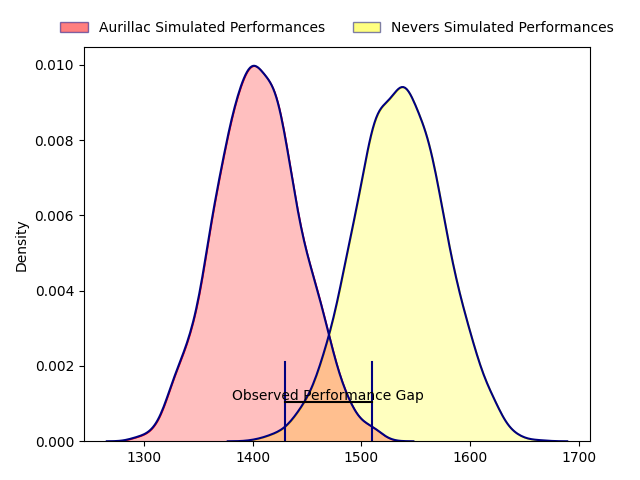
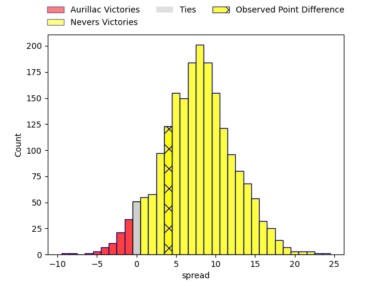
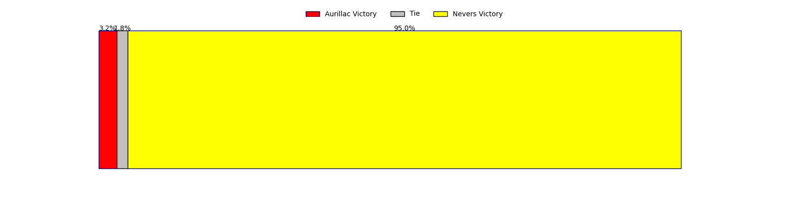
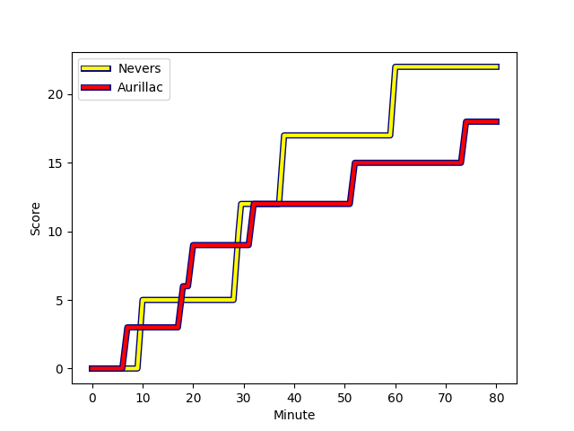
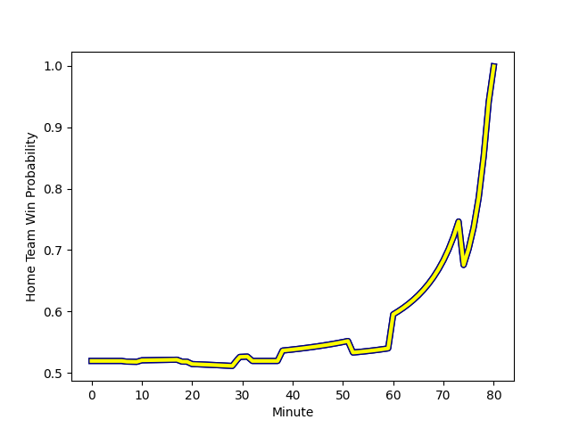

---  
layout: page  
title: Aurillac at Nevers; 18-22  
date: 2023-02-03 19:30:00 18:00:00 -0500  
categories: match review  
---
# Aurillac at Nevers; 18-22

# Club Level Predictions

The first set of predictions treats a club as the smallest object, as the club develops its members, organizes a gameplan, and deploys its players as needed for each match. This club model has a prediction of 0.679, which translates to predicting Nevers to win by 6.6.

Each club has a rating and a rating deviation (simiar to a Glicko system), and expected performances can be generated. This allows for simulated matches and spreads like the ones below.
## Projected Performances

## Projected Spreads

## Projected Results

# Player Level Predictions

Treating teams instead as an entity made up of the currently active players, I have ratings for each player in an altogether different system. These can be combined to form team ratings once teamsheets are announced, weighting starters a bit higher than the reserves. After the match is played, players can be weighted by their minutes on the field, allowing for an accurate measure of the team's composition. With these compiled team ratings, we can make predictions, measure inaccuracy, and update the individual player ratings.
## Prediction with Player Minutes: Nevers by 7.4

Nevers by 3.4 on a neutral field
## Scores over Time

## Win Probability over Time

## Prediction without Player Minutes: Nevers by 6.1

Nevers by 2.1 on a neutral pitch

|   Away Minutes | Away Player                                                               |   Away elo |   Away Percentile |   Number |   Home Percentile |   Home elo | Home Player                                                                   |   Home Minutes |
|---------------:|:--------------------------------------------------------------------------|-----------:|------------------:|---------:|------------------:|-----------:|:------------------------------------------------------------------------------|---------------:|
|             80 | [Robert Rodgers](..//playerfiles//RobertRodgers_cleaned.md)               |      80.06 |                14 |        1 |                46 |      94.92 | [Kamaliele Tufele](..//playerfiles//KamalieleTufele_cleaned.md)               |             80 |
|             52 | [Robert Rodgers](..//playerfiles//RobertRodgers_cleaned.md)               |      80.06 |                14 |        1 |                46 |      94.92 | [Kamaliele Tufele](..//playerfiles//KamalieleTufele_cleaned.md)               |             80 |
|             80 | [Robert Rodgers](..//playerfiles//RobertRodgers_cleaned.md)               |      80.06 |                14 |        1 |                46 |      94.92 | [Kamaliele Tufele](..//playerfiles//KamalieleTufele_cleaned.md)               |             54 |
|             52 | [Robert Rodgers](..//playerfiles//RobertRodgers_cleaned.md)               |      80.06 |                14 |        1 |                46 |      94.92 | [Kamaliele Tufele](..//playerfiles//KamalieleTufele_cleaned.md)               |             54 |
|             80 | [Adrian Smith](..//playerfiles//AdrianSmith_cleaned.md)                   |     113.98 |                89 |        2 |                44 |      95.07 | [Issam Hamel](..//playerfiles//IssamHamel_cleaned.md)                         |             80 |
|             62 | [Adrian Smith](..//playerfiles//AdrianSmith_cleaned.md)                   |     113.98 |                89 |        2 |                44 |      95.07 | [Issam Hamel](..//playerfiles//IssamHamel_cleaned.md)                         |             80 |
|             80 | [Adrian Smith](..//playerfiles//AdrianSmith_cleaned.md)                   |     113.98 |                89 |        2 |                44 |      95.07 | [Issam Hamel](..//playerfiles//IssamHamel_cleaned.md)                         |             64 |
|             62 | [Adrian Smith](..//playerfiles//AdrianSmith_cleaned.md)                   |     113.98 |                89 |        2 |                44 |      95.07 | [Issam Hamel](..//playerfiles//IssamHamel_cleaned.md)                         |             64 |
|             80 | [Giorgi Kartvelishvili](..//playerfiles//GiorgiKartvelishvili_cleaned.md) |     113.53 |                91 |        3 |                54 |      97.26 | [Ilia Kaikatsishvili](..//playerfiles//IliaKaikatsishvili_cleaned.md)         |             54 |
|             46 | [Giorgi Kartvelishvili](..//playerfiles//GiorgiKartvelishvili_cleaned.md) |     113.53 |                91 |        3 |                54 |      97.26 | [Ilia Kaikatsishvili](..//playerfiles//IliaKaikatsishvili_cleaned.md)         |             80 |
|             80 | [Giorgi Kartvelishvili](..//playerfiles//GiorgiKartvelishvili_cleaned.md) |     113.53 |                91 |        3 |                54 |      97.26 | [Ilia Kaikatsishvili](..//playerfiles//IliaKaikatsishvili_cleaned.md)         |             80 |
|             46 | [Giorgi Kartvelishvili](..//playerfiles//GiorgiKartvelishvili_cleaned.md) |     113.53 |                91 |        3 |                54 |      97.26 | [Ilia Kaikatsishvili](..//playerfiles//IliaKaikatsishvili_cleaned.md)         |             54 |
|             80 | [Cam Dodson](..//playerfiles//CamDodson_cleaned.md)                       |     116.49 |                88 |        4 |                 4 |      67.76 | [Christiaan van der Merwe](..//playerfiles//ChristiaanvanderMerwe_cleaned.md) |             80 |
|             62 | [Jean-Baptiste Singer](..//playerfiles//Jean-BaptisteSinger_cleaned.md)   |      73.16 |                 9 |        5 |                91 |     121.24 | [Will Skelton](..//playerfiles//WillSkelton_cleaned.md)                       |             64 |
|             80 | [Jean-Baptiste Singer](..//playerfiles//Jean-BaptisteSinger_cleaned.md)   |      73.16 |                 9 |        5 |                91 |     121.24 | [Will Skelton](..//playerfiles//WillSkelton_cleaned.md)                       |             64 |
|             62 | [Jean-Baptiste Singer](..//playerfiles//Jean-BaptisteSinger_cleaned.md)   |      73.16 |                 9 |        5 |                91 |     121.24 | [Will Skelton](..//playerfiles//WillSkelton_cleaned.md)                       |             80 |
|             80 | [Jean-Baptiste Singer](..//playerfiles//Jean-BaptisteSinger_cleaned.md)   |      73.16 |                 9 |        5 |                91 |     121.24 | [Will Skelton](..//playerfiles//WillSkelton_cleaned.md)                       |             80 |
|             80 | [Hugo Huurman](..//playerfiles//HugoHuurman_cleaned.md)                   |      95    |               nan |        6 |                15 |      82    | [Luka Plataret](..//playerfiles//LukaPlataret_cleaned.md)                     |             80 |
|             80 | [Théo Cambon](..//playerfiles//ThéoCambon_cleaned.md)                     |      76.98 |                11 |        7 |                43 |      94.65 | [Julien Kazubek](..//playerfiles//JulienKazubek_cleaned.md)                   |             80 |
|             46 | [Théo Cambon](..//playerfiles//ThéoCambon_cleaned.md)                     |      76.98 |                11 |        7 |                43 |      94.65 | [Julien Kazubek](..//playerfiles//JulienKazubek_cleaned.md)                   |             80 |
|             80 | [Théo Cambon](..//playerfiles//ThéoCambon_cleaned.md)                     |      76.98 |                11 |        7 |                43 |      94.65 | [Julien Kazubek](..//playerfiles//JulienKazubek_cleaned.md)                   |             56 |
|             46 | [Théo Cambon](..//playerfiles//ThéoCambon_cleaned.md)                     |      76.98 |                11 |        7 |                43 |      94.65 | [Julien Kazubek](..//playerfiles//JulienKazubek_cleaned.md)                   |             56 |
|             80 | [Didier Tison](..//playerfiles//DidierTison_cleaned.md)                   |     125.16 |                94 |        8 |                75 |     107.03 | [Shaun Adendorff](..//playerfiles//ShaunAdendorff_cleaned.md)                 |             80 |
|             80 | [David Delarue](..//playerfiles//DavidDelarue_cleaned.md)                 |      74.1  |                 7 |        9 |                62 |     105.72 | [Arthurs Barbier](..//playerfiles//ArthursBarbier_cleaned.md)                 |             80 |
|             56 | [David Delarue](..//playerfiles//DavidDelarue_cleaned.md)                 |      74.1  |                 7 |        9 |                62 |     105.72 | [Arthurs Barbier](..//playerfiles//ArthursBarbier_cleaned.md)                 |             54 |
|             56 | [David Delarue](..//playerfiles//DavidDelarue_cleaned.md)                 |      74.1  |                 7 |        9 |                62 |     105.72 | [Arthurs Barbier](..//playerfiles//ArthursBarbier_cleaned.md)                 |             80 |
|             80 | [David Delarue](..//playerfiles//DavidDelarue_cleaned.md)                 |      74.1  |                 7 |        9 |                62 |     105.72 | [Arthurs Barbier](..//playerfiles//ArthursBarbier_cleaned.md)                 |             54 |
|             80 | [Antoine Aucagne](..//playerfiles//AntoineAucagne_cleaned.md)             |      82.45 |                16 |       10 |                70 |     104.32 | [Yohan Le Bourhis](..//playerfiles//YohanLeBourhis_cleaned.md)                |             80 |
|             24 | [AJ Coertzen](..//playerfiles//AJCoertzen_cleaned.md)                     |      82.82 |                17 |       11 |                84 |     113.83 | [Christian Erasmus](..//playerfiles//ChristianErasmus_cleaned.md)             |             80 |
|             80 | [AJ Coertzen](..//playerfiles//AJCoertzen_cleaned.md)                     |      82.82 |                17 |       11 |                84 |     113.83 | [Christian Erasmus](..//playerfiles//ChristianErasmus_cleaned.md)             |             80 |
|             80 | [Christa Powell](..//playerfiles//ChristaPowell_cleaned.md)               |      89.32 |                32 |       12 |                16 |      84.08 | [Rudy Derrieux](..//playerfiles//RudyDerrieux_cleaned.md)                     |             62 |
|             80 | [Christa Powell](..//playerfiles//ChristaPowell_cleaned.md)               |      89.32 |                32 |       12 |                16 |      84.08 | [Rudy Derrieux](..//playerfiles//RudyDerrieux_cleaned.md)                     |             80 |
|             62 | [Elijah Niko](..//playerfiles//ElijahNiko_cleaned.md)                     |     101.26 |                64 |       13 |                35 |      90.36 | [Alifereti Loaloa](..//playerfiles//AliferetiLoaloa_cleaned.md)               |             80 |
|             80 | [Elijah Niko](..//playerfiles//ElijahNiko_cleaned.md)                     |     101.26 |                64 |       13 |                35 |      90.36 | [Alifereti Loaloa](..//playerfiles//AliferetiLoaloa_cleaned.md)               |             80 |
|             80 | [Albert Valentin](..//playerfiles//AlbertValentin_cleaned.md)             |     101.37 |                65 |       14 |                23 |      87.09 | [Christian Ambadiang](..//playerfiles//ChristianAmbadiang_cleaned.md)         |             80 |
|             80 | [Anderson Neisen](..//playerfiles//AndersonNeisen_cleaned.md)             |      71.21 |                 7 |       15 |                90 |     125.01 | [Kylian Jaminet](..//playerfiles//KylianJaminet_cleaned.md)                   |             80 |
|             56 | [Jimmy Yobo](..//playerfiles//JimmyYobo_cleaned.md)                       |      87.87 |                28 |       16 |                44 |      94.2  | [Aselo Ikahehegi](..//playerfiles//AseloIkahehegi_cleaned.md)                 |             26 |
|             34 | [Henzo Kiteau](..//playerfiles//HenzoKiteau_cleaned.md)                   |      80.53 |                11 |       17 |                31 |      90.69 | [Tornike Mataradze](..//playerfiles//TornikeMataradze_cleaned.md)             |             26 |
|             34 | [Yann Tivoli](..//playerfiles//YannTivoli_cleaned.md)                     |      99.13 |                57 |       18 |                87 |     113.09 | [Yoan Cottin](..//playerfiles//YoanCottin_cleaned.md)                         |             26 |
|             28 | [Alexandre Plantier](..//playerfiles//AlexandrePlantier_cleaned.md)       |     109.11 |                84 |       19 |                92 |     123.69 | [Hugues Bastide](..//playerfiles//HuguesBastide_cleaned.md)                   |             24 |
|             24 | [Hugo Bouyssou](..//playerfiles//HugoBouyssou_cleaned.md)                 |      77.02 |                11 |       20 |                83 |     113.3  | [Leonard Paris](..//playerfiles//LeonardParis_cleaned.md)                     |             18 |
|             18 | [Mosa'ati Moala](..//playerfiles//Mosa'atiMoala_cleaned.md)               |      85.08 |                24 |       21 |                 0 |      50.01 | [Makatuki Polutele](..//playerfiles//MakatukiPolutele_cleaned.md)             |             16 |
|             18 | [Marc Palmier](..//playerfiles//MarcPalmier_cleaned.md)                   |     113.52 |                82 |       22 |                29 |      88.99 | [Quentin Beaudaux](..//playerfiles//QuentinBeaudaux_cleaned.md)               |             16 |
|             18 | [Luka Nioradze](..//playerfiles//LukaNioradze_cleaned.md)                 |     119.52 |                93 |       23 |               nan |     nan    | nan                                                                           |            nan |

