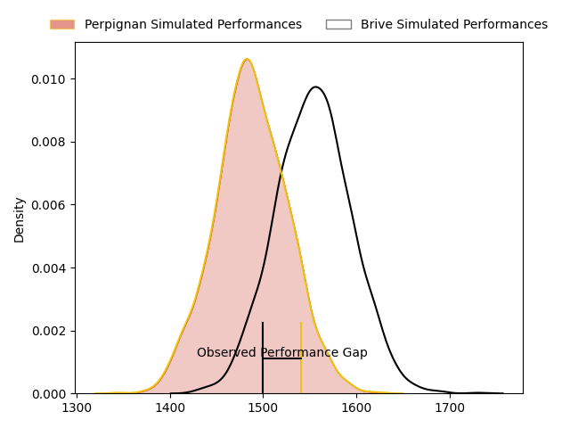
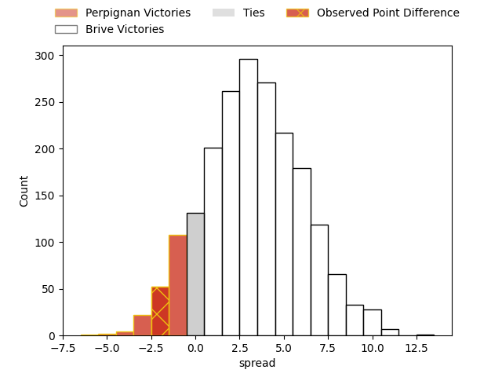
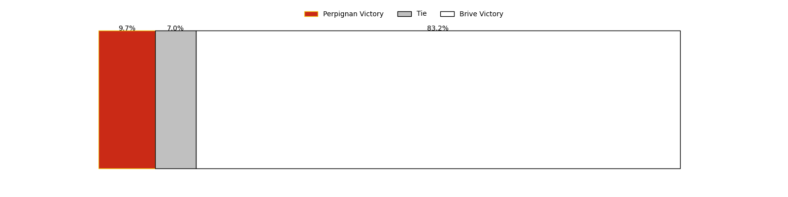
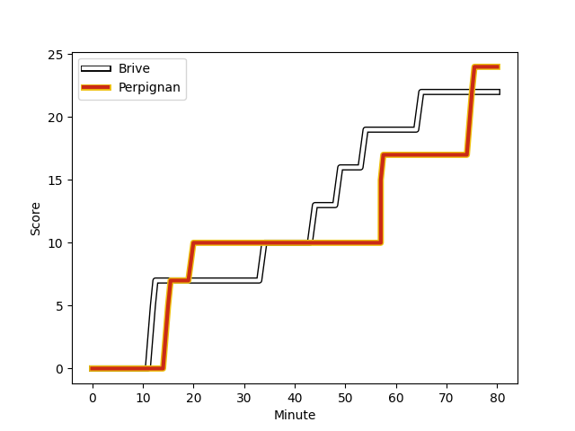
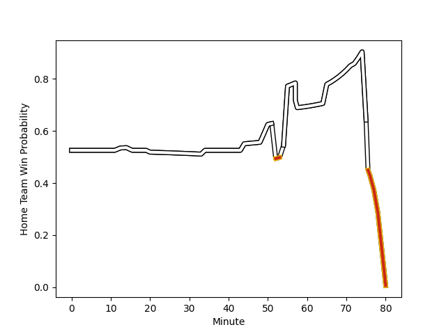

---  
layout: page  
title: Perpignan at Brive; 24-22  
date: 2023-02-04 17:00:00 18:00:00 -0500  
categories: match review  
---
# Perpignan at Brive; 24-22

# Club Level Predictions

The first set of predictions treats a club as the smallest object, as the club develops its members, organizes a gameplan, and deploys its players as needed for each match. This club model has a prediction of 0.631, which translates to predicting Brive to win by 4.7.

Each club has a rating and a rating deviation (simiar to a Glicko system), and expected performances can be generated. This allows for simulated matches and spreads like the ones below.
## Projected Performances

## Projected Spreads

## Projected Results

# Player Level Predictions

Treating teams instead as an entity made up of the currently active players, I have ratings for each player in an altogether different system. These can be combined to form team ratings once teamsheets are announced, weighting starters a bit higher than the reserves. After the match is played, players can be weighted by their minutes on the field, allowing for an accurate measure of the team's composition. With these compiled team ratings, we can make predictions, measure inaccuracy, and update the individual player ratings.
## Prediction with Player Minutes: Brive by 8.4

Brive by 4.4 on a neutral field
## Scores over Time

## Win Probability over Time

There were 15 large changes in win probability in this match
## Prediction without Player Minutes: Brive by 7.2

Brive by 3.2 on a neutral pitch

|   Away Minutes | Away Player                                                            |   Away elo |   Away Percentile |   Number |   Home Percentile |   Home elo | Home Player                                                                      |   Home Minutes |
|---------------:|:-----------------------------------------------------------------------|-----------:|------------------:|---------:|------------------:|-----------:|:---------------------------------------------------------------------------------|---------------:|
|             55 | [Giorgi Tetrashvili](..//playerfiles//GiorgiTetrashvili_cleaned.md)    |      85.79 |                20 |        1 |                63 |      98.25 | [Daniel Brennan](..//playerfiles//DanielBrennan_cleaned.md)                      |             52 |
|             55 | [Seilala Lam](..//playerfiles//SeilalaLam_cleaned.md)                  |      88.34 |                27 |        2 |                14 |      82.04 | [Motu Matu'u](..//playerfiles//MotuMatu'u_cleaned.md)                            |             72 |
|             55 | [Arthur Joly](..//playerfiles//ArthurJoly_cleaned.md)                  |     130.96 |                96 |        3 |                35 |      91.36 | [Marcel van der Merwe](..//playerfiles//MarcelvanderMerwe_cleaned.md)            |             52 |
|             80 | [Tristan Labouteley](..//playerfiles//TristanLabouteley_cleaned.md)    |      78.86 |                13 |        4 |                51 |      96.08 | [Tevita Ratuva](..//playerfiles//TevitaRatuva_cleaned.md)                        |             80 |
|             50 | [Piula Faasalele](..//playerfiles//PiulaFaasalele_cleaned.md)          |     120.95 |                91 |        5 |                64 |     101.28 | [Lucas Paulos](..//playerfiles//LucasPaulos_cleaned.md)                          |             80 |
|             80 | [Brad Shields](..//playerfiles//BradShields_cleaned.md)                |     126.17 |                94 |        6 |                90 |     120.59 | [Retief Marais](..//playerfiles//RetiefMarais_cleaned.md)                        |             72 |
|             50 | [Lucas Bachelier](..//playerfiles//LucasBachelier_cleaned.md)          |     128.66 |                95 |        7 |                99 |     150.89 | [Said Hireche](..//playerfiles//SaidHireche_cleaned.md)                          |             66 |
|             55 | [Genesis Mamea Lemalu](..//playerfiles//GenesisMameaLemalu_cleaned.md) |      94.34 |                42 |        8 |                91 |     120.45 | [Esteban Abadie](..//playerfiles//EstebanAbadie_cleaned.md)                      |             80 |
|             58 | [Sadek Deghmache](..//playerfiles//SadekDeghmache_cleaned.md)          |     108.65 |                79 |        9 |                53 |      97.44 | [Paul Abadie](..//playerfiles//PaulAbadie_cleaned.md)                            |             55 |
|             80 | [Jake McIntyre](..//playerfiles//JakeMcIntyre_cleaned.md)              |     107.63 |                75 |       10 |                95 |     129.83 | [Nicolas Sanchez](..//playerfiles//NicolasSanchez_cleaned.md)                    |             72 |
|             80 | [Ali Crossdale](..//playerfiles//AliCrossdale_cleaned.md)              |     120.4  |                90 |       11 |                59 |      98.85 | [Axel Muller](..//playerfiles//AxelMuller_cleaned.md)                            |             80 |
|             80 | [Edward Sawailau](..//playerfiles//EdwardSawailau_cleaned.md)          |      80.69 |                14 |       12 |                91 |     121.3  | [Nico Lee](..//playerfiles//NicoLee_cleaned.md)                                  |             80 |
|             80 | [Afusipa Taumoepeau](..//playerfiles//AfusipaTaumoepeau_cleaned.md)    |     106.56 |                73 |       13 |                41 |      92.72 | [Seta Tuicuvu](..//playerfiles//SetaTuicuvu_cleaned.md)                          |             27 |
|             72 | [Lucas Dubois](..//playerfiles//LucasDubois_cleaned.md)                |     106.01 |                74 |       14 |                87 |     116.77 | [Setareki Bituniyata](..//playerfiles//SetarekiBituniyata_cleaned.md)            |             80 |
|             80 | [Tristan Tedder](..//playerfiles//TristanTedder_cleaned.md)            |      86.06 |                25 |       15 |                29 |      88.24 | [Mathis Ferté](..//playerfiles//MathisFerté_cleaned.md)                          |             80 |
|             30 | [Victor Moreaux](..//playerfiles//VictorMoreaux_cleaned.md)            |      82.49 |                17 |       16 |                50 |      96.01 | [Sammy Arnold](..//playerfiles//SammyArnold_cleaned.md)                          |             53 |
|             30 | [Joaquin Oviedo](..//playerfiles//JoaquinOviedo_cleaned.md)            |     103.15 |                69 |       17 |                45 |      94.5  | [Tietie Tuimauga](..//playerfiles//TietieTuimauga_cleaned.md)                    |             28 |
|             25 | [Sacha Lotrian](..//playerfiles//SachaLotrian_cleaned.md)              |     119.24 |                95 |       18 |                17 |      84.12 | [Francisco Coria Marchetti](..//playerfiles//FranciscoCoriaMarchetti_cleaned.md) |             28 |
|             25 | [Mike Tadjer Barbosa](..//playerfiles//MikeTadjerBarbosa_cleaned.md)   |      89.47 |                30 |       19 |                28 |      85.58 | [Leo Carbonneau](..//playerfiles//LeoCarbonneau_cleaned.md)                      |             25 |
|             25 | [Ma'afu Fia](..//playerfiles//Ma'afuFia_cleaned.md)                    |     105.65 |                78 |       20 |                 9 |      75.71 | [Andres Zafra Tarazona](..//playerfiles//AndresZafraTarazona_cleaned.md)         |              8 |
|             25 | [Kelian Galletier](..//playerfiles//KelianGalletier_cleaned.md)        |     100.26 |                62 |       21 |                98 |     135.19 | [Enzo Herve](..//playerfiles//EnzoHerve_cleaned.md)                              |              8 |
|             22 | [Matteo Rodor](..//playerfiles//MatteoRodor_cleaned.md)                |      97.1  |                47 |       22 |                58 |     102.92 | [Nathan Fraissenon](..//playerfiles//NathanFraissenon_cleaned.md)                |              8 |
|              8 | [Boris Goutard](..//playerfiles//BorisGoutard_cleaned.md)              |      58.07 |                 2 |       23 |                17 |      85.05 | [Sasha Gue](..//playerfiles//SashaGue_cleaned.md)                                |             14 |

