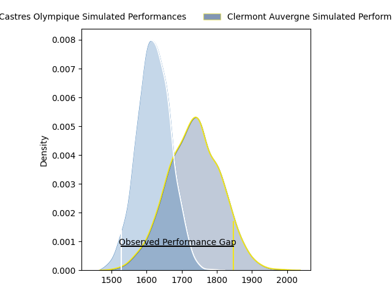
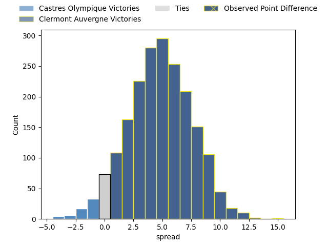
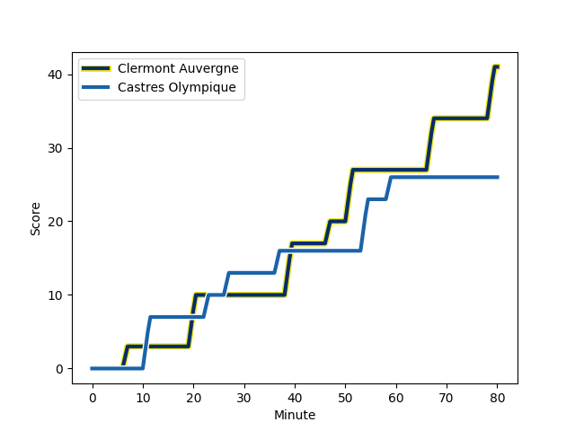
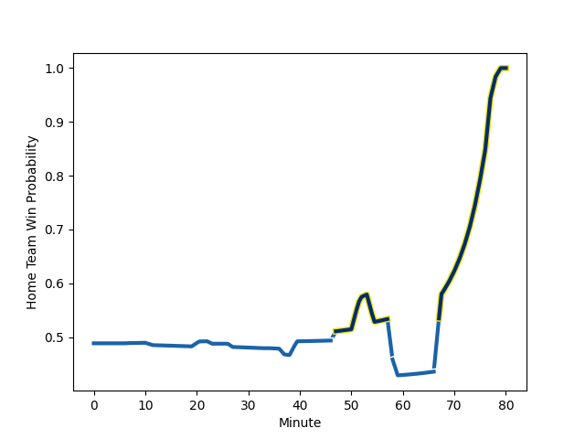

---  
layout: page  
title: Castres Olympique at Clermont Auvergne; 26-41  
date: 2023-02-04 17:00:00 18:00:00 -0500  
categories: match review  
---
# Castres Olympique at Clermont Auvergne; 26-41

# Club Level Predictions

The first set of predictions treats a club as the smallest object, as the club develops its members, organizes a gameplan, and deploys its players as needed for each match. This club model has a prediction of 0.619, which translates to predicting Clermont Auvergne to win by 4.2.

Each club has a rating and a rating deviation (simiar to a Glicko system), and expected performances can be generated. This allows for simulated matches and spreads like the ones below.
## Projected Performances

## Projected Spreads

## Projected Results

# Player Level Predictions

Treating teams instead as an entity made up of the currently active players, I have ratings for each player in an altogether different system. These can be combined to form team ratings once teamsheets are announced, weighting starters a bit higher than the reserves. After the match is played, players can be weighted by their minutes on the field, allowing for an accurate measure of the team's composition. With these compiled team ratings, we can make predictions, measure inaccuracy, and update the individual player ratings.
## Prediction with Player Minutes: Clermont Auvergne by 2.0

Castres Olympique by 2.0 on a neutral field
## Scores over Time

## Win Probability over Time

## Prediction without Player Minutes: Castres Olympique by 2.0

Castres Olympique by 6.0 on a neutral pitch

|   Away Minutes | Away Player                                                                       |   Away elo |   Away Percentile |   Number |   Home Percentile |   Home elo | Home Player                                                            |   Home Minutes |
|---------------:|:----------------------------------------------------------------------------------|-----------:|------------------:|---------:|------------------:|-----------:|:-----------------------------------------------------------------------|---------------:|
|             52 | [Quentin Walcker](..//playerfiles//QuentinWalcker_cleaned.md)                     |     113.6  |                89 |        1 |                95 |     121.02 | [Etienne Falgoux](..//playerfiles//EtienneFalgoux_cleaned.md)          |             59 |
|             52 | [Pierre Colonna](..//playerfiles//PierreColonna_cleaned.md)                       |      93.38 |                45 |        2 |                30 |      89.33 | [Yohan Beheregaray](..//playerfiles//YohanBeheregaray_cleaned.md)      |             34 |
|             52 | [Wilfrid Hounkpatin](..//playerfiles//WilfridHounkpatin_cleaned.md)               |      99.62 |                61 |        3 |                63 |     100.36 | [Cristian Ojovan](..//playerfiles//CristianOjovan_cleaned.md)          |             59 |
|             52 | [Florent Vanverberghe](..//playerfiles//FlorentVanverberghe_cleaned.md)           |     114.97 |                86 |        4 |                73 |     105.17 | [Thibaud Lanen](..//playerfiles//ThibaudLanen_cleaned.md)              |             80 |
|             80 | [Tom Staniforth](..//playerfiles//TomStaniforth_cleaned.md)                       |      97.21 |                54 |        5 |                24 |      85.42 | [Paul Jedrasiak](..//playerfiles//PaulJedrasiak_cleaned.md)            |             74 |
|              7 | [Mathieu Babillot](..//playerfiles//MathieuBabillot_cleaned.md)                   |      95.26 |                48 |        6 |                69 |     103.41 | [Arthur Iturria](..//playerfiles//ArthurIturria_cleaned.md)            |             76 |
|             52 | [Nick Champion de Crespigny](..//playerfiles//NickChampiondeCrespigny_cleaned.md) |      85.41 |                21 |        7 |               nan |     111.95 | [Peceli Yato Senibitu](..//playerfiles//PeceliYatoSenibitu_cleaned.md) |             80 |
|             80 | [Tyler Ardron](..//playerfiles//TylerArdron_cleaned.md)                           |     110.89 |                78 |        8 |                99 |     137.91 | [Fritz Lee](..//playerfiles//FritzLee_cleaned.md)                      |             80 |
|             64 | [Santiago Arata](..//playerfiles//SantiagoArata_cleaned.md)                       |     100.34 |                62 |        9 |                87 |     112.54 | [Sebastien Bezy](..//playerfiles//SebastienBezy_cleaned.md)            |             80 |
|             80 | [Benjamin Urdapilleta](..//playerfiles//BenjaminUrdapilleta_cleaned.md)           |     107.72 |                75 |       10 |                50 |      96.86 | [Jules Plisson](..//playerfiles//JulesPlisson_cleaned.md)              |             58 |
|             77 | [Filipo Nakosi](..//playerfiles//FilipoNakosi_cleaned.md)                         |     114.18 |                84 |       11 |                77 |     108.05 | [Alivereti Raka](..//playerfiles//AliveretiRaka_cleaned.md)            |             80 |
|             80 | [Vilimoni Botitu](..//playerfiles//VilimoniBotitu_cleaned.md)                     |      89.1  |                32 |       12 |                30 |      88.23 | [Irae Simone](..//playerfiles//IraeSimone_cleaned.md)                  |             80 |
|             80 | [Adrea Cocagi](..//playerfiles//AdreaCocagi_cleaned.md)                           |     137.04 |                98 |       13 |                78 |     110.46 | [George Moala](..//playerfiles//GeorgeMoala_cleaned.md)                |             80 |
|             80 | [Geoffrey Palis](..//playerfiles//GeoffreyPalis_cleaned.md)                       |     127.27 |                94 |       14 |                 9 |      76.18 | [Cheikh Tiberghien](..//playerfiles//CheikhTiberghien_cleaned.md)      |             80 |
|             80 | [Julien Dumora](..//playerfiles//JulienDumora_cleaned.md)                         |     103.6  |                63 |       15 |                82 |     114.92 | [Alex Newsome](..//playerfiles//AlexNewsome_cleaned.md)                |             80 |
|             73 | [Baptiste Delaporte](..//playerfiles//BaptisteDelaporte_cleaned.md)               |      97.05 |                57 |       16 |                31 |      90.68 | [Benjamin Boudou](..//playerfiles//BenjaminBoudou_cleaned.md)          |             46 |
|             28 | [Josaia Raisuqe](..//playerfiles//JosaiaRaisuqe_cleaned.md)                       |      89.95 |                33 |       17 |                77 |     108.53 | [Anthony Belleau](..//playerfiles//AnthonyBelleau_cleaned.md)          |             22 |
|             28 | [Brice Humbert](..//playerfiles//BriceHumbert_cleaned.md)                         |     104.5  |               nan |       18 |                50 |      95.97 | [Killian Tixeront](..//playerfiles//KillianTixeront_cleaned.md)        |              6 |
|             28 | [Levan Chilachava](..//playerfiles//LevanChilachava_cleaned.md)                   |      97.48 |                55 |       19 |                30 |      87.46 | [Giorgi Beria](..//playerfiles//GiorgiBeria_cleaned.md)                |             21 |
|             28 | [Antoine Tichit](..//playerfiles//AntoineTichit_cleaned.md)                       |      97.64 |                58 |       20 |                90 |     113.98 | [Davit Kubriashvili](..//playerfiles//DavitKubriashvili_cleaned.md)    |             21 |
|             28 | [Gauthier Maravat](..//playerfiles//GauthierMaravat_cleaned.md)                   |      95.38 |                48 |       21 |                76 |     111.89 | [Lucas Dessaigne](..//playerfiles//LucasDessaigne_cleaned.md)          |              4 |
|             16 | [Gauthier Doubrere](..//playerfiles//GauthierDoubrere_cleaned.md)                 |      95.69 |                50 |       22 |               nan |     nan    | nan                                                                    |            nan |
|              3 | [Louis Le Brun](..//playerfiles//LouisLeBrun_cleaned.md)                          |      82.16 |                13 |       23 |               nan |     nan    | nan                                                                    |            nan |

