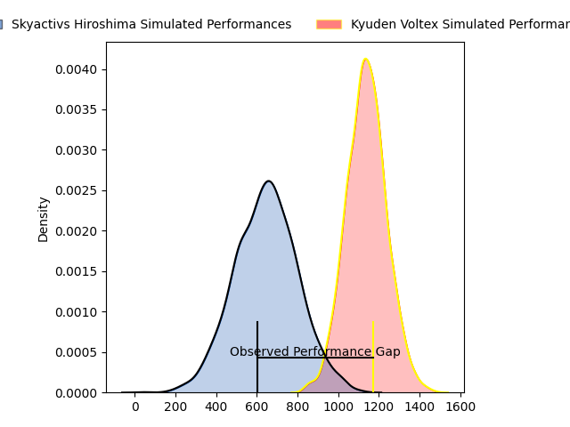
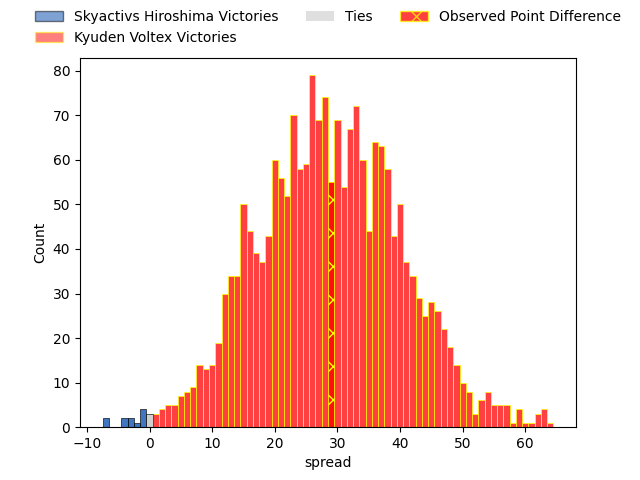
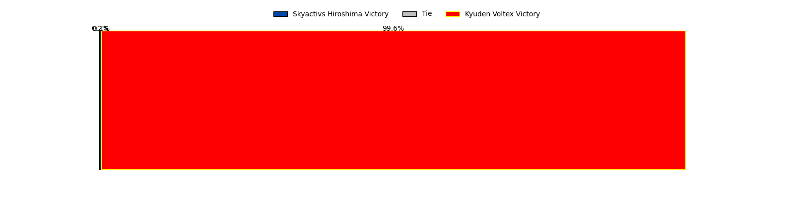
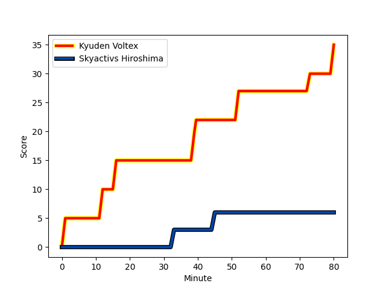
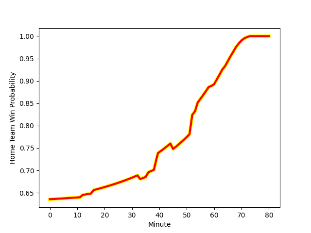

---  
layout: page  
title: Skyactivs Hiroshima at Kyuden Voltex; 6-35  
date: 2023-02-04 00:00:00 18:00:00 -0500  
categories: match review  
---
# Skyactivs Hiroshima at Kyuden Voltex; 6-35

# Club Level Predictions

The first set of predictions treats a club as the smallest object, as the club develops its members, organizes a gameplan, and deploys its players as needed for each match. This club model has a prediction of 0.949, which translates to predicting Kyuden Voltex to win by 29.2.

Each club has a rating and a rating deviation (simiar to a Glicko system), and expected performances can be generated. This allows for simulated matches and spreads like the ones below.
## Projected Performances

## Projected Spreads

## Projected Results

# Player Level Predictions

Treating teams instead as an entity made up of the currently active players, I have ratings for each player in an altogether different system. These can be combined to form team ratings once teamsheets are announced, weighting starters a bit higher than the reserves. After the match is played, players can be weighted by their minutes on the field, allowing for an accurate measure of the team's composition. With these compiled team ratings, we can make predictions, measure inaccuracy, and update the individual player ratings.
## Prediction with Player Minutes: Kyuden Voltex by 28.2

Kyuden Voltex by 24.2 on a neutral field
## Scores over Time

## Win Probability over Time

There were 2 large changes in win probability in this match
## Prediction without Player Minutes: Kyuden Voltex by 27.4

Kyuden Voltex by 23.4 on a neutral pitch

|   Away Minutes | Away Player                                                         |   Away elo |   Away Percentile |   Number |   Home Percentile |   Home elo | Home Player                                                                |   Home Minutes |
|---------------:|:--------------------------------------------------------------------|-----------:|------------------:|---------:|------------------:|-----------:|:---------------------------------------------------------------------------|---------------:|
|             64 | [Koshiro Shigenobu](..//playerfiles//KoshiroShigenobu_cleaned.md)   |      80.09 |               nan |        1 |                63 |     100.3  | [Samuel Nozomu Faialaga](..//playerfiles//SamuelNozomuFaialaga_cleaned.md) |             54 |
|             64 | [Tomohiro Takeda](..//playerfiles//TomohiroTakeda_cleaned.md)       |      73.22 |                 4 |        2 |                45 |      93.31 | [Daigo Asato](..//playerfiles//DaigoAsato_cleaned.md)                      |             59 |
|             60 | [Tomoya Otake](..//playerfiles//TomoyaOtake_cleaned.md)             |      77.16 |                 7 |        3 |                63 |     100.3  | [Shinpei Kamata](..//playerfiles//ShinpeiKamata_cleaned.md)                |             59 |
|             80 | [Kaiha Noda](..//playerfiles//KaihaNoda_cleaned.md)                 |      89.35 |                31 |        4 |                 1 |      63.55 | [Ray Tatafu](..//playerfiles//RayTatafu_cleaned.md)                        |             80 |
|             80 | [Lachlan Osborne](..//playerfiles//LachlanOsborne_cleaned.md)       |      73.84 |                 8 |        5 |                58 |      98.61 | [Tom Rowe](..//playerfiles//TomRowe_cleaned.md)                            |             36 |
|             60 | [Isi Manu](..//playerfiles//IsiManu_cleaned.md)                     |      69.09 |                 4 |        6 |                34 |      90.29 | [Ken Nakashima](..//playerfiles//KenNakashima_cleaned.md)                  |             80 |
|             68 | [Tevin Ferris](..//playerfiles//TevinFerris_cleaned.md)             |     109.75 |                80 |        7 |                68 |     102.61 | [Yuuki Yamada](..//playerfiles//YuukiYamada_cleaned.md)                    |             80 |
|             80 | [Iori Suzuki](..//playerfiles//IoriSuzuki_cleaned.md)               |      70.94 |                 5 |        8 |                20 |      84.9  | [Colby Fainga'a](..//playerfiles//ColbyFainga'a_cleaned.md)                |             60 |
|             70 | [Rikuto Nakashima](..//playerfiles//RikutoNakashima_cleaned.md)     |      87.54 |                26 |        9 |                44 |      93.73 | [Shunta Takenouchi](..//playerfiles//ShuntaTakenouchi_cleaned.md)          |             54 |
|             60 | [Ryoutarou Saito](..//playerfiles//RyoutarouSaito_cleaned.md)       |      71.37 |                 5 |       10 |                 9 |      78.19 | [Shogo Matsushita](..//playerfiles//ShogoMatsushita_cleaned.md)            |             73 |
|             80 | [Yuto Nakamura](..//playerfiles//YutoNakamura_cleaned.md)           |      66.3  |                 4 |       11 |                37 |      91.61 | [Naoki Takaya](..//playerfiles//NaokiTakaya_cleaned.md)                    |             80 |
|             80 | [Sora Ohchi](..//playerfiles//SoraOhchi_cleaned.md)                 |      93.82 |                43 |       12 |                15 |      81.03 | [Noriaki Nakazuru](..//playerfiles//NoriakiNakazuru_cleaned.md)            |             80 |
|             80 | [Shuhei Lee](..//playerfiles//ShuheiLee_cleaned.md)                 |      51.83 |                 0 |       13 |                71 |     105.52 | [Sam Vaka](..//playerfiles//SamVaka_cleaned.md)                            |             80 |
|             36 | [Haruki Kitajima](..//playerfiles//HarukiKitajima_cleaned.md)       |      88.52 |                28 |       14 |                73 |     105.83 | [Yasunari Isoda](..//playerfiles//YasunariIsoda_cleaned.md)                |             54 |
|             80 | [Ginjiro Sakiguchi](..//playerfiles//GinjiroSakiguchi_cleaned.md)   |      49.12 |                 0 |       15 |               nan |      95    | [Masaya Kanado](..//playerfiles//MasayaKanado_cleaned.md)                  |             80 |
|             44 | [Kotaro Tatsuno](..//playerfiles//KotaroTatsuno_cleaned.md)         |      76.35 |                11 |       16 |                66 |     102.05 | [Tomotaka Ishimatsu](..//playerfiles//TomotakaIshimatsu_cleaned.md)        |             44 |
|             20 | [Yuta Takami](..//playerfiles//YutaTakami_cleaned.md)               |      63.24 |                 1 |       17 |                97 |     124.61 | [Kazuto Tokunaga](..//playerfiles//KazutoTokunaga_cleaned.md)              |             26 |
|             20 | [Rame Sato](..//playerfiles//RameSato_cleaned.md)                   |      80.15 |                12 |       18 |                20 |      85.01 | [Daisuke Kodama](..//playerfiles//DaisukeKodama_cleaned.md)                |             26 |
|             20 | [Tevita Tai](..//playerfiles//TevitaTai_cleaned.md)                 |      96.03 |                51 |       19 |               nan |     122.68 | [Akihito Yamada](..//playerfiles//AkihitoYamada_cleaned.md)                |             26 |
|             16 | [Yusuke Kitobayashi](..//playerfiles//YusukeKitobayashi_cleaned.md) |      70.55 |                 3 |       20 |               nan |      82.83 | [Genki Nakamura](..//playerfiles//GenkiNakamura_cleaned.md)                |             21 |
|             16 | [Tomonori Koyanagi](..//playerfiles//TomonoriKoyanagi_cleaned.md)   |     100.67 |                64 |       21 |                19 |      85.39 | [Yasuo Saruwatari](..//playerfiles//YasuoSaruwatari_cleaned.md)            |             21 |
|             12 | [Yutaro Tanaka](..//playerfiles//YutaroTanaka_cleaned.md)           |      97.31 |                56 |       22 |               nan |      84.85 | [Wataru Obara](..//playerfiles//WataruObara_cleaned.md)                    |             20 |
|             10 | [Yuki Mori](..//playerfiles//YukiMori_cleaned.md)                   |      77.62 |               nan |       23 |                71 |     105.18 | [Kichi Uezato](..//playerfiles//KichiUezato_cleaned.md)                    |              7 |

