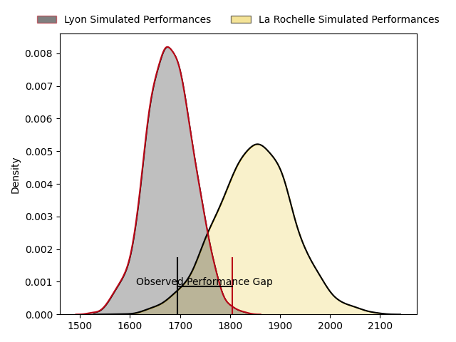
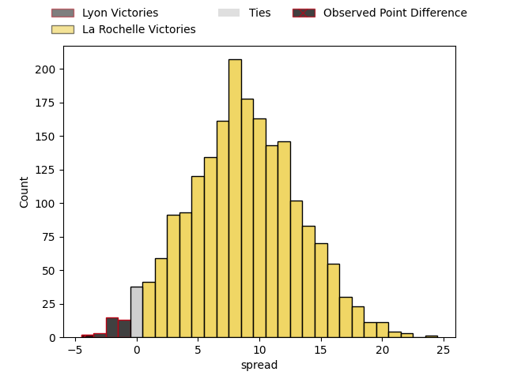
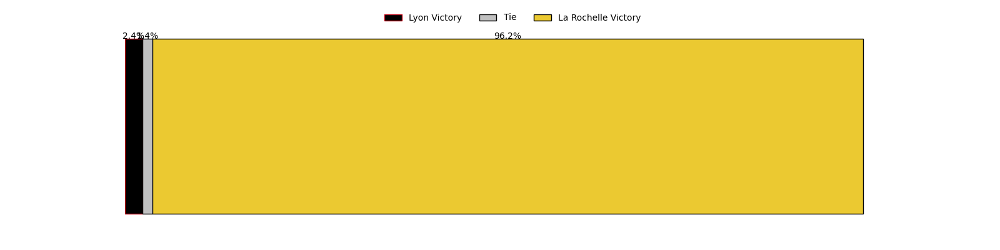
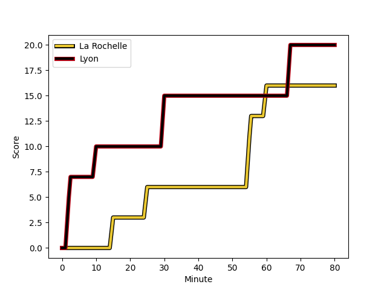
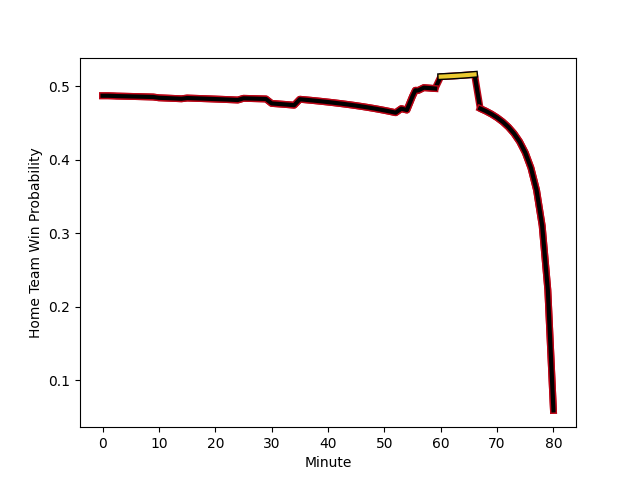

---  
layout: page  
title: Lyon at La Rochelle; 20-16  
date: 2023-02-04 17:00:00 18:00:00 -0500  
categories: match review  
---
# Lyon at La Rochelle; 20-16

# Club Level Predictions

The first set of predictions treats a club as the smallest object, as the club develops its members, organizes a gameplan, and deploys its players as needed for each match. This club model has a prediction of 0.685, which translates to predicting La Rochelle to win by 6.8.

Each club has a rating and a rating deviation (simiar to a Glicko system), and expected performances can be generated. This allows for simulated matches and spreads like the ones below.
## Projected Performances

## Projected Spreads

## Projected Results

# Player Level Predictions

Treating teams instead as an entity made up of the currently active players, I have ratings for each player in an altogether different system. These can be combined to form team ratings once teamsheets are announced, weighting starters a bit higher than the reserves. After the match is played, players can be weighted by their minutes on the field, allowing for an accurate measure of the team's composition. With these compiled team ratings, we can make predictions, measure inaccuracy, and update the individual player ratings.
## Prediction with Player Minutes: La Rochelle by 1.7

Lyon by 2.3 on a neutral field
## Scores over Time

## Win Probability over Time

## Prediction without Player Minutes: Lyon by 1.2

Lyon by 5.2 on a neutral pitch

|   Away Minutes | Away Player                                                                |   Away elo |   Away Percentile |   Number |   Home Percentile |   Home elo | Home Player                                                                     |   Home Minutes |
|---------------:|:---------------------------------------------------------------------------|-----------:|------------------:|---------:|------------------:|-----------:|:--------------------------------------------------------------------------------|---------------:|
|             57 | [Sebastien Taofifenua](..//playerfiles//SebastienTaofifenua_cleaned.md)    |     102.04 |                68 |        1 |                85 |     110.56 | [Joel Sclavi](..//playerfiles//JoelSclavi_cleaned.md)                           |             66 |
|             57 | [Guillaume Marchand](..//playerfiles//GuillaumeMarchand_cleaned.md)        |      91.16 |                36 |        2 |                 9 |      78.32 | [Quentin Lespiaucq](..//playerfiles//QuentinLespiaucq_cleaned.md)               |             69 |
|             35 | [Demba Bamba](..//playerfiles//DembaBamba_cleaned.md)                      |     118.37 |                93 |        3 |                 0 |      55.22 | [Georges-Henri Colombe](..//playerfiles//Georges-HenriColombe_cleaned.md)       |             53 |
|             58 | [Theo William](..//playerfiles//TheoWilliam_cleaned.md)                    |     101.01 |                63 |        4 |                97 |     133.1  | [Romain Sazy](..//playerfiles//RomainSazy_cleaned.md)                           |             57 |
|             80 | [Temo Mayanavanua](..//playerfiles//TemoMayanavanua_cleaned.md)            |      92.38 |                40 |        5 |                35 |      90.86 | [Remi Picquette](..//playerfiles//RemiPicquette_cleaned.md)                     |             44 |
|             69 | [Dylan Cretin](..//playerfiles//DylanCretin_cleaned.md)                    |      94.2  |                46 |        6 |                85 |     113.86 | [Levani Botia Veivuke](..//playerfiles//LevaniBotiaVeivuke_cleaned.md)          |             61 |
|             80 | [Patrick Sobela](..//playerfiles//PatrickSobela_cleaned.md)                |     113.26 |                84 |        7 |                11 |      79.12 | [Paul Boudehent](..//playerfiles//PaulBoudehent_cleaned.md)                     |             80 |
|             35 | [Jordan Taufua](..//playerfiles//JordanTaufua_cleaned.md)                  |     126.37 |                93 |        8 |                72 |     106.73 | [Yoan Tanga](..//playerfiles//YoanTanga_cleaned.md)                             |             80 |
|             80 | [Jean-Marc Doussain](..//playerfiles//Jean-MarcDoussain_cleaned.md)        |     111.74 |                85 |        9 |                95 |     124.24 | [Tawera Kerr-Barlow](..//playerfiles//TaweraKerr-Barlow_cleaned.md)             |             80 |
|             80 | [Leo Berdeu](..//playerfiles//LeoBerdeu_cleaned.md)                        |     104.35 |                70 |       10 |                47 |      96.1  | [Antoine Hastoy](..//playerfiles//AntoineHastoy_cleaned.md)                     |             80 |
|             80 | [Noa Nakaitaci](..//playerfiles//NoaNakaitaci_cleaned.md)                  |     106.71 |                75 |       11 |                79 |     109.6  | [Pierre Boudehent](..//playerfiles//PierreBoudehent_cleaned.md)                 |             80 |
|             80 | [Josua Tuisova Ratulevu](..//playerfiles//JosuaTuisovaRatulevu_cleaned.md) |     150.36 |                99 |       12 |                40 |      92.4  | [Ulupano Seuteni](..//playerfiles//UlupanoSeuteni_cleaned.md)                   |             80 |
|             80 | [Josiah Maraku](..//playerfiles//JosiahMaraku_cleaned.md)                  |      88.5  |                31 |       13 |                99 |     140.93 | [Jules Favre](..//playerfiles//JulesFavre_cleaned.md)                           |             80 |
|             80 | [Tavite Veredamu](..//playerfiles//TaviteVeredamu_cleaned.md)              |      91.01 |                36 |       14 |                82 |     111.85 | [Teddy Thomas](..//playerfiles//TeddyThomas_cleaned.md)                         |             65 |
|             62 | [Toby Arnold](..//playerfiles//TobyArnold_cleaned.md)                      |     114.77 |                82 |       15 |                49 |      97    | [Pierre Popelin](..//playerfiles//PierrePopelin_cleaned.md)                     |             80 |
|             45 | [Paulo Tafili](..//playerfiles//PauloTafili_cleaned.md)                    |      91.39 |                18 |       16 |                91 |     119.78 | [Will Skelton](..//playerfiles//WillSkelton_cleaned.md)                         |             36 |
|             45 | [Paulo Tafili](..//playerfiles//PauloTafili_cleaned.md)                    |      91.39 |                18 |       16 |                90 |     119.78 | [Will Skelton](..//playerfiles//WillSkelton_cleaned.md)                         |             36 |
|             45 | [Mickael Guillard](..//playerfiles//MickaelGuillard_cleaned.md)            |     109.21 |                75 |       17 |                42 |      92.19 | [Aleksandre Kuntelia](..//playerfiles//AleksandreKuntelia_cleaned.md)           |             27 |
|             23 | [Jerome Rey](..//playerfiles//JeromeRey_cleaned.md)                        |      69.03 |                 2 |       18 |                59 |      99.24 | [Ultan Dillane](..//playerfiles//UltanDillane_cleaned.md)                       |             23 |
|             23 | [Yanis Charcosset](..//playerfiles//YanisCharcosset_cleaned.md)            |      93.81 |                47 |       19 |                 7 |      76.66 | [Kyle Hatherell](..//playerfiles//KyleHatherell_cleaned.md)                     |             19 |
|             22 | [Loann Goujon](..//playerfiles//LoannGoujon_cleaned.md)                    |      85.69 |                23 |       20 |                83 |     112.88 | [Raymond Rhule](..//playerfiles//RaymondRhule_cleaned.md)                       |             15 |
|             18 | [Lima Sopoaga](..//playerfiles//LimaSopoaga_cleaned.md)                    |     124.05 |                92 |       21 |                63 |      99.57 | [Samuel Lagrange](..//playerfiles//SamuelLagrange_cleaned.md)                   |             11 |
|             11 | [Joel Kpoku](..//playerfiles//JoelKpoku_cleaned.md)                        |     113.4  |                84 |       22 |                90 |     114.25 | [Hayden Thompson-Stringer](..//playerfiles//HaydenThompson-Stringer_cleaned.md) |             14 |

