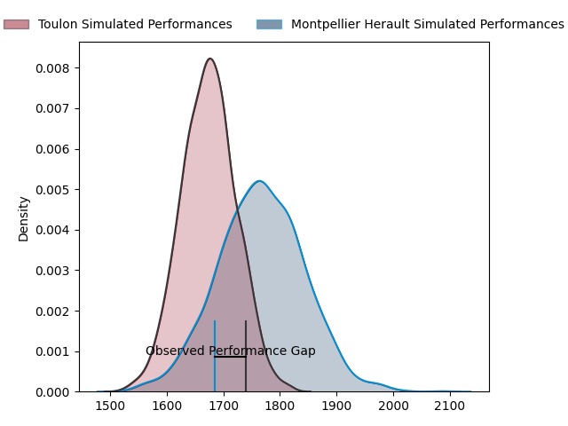
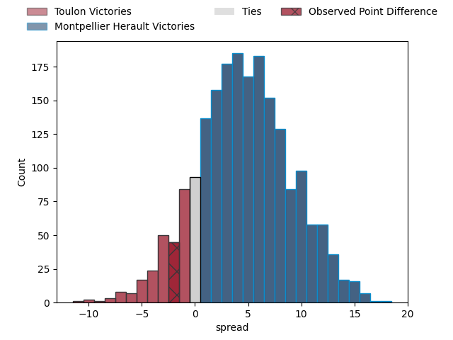
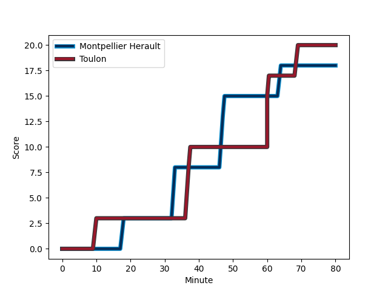
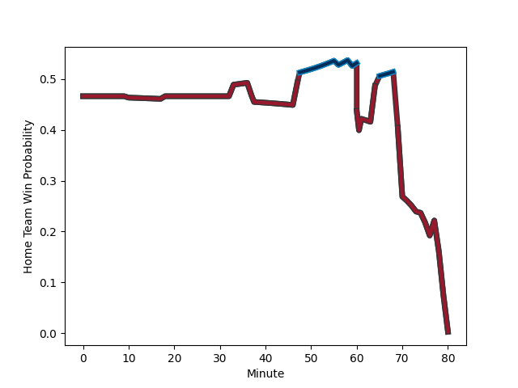

---  
layout: page  
title: Toulon at Montpellier Herault; 20-18  
date: 2023-02-04 21:00:00 18:00:00 -0500  
categories: match review  
---
# Toulon at Montpellier Herault; 20-18

# Club Level Predictions

The first set of predictions treats a club as the smallest object, as the club develops its members, organizes a gameplan, and deploys its players as needed for each match. This club model has a prediction of 0.631, which translates to predicting Montpellier Herault to win by 4.7.

Each club has a rating and a rating deviation (simiar to a Glicko system), and expected performances can be generated. This allows for simulated matches and spreads like the ones below.
## Projected Performances

## Projected Spreads

## Projected Results

# Player Level Predictions

Treating teams instead as an entity made up of the currently active players, I have ratings for each player in an altogether different system. These can be combined to form team ratings once teamsheets are announced, weighting starters a bit higher than the reserves. After the match is played, players can be weighted by their minutes on the field, allowing for an accurate measure of the team's composition. With these compiled team ratings, we can make predictions, measure inaccuracy, and update the individual player ratings.
## Prediction with Player Minutes: Toulon by 1.9

Toulon by 5.9 on a neutral field
## Scores over Time

## Win Probability over Time

There were 12 large changes in win probability in this match
## Prediction without Player Minutes: Montpellier Herault by 2.9

Toulon by 1.1 on a neutral pitch

|   Away Minutes | Away Player                                                                                |   Away elo |   Away Percentile |   Number |   Home Percentile |   Home elo | Home Player                                                                     |   Home Minutes |
|---------------:|:-------------------------------------------------------------------------------------------|-----------:|------------------:|---------:|------------------:|-----------:|:--------------------------------------------------------------------------------|---------------:|
|             70 | [Dany Priso](..//playerfiles//DanyPriso_cleaned.md)                                        |      99.09 |                60 |        1 |                77 |     105.5  | [Enzo Forletta](..//playerfiles//EnzoForletta_cleaned.md)                       |             66 |
|             74 | [Anthony Etrillard](..//playerfiles//AnthonyEtrillard_cleaned.md)                          |     108.94 |                83 |        2 |                62 |      99.67 | [Brandon Paenga-Amosa](..//playerfiles//BrandonPaenga-Amosa_cleaned.md)         |             77 |
|             61 | [Emerick Setiano](..//playerfiles//EmerickSetiano_cleaned.md)                              |     117.82 |                93 |        3 |                17 |      84.4  | [Titi Lamositele](..//playerfiles//TitiLamositele_cleaned.md)                   |             74 |
|             77 | [Swan Rebbadj](..//playerfiles//SwanRebbadj_cleaned.md)                                    |      90.76 |                36 |        4 |                95 |     127.79 | [Bastien Chalureau](..//playerfiles//BastienChalureau_cleaned.md)               |             66 |
|             80 | [Brian Alainu'uese](..//playerfiles//BrianAlainu'uese_cleaned.md)                          |     106.75 |                75 |        5 |                37 |      91.35 | [Elliott Stooke](..//playerfiles//ElliottStooke_cleaned.md)                     |             74 |
|             80 | [Cornell du Preez](..//playerfiles//CornellduPreez_cleaned.md)                             |      98.49 |                56 |        6 |                61 |     100.58 | [Masivesi Dakuwaqa](..//playerfiles//MasivesiDakuwaqa_cleaned.md)               |             56 |
|             80 | [Facundo Isa](..//playerfiles//FacundoIsa_cleaned.md)                                      |     102    |                62 |        7 |                34 |      90.33 | [Alexandre Becognee](..//playerfiles//AlexandreBecognee_cleaned.md)             |             80 |
|             65 | [Sergio Parisse](..//playerfiles//SergioParisse_cleaned.md)                                |     118.96 |                89 |        8 |                73 |     106.85 | [Zach Mercer](..//playerfiles//ZachMercer_cleaned.md)                           |             80 |
|             59 | [Benoit Paillaugue](..//playerfiles//BenoitPaillaugue_cleaned.md)                          |      82.08 |                21 |        9 |                83 |     110.52 | [Cobus Reinach](..//playerfiles//CobusReinach_cleaned.md)                       |             75 |
|             80 | [Ihaia West](..//playerfiles//IhaiaWest_cleaned.md)                                        |     103.63 |                67 |       10 |                42 |      94    | [Louis Carbonel](..//playerfiles//LouisCarbonel_cleaned.md)                     |             80 |
|             80 | [Jiuta Wainiqolo](..//playerfiles//JiutaWainiqolo_cleaned.md)                              |      94.12 |                45 |       11 |                93 |     124.76 | [George Bridge](..//playerfiles//GeorgeBridge_cleaned.md)                       |             80 |
|             80 | [Duncan Paia'aua](..//playerfiles//DuncanPaia'aua_cleaned.md)                              |     113.53 |                83 |       12 |                75 |     107.5  | [Jan Serfontein](..//playerfiles//JanSerfontein_cleaned.md)                     |             77 |
|             80 | [Waisea Nayacalevu Vuidravuwalu](..//playerfiles//WaiseaNayacalevuVuidravuwalu_cleaned.md) |     110.64 |                79 |       13 |                 2 |      64.08 | [Thomas Darmon](..//playerfiles//ThomasDarmon_cleaned.md)                       |             80 |
|             80 | [Cheslin Kolbe](..//playerfiles//CheslinKolbe_cleaned.md)                                  |     136.72 |                97 |       14 |                96 |     129.07 | [Vincent Rattez](..//playerfiles//VincentRattez_cleaned.md)                     |             80 |
|             80 | [Aymeric Luc](..//playerfiles//AymericLuc_cleaned.md)                                      |     113.24 |                83 |       15 |                75 |     109.41 | [Anthony Bouthier](..//playerfiles//AnthonyBouthier_cleaned.md)                 |             80 |
|             19 | [Kieran Brookes](..//playerfiles//KieranBrookes_cleaned.md)                                |      81.1  |                12 |       16 |                22 |      82    | [Clément Doumenc](..//playerfiles//ClémentDoumenc_cleaned.md)                   |             24 |
|             15 | [Matthias Halagahu](..//playerfiles//MatthiasHalagahu_cleaned.md)                          |      92.09 |                39 |       17 |                80 |     106.02 | [Simon-Pierre Chauvac](..//playerfiles//Simon-PierreChauvac_cleaned.md)         |             14 |
|             10 | [Bruce Devaux](..//playerfiles//BruceDevaux_cleaned.md)                                    |      86.57 |                21 |       18 |                 8 |      71.72 | [Tyler Duguid](..//playerfiles//TylerDuguid_cleaned.md)                         |             14 |
|              6 | [Yanis Boulassel](..//playerfiles//YanisBoulassel_cleaned.md)                              |      94.59 |               nan |       19 |                31 |      85.05 | [Louis Foursans-Bourdette](..//playerfiles//LouisFoursans-Bourdette_cleaned.md) |              5 |
|              3 | [Mattéo Le Corvec](..//playerfiles//MattéoLeCorvec_cleaned.md)                             |      96.2  |                51 |       20 |                47 |      93.77 | [Vincent Giudicelli](..//playerfiles//VincentGiudicelli_cleaned.md)             |              3 |
|             21 | [Baptiste Serin](..//playerfiles//BaptisteSerin_cleaned.md)                                |     107.29 |                77 |       21 |                79 |     108.64 | [Marco Tauleigne](..//playerfiles//MarcoTauleigne_cleaned.md)                   |              6 |
|            nan | nan                                                                                        |     nan    |               nan |       22 |                23 |      86.55 | [Henry Thomas](..//playerfiles//HenryThomas_cleaned.md)                         |              6 |
|            nan | nan                                                                                        |     nan    |               nan |       23 |                 7 |      67.25 | [Pierre Lucas](..//playerfiles//PierreLucas_cleaned.md)                         |              3 |

