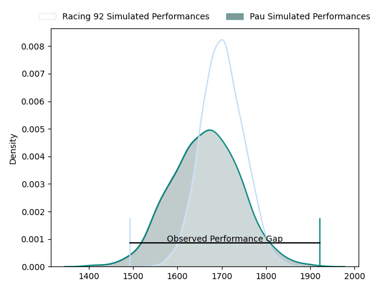
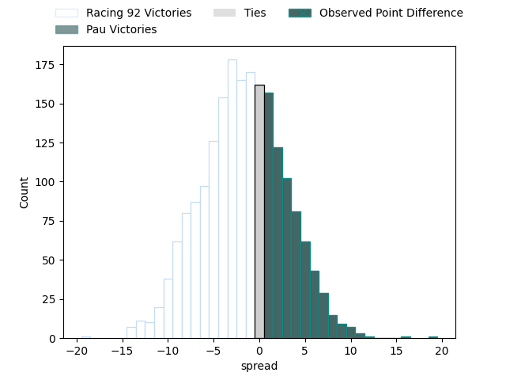
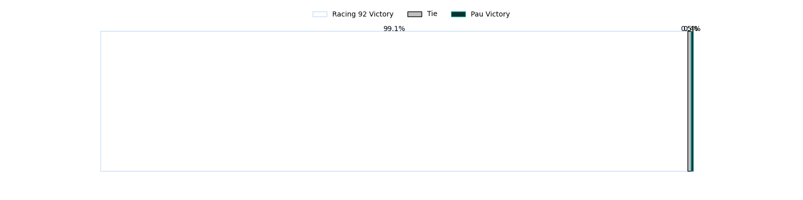
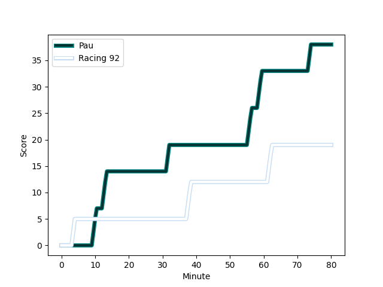
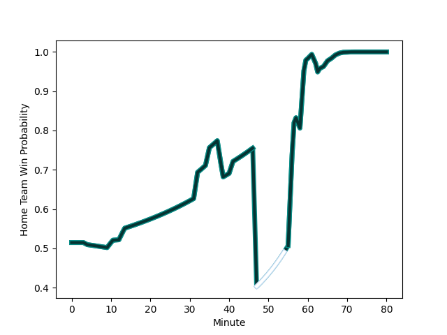

---  
layout: page  
title: Racing 92 at Pau; 19-38  
date: 2023-02-04 17:00:00 18:00:00 -0500  
categories: match review  
---
# Racing 92 at Pau; 19-38

# Club Level Predictions

The first set of predictions treats a club as the smallest object, as the club develops its members, organizes a gameplan, and deploys its players as needed for each match. This club model has a prediction of 0.416, which translates to predicting Racing 92 to win by 3.0.

Each club has a rating and a rating deviation (simiar to a Glicko system), and expected performances can be generated. This allows for simulated matches and spreads like the ones below.
## Projected Performances

## Projected Spreads

## Projected Results

# Player Level Predictions

Treating teams instead as an entity made up of the currently active players, I have ratings for each player in an altogether different system. These can be combined to form team ratings once teamsheets are announced, weighting starters a bit higher than the reserves. After the match is played, players can be weighted by their minutes on the field, allowing for an accurate measure of the team's composition. With these compiled team ratings, we can make predictions, measure inaccuracy, and update the individual player ratings.
## Prediction with Player Minutes: Pau by 6.6

Pau by 2.6 on a neutral field
## Scores over Time

## Win Probability over Time

## Prediction without Player Minutes: Pau by 3.9

Racing 92 by 0.1 on a neutral pitch

|   Away Minutes | Away Player                                                           |   Away elo |   Away Percentile |   Number |   Home Percentile |   Home elo | Home Player                                                           |   Home Minutes |
|---------------:|:----------------------------------------------------------------------|-----------:|------------------:|---------:|------------------:|-----------:|:----------------------------------------------------------------------|---------------:|
|             41 | [Eddy Ben Arous](..//playerfiles//EddyBenArous_cleaned.md)            |     107.52 |                81 |        1 |                34 |      91.19 | [Ignacio Calles](..//playerfiles//IgnacioCalles_cleaned.md)           |             47 |
|             41 | [Peniami Narisia](..//playerfiles//PeniamiNarisia_cleaned.md)         |     106.9  |                79 |        2 |                14 |      82.29 | [Lucas Rey](..//playerfiles//LucasRey_cleaned.md)                     |             64 |
|             58 | [Gia Kharaishvili](..//playerfiles//GiaKharaishvili_cleaned.md)       |     104.9  |                76 |        3 |                38 |      92.27 | [Siate Tokolahi](..//playerfiles//SiateTokolahi_cleaned.md)           |             47 |
|             70 | [Boris Palu](..//playerfiles//BorisPalu_cleaned.md)                   |      93.11 |                44 |        4 |                30 |      89.08 | [Guillaume Ducat](..//playerfiles//GuillaumeDucat_cleaned.md)         |             80 |
|             80 | [Veikoso Poloniati](..//playerfiles//VeikosoPoloniati_cleaned.md)     |      71.51 |                 6 |        5 |                14 |      79.47 | [Fabrice Metz](..//playerfiles//FabriceMetz_cleaned.md)               |             58 |
|             80 | [Ibrahim Diallo](..//playerfiles//IbrahimDiallo_cleaned.md)           |     101.89 |                66 |        6 |                17 |      82.92 | [Thibault Hamonou](..//playerfiles//ThibaultHamonou_cleaned.md)       |             35 |
|             80 | [Baptiste Chouzenoux](..//playerfiles//BaptisteChouzenoux_cleaned.md) |      92.05 |                39 |        7 |                38 |      91.61 | [Reece Hewat](..//playerfiles//ReeceHewat_cleaned.md)                 |             80 |
|             66 | [Kitione Kamikamica](..//playerfiles//KitioneKamikamica_cleaned.md)   |      82.69 |                18 |        8 |                92 |     122.95 | [Beka Gorgadze](..//playerfiles//BekaGorgadze_cleaned.md)             |             70 |
|             61 | [Teddy Iribaren](..//playerfiles//TeddyIribaren_cleaned.md)           |     106.13 |                75 |        9 |                99 |     141.91 | [Thibault Daubagna](..//playerfiles//ThibaultDaubagna_cleaned.md)     |             64 |
|             80 | [Antoine Gibert](..//playerfiles//AntoineGibert_cleaned.md)           |     128.26 |                97 |       10 |                89 |     119.58 | [Thibault Debaes](..//playerfiles//ThibaultDebaes_cleaned.md)         |             61 |
|             80 | [Paul Leraitre](..//playerfiles//PaulLeraitre_cleaned.md)             |      97.3  |                54 |       11 |                34 |      83.37 | [Mathias Colombet](..//playerfiles//MathiasColombet_cleaned.md)       |             80 |
|             80 | [Henry Chavancy](..//playerfiles//HenryChavancy_cleaned.md)           |     115.66 |                86 |       12 |                90 |     121.46 | [Nathan Decron](..//playerfiles//NathanDecron_cleaned.md)             |             80 |
|             66 | [Olivier Klemenczak](..//playerfiles//OlivierKlemenczak_cleaned.md)   |     114.55 |                82 |       13 |                48 |      97.6  | [Émilien Gailleton](..//playerfiles//ÉmilienGailleton_cleaned.md)     |             80 |
|             80 | [Donovan Taofifenua](..//playerfiles//DonovanTaofifenua_cleaned.md)   |     106.3  |                75 |       14 |                99 |     152.24 | [Clement Laporte](..//playerfiles//ClementLaporte_cleaned.md)         |             80 |
|             75 | [Max Spring](..//playerfiles//MaxSpring_cleaned.md)                   |      93.88 |                43 |       15 |                20 |      81.93 | [Jack Maddocks](..//playerfiles//JackMaddocks_cleaned.md)             |             80 |
|             39 | [Janick Tarrit](..//playerfiles//JanickTarrit_cleaned.md)             |      93.68 |                46 |       16 |                67 |     104.56 | [Jordan Joseph](..//playerfiles//JordanJoseph_cleaned.md)             |             45 |
|             39 | [Thomas Moukoro](..//playerfiles//ThomasMoukoro_cleaned.md)           |      95    |               nan |       17 |                95 |     119.78 | [Remi Seneca](..//playerfiles//RemiSeneca_cleaned.md)                 |             33 |
|             22 | [Biyi Alo](..//playerfiles//BiyiAlo_cleaned.md)                       |     142.13 |                99 |       18 |                 7 |      76.74 | [Nicolas Corato](..//playerfiles//NicolasCorato_cleaned.md)           |             33 |
|             19 | [Ben Volavola](..//playerfiles//BenVolavola_cleaned.md)               |      83.89 |                16 |       19 |                70 |     108.24 | [Lekima Tagitagivalu](..//playerfiles//LekimaTagitagivalu_cleaned.md) |             22 |
|             14 | [Inia Tabuavou](..//playerfiles//IniaTabuavou_cleaned.md)             |     107.81 |                75 |       20 |                95 |     127.97 | [Tumua Manu](..//playerfiles//TumuaManu_cleaned.md)                   |             19 |
|             14 | [Anthime Hemery](..//playerfiles//AnthimeHemery_cleaned.md)           |     109.25 |                79 |       21 |                93 |     119.61 | [Dan Robson](..//playerfiles//DanRobson_cleaned.md)                   |             16 |
|             10 | [Anton Bresler](..//playerfiles//AntonBresler_cleaned.md)             |     115.55 |                85 |       22 |                14 |      79.82 | [Youri Delhommel](..//playerfiles//YouriDelhommel_cleaned.md)         |             16 |
|              5 | [Martin Méliande](..//playerfiles//MartinMéliande_cleaned.md)         |     106.43 |                69 |       23 |                22 |      85.73 | [Hugo Auradou](..//playerfiles//HugoAuradou_cleaned.md)               |             10 |

