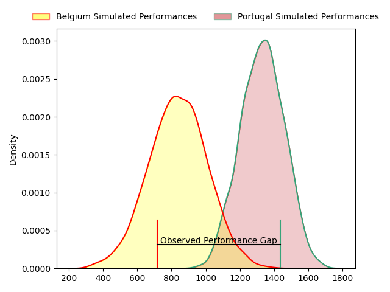
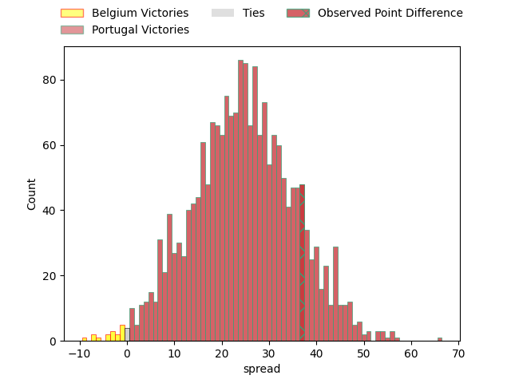
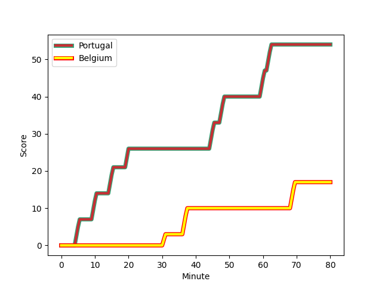
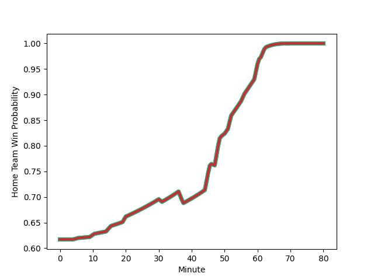

---  
layout: page  
title: Belgium at Portugal; 17-54  
date: 2023-02-04 20:00:00 18:00:00 -0500  
categories: match review  
---
# Belgium at Portugal; 17-54

# Club Level Predictions

The first set of predictions treats a club as the smallest object, as the club develops its members, organizes a gameplan, and deploys its players as needed for each match. This club model has a prediction of 0.872, which translates to predicting Portugal to win by 18.0.

Each club has a rating and a rating deviation (simiar to a Glicko system), and expected performances can be generated. This allows for simulated matches and spreads like the ones below.
## Projected Performances

## Projected Spreads

## Projected Results

# Player Level Predictions

Treating teams instead as an entity made up of the currently active players, I have ratings for each player in an altogether different system. These can be combined to form team ratings once teamsheets are announced, weighting starters a bit higher than the reserves. After the match is played, players can be weighted by their minutes on the field, allowing for an accurate measure of the team's composition. With these compiled team ratings, we can make predictions, measure inaccuracy, and update the individual player ratings.
## Prediction with Player Minutes: Portugal by 24.7

Portugal by 20.7 on a neutral field
## Scores over Time

## Win Probability over Time

## Prediction without Player Minutes: Portugal by 24.5

Portugal by 20.5 on a neutral pitch

|   Away Minutes | Away Player                                                             |   Away elo |   Away Percentile |   Number |   Home Percentile |   Home elo | Home Player                                                                                 |   Home Minutes |
|---------------:|:------------------------------------------------------------------------|-----------:|------------------:|---------:|------------------:|-----------:|:--------------------------------------------------------------------------------------------|---------------:|
|             50 | [Bruno Vliegen](..//playerfiles//BrunoVliegen_cleaned.md)               |      99.37 |               nan |        1 |                69 |     102.09 | [David Da Costa](..//playerfiles//DavidDaCosta_cleaned.md)                                  |             67 |
|             50 | [Thomas Dienst](..//playerfiles//ThomasDienst_cleaned.md)               |      91.72 |               nan |        2 |                 1 |      64.96 | [Duarte Azevedo de Brito Diniz](..//playerfiles//DuarteAzevedodeBritoDiniz_cleaned.md)      |             52 |
|             50 | [Maxime Jadot](..//playerfiles//MaximeJadot_cleaned.md)                 |      92.4  |               nan |        3 |                 6 |      75.28 | [Diogo Hasse Ferreira](..//playerfiles//DiogoHasseFerreira_cleaned.md)                      |             64 |
|             64 | [Guillaume Mortier](..//playerfiles//GuillaumeMortier_cleaned.md)       |      10.98 |                 0 |        4 |                83 |     111.91 | [Jose Madeira](..//playerfiles//JoseMadeira_cleaned.md)                                     |             58 |
|             52 | [Chris Salay Baudry](..//playerfiles//ChrisSalayBaudry_cleaned.md)      |      95    |               nan |        5 |                26 |      86.69 | [Jose Maria Rebelo De Andrade](..//playerfiles//JoseMariaRebeloDeAndrade_cleaned.md)        |             80 |
|             80 | [Maximilien Hendrickx](..//playerfiles//MaximilienHendrickx_cleaned.md) |      79.84 |                14 |        6 |                73 |     105.32 | [Joao Granate](..//playerfiles//JoaoGranate_cleaned.md)                                     |             80 |
|             62 | [Toon Deceuninck](..//playerfiles//ToonDeceuninck_cleaned.md)           |      78.79 |                10 |        7 |                 9 |      75.44 | [Nicolas Martins](..//playerfiles//NicolasMartins_cleaned.md)                               |             80 |
|             80 | [Thomas De Molder](..//playerfiles//ThomasDeMolder_cleaned.md)          |      95    |               nan |        8 |               nan |      99.81 | [Thibault de Freitas](..//playerfiles//ThibaultdeFreitas_cleaned.md)                        |             67 |
|             56 | [Julien Berger](..//playerfiles//JulienBerger_cleaned.md)               |     113.01 |                87 |        9 |                81 |     110.36 | [Joao Belo](..//playerfiles//JoaoBelo_cleaned.md)                                           |             47 |
|             50 | [Henri Dequenne](..//playerfiles//HenriDequenne_cleaned.md)             |      83.05 |                13 |       10 |                81 |     112.79 | [Jeronimo Portela](..//playerfiles//JeronimoPortela_cleaned.md)                             |             80 |
|             80 | [Victor André](..//playerfiles//VictorAndré_cleaned.md)                 |      85.23 |                22 |       11 |                61 |     100.64 | [Rodrigo Marta](..//playerfiles//RodrigoMarta_cleaned.md)                                   |             80 |
|             80 | [Jens Torfs](..//playerfiles//JensTorfs_cleaned.md)                     |      96.92 |                52 |       12 |                48 |      95.53 | [Tomas Appleton](..//playerfiles//TomasAppleton_cleaned.md)                                 |             80 |
|             80 | [Florian Remue](..//playerfiles//FlorianRemue_cleaned.md)               |      74.97 |               nan |       13 |                90 |     119.7  | [Jose Lima](..//playerfiles//JoseLima_cleaned.md)                                           |             59 |
|             80 | [Dazzy Cornez](..//playerfiles//DazzyCornez_cleaned.md)                 |      44.68 |                 0 |       14 |                42 |      93.24 | [Vincent Pinto](..//playerfiles//VincentPinto_cleaned.md)                                   |             80 |
|             80 | [Jordan Gott](..//playerfiles//JordanGott_cleaned.md)                   |      95    |               nan |       15 |               nan |      95    | [Nuno Sousa Guedes](..//playerfiles//NunoSousaGuedes_cleaned.md)                            |             64 |
|             30 | [Lucas Sotteau](..//playerfiles//LucasSotteau_cleaned.md)               |     105.9  |               nan |       16 |                30 |      88.8  | [Pedro Lucas](..//playerfiles//PedroLucas_cleaned.md)                                       |             33 |
|             30 | [Alexis Cuffolo](..//playerfiles//AlexisCuffolo_cleaned.md)             |      99.98 |                62 |       17 |                34 |      90.5  | [Lionel Campergue](..//playerfiles//LionelCampergue_cleaned.md)                             |             28 |
|             30 | [Romain Pinte](..//playerfiles//RomainPinte_cleaned.md)                 |      93.94 |                43 |       18 |                83 |     108.49 | [Martim Ruggeroni Roquette Bello](..//playerfiles//MartimRuggeroniRoquetteBello_cleaned.md) |             22 |
|             28 | [Hughes Bastin](..//playerfiles//HughesBastin_cleaned.md)               |      69.75 |                 3 |       19 |                24 |      86.12 | [Antonio Vidinha](..//playerfiles//AntonioVidinha_cleaned.md)                               |             21 |
|             24 | [Timothé Rifon](..//playerfiles//TimothéRifon_cleaned.md)               |      95    |               nan |       20 |                66 |     101.4  | [Pierre-Mathieu Fernandes](..//playerfiles//Pierre-MathieuFernandes_cleaned.md)             |             16 |
|             18 | [Robin Vermeersch](..//playerfiles//RobinVermeersch_cleaned.md)         |      66.8  |                 2 |       21 |                63 |     103.56 | [Manuel Cardoso Pinto](..//playerfiles//ManuelCardosoPinto_cleaned.md)                      |             16 |
|             16 | [Viktor Pazgrat](..//playerfiles//ViktorPazgrat_cleaned.md)             |      80.38 |                13 |       22 |               nan |      93.23 | [Antonio Machado Santos](..//playerfiles//AntonioMachadoSantos_cleaned.md)                  |             13 |
|             30 | [Hugo De Francq](..//playerfiles//HugoDeFrancq_cleaned.md)              |      77.16 |                10 |       23 |                51 |      96.2  | [Rafael Simoes](..//playerfiles//RafaelSimoes_cleaned.md)                                   |             13 |

