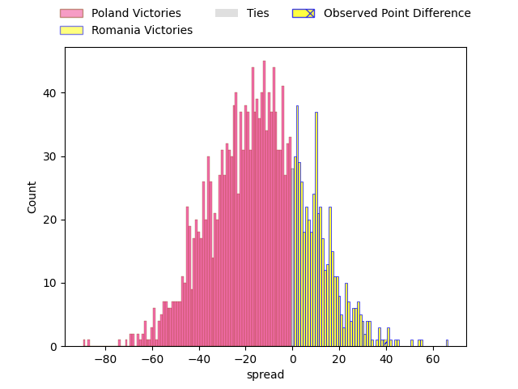
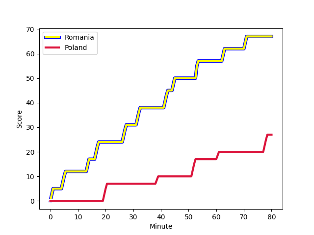
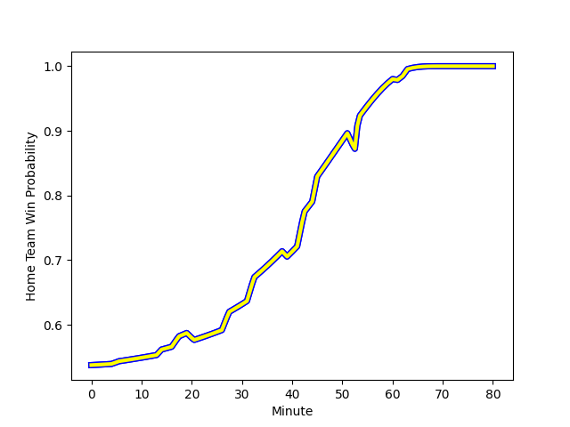

---  
layout: page  
title: Poland at Romania; 27-67  
date: 2023-02-04 13:00:00 18:00:00 -0500  
categories: match review  
---
# Poland at Romania; 27-67

# Club Level Predictions

The first set of predictions treats a club as the smallest object, as the club develops its members, organizes a gameplan, and deploys its players as needed for each match. This club model has a prediction of 0.293, which translates to predicting Poland to win by 13.2.

Each club has a rating and a rating deviation (simiar to a Glicko system), and expected performances can be generated. This allows for simulated matches and spreads like the ones below.
## Projected Performances

## Projected Spreads

## Projected Results

# Player Level Predictions

Treating teams instead as an entity made up of the currently active players, I have ratings for each player in an altogether different system. These can be combined to form team ratings once teamsheets are announced, weighting starters a bit higher than the reserves. After the match is played, players can be weighted by their minutes on the field, allowing for an accurate measure of the team's composition. With these compiled team ratings, we can make predictions, measure inaccuracy, and update the individual player ratings.
## Prediction with Player Minutes: Romania by 10.5

Romania by 6.5 on a neutral field
## Scores over Time

## Win Probability over Time

There were 4 large changes in win probability in this match
## Prediction without Player Minutes: Romania by 10.8

Romania by 6.8 on a neutral pitch

|   Away Minutes | Away Player                                                         |   Away elo |   Away Percentile |   Number |   Home Percentile |   Home elo | Home Player                                                                        |   Home Minutes |
|---------------:|:--------------------------------------------------------------------|-----------:|------------------:|---------:|------------------:|-----------:|:-----------------------------------------------------------------------------------|---------------:|
|             80 | [Jake Wisniewski](..//playerfiles//JakeWisniewski_cleaned.md)       |         95 |               nan |        1 |               nan |      95    | [Constantin Ciprian Chiriac](..//playerfiles//ConstantinCiprianChiriac_cleaned.md) |             80 |
|             47 | [Jake Wisniewski](..//playerfiles//JakeWisniewski_cleaned.md)       |         95 |               nan |        1 |               nan |      95    | [Constantin Ciprian Chiriac](..//playerfiles//ConstantinCiprianChiriac_cleaned.md) |             80 |
|             80 | [Jake Wisniewski](..//playerfiles//JakeWisniewski_cleaned.md)       |         95 |               nan |        1 |               nan |      95    | [Constantin Ciprian Chiriac](..//playerfiles//ConstantinCiprianChiriac_cleaned.md) |             47 |
|             47 | [Jake Wisniewski](..//playerfiles//JakeWisniewski_cleaned.md)       |         95 |               nan |        1 |               nan |      95    | [Constantin Ciprian Chiriac](..//playerfiles//ConstantinCiprianChiriac_cleaned.md) |             47 |
|             80 | [Grzegorz Buczek](..//playerfiles//GrzegorzBuczek_cleaned.md)       |         95 |               nan |        2 |                68 |     101.77 | [Tudor Butnariu](..//playerfiles//TudorButnariu_cleaned.md)                        |             80 |
|             80 | [Grzegorz Buczek](..//playerfiles//GrzegorzBuczek_cleaned.md)       |         95 |               nan |        2 |                68 |     101.77 | [Tudor Butnariu](..//playerfiles//TudorButnariu_cleaned.md)                        |             47 |
|             47 | [Sylwester Gaska](..//playerfiles//SylwesterGaska_cleaned.md)       |         95 |               nan |        3 |                19 |      84.75 | [Gheorge Gajion](..//playerfiles//GheorgeGajion_cleaned.md)                        |             47 |
|             80 | [Sylwester Gaska](..//playerfiles//SylwesterGaska_cleaned.md)       |         95 |               nan |        3 |                19 |      84.75 | [Gheorge Gajion](..//playerfiles//GheorgeGajion_cleaned.md)                        |             47 |
|             47 | [Sylwester Gaska](..//playerfiles//SylwesterGaska_cleaned.md)       |         95 |               nan |        3 |                19 |      84.75 | [Gheorge Gajion](..//playerfiles//GheorgeGajion_cleaned.md)                        |             80 |
|             80 | [Sylwester Gaska](..//playerfiles//SylwesterGaska_cleaned.md)       |         95 |               nan |        3 |                19 |      84.75 | [Gheorge Gajion](..//playerfiles//GheorgeGajion_cleaned.md)                        |             80 |
|             80 | [Michal Kruzycki](..//playerfiles//MichalKruzycki_cleaned.md)       |         95 |               nan |        4 |                79 |     109.59 | [Marius Antonescu](..//playerfiles//MariusAntonescu_cleaned.md)                    |             47 |
|             80 | [Michal Kruzycki](..//playerfiles//MichalKruzycki_cleaned.md)       |         95 |               nan |        4 |                79 |     109.59 | [Marius Antonescu](..//playerfiles//MariusAntonescu_cleaned.md)                    |             80 |
|             80 | [Jakub Malecki](..//playerfiles//JakubMalecki_cleaned.md)           |         95 |               nan |        5 |                 5 |      69.87 | [Marius Iftimiciuc](..//playerfiles//MariusIftimiciuc_cleaned.md)                  |             80 |
|             80 | [Jakub Malecki](..//playerfiles//JakubMalecki_cleaned.md)           |         95 |               nan |        5 |                31 |      90.07 | [Andrei Mahu](..//playerfiles//AndreiMahu_cleaned.md)                              |             80 |
|             52 | [Jakub Malecki](..//playerfiles//JakubMalecki_cleaned.md)           |         95 |               nan |        5 |                31 |      90.07 | [Andrei Mahu](..//playerfiles//AndreiMahu_cleaned.md)                              |             80 |
|             52 | [Jakub Malecki](..//playerfiles//JakubMalecki_cleaned.md)           |         95 |               nan |        5 |                 5 |      69.87 | [Marius Iftimiciuc](..//playerfiles//MariusIftimiciuc_cleaned.md)                  |             80 |
|             80 | [Jan Cal](..//playerfiles//JanCal_cleaned.md)                       |         95 |               nan |        6 |                54 |      97.37 | [Mihai Macovei](..//playerfiles//MihaiMacovei_cleaned.md)                          |             80 |
|             80 | [Jan Cal](..//playerfiles//JanCal_cleaned.md)                       |         95 |               nan |        6 |                54 |      97.37 | [Mihai Macovei](..//playerfiles//MihaiMacovei_cleaned.md)                          |             47 |
|             80 | [Siokivaha Taufui](..//playerfiles//SiokivahaTaufui_cleaned.md)     |         95 |               nan |        7 |                 8 |      75.5  | [Vlad Neculau](..//playerfiles//VladNeculau_cleaned.md)                            |             80 |
|             80 | [Piotr Zeszutek](..//playerfiles//PiotrZeszutek_cleaned.md)         |         95 |               nan |        8 |                 1 |      61.06 | [Cristian Chirica](..//playerfiles//CristianChirica_cleaned.md)                    |             80 |
|             55 | [Piotr Zeszutek](..//playerfiles//PiotrZeszutek_cleaned.md)         |         95 |               nan |        8 |                 1 |      61.06 | [Cristian Chirica](..//playerfiles//CristianChirica_cleaned.md)                    |             80 |
|             80 | [Dawid Plichta](..//playerfiles//DawidPlichta_cleaned.md)           |         95 |               nan |        9 |               nan |      95    | [Alexandru Tigla](..//playerfiles//AlexandruTigla_cleaned.md)                      |             52 |
|             72 | [Dawid Plichta](..//playerfiles//DawidPlichta_cleaned.md)           |         95 |               nan |        9 |               nan |      95    | [Alexandru Tigla](..//playerfiles//AlexandruTigla_cleaned.md)                      |             52 |
|             80 | [Dawid Plichta](..//playerfiles//DawidPlichta_cleaned.md)           |         95 |               nan |        9 |               nan |      95    | [Alexandru Tigla](..//playerfiles//AlexandruTigla_cleaned.md)                      |             80 |
|             72 | [Dawid Plichta](..//playerfiles//DawidPlichta_cleaned.md)           |         95 |               nan |        9 |               nan |      95    | [Alexandru Tigla](..//playerfiles//AlexandruTigla_cleaned.md)                      |             80 |
|             80 | [Jedrzej Nowicki](..//playerfiles//JedrzejNowicki_cleaned.md)       |         95 |               nan |       10 |                50 |      97.52 | [Vladut Popa](..//playerfiles//VladutPopa_cleaned.md)                              |             80 |
|             65 | [Jedrzej Nowicki](..//playerfiles//JedrzejNowicki_cleaned.md)       |         95 |               nan |       10 |                50 |      97.52 | [Vladut Popa](..//playerfiles//VladutPopa_cleaned.md)                              |             80 |
|             80 | [Dominik Morycki](..//playerfiles//DominikMorycki_cleaned.md)       |         95 |               nan |       11 |                 3 |      63.12 | [Marius Simionescu](..//playerfiles//MariusSimionescu_cleaned.md)                  |             22 |
|             80 | [Dominik Morycki](..//playerfiles//DominikMorycki_cleaned.md)       |         95 |               nan |       11 |                 3 |      63.12 | [Marius Simionescu](..//playerfiles//MariusSimionescu_cleaned.md)                  |             80 |
|             75 | [Dawid Banaszek](..//playerfiles//DawidBanaszek_cleaned.md)         |         95 |               nan |       12 |                20 |      83.77 | [Taylor Gontineac](..//playerfiles//TaylorGontineac_cleaned.md)                    |             80 |
|             80 | [Dawid Banaszek](..//playerfiles//DawidBanaszek_cleaned.md)         |         95 |               nan |       12 |                20 |      83.77 | [Taylor Gontineac](..//playerfiles//TaylorGontineac_cleaned.md)                    |             80 |
|             80 | [Peter Hudson](..//playerfiles//PeterHudson_cleaned.md)             |         95 |               nan |       13 |                26 |      87.69 | [Atila Septar](..//playerfiles//AtilaSeptar_cleaned.md)                            |             80 |
|             80 | [Robert Wojtowicz](..//playerfiles//RobertWojtowicz_cleaned.md)     |         95 |               nan |       14 |                39 |      92.01 | [Nicolas Onutu](..//playerfiles//NicolasOnutu_cleaned.md)                          |             80 |
|             80 | [Robert Wojtowicz](..//playerfiles//RobertWojtowicz_cleaned.md)     |         95 |               nan |       14 |                39 |      92.01 | [Nicolas Onutu](..//playerfiles//NicolasOnutu_cleaned.md)                          |              3 |
|             80 | [Ross Cooke](..//playerfiles//RossCooke_cleaned.md)                 |         95 |               nan |       15 |                67 |     102.25 | [Paul Popoaia](..//playerfiles//PaulPopoaia_cleaned.md)                            |             80 |
|             33 | [Quentin Cieslinski](..//playerfiles//QuentinCieslinski_cleaned.md) |         95 |               nan |       16 |                19 |      83.36 | [Hinckley Vaovasa](..//playerfiles//HinckleyVaovasa_cleaned.md)                    |             77 |
|             33 | [Tom Fidler](..//playerfiles//TomFidler_cleaned.md)                 |         95 |               nan |       17 |                43 |      94.29 | [Ionel Melinte](..//playerfiles//IonelMelinte_cleaned.md)                          |             58 |
|             28 | [Arthur Klis](..//playerfiles//ArthurKlis_cleaned.md)               |         95 |               nan |       18 |                48 |      95.46 | [Alexandru Savin](..//playerfiles//AlexandruSavin_cleaned.md)                      |             33 |
|             25 | [Kacper Palamarczuk](..//playerfiles//KacperPalamarczuk_cleaned.md) |         95 |               nan |       19 |                61 |      99.22 | [Rob Irimescu](..//playerfiles//RobIrimescu_cleaned.md)                            |             33 |
|             15 | [Wojciak Piotrowicz](..//playerfiles//WojciakPiotrowicz_cleaned.md) |         95 |               nan |       20 |               nan |      95    | [Thomas Cretu](..//playerfiles//ThomasCretu_cleaned.md)                            |             33 |
|              8 | [Sam Stelmaszek](..//playerfiles//SamStelmaszek_cleaned.md)         |         95 |               nan |       21 |               nan |      95    | [Alexander Dinu](..//playerfiles//AlexanderDinu_cleaned.md)                        |             33 |
|              5 | [Tomek Pozniak](..//playerfiles//TomekPozniak_cleaned.md)           |         95 |               nan |       22 |                47 |      94.82 | [Florian Rosu](..//playerfiles//FlorianRosu_cleaned.md)                            |             33 |
|            nan | nan                                                                 |        nan |               nan |       23 |                46 |      94.45 | [Alin Conache](..//playerfiles//AlinConache_cleaned.md)                            |             28 |

