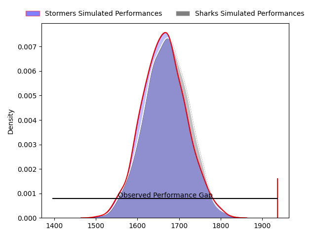
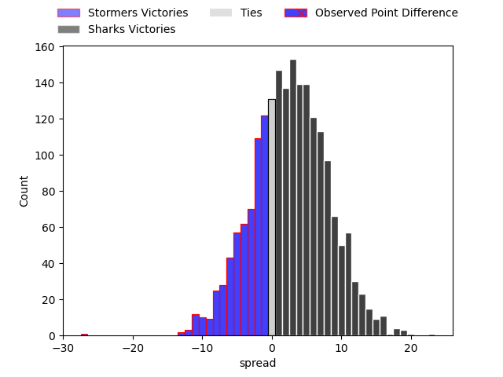
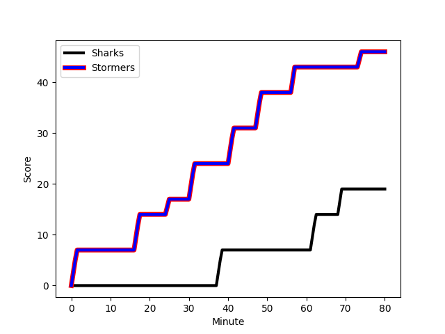
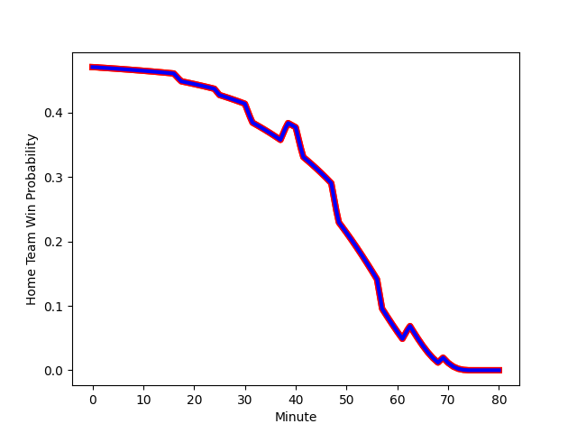

---  
layout: page  
title: Stormers at Sharks; 46-19  
date: 2023-02-04 13:00:00 18:00:00 -0500  
categories: match review  
---
# Stormers at Sharks; 46-19

# Club Level Predictions

The first set of predictions treats a club as the smallest object, as the club develops its members, organizes a gameplan, and deploys its players as needed for each match. This club model has a prediction of 0.542, which translates to predicting Sharks to win by 1.5.

Each club has a rating and a rating deviation (simiar to a Glicko system), and expected performances can be generated. This allows for simulated matches and spreads like the ones below.
## Projected Performances

## Projected Spreads

## Projected Results

# Player Level Predictions

Treating teams instead as an entity made up of the currently active players, I have ratings for each player in an altogether different system. These can be combined to form team ratings once teamsheets are announced, weighting starters a bit higher than the reserves. After the match is played, players can be weighted by their minutes on the field, allowing for an accurate measure of the team's composition. With these compiled team ratings, we can make predictions, measure inaccuracy, and update the individual player ratings.
## Prediction with Player Minutes: Stormers by 8.3

Stormers by 12.3 on a neutral field
## Scores over Time

## Win Probability over Time

## Prediction without Player Minutes: Stormers by 9.0

Stormers by 13.0 on a neutral pitch

|   Away Minutes | Away Player                                                              |   Away elo |   Away Percentile |   Number |   Home Percentile |   Home elo | Home Player                                                                   |   Home Minutes |
|---------------:|:-------------------------------------------------------------------------|-----------:|------------------:|---------:|------------------:|-----------:|:------------------------------------------------------------------------------|---------------:|
|             52 | [Brok Harris](..//playerfiles//BrokHarris_cleaned.md)                    |     123.79 |                96 |        1 |                88 |     112.36 | [Ntuthuko Mchunu](..//playerfiles//NtuthukoMchunu_cleaned.md)                 |             80 |
|             52 | [Brok Harris](..//playerfiles//BrokHarris_cleaned.md)                    |     123.79 |                96 |        1 |                88 |     112.36 | [Ntuthuko Mchunu](..//playerfiles//NtuthukoMchunu_cleaned.md)                 |             44 |
|             80 | [Brok Harris](..//playerfiles//BrokHarris_cleaned.md)                    |     123.79 |                96 |        1 |                88 |     112.36 | [Ntuthuko Mchunu](..//playerfiles//NtuthukoMchunu_cleaned.md)                 |             44 |
|             80 | [Brok Harris](..//playerfiles//BrokHarris_cleaned.md)                    |     123.79 |                96 |        1 |                88 |     112.36 | [Ntuthuko Mchunu](..//playerfiles//NtuthukoMchunu_cleaned.md)                 |             80 |
|             52 | [Joseph Dweba](..//playerfiles//JosephDweba_cleaned.md)                  |     109.77 |                85 |        2 |                 3 |      72.13 | [Kerron van Vuuren](..//playerfiles//KerronvanVuuren_cleaned.md)              |             44 |
|             80 | [Joseph Dweba](..//playerfiles//JosephDweba_cleaned.md)                  |     109.77 |                85 |        2 |                 3 |      72.13 | [Kerron van Vuuren](..//playerfiles//KerronvanVuuren_cleaned.md)              |             44 |
|             52 | [Joseph Dweba](..//playerfiles//JosephDweba_cleaned.md)                  |     109.77 |                85 |        2 |                 3 |      72.13 | [Kerron van Vuuren](..//playerfiles//KerronvanVuuren_cleaned.md)              |             80 |
|             80 | [Joseph Dweba](..//playerfiles//JosephDweba_cleaned.md)                  |     109.77 |                85 |        2 |                 3 |      72.13 | [Kerron van Vuuren](..//playerfiles//KerronvanVuuren_cleaned.md)              |             80 |
|             80 | [Neethling Fouche](..//playerfiles//NeethlingFouche_cleaned.md)          |     110.03 |                84 |        3 |                82 |     107.84 | [Carlu Sadie](..//playerfiles//CarluSadie_cleaned.md)                         |             44 |
|             80 | [Neethling Fouche](..//playerfiles//NeethlingFouche_cleaned.md)          |     110.03 |                84 |        3 |                82 |     107.84 | [Carlu Sadie](..//playerfiles//CarluSadie_cleaned.md)                         |             80 |
|             52 | [Neethling Fouche](..//playerfiles//NeethlingFouche_cleaned.md)          |     110.03 |                84 |        3 |                82 |     107.84 | [Carlu Sadie](..//playerfiles//CarluSadie_cleaned.md)                         |             80 |
|             52 | [Neethling Fouche](..//playerfiles//NeethlingFouche_cleaned.md)          |     110.03 |                84 |        3 |                82 |     107.84 | [Carlu Sadie](..//playerfiles//CarluSadie_cleaned.md)                         |             44 |
|             80 | [Ruben van Heerden](..//playerfiles//RubenvanHeerden_cleaned.md)         |     113.46 |                86 |        4 |                30 |      89.04 | [Hyron Andrews](..//playerfiles//HyronAndrews_cleaned.md)                     |             80 |
|             80 | [Ruben van Heerden](..//playerfiles//RubenvanHeerden_cleaned.md)         |     113.46 |                86 |        4 |                30 |      89.04 | [Hyron Andrews](..//playerfiles//HyronAndrews_cleaned.md)                     |             54 |
|             52 | [Gary Porter](..//playerfiles//GaryPorter_cleaned.md)                    |      90.54 |                34 |        5 |                54 |      97.31 | [Gerbrandt Grobler](..//playerfiles//GerbrandtGrobler_cleaned.md)             |             80 |
|             80 | [Gary Porter](..//playerfiles//GaryPorter_cleaned.md)                    |      90.54 |                34 |        5 |                54 |      97.31 | [Gerbrandt Grobler](..//playerfiles//GerbrandtGrobler_cleaned.md)             |             80 |
|             72 | [Deon Fourie](..//playerfiles//DeonFourie_cleaned.md)                    |     135.91 |                97 |        6 |                64 |     100.92 | [James Venter](..//playerfiles//JamesVenter_cleaned.md)                       |             80 |
|             80 | [Deon Fourie](..//playerfiles//DeonFourie_cleaned.md)                    |     135.91 |                97 |        6 |                64 |     100.92 | [James Venter](..//playerfiles//JamesVenter_cleaned.md)                       |             80 |
|             80 | [Junior Pokomela](..//playerfiles//JuniorPokomela_cleaned.md)            |      90.97 |                36 |        7 |                55 |      98.02 | [Henco Venter](..//playerfiles//HencoVenter_cleaned.md)                       |             80 |
|             59 | [Junior Pokomela](..//playerfiles//JuniorPokomela_cleaned.md)            |      90.97 |                36 |        7 |                55 |      98.02 | [Henco Venter](..//playerfiles//HencoVenter_cleaned.md)                       |             80 |
|             80 | [Marcel Theunissen](..//playerfiles//MarcelTheunissen_cleaned.md)        |      82.19 |                16 |        8 |                74 |     108.14 | [Phepsi Buthelezi](..//playerfiles//PhepsiButhelezi_cleaned.md)               |             54 |
|             80 | [Marcel Theunissen](..//playerfiles//MarcelTheunissen_cleaned.md)        |      82.19 |                16 |        8 |                74 |     108.14 | [Phepsi Buthelezi](..//playerfiles//PhepsiButhelezi_cleaned.md)               |             80 |
|             80 | [Herschel Jantjies](..//playerfiles//HerschelJantjies_cleaned.md)        |     101.46 |                66 |        9 |                28 |      88.92 | [Cameron Wright](..//playerfiles//CameronWright_cleaned.md)                   |             80 |
|             80 | [Herschel Jantjies](..//playerfiles//HerschelJantjies_cleaned.md)        |     101.46 |                66 |        9 |                28 |      88.92 | [Cameron Wright](..//playerfiles//CameronWright_cleaned.md)                   |             74 |
|             52 | [Herschel Jantjies](..//playerfiles//HerschelJantjies_cleaned.md)        |     101.46 |                66 |        9 |                28 |      88.92 | [Cameron Wright](..//playerfiles//CameronWright_cleaned.md)                   |             74 |
|             52 | [Herschel Jantjies](..//playerfiles//HerschelJantjies_cleaned.md)        |     101.46 |                66 |        9 |                28 |      88.92 | [Cameron Wright](..//playerfiles//CameronWright_cleaned.md)                   |             80 |
|             80 | [Manie Libbok](..//playerfiles//ManieLibbok_cleaned.md)                  |     113.37 |                81 |       10 |                71 |     104.96 | [Curwin Bosch](..//playerfiles//CurwinBosch_cleaned.md)                       |             80 |
|             80 | [Seabelo Senatla](..//playerfiles//SeabeloSenatla_cleaned.md)            |     125.18 |                93 |       11 |                19 |      84.74 | [Thaakir Abrahams](..//playerfiles//ThaakirAbrahams_cleaned.md)               |             55 |
|             80 | [Seabelo Senatla](..//playerfiles//SeabeloSenatla_cleaned.md)            |     125.18 |                93 |       11 |                19 |      84.74 | [Thaakir Abrahams](..//playerfiles//ThaakirAbrahams_cleaned.md)               |             80 |
|             80 | [Daniel du Plessis](..//playerfiles//DanielduPlessis_cleaned.md)         |     109.46 |                78 |       12 |                85 |     115.22 | [Rohan Janse van Rensburg](..//playerfiles//RohanJansevanRensburg_cleaned.md) |             80 |
|             60 | [Daniel du Plessis](..//playerfiles//DanielduPlessis_cleaned.md)         |     109.46 |                78 |       12 |                85 |     115.22 | [Rohan Janse van Rensburg](..//playerfiles//RohanJansevanRensburg_cleaned.md) |             80 |
|             80 | [Ruhan Nel](..//playerfiles//RuhanNel_cleaned.md)                        |     103.11 |                67 |       13 |                80 |     111.47 | [Ben Tapuai](..//playerfiles//BenTapuai_cleaned.md)                           |             80 |
|             80 | [Ruhan Nel](..//playerfiles//RuhanNel_cleaned.md)                        |     103.11 |                67 |       13 |                80 |     111.47 | [Ben Tapuai](..//playerfiles//BenTapuai_cleaned.md)                           |             59 |
|             80 | [Suleiman  Hartzenberg](..//playerfiles//SuleimanHartzenberg_cleaned.md) |      84.93 |                20 |       14 |                60 |      99.21 | [Marnus Potgieter](..//playerfiles//MarnusPotgieter_cleaned.md)               |             80 |
|             80 | [Clayton Blommetjies](..//playerfiles//ClaytonBlommetjies_cleaned.md)    |      81.3  |                19 |       15 |                95 |     134.75 | [Aphelele Fassi](..//playerfiles//ApheleleFassi_cleaned.md)                   |             80 |
|             28 | [Paul de Wet](..//playerfiles//PauldeWet_cleaned.md)                     |      94.33 |                45 |       16 |               nan |      96.25 | [Hanro Jacobs](..//playerfiles//HanroJacobs_cleaned.md)                       |             36 |
|             28 | [Ben-Jason Dixon](..//playerfiles//Ben-JasonDixon_cleaned.md)            |     100.8  |                63 |       17 |                50 |      93.86 | [Daniel Viljoen Jooste](..//playerfiles//DanielViljoenJooste_cleaned.md)      |             36 |
|             28 | [Andre-Hugo Venter](..//playerfiles//Andre-HugoVenter_cleaned.md)        |     109.87 |                85 |       18 |                28 |      93.25 | [Dian Bleuler](..//playerfiles//DianBleuler_cleaned.md)                       |             36 |
|             28 | [Alistair Vermaak](..//playerfiles//AlistairVermaak_cleaned.md)          |     100.51 |                64 |       19 |                73 |     106.78 | [Sikhumbuzo Notshe](..//playerfiles//SikhumbuzoNotshe_cleaned.md)             |             26 |
|             28 | [Sazi Sandi](..//playerfiles//SaziSandi_cleaned.md)                      |      95.67 |                46 |       20 |                96 |     129.73 | [Reniel Hugo](..//playerfiles//RenielHugo_cleaned.md)                         |             26 |
|             21 | [Willie Engelbrecht](..//playerfiles//WillieEngelbrecht_cleaned.md)      |     110.63 |                81 |       21 |                90 |     120.13 | [Lionel Cronje](..//playerfiles//LionelCronje_cleaned.md)                     |             25 |
|             20 | [Sacha Mngomezulu](..//playerfiles//SachaMngomezulu_cleaned.md)          |      98.15 |                55 |       22 |                12 |      78.14 | [Yaw Penxe](..//playerfiles//YawPenxe_cleaned.md)                             |             21 |
|              8 | [Keke Morabe](..//playerfiles//KekeMorabe_cleaned.md)                    |     105.23 |                68 |       23 |               nan |      95.63 | [Bradley Davids](..//playerfiles//BradleyDavids_cleaned.md)                   |              6 |

